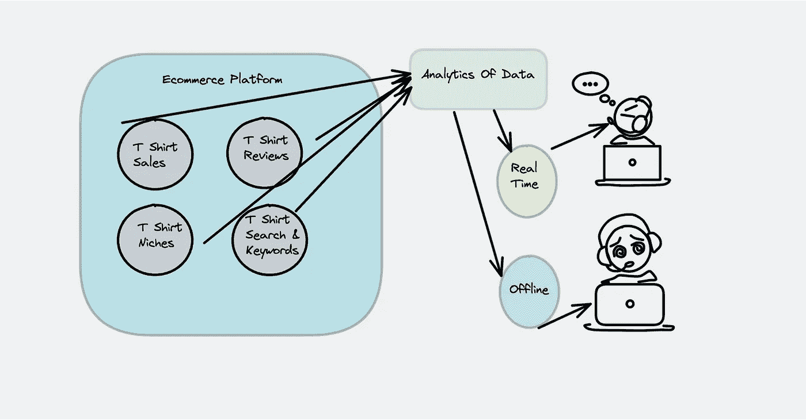
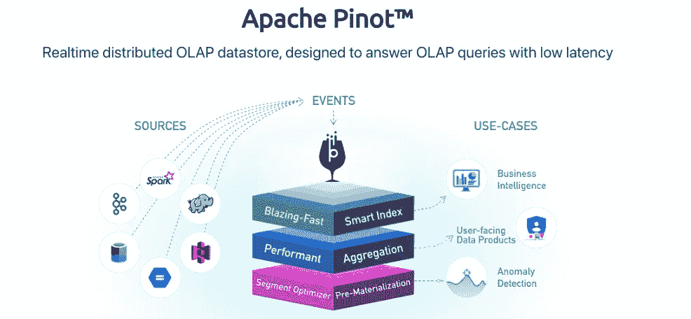
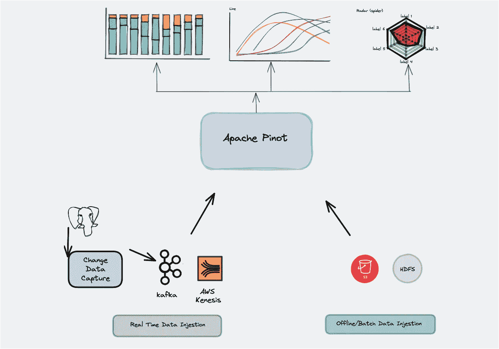
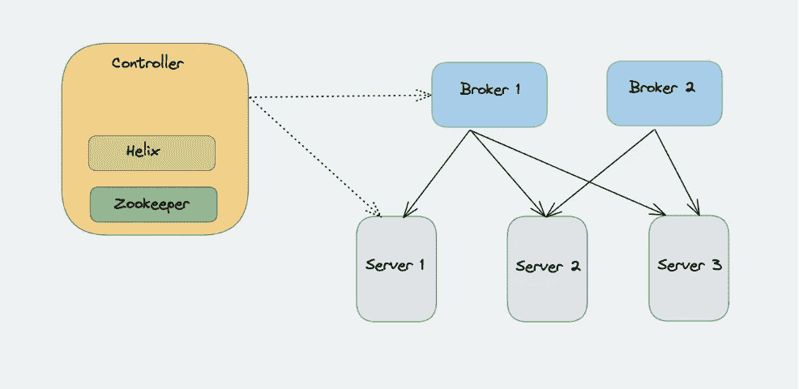
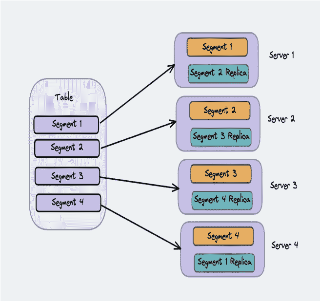
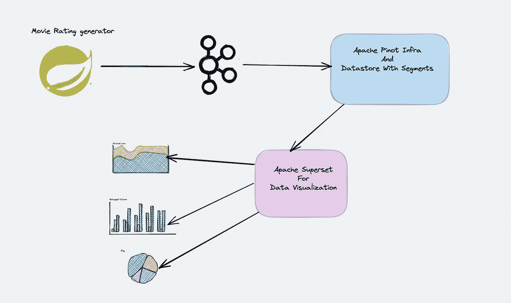
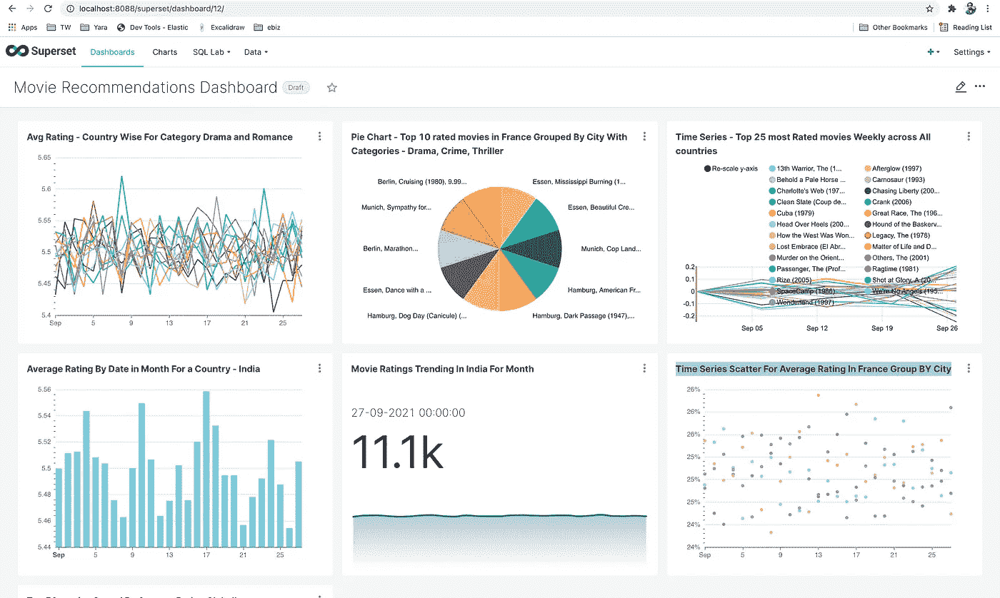

# 使用 Apache Pinot 的低延迟(OLAP)电影分级分析

> 原文：<https://medium.com/geekculture/low-latency-olap-movie-rating-analytics-using-apache-pinot-cc3198e4e012?source=collection_archive---------9----------------------->

## **使用 Apache Pinot 从一个 Kafka 主题中获取跨国家的电影分级事件，并使它们可用于从 Sourceset 中进行即时查询。流式事件由 Spring Boot 应用程序(随机数据)产生。我们将通过超集来可视化数据。**

***我在 Thoughtworks 极客之夜上展示了关于 OLAP 实时分析的内容。请在这里找到 youtube 链接***[](https://www.youtube.com/watch?v=ZjWB0JEYYkg&t=3569s)****。****

# *什么是 OLAP？*

*OLAP(online analytical processing)是一种计算方法，它使用户能够轻松、有选择地提取和查询数据，以便从不同的角度进行分析。OLAP 商业智能查询通常有助于趋势分析、财务报告、销售预测、预算和其它计划目的。*

****OLAP 用在哪里？****

*   *零售商店主的一个简单用例——定制 t 恤制造商。*
*   *许多不同种类的分析都属于 OLAP 的范畴。最主要的是面向用户的分析。*
*   *考虑一个电子商务平台的用例，其中不同的卖家试图销售他们的产品。这将导致多个店主试图销售相似的类别。让我们关注这样一个类别定制 t 恤制造商。*

**

*让我们考虑这个用例，一个受欢迎的电子商务供应商允许店主出售他们的 t 恤。一个用户可以访问几秒钟前发生的实时分析。其他用户拥有非实时的离线信息(前一天分析)。具有实时分析的用户可以更新他的关键字和利基，以便他的产品可以根据分析列在前列。用户不能，在某一天对他的业务是一个损失。*

# *OLAP 的真实例子*

*最好的例子就是 LinkedIn 上的“ ***谁查看了你的个人资料”*** 版块(按周统计)。在这种情况下，终端用户可以直接体验分析功能。*

**

*另一个是 LinkedIn Feed。这是与饲料排名的帮助，这确保用户不会看到相同的饲料一次又一次。它确实在幕后执行一些逻辑来提供这种独特的用户体验。*

***OLAP 的另一个例子***

*   *以上两个例子是基于用户的分析。想象一下庞大的用户群(700 百万)，每秒 10000 多个查询，这是 99%的负载和查询性能。作为 SLA，它必须是几个 ms(毫秒),否则，对于最终用户来说，这是一个可怕的体验。这两个都是具有高吞吐量和低延迟的分析查询的例子。*
*   *另一个用例是业务指标、异常检测。例如，电子商务平台需要确定需求与供应之间是否存在任何下降。对于 LinkedIn 用例，检测可能已经下降的页面访问量。这些指标将有助于采取正确的营销策略。不仅如此，深入到不同的数据点并进行分析是页面浏览量或需求与供应下降的确切原因。*
*   *除了聚合历史数据之外，所有这些案例都对精细分析最近的数据感兴趣。*
*   *所有这些都可以通过不同的技术来完成。让我们看看 Apache Pinot，它适合所有 OLAP 用例。*

# *什么是阿帕奇皮诺？*

**

*Apache Pinot 是一个分布式 OLAP 数据存储，旨在提供低延迟的实时分析。它可以从批处理数据源(如 Hadoop HDFS、亚马逊 S3、Azure ADLS 或谷歌云存储)以及流数据源(如 Apache Kafka)中获取数据。*

*如果需要面向用户的低延迟分析，那么基于 Hadoop 的 SQL 解决方案无法提供所需的低延迟。像 Apache Pinot(或 Apache Druid 和 Click house 等)这样的现代 OLAP 引擎可以实现更低的延迟，特别适合需要对不可变数据进行快速分析(如聚合)的环境，可能需要实时数据摄取。Apache Pinot 最初由 LinkedIn 创建，于 2018 年底进入 Apache 孵化，此后添加了插件架构和 SQL 支持以及其他关键功能。*

*就规模而言，已知最大的皮诺生产集群每秒可处理超过 100 万个事件。170，000+查询/秒，延迟几毫秒。*

***阿帕契比诺特色***

*Apache Pinot 于 2014 年在 LinkedIn 上开发，目前每秒钟提供超过 20 万次查询，以支持用户喜欢的许多功能，如“谁查看了我的个人资料？”。*

*Star Tree 由 Apache Pinot 的原始开发者创建，为 Apache Pinot 提供了一个完全托管的平台。通过消除基础设施管理的负担，公司可以专注于向最终用户提供实时洞察。*

****列数据库:***Apache Pinot 的核心是一个面向列的数据库，可以使用 SQL 的子集进行查询。它的可插拔索引允许快速开发新的索引类型，从而不断提高性能。传统上，OLAP 数据库的查询执行速度慢，存储效率低，但是 Apache Pinot 在不到一秒的时间内执行大多数查询，同时与其他数据库相比，提供了改进的存储需求。*

****面向用户的实时分析:*** Apache Pinot 是为面向用户的应用而打造的。这些应用要求低延迟响应时间，以便为用户提供最佳体验。传统上，分析见解是为内部用户保留的，因为最终用户不太宽容。这就是低延迟对任务至关重要的原因。*

****实时数据摄取:*** Apache Pinot 每秒能够摄取数百万个事件，同时允许立即查询它们。摄取和查询可用性的独特组合开启了新的用户体验，这是以前在没有缓存的情况下无法大规模实现的。*

****高可伸缩容错:*** Apache Pinot 是一个分布式系统，可以跨越数千个节点。这些节点作为一个系统统一响应查询请求，数据在节点之间复制以实现容错。*

**

# *阿帕奇皮诺建筑*

**

*Pinot 收集实时和离线数据，并分布在服务器上。Pinot 使用控制器，它决定什么数据去哪里，数据如何复制和分区。*

*它使用 ***zookeeper*** 来维护状态信息。支持数据查询的是 ***代理*** ，当请求查询时，代理将从 zookeeper 中查找状态，并进行分布式的分散-收集来处理查询。 ***代理*** 包含路由表，其中有段到服务器之间映射的细节。代理从控制器获取这些数据，控制器将段之间的主映射存储到服务器。*

*Pinot ***服务器*** 负责繁重的查询处理。基于批处理/实时摄取，这些表可以在物理上分为具有不同资源分配的离线和实时服务器，并且可以通过添加更多服务器来进行水平扩展。多个 ***控制器*** 被启动，其中一个被*选为领导者。如果领导者倒下，另一个控制者被选为领导者。**

**即使所有 ***控制器*** 关闭，查询处理也可以继续。但是新表和段的创建需要至少一个控制器处于活动状态。控制器还公开了一些管理端点，我们可以在这里对代理、服务器和分段执行一些操作。**

# **表格和段**

****

*   **该表是相关数据(行和列)的集合。为了保证大量数据的可扩展性，一个表被分成多个段(**)。每个数据段存储在不同的服务器上。****
*   ***为了确保高可用性，段还支持副本。如果一个网段出现故障，数据仍可用于服务。可以对表进行索引和预聚合，以减少查询延迟。***

******表的模式******

**Pinot 中的每个表都有一个模式，其中定义了字段和数据类型、元信息和索引。**

**模式可以有 3 类字段**

*   *****维度:*** 用于切片和切块操作，(按字段分组)。**
*   *****指标:*** 用于聚合运算，一般为数值型。**
*   *****日期时间:*** 可以有多个日期时间字段，我们也可以定义格式(EPOCH_MS，SIMPLEDATEFORMAT)。其中一个日期时间字段被视为主要字段，有助于创建真实数据和批处理数据之间的边界。**

# **皮诺中的索引**

**通常，索引用于以更快的方式检索数据。数据库提供者有他们自己实现索引的方式。**

*   **正向索引**
*   **倒排索引**
*   **距离指标**
*   **布卢姆指数**
*   **星形树索引**
*   **文本索引**
*   **地理空间索引**

> **借助星形树指数的阿帕奇皮诺预聚集指数。这有助于预先汇总和计算价值。因此，查询指标非常快。**

# **为什么阿帕奇皮诺适合 OLAP？**

**基于我的研究和阅读，以下是我的发现。可以使用不同的技术来设计分析系统。**

*   *****Spark SQL，Presto，Big Query*** —这些提供了巨大的灵活性和丰富的查询，但只能承诺几秒钟的 SLA，不能用于面向用户的分析。**
*   *****弹性搜索—*** 通常适用于自由文本搜索，这种搜索严重依赖于倒排索引，具有获取匹配文档的查询计划，并且未针对扫描全部、聚合或分组进行优化。**
*   *****键值存储(Cassandra)——***我们必须预先计算每一个可能的组合，每次添加新的维度时这样做都会导致失去灵活性和大量的存储空间。**

> **我个人在旅游平台的个性化引擎中工作，我们使用 Redis graphs，后来转移到 Neo4j，但在每用户分析方面面临许多问题。**
> 
> **弹性搜索和 Pinot 的组合可用于全文搜索和分析。但要明智地做出正确的决定。**

# **Apache Pinot 在电影分级分析中的应用(流摄取)**

****

**电影分级生成器将流摄取事件的电影分级跨越不同的国家和他们相应的城市。用户基数 50 多万，电影 7 万多。*每秒大约有 5k 个事件通过 Kafka 被推送到 Apache Pinot* 。**

**使用 ***Apache 超集*** 创建几个仪表板来可视化数据。**

**不同的报告是**

*   **戏剧和浪漫类别的平均国家评级。**
*   **饼状图法国十大分级电影按城市分类:戏剧、犯罪、惊悚。**
*   **时间系列—所有国家每周收视率最高的 25 部电影。**
*   **某个国家/地区(印度)按月份日期的平均评分。**
*   **一个月来印度电影收视率趋势。**
*   **按城市分组的法国平均评分的时间序列散点图。**

****环境****

*   **码头工人作曲。**
*   **Spring Boot 和格拉德。**
*   **阿帕奇超集。**
*   **Java 11。**
*   **阿帕奇卡夫卡。**

**请找到代码库的 [github](https://github.com/ereshzealous/apache-pinot-examples/tree/master/movie-recommendation) 链接。**

****阿帕奇皮诺模式****

****阿帕奇皮诺表****

**创建具有星形树索引的实时表，用于预先计算这些值。**

# **Apache 超集数据可视化**

**我已经在我的本地 mac 上安装了 Superset，并将其连接到 Apache Pinot 数据库以可视化数据。从[这里](https://superset.apache.org/docs/installation/installing-superset-from-scratch)安装超集。**

****

# **关于阿帕奇皮诺的几点**

****目前没有类似 JDBC 的驱动程序:** Apache Pinot 公开了查询 API。我们可以从 API 中查询数据。**

```
**curl -H "Content-Type: application/json" -X POST -s -w '\nEstablish Connection: %{time_connect}s\nTTFB: %{time_starttransfer}s\nTotal: %{time_total}s\n' -d '{"sql":"select avg(rating), country, city, movie from MovieRating group by movie, country, city limit 10"}' [http://localhost:8000/query/sql](http://localhost:8000/query/sql){"resultTable":{"dataSchema":{"columnDataTypes":["DOUBLE","STRING","STRING","STRING"],"columnNames":["avg(rating)","country","city","movie"]},"rows":[[4.749166153978075,"France","Lyon","Astronaut Farmer, The (2007)"],[5.4709471488611925,"Canada","Vancouver","Carnival of Souls (1962)"],[5.037873191946813,"France","Marseille","School for Scoundrels (2006)"],[4.477064753491312,"China","Harbin","Palindromes (2004)"],[5.690398473658868,"Germany","Essen","Freddy Got Fingered (2001)"],[6.040778780460276,"Germany","Hamburg","Judgment Night (1993)"],[6.805443873414745,"Germany","Berlin","Goonies, The (1985)"],[5.9604582965851645,"Canada","Scarborough","Summer Catch (2001)"],[6.1164004691146125,"Germany","Berlin","Butterfield 8 (1960)"],[6.20282039744616,"France","Bordeaux","Harry Potter and the Goblet of Fire (2005)"]]},"exceptions":[],"numServersQueried":1,"numServersResponded":1,"numSegmentsQueried":21,"numSegmentsProcessed":21,"numSegmentsMatched":21,"numConsumingSegmentsQueried":1,"numDocsScanned":4140677,"numEntriesScannedInFilter":0,"numEntriesScannedPostFilter":16562708,"numGroupsLimitReached":false,"totalDocs":5054756,"timeUsedMs":554,"segmentStatistics":[],"traceInfo":{},"minConsumingFreshnessTimeMs":1633406928068}
Establish Connection: 0.000937s
TTFB: 0.000000s
Total: 0.559546s**
```

****如果数据流中断如果 zookeeper 中断:**否，数据流正常。但是如果我们想建立新的部分，如果动物园管理员停机了，这是不可能的。这也给查询端带来了问题。**

**实时和离线的分离:性能特征不同于实时和离线。对于实时，如果使用 kafka 获取数据，则使用 java 堆。最好有不同的实时和离线配置文件。**

****什么是查询语言和限制:** Apache Pinot 使用方解石查询语义。Presto 集成在会谈中，可以做各种各样的加入和自定义项。**

****备份和恢复策略:** Pinot 获取数据并将其存储在本地，它还将所有数据段保存到数据段存储中。这是皮诺以外的东西。什么都有可能。ANFS、S3、HDFS..您必须将其配置为 pinot 集群设置的一部分，Pinot 会自动将构建的分段存档到分段存储中。万一服务器停机或硬盘崩溃，新的服务器必须进行配置并从段存储中下载数据。当我们需要从一台服务器到另一台服务器进行集群扩展时，这种备份策略非常有效，您可以直接从 segment store 进行备份。**

# **参考**

 **[## Apache Pinot:实时分布式 OLAP 数据存储| Apache Pinot

### 谁用阿帕奇皮诺？

pinot.apache.org](http://pinot.apache.org/)** **[](https://docs.pinot.apache.org/) [## 介绍

### Pinot 是一个实时分布式 OLAP 数据存储，旨在提供超低延迟分析，即使在…

docs.pinot.apache.org](https://docs.pinot.apache.org/) [](https://superset.apache.org/) [## 欢迎

### 超集是快速，轻量级，直观，并载有选项，使所有技能集的用户很容易…

superset.apache.org](https://superset.apache.org/) [](https://www.startree.ai/what-is-apache-pinot/) [## 什么是阿帕奇皮诺？

### Apache Pinot 是一个实时分布式 OLAP 数据库，设计用于低延迟查询执行，即使在极高的…

www.startree.ai](https://www.startree.ai/what-is-apache-pinot/)  [## 证明文件

### 超集将数据库连接信息存储在其元数据数据库中。为此，我们使用加密技术…

superset.apache.org](https://superset.apache.org/docs/installation/installing-superset-from-scratch)  [## OLAP 服务器比较-维基百科

### 下表比较了一些在线分析处理(OLAP)的一般信息和技术信息…

en.wikipedia.org](https://en.wikipedia.org/wiki/Comparison_of_OLAP_servers)**