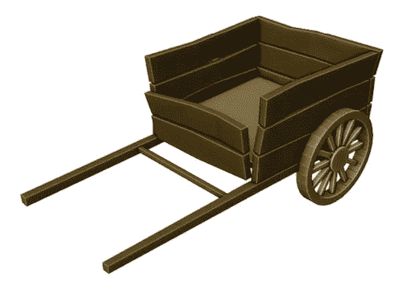

# 搅拌机中的低聚模型:一辆农用手推车

> 原文：<https://medium.com/geekculture/low-poly-model-in-blender-a-farm-cart-ffa0213c77c5?source=collection_archive---------19----------------------->

[*搅拌机中的⬅️低聚模型:一个简单的低音*](/geekculture/low-poly-model-in-blender-a-simple-bass-d7cd5a9941ce)*|*[*TOC*](https://mina-pecheux.medium.com/low-poly-models-1-timelapses-dce93654fff3)*|*[*搅拌机中的低聚模型:一盆植物➡️*](https://mina-pecheux.medium.com/d9199ea2e91b)

今天，在 [Blender](https://www.blender.org/) 中，这里有一个新的低聚建模会议的延时，更多在车辆/RPG vibe 中！这一次，我用几块木板做了一个简单的木制农用手推车；)

A woody farm cart in low-poly!

对于这个模型，我再次使用[“镜像”修改器](https://docs.blender.org/manual/en/latest/modeling/modifiers/generate/mirror.html)快速得到一个基本的**对称的**形状。我…