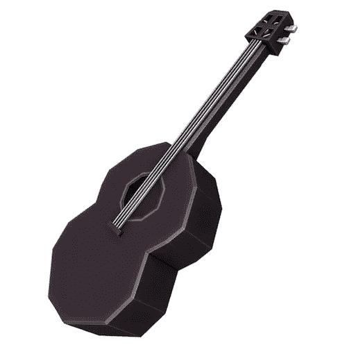

# 搅拌机中的低聚模型:简单的低音

> 原文：<https://medium.com/geekculture/low-poly-model-in-blender-a-simple-bass-d7cd5a9941ce?source=collection_archive---------18----------------------->

[*搅拌机中的⬅️低聚模型:一个百宝箱*](/nerd-for-tech/low-poly-model-in-blender-a-treasure-chest-35003a7a8b49)*|*[*TOC*](https://mina-pecheux.medium.com/low-poly-models-1-timelapses-dce93654fff3)*|*[*搅拌机中的低聚模型:一辆农用手推车*](https://mina-pecheux.medium.com/low-poly-model-in-blender-a-farm-cart-ffa0213c77c5)

在这一集里，我要回到一个“日常生活物品”:我做了一把小小的低音吉他！它不应该类似于任何特定的现实世界模型，**它更像是一个低音的“想法”**……(事实上，琴颈可能太短了，这种乐器无法真正演奏！)

A basic black bass in low-poly!