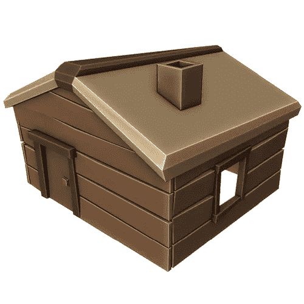

# 搅拌机中的低聚模型:一个小木屋

> 原文：<https://medium.com/geekculture/low-poly-model-in-blender-a-small-cabin-2bd5a8e2c2e6?source=collection_archive---------14----------------------->

[*搅拌机中的⬅️低聚模型:一盆植物*](/geekculture/low-poly-model-in-blender-a-pot-plant-d9199ea2e91b)*|*[*TOC*](https://mina-pecheux.medium.com/low-poly-models-1-timelapses-dce93654fff3)*|*[*搅拌机中的低聚模型:一辆玩具火车*](https://mina-pecheux.medium.com/low-poly-model-in-blender-a-toy-train-f12f992990eb)

我在这个系列中最新的低多边形模型主要是物体。今天，让我们稍微改变一下，去做一些中等大小的东西:这是我在[搅拌机](https://www.blender.org/)里做的一个小的低聚小屋。它又小又简单，只有一些木板和茅草屋顶；)

A small wood-and-thatch cabin low-poly model!