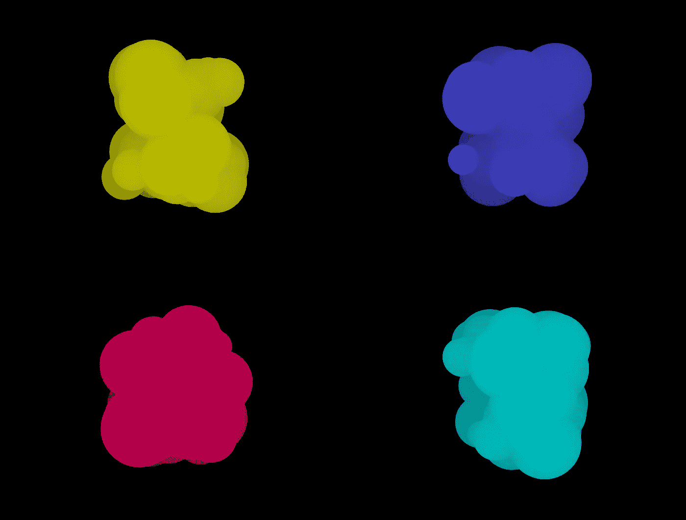
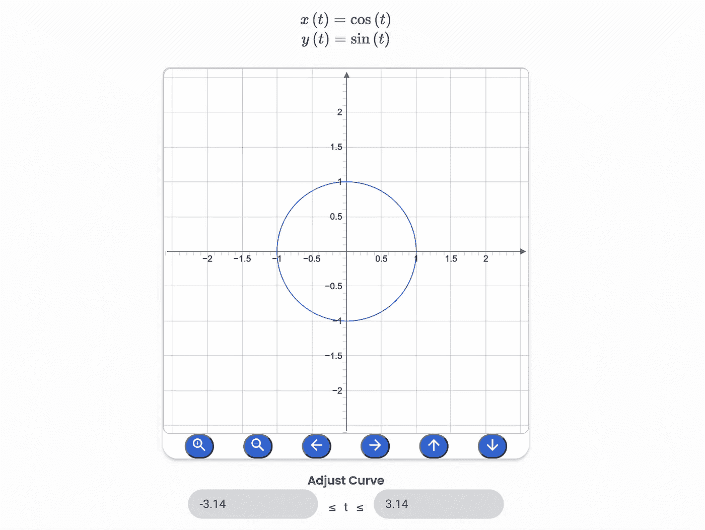
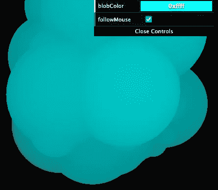
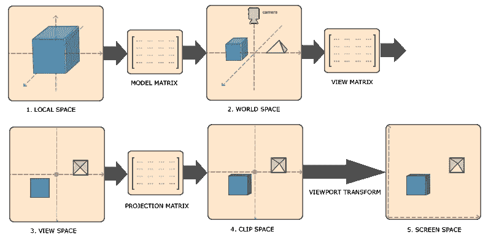
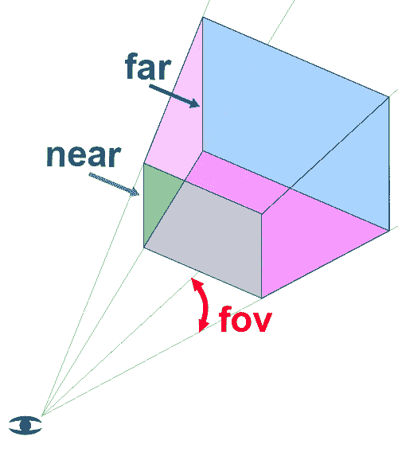
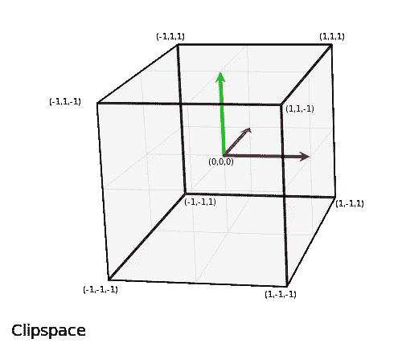

# Three.js 中的低聚烟雾颗粒

> 原文：<https://medium.com/geekculture/low-poly-smoke-particles-in-three-js-acd3942fd250?source=collection_archive---------4----------------------->

这是一个简短的教程，关于如何在不使用完整粒子系统的情况下制作简单的低多边形粒子。



I like them colorful

# 关键要点

*   学习使用内置的`Vector3.lerp`功能来减缓物体运动
*   了解如何将屏幕坐标转换为世界空间坐标

# 现场演示和代码

大部分代码和想法都来自这个很酷的代码笔:[https://codepen.io/vcomics/pen/KBMyjE?editors=0010](https://codepen.io/vcomics/pen/KBMyjE?editors=0010)作者维克多·维加拉🙇🏻‍♂️，我不久前找到的，还做了书签。我对它进行了改进，增加了统计数据和 gui 控件。我的代码托管在[https://github.com/franky-adl/smoke-blobs](https://github.com/franky-adl/smoke-blobs)。

# 这是如何工作的？

这个想法很简单。创建一堆不同大小的球体，然后使用缓动和三角函数来帮助制作类似布朗运动的动画。还添加了雾来创建场景的深度错觉。不需要照明，因为我们只使用`MeshBasicMaterial`。

创建球体是容易的部分，但制作伪随机动画有点难。

首先，我们有一个“种子”球体，它是球体阵列中的第一个球体，作为所有后续球体的运动指南。它随时间以规则的圆形路径运动(暂时忽略`offset`):

```
// the first blob has a regular circular path (x y positions are calculated using the parametric function for a circle)
first_obj.position.set(
  offset.x + Math.cos(elapsed * 2.0),
  offset.y + Math.sin(elapsed * 2.0),
  offset.z + Math.sin(elapsed * 2.0)
)
```



The parametric function of a circle

然后，我们使每个下一个球的运动成为其前一个球的函数。所以球体 2 跟随球体 1，球体 3 跟随球体 2，以此类推。有很多方法可以做到这一点，但至少我们必须防止球体过于有规律地跟随它们的同伴，从而导致整体有规律的运动。让事情看起来更随机的一个简单且划算的方法是使用三角函数来计算每个球体的坐标(现在忽略`offset`):

```
object.position.lerp(
  new THREE.Vector3(
    offset.x + Math.cos(object_left.position.x * 3),
    offset.y + Math.sin(object_left.position.y * 3),
    offset.z + Math.cos(object_left.position.z * 3),
  ), params.lerpFactor
)
```

首先，让我解释一下这个`lerp`功能是关于什么的。

# **使用** `**lerp**` **功能**

我将原始代码的 GSAP 补间函数替换为这个内置的 lerp 函数，我认为这样可以使代码更简洁，并且可以达到几乎相同的效果。lerp 因子(封闭区间:[0，1])确定向量向目标向量“lerp”的距离百分比。当以固定的时间间隔使用时，这基本上是一个“放松”动画。我使用了一个非常小的插值因子，这样物体在每一帧中移动的距离就更小了。系数越高，球体的运动越快。要了解更多关于`lerp`的信息，请阅读这里的文档:[https://threejs.org/docs/#api/en/math/Vector3.lerp](https://threejs.org/docs/#api/en/math/Vector3.lerp)。

想象一下，如果只有两个球体，即使我们使用三角函数，第二个球体仍然会以某种圆形的规则方式运动。这是因为正弦余弦函数给出了规则的波形。

但是，如果你将球体的数量增加到几十或几百个，这种规律性将很快消失，因为人眼很难跟踪每个球体的运动，加上前面较大的球体阻挡了后面其他球体的视线。

# **将屏幕坐标转换成世界空间坐标**



followMouse turned on

我还添加了一个“跟随鼠标”复选框，这样当你的鼠标打开时，烟雾就会跟随鼠标。

要做到这一点，您需要一种将鼠标/屏幕坐标转换为世界空间坐标的方法。这不是一个猜谜游戏，因为你希望物体正好在你的鼠标位置上。这需要精确的计算。

幸运的是，这个代码片段可以帮助我们做到这一点。这个解决方案是由 Three.js 大师韦斯特兰利提供的🙇🏻‍♂️在[https://stack overflow . com/questions/13055214/mouse-canvas-x-y-to-three-js-world-x-y-z](https://stackoverflow.com/questions/13055214/mouse-canvas-x-y-to-three-js-world-x-y-z)。

那么这个神奇的片段是如何工作的呢？

为了理解这一点，我们必须绕一点弯子，回到一些 WebGL 的基础知识。下面是底层 WebGL 如何将每个对象从其本地空间转换到最终屏幕空间的管道:



Transformation of coordinate systems, image from [https://learnopengl.com/Getting-started/Coordinate-Systems](https://learnopengl.com/Getting-started/Coordinate-Systems)

如您所见，应用了 3 个矩阵，但让我们只关注投影矩阵，它将视图空间转换为剪辑空间。视图空间是从相机的角度看到的空间，这就是我在本文中所说的世界空间。(**注意不要把我的世界空间误认为上图中的世界空间。抱歉，我没有别的名字。)由于 WebGL 的工作方式是，最终它期望摄像机可见平截头体中的所有坐标都映射到 NDC(归一化设备坐标)，这是每个维度中范围[-1.0，1.0]的一个框，NDC 之外的所有内容都被裁剪掉，不可见。这就是为什么它被称为剪辑空间。请注意，WebGL 中 NDC 的 z 轴与 Three.js 的 z 轴相反。NDC z 轴指向屏幕的正方向。**



Left: the camera’s visible frustum ([img source](https://threejs.org/manual/#en/cameras)), Right: the NDC(normalized device coordinates) box ([img source](https://developer.mozilla.org/en-US/docs/Web/API/WebGL_API/WebGL_model_view_projection))

因此，如果我们想将屏幕坐标转换回世界空间(从摄像机看)，我们需要一个函数来将空间转换管道从步骤 5 反转回步骤 3，这意味着转换后的坐标回到视图空间。

这个函数写在下面的要点中。这是从我的回购中提取的。我还写了注释来解释每一步是怎么回事。

从代码中可以很快看出，你可以将步骤 2 `vec.unproject(camera)`作为你的结果，因为它已经将屏幕坐标转换为世界空间坐标，如果你不在乎它的 z 值的话。在步骤 1 中，将剪辑空间 z 设置为 1.0 越接近(越接近相机的远平面)，得到的贴图世界空间 z 越负；将剪辑空间 z 设置为-1.0 越近(越靠近摄影机的近平面)，贴图世界空间 z 就越正。

如果您想要返回点的指定 z 平面，只需将`targetZ`传递到函数中。轻松点。

最后，计算出的世界空间坐标被分配给`mouseWorldSpace`，然后被分配给我之前告诉你忽略的`offset`变量。`offset`是让烟雾跟随鼠标位置的东西。

这就是了。你一直读到最后，这很值得称赞。我可以告诉你是一个好奇和持之以恒的学习者！希望你能从本教程中学到一些东西，直到下次👋🏼。