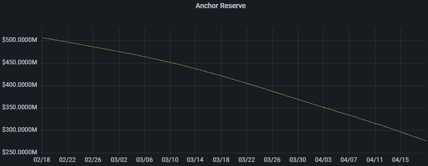
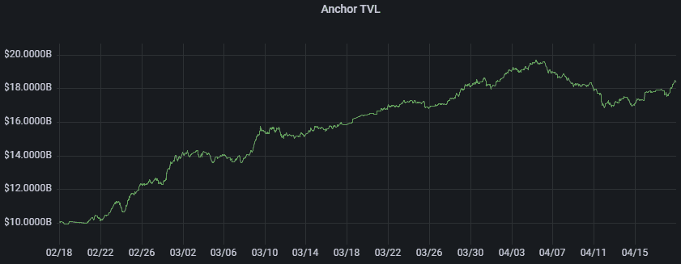
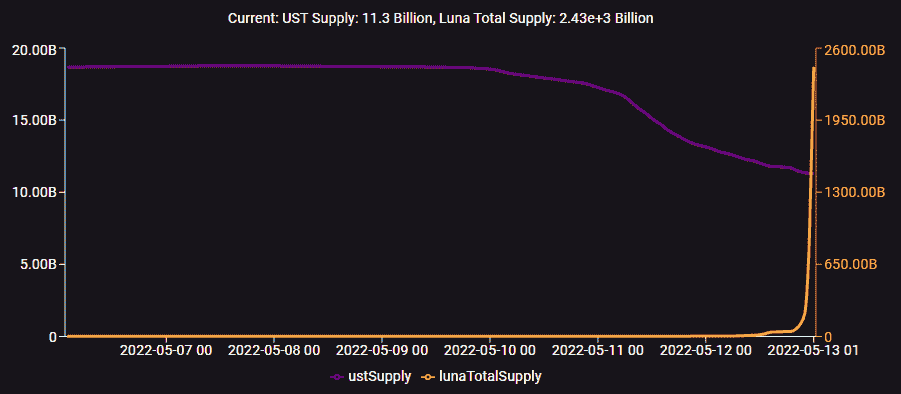

# 露娜短论文

> 原文：<https://medium.com/geekculture/luna-short-thesis-523104b305d3?source=collection_archive---------9----------------------->

这份备忘录概述了押注不可避免的 UST 脱钩事件和通过 perp 掉期做空 LUNA 的理由。我是在 3 月底开始研究 Terra 的，到 4 月中旬，我得出结论，UST 盯住美元的汇率制度是不可持续的。此后不久，我开始以相当悠闲的节奏撰写这份备忘录，预计月底利率调整后，资本将逐渐退出锚。我一点也不知道我的论文会在几周内发表。我真希望早点完成这个，而不是准备期末考试。

**美国东部时间 22 年 5 月 12 日下午 6 点—** UST 的价格约为 0.49 美元，露娜的价格约为 0.013 美元(低于 4 月 1 日 ATH 的 115 美元)

市场已经证明，Terra 在最好的情况下是一次建立持久稳定机制的失败尝试，在最坏的情况下是一次大规模的欺诈，有可能迎来另一个秘密的冬天。下面我将首先描述 UST 的挂钩机制，并详述我的核心论点。我将用一些关于算法稳定性、去中心化金融的未来和风险资本的状态的一般性观点来结束我的演讲。多么戏剧性的几天。

# **泰拉挂钩机制&银行挤兑的威胁**

理解 UST 的稳定机制对于理解我的论点是必要的。通过一种烧钱/造币机制，1 UST 总是可以与价值 1 美元的月神互换，Terra 鼓励做市商套利消除 UST 供求失调。例如，在第一种情况下，如果由于需求下降，UST 以钉住价格(0.99 美元)交易，套利者将烧掉 UST 和铸币厂价值 1 美元的 LUNA。由此导致的 UST 供应量的收缩给其价格带来了上行压力，套利者抓住了 UST 此前价格(0.99 美元)与盯住汇率之间的价差。做市商将反复焚烧 UST 和薄荷露娜，直到稳定币再次交易于 1 美元。类似地，在情景 2 中，如果 UST 由于需求增加而交易高于挂钩价(1.01 美元)，套利者将烧掉价值 1 美元的卢纳来铸造 1 美元的 UST。套利者再一次获得了 1 美元的卢纳和 1 UST(1.01 美元)的差价，UST 供应量的增加略微降低了它的价格。

主要观点是，LUNA 充当了 UST 需求冲击的缓冲器，然而，这两种代币之间极其自反的关系揭示了一种易受银行挤兑影响的令人担忧的机制。考虑一下需求突然收缩给 UST 带来巨大抛售压力的情景:为了维持盯住美元的汇率制度，套利者铸币造币，并迅速增加供应量。与外源性抛售相结合，这种理应支撑 UST 价值的代币上的通胀压力降低了市场对 LUNA 作为抵押资产的信心，并加剧了对挂钩破裂的担忧。UST 和卢娜之间的反射性互动创造了一个自我毁灭的反馈回路，促使更多的资本从这两个代币中逃离，但尤其蒸发了卢娜的资本价值。银行挤兑的威胁要求 Terra 以某种方式激励套利者持有 LUNA，而不是在收缩期立即获利。理性套利者会这样做的唯一原因是，如果他们坚信未来对 UST 需求的扩张将超过当前的收缩，然而，自愿背离市场中立的安全性不是做市商的本性。此外，保证未来需求增长超过任何短期收缩的唯一方法是通过 Terra 生态系统的永久增长。

为了建立抵御需求收缩的能力，并减轻对潜在银行挤兑的担忧，在 Jump Crypto 于 3 月下旬提出严格的治理提案后，Terra 宣布建立比特币储备池。Jump 提出了一种机制，如果 UST 价格跌至 0.98 美元以下，套利者将把 UST 换成价值 0.98 美元的比特币，而不是 1 美元的卢纳。这个储备池的资金由 Jump Crypto 和 Three Arrows Capital 等公司提供。尽管由 BTC 等不相关资产资本化的足够大的储备池肯定会降低银行挤兑的风险，但这一策略也应该被解读为意识形态上的失败。对储备池作为部分抵押品的依赖，消除了 Terra 相对于戴(DAI)和等被抵押稳定资产的资本效率优势。此外，由于在大幅脱钩的情况下，做市商将与 BTC 套利，在随后的复苏中，LUNA 持有人获得的回报将减少，进一步降低了持有的动力。

希望 UST 稳定机制的不可持续性是明确的，然而，如果没有即将到来的流动性紧缩可能引发上述事件，我不会做空 LUNA。

# **锚**

Anchor 是建立在区块链基础上的货币市场协议，直到 2012 年 5 月 1 日，它在 UST 提供了稳定的 20%的收益率。银行通常从它们的净息差中赚钱，然而，在 Anchor 的案例中，这种利差是不存在的。为了维持他们在 UST 的 20%的 APY，Anchor 从 Terraform Labs 资助的 9 位数储备池中支付，并可能与其他几家风投合作跳加密。该储备在 2022 年初迅速耗尽，要求 Terraform Labs 在 2 月 17 日紧急注资 4 . 5 亿美元。从 2 月 18 日到 4 月 18 日，Anchor 的储备从 5 亿美元下降到 2 . 75 亿美元，这意味着每月要烧掉 1 . 08 亿美元，而他们的 TVL 从 100 亿美元增加到 180 亿美元。

**来源:**【https://grafana.luigi311.com/d/7j96rRI7z/anchor?orgId=2】T2&从=现在-30d &到=现在

显而易见，随着 Anchor 的储量和 TVL 稳步向相反的方向移动，协议必须投票大幅降低其产量，除非确定了> 20% APY 的有机来源，以免储量在短短几个月内耗尽。再次重新资本化 Anchor 的储备是为了延续一个明显的庞氏骗局，支撑着世界上最大的数字资产之一。

在采纳了转向动态利率的提议后，5 月 1 日，Anchor 将 UST 的收益率从之前的 19.5%降至 18.5%。随着 Anchor 进一步将收益率降至可持续的 7-12%(根据 Galois Capital 的估计)，流动性将转移到其他地方，因此减少了对 UST 的需求，并大幅增加了 LUNA 的供应。考虑到截至 5 月 1 日，约 74%的 UST 需求可归因于锚定存款收益(锚定存款中的 137.15 亿 UST/185.37 亿 UST 总供应量)，TVL 的大幅减少可能会引发银行挤兑。

# **核心辩论**

传播最广的反对观点认为，UST 足够的有机需求将抵消锚定资本外逃，并产生飞轮效应，带来可持续的稳定。这篇论文有几个问题。首先，尽管有许多有趣的项目正在 Terra 上建设，如 Mirror(反映现实世界资产价格的合成品)、Astroport(针对不同资产池的单独 AMM 的无所不包的指数)和鲸声优(允许用户对折扣抵押品进行投标)，但每个项目的 TVL 只是 Anchor 的一小部分(截至 5 月 1 日，astro port:～15 亿美元，Mirror:～7 亿美元，鲸声优:～4000 万美元)。期望 TVL 在其他 L2 协议中的增长会在短期内抵消锚的资本转移是不现实的。

想想临近的 Near 和 Tron 上的几个吸血鬼算法马厩，分别提供 20%和 30%的收益。由于任何人都可以挪用现有项目，这些模仿者很可能是众多模仿者中的第一个，肯定会进一步将流动性分散到各个链中。

另一个相反的论点是，曲线 4 工具的引入将增加足够的流动性，以承受资本退出 Anchor 的销售压力。就上下文而言，3pool 是 Curve 上流动性最强的池，是一种针对稳定债券互换进行优化的 DEX，由 USDC、USDT 和 DAI 组成，它们都是完全抵押的稳定债券。最初由 Terraform Labs 提议，4 个池将由 UST、Frax、USDC 和 USDT 组成。Terra 和 Frax 在凸型治理中占有相当大的份额，这使得他们能够将更高的收益率分配给预期的 4 个工具，从而激励他们自己的稳定投资获得更大的流动性。4pool 肯定会实现这个目标，但是，让我们进一步分析短期销售压力，以了解其意义。

假设 Anchor 的利率降至 12%，考虑到 defi 有大量诱人的高产农业机会，让我们相当保守地假设，协议只剩下约 60 亿美元的资本(约 33%的 TVL 和约 44%的 UST 存款)。事实上，退出 UST 的途径令人惊讶地有限:考虑到 Curve 目前的流动性水平，只有大约 5 亿美元可以通过 Curve 进行交换，其中几十亿美元可以通过 BTC 退出，几十亿美元可以通过 LUNA 退出，其余的可能将在 Terra 链上进行回购。4 工具的推出对缓解即将到来的流动性紧缩几乎没有作用。此外，还要考虑买卖通常流动性差的数字资产对价格的巨大影响。购买和出售公共股票的乘数通常只有 4-8 倍(例如，购买 100 美元的股票会使其市值增加 400-800 美元)，这意味着 defi 等价物要高得多。坦率地说，UST 根本不存在足够的流动性来避免危机。

事实是，到目前为止，每一个算法稳定性实验都失败了，通常是以相当戏剧化的方式。回顾主要的争论，跆拳道曾经在推特上发布了类似的内容:确保长期稳定性的唯一方法是通过创建依赖于稳定连接的可持续和不相关的用例。他基本上认为，算法稳定的开发者必须优先考虑经济建设而不是机制设计，然而，如果机制本身有缺陷，经济，无论多么有活力，都是无关紧要的。

2021 年 1 月，曼尼·林孔-克鲁兹(Manny Rincon-Cruz)在他的博客上发布了一篇我认为是关于算法稳定积分的开创性文章，题为“当心优惠券剪报:所谓算法稳定积分的不可逾越的缺陷”。在这篇文章中，他认为算法稳定必须保持单调递增的需求增长，以避免最终钉住汇率制度崩溃前的一系列价格波动。Rincon-Cruz 写这篇文章时想到了“息票币”，即当价格高于挂钩时通过铸造来挂钩其价值的代币(如 UST)，但当价格低于挂钩时发行附息票。虽然略有不同，但我认为 LUNA token 本质上代表了对未来稳定的硬币需求和供应增长的要求，就像附息票一样。因此，从货币政策的角度来看，Terra 的机制保持了完全相同的基本缺陷。算法稳定银行试图复制公开市场操作，但不具备实施资本管制的关键能力。

我的论文面临的最大风险是，为了延续这种庞氏骗局，Jump Crypto 和 LUNA Foundation Guard 继续干预在透明竞争中运营的分散市场。预测他们的行动是不可能的，但为了 defi 生态系统，我真诚地希望他们停止。

# **结论**

现在尘埃落定，我将简要地思考一下我的论文。资金逃离锚定，加剧了似乎是来自攻击挂钩的鲸鱼的外源抛售压力，引发了银行挤兑，使 LUNA 的供应膨胀，直到变得一文不值，迫使 Terra 现在转向抵押模式。

【https://terra.smartstake.io/UST】来源:

我现在问自己，特别是鉴于最近有消息称，跆拳道也是基础现金的幕后黑手，Terra 是金融创新的真实尝试，还是针对不知情的散户投资者的蓄意欺诈。不管 Do 的意图如何，我强烈认为选择投资 Terra 或 Anchor 的风投和 mm 应该受到批评，因为他们缺乏头脑清晰和彻底的勤奋。我的希望是，加息和即将到来的经济衰退将最终结束不合理的过度回报时代，迎来新一代秘密风险投资者，他们的唯一优先事项是为可持续的分散化未来融资。