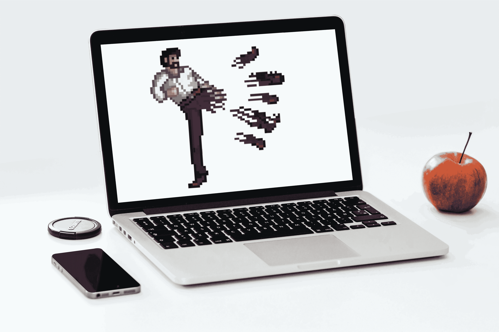

# MacBook Pro 是计算机界的查克·诺里斯

> 原文：<https://medium.com/geekculture/macbook-pro-is-the-chuck-norris-of-computing-a9b66180280a?source=collection_archive---------9----------------------->

## 幽默

## 有计算，也有糟糕的计算

MacBook Pro boots YOU! Photo by [karsten madsen](https://www.pexels.com/@morningtrain?utm_content=attributionCopyText&utm_medium=referral&utm_source=pexels) from [Pexels](https://www.pexels.com/photo/macbook-pro-near-iphone-and-apple-fruit-18105/?utm_content=attributionCopyText&utm_medium=referral&utm_source=pexels), modified by the author.

Louis Petrik 在他关于为什么开发者喜欢 MacBook Pro 的故事中说，“我曾经不小心用 MacBook 撞上了一堵墙，只在墙上撞了一个小洞。”