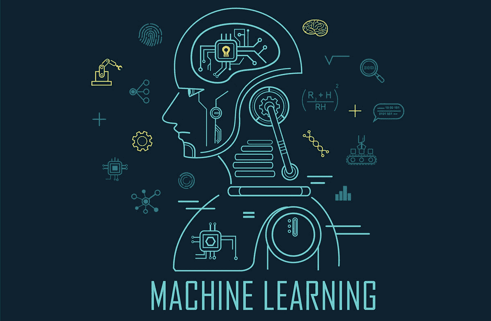
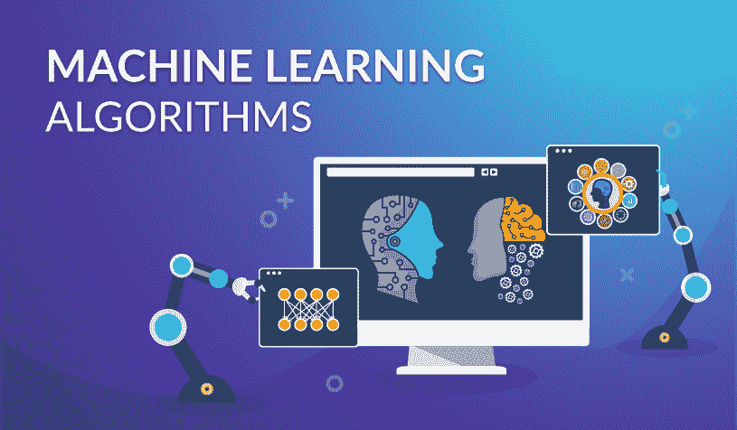
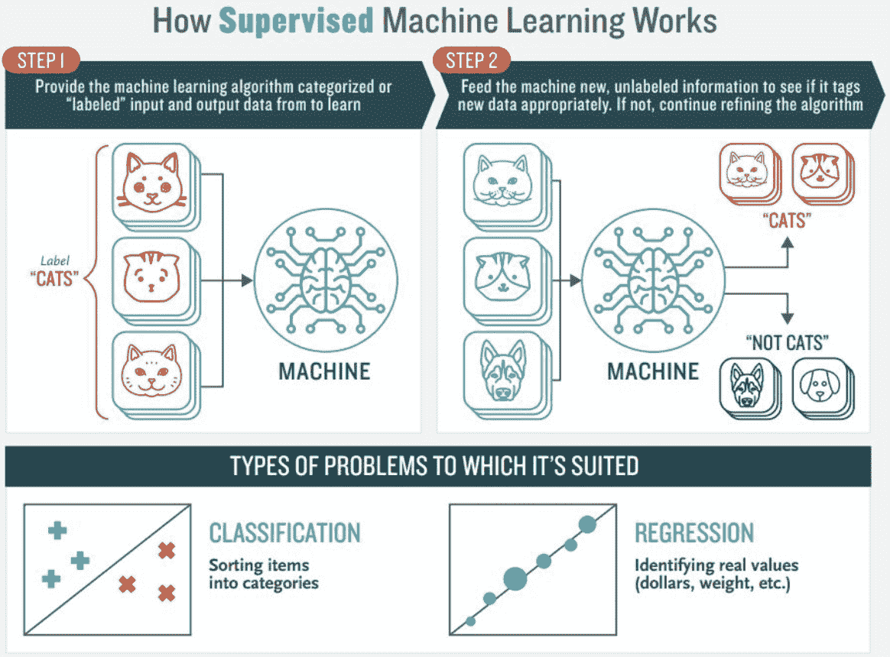
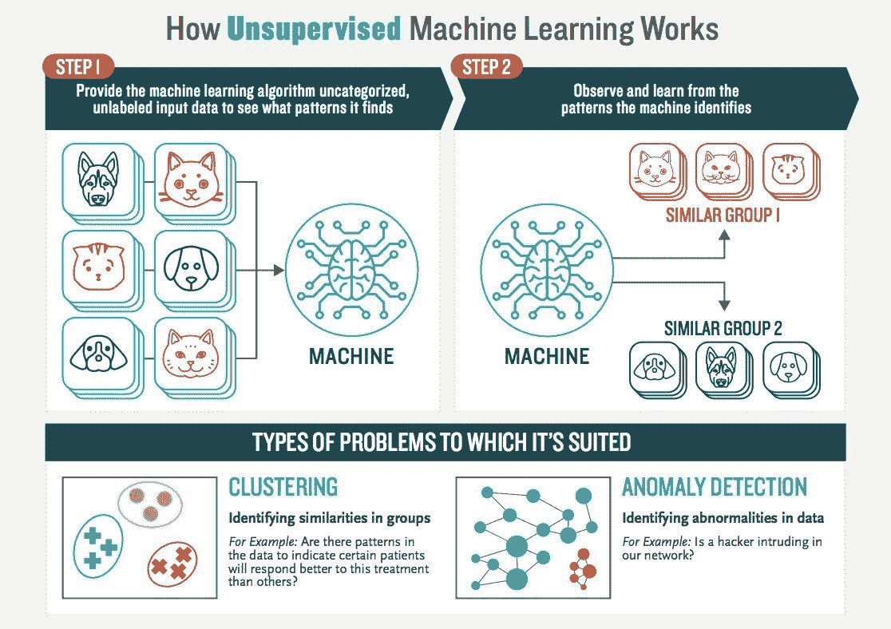
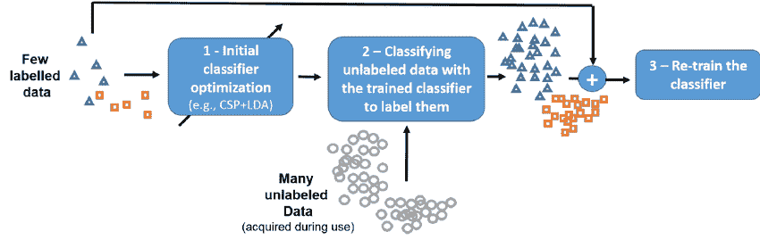
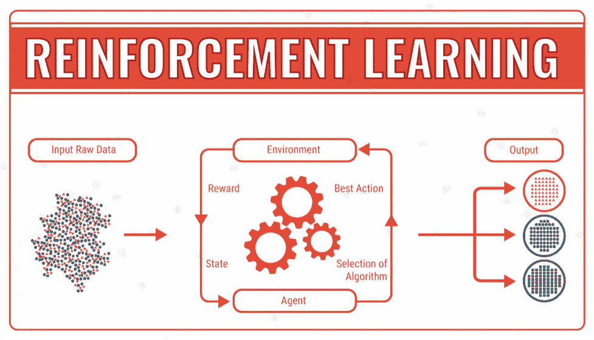

# 机器学习算法:详细的初级读本

> 原文：<https://medium.com/geekculture/machine-learning-algorithms-a-detailed-primer-8052c5397d4c?source=collection_archive---------9----------------------->

Image Source: University of Reston

机器学习已经接管了世界，它已经从科幻世界的幻想中走出来，成为商业智能现实。它可以被称为新时代的商业工具，包含了商业运作的多种元素。

商业智能的未来现在取决于机器学习。机器学习是现代工作场所的一项重要技术。

它从科幻小说跨越到商业智能现实，可以用于多种目的，如改善营销策略或非常准确地分析客户趋势。

在 1，600 多名接受调查的企业所有者、决策者和技术领导者中，74%的人认为 ML 是一个游戏规则改变者，有可能改变他们的工作和行业。很明显，这项技术已经成为我们日常工作的重要组成部分。

*[***人工智能和机器学习***](https://www.globenewswire.com/news-release/2020/06/16/2048487/0/en/Artificial-Intelligence-AI-Market-to-Rise-at-33-1-CAGR-by-2026-Natural-Language-Processing-Segment-to-Earn-Dominance-Owing-to-its-Semantic-Disambiguation-Features-says-Fortune-Busi.html) ***的市场预计将在未来几年增长 33%，如果目前的趋势继续下去，到 2026 年将达到 2025.7 亿美元的收入！****

*如果我告诉你，你的未来可以由机器决定，你会怎么说？嗯，这并不太牵强，因为机器每天都在学习比人类做得更多更好。*

*此外，机器学习(ML)应用的使用在不同行业中也变得突出，如供应链、医疗保健、信息技术、银行等。*

# *2022 年机器学习的重要性*

*人工智能(AI)和机器学习(ML)都是当今企业最有价值和最具趋势的技术。*

*数据分析已成为理解客户需求、预测行为模式的关键部分，其准确率远远超出了人类自身的能力；所有这些都可以通过利用人工智能或人工智能算法来完成，这些算法有助于对资源下一步应该去哪里做出明智的决定。*

*人工智能和机器学习的未来现在掌握在你们手中。这些算法正在被大数据分析师所接受，他们依赖这些算法成为更智能的应用程序，这些应用程序可以自己分析用户行为模式，同时在需要的时间或地点提供所需的内容——所有这些都无需人工干预。*

*简而言之，企业正在使用机器学习应用程序来通过预测分析获得重大收益并推动客户参与。*

*因此，如果你是企业主或机器学习专家，你有必要理解各种机器学习算法可以带来什么？*

*在与我们的人工智能专门开发团队进行了彻底的交谈后，我们已经制定了一个关于人工智能算法的详尽的初级读本。*

*在这篇博客中，我将尝试揭示机器学习(ML)算法类型的本质，并尝试详细描述不同类型的机器学习算法的目的和用途:*

# *机器学习算法的类型*

**

*Image Source: Coders era*

*在深入研究机器学习算法的权宜之计和执行之前，让我们试着理解机器学习到底是什么？*

*ML 是人工智能的一种形式，它为计算系统提供了自动学习、改进和复制经验的能力，而无需显式编程。*

*机器学习的一些常见应用包括医疗诊断(例如，放射学)、图像处理(例如，对象识别或面部分析)、预测，其中算法可以基于过去的数据点预测未来事件。*

*机器学习的应用正在被用于许多不同的领域，并且它已经成为一个主要的产业。构成这些功能的算法可以在各种行业中找到，因为它们是如此的通用！*

*如果你正在寻求在你的企业应用中执行机器学习功能，你应该 [**雇用机器学习开发者**](https://www.valuecoders.com/hire-developers/hire-machine-learning-experts?utm_source=Medium&utm_medium=ANU_B11&utm_id=ML) ，他们可以利用机器学习算法来制定面向业务的应用。*

# *主要的机器学习算法*

# *1.监督机器学习算法*

*监督学习算法是那些数据科学家或分析师对算法的预期结果有明确想法的算法。*

*然后使用带标签的数据集来训练该算法，该数据集包含一组训练数据点以及相应的标签。*

*这里的目标是生成一个可以将输入值(x)映射到相应的输出值(y)的模型。在模型被训练之后，它可以被用来预测新数据点的标签。*

*监督机器学习算法的一些常见示例有:*

*   *线性回归*
*   *逻辑回归*
*   *决策树*
*   *随机森林*
*   *支持向量机等。*

**

*Image Source: Medium*

## ***监督机器算法包括两个主要过程***

***回归:**在这里，目标是预测一个连续的值输出。例如，根据房子的大小、年龄、位置等来预测房子的价格。*

***分类:**在这个过程中，目的是给输入数据点分配一个类别标签。例如，将电子邮件分类为垃圾邮件或非垃圾邮件。*

## *用例:监督机器学习算法*

*有监督的机器学习算法的用例非常多。一些最受欢迎的使用案例如下:*

***检测银行交易中的欺诈活动:**这对任何银行来说都是一项至关重要的任务，因为它可以帮助他们避免巨大的财务损失。*

*可以运行监督机器学习算法来训练关于过去交易数据(欺诈性和非欺诈性)的模型，然后可以使用该模型来预测新交易是否可能是欺诈性的。*

***预测股价:**通过使用历史股票数据，可以训练一个机器学习算法来预测未来的股价。这对于想要做出明智投资决策的投资者来说非常有用。*

# *2.无监督机器学习算法*

*无监督的机器学习算法是一种分析师或数据科学家不知道算法的预期结果应该是什么的算法。*

*然后使用不包含任何标签的数据集来训练该算法。这里的目标是生成一个模型，它可以学习根据一些共同的基本特征对输入值进行分组。*

*与监督学习算法相比，非监督学习算法不需要标记数据。相反，他们试图通过寻找数据本身的模式来了解数据的底层结构。*

**

*来源:走向数据科学*

## *这种 ML 算法使用以下类型的技术来描述数据:*

*   ***聚类:**这是一种数据可视化的方法，将相似的数据点分组在一起。*
*   ***异常检测:**这是一种识别不符合其余数据的异常数据点的方法。*
*   ***降维:**这是一种减少数据集中特征数量的方法，同时仍然保留尽可能多的信息。*
*   ***关联挖掘:**这是发现数据集中不同项目之间关系的过程。*

*一些常见的无监督机器学习算法有:*

*   *k 均值聚类*
*   *分层聚类*
*   *Apriori 算法等。*

## *用例:无监督的机器学习算法*

*无监督机器学习算法的用例也非常多。一些最受欢迎的使用案例如下:*

***在客户数据中寻找模式:**通过根据购买历史对客户进行聚类，零售商可以识别出具有相似购买习惯的客户群。这可用于针对这些客户开展特定的营销活动。*

***预测客户流失:**流失是指停止与公司做生意的客户。通过使用无监督的机器学习算法，根据客户过去的行为对他们进行聚类，公司可以识别出有流失风险的客户群体。*

*然后，这些信息可用于针对这些客户开展特定的保留活动。*

# *3.半监督机器学习算法*

*顾名思义，半监督机器学习算法使用标记和未标记数据的组合。*

*使用半监督学习算法的优点是，它们可以利用未标记数据中包含的额外信息。这有助于提高学习到的模型的准确性。*

**

***图片来源** : ResearchGate*

*一些常见类型的半监督机器学习算法有:*

*   *合作培训*
*   *三元训练*
*   *自我训练*

## *用例:半监督机器学习算法*

*半监督机器学习算法的用例类似于监督和非监督机器学习算法的用例。半监督机器学习算法的一些最流行的用例如下:*

***文本分类:**半监督机器学习算法可以用来分类文本文档。这是因为获得少量标记数据通常比获得大量标记数据更容易。*

***图像分类:**半监督机器学习算法也可以用于图像分类任务。这是因为获得少量标记数据通常比获得大量标记数据更容易。*

*如果你想创建一个机器学习应用，那么你应该**雇佣机器学习程序员**。*

# *4.强化机器学习算法*

*强化学习算法是一种通过试错来学习的机器学习算法。他们习惯于解决事先不知道解决方案的问题，算法必须找出实现预期结果的最佳方式。*

*强化学习算法的一个常见应用是玩游戏。在围棋、国际象棋和扑克等游戏中，玩家的最佳走法并不总是很明确。可以采用强化学习算法，通过多次迭代与自身对抗来学习最佳移动。*

*强化学习算法的另一个常见应用是在机器人领域。像在迷宫中导航或捡起一个物体这样的机器人任务很难通过手动编程来完成。*

*然而，可以使用强化学习算法来自动学习如何执行这些任务。*

**

*图片来源:nateq 新闻*

*一些常见的强化学习算法有:*

*   *q 学习*
*   *蒙特卡罗树搜索(MCTS)*
*   *时差*
*   *异步行动者-批评家代理(A3C)*

## *用例:强化学习算法*

*强化学习算法的使用案例是巨大的和多样的。一些最受欢迎的应用如下:*

*训练机器人:强化学习算法可以用来训练机器人如何执行任务，例如在迷宫中导航或捡起一个物体。*

***预测股票价格:**通过使用强化学习算法，投资者可以学习如何交易股票，以实现利润最大化。*

***优化制造流程:**通过使用强化学习算法，公司可以学习如何优化他们的制造流程，以最大限度地提高效率。*

# *结尾词*

*机器学习算法是解开数据集的关键，否则这些数据集将毫无用处。通过合并不同类型的这些强大的、基于机器学习的算法，您可以在无法搜索的信息中找到新的见解，并以前所未有的速度采取行动！*

*因此，无论你有一家专注于打车应用或食品配送服务甚至任何其他应用等项目的公司，你的下一个和当前的业务需求都将受益于机器学习算法。*

*如果你需要专业知识，那么你可以**从最好的 [**机器学习应用程序开发公司**](https://www.valuecoders.com/ai-ml-development-services-company?utm_source=Medium&utm_medium=ANU_B11&utm_id=ML) 聘请机器学习顾问**来注入机器学习算法，这些算法可以创建面向业务的解决方案，以增加你的客户参与度和销售额。*