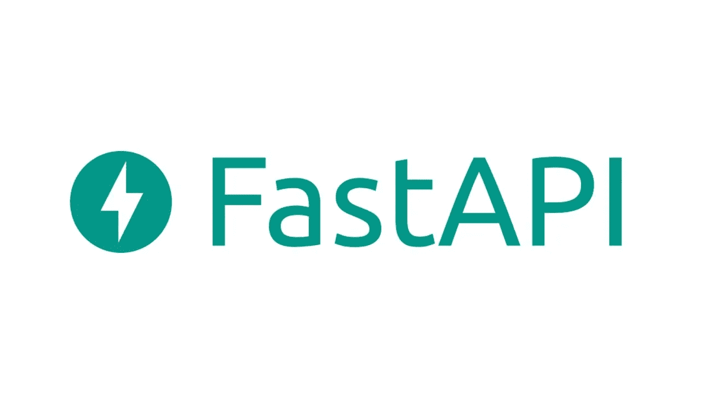

# 为什么应该在 FastAPI 上部署机器学习模型

> 原文：<https://medium.com/geekculture/machine-learning-and-fastapi-5471a4975ff0?source=collection_archive---------9----------------------->

开发、记录、部署和输入

Fast API [documentation](https://fastapi.tiangolo.com/tutorial/first-steps/)

你们很多人可能听说过 FastAPI，甚至读过我关于它的文章。FastAPI，顾名思义，是一个基于 ASGI python 的框架，比 Django 和 Flask 快很多。它带有 Pydantic 和 Starlette，并被证明是最好的 py 候选人。