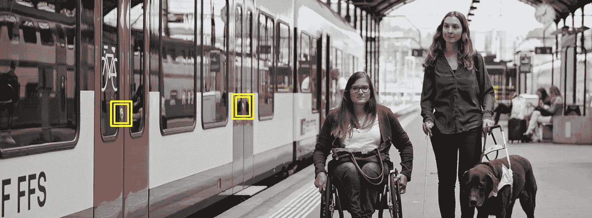
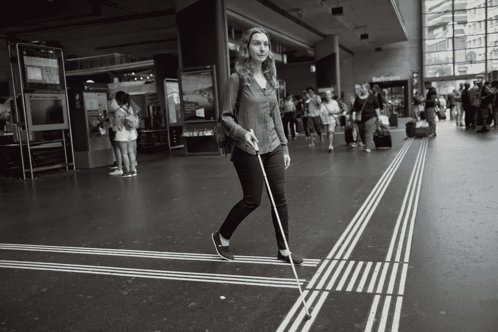
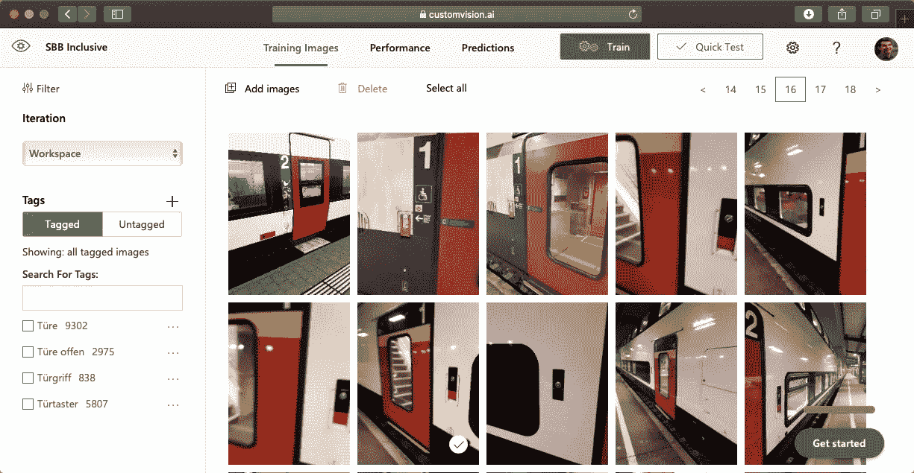
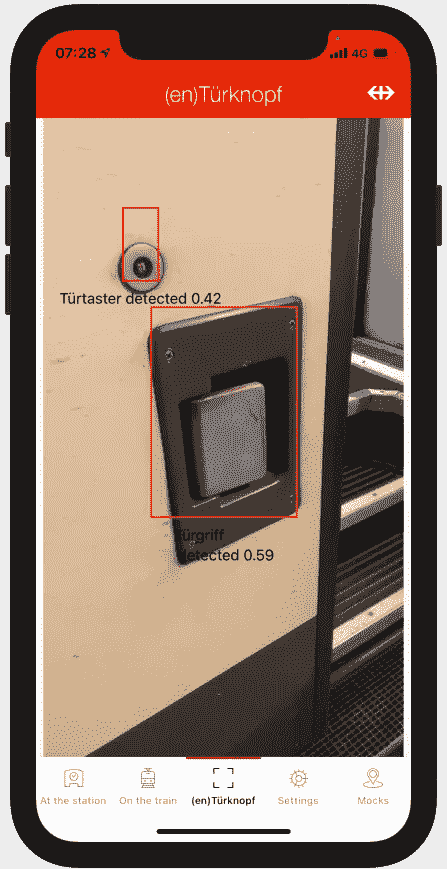
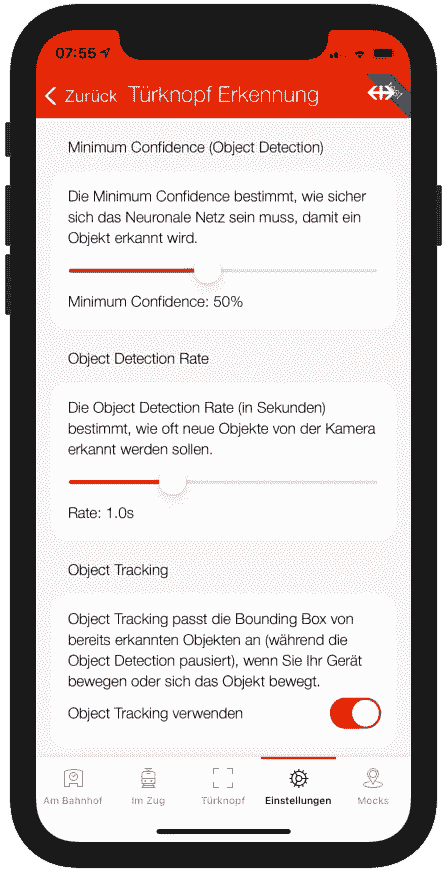
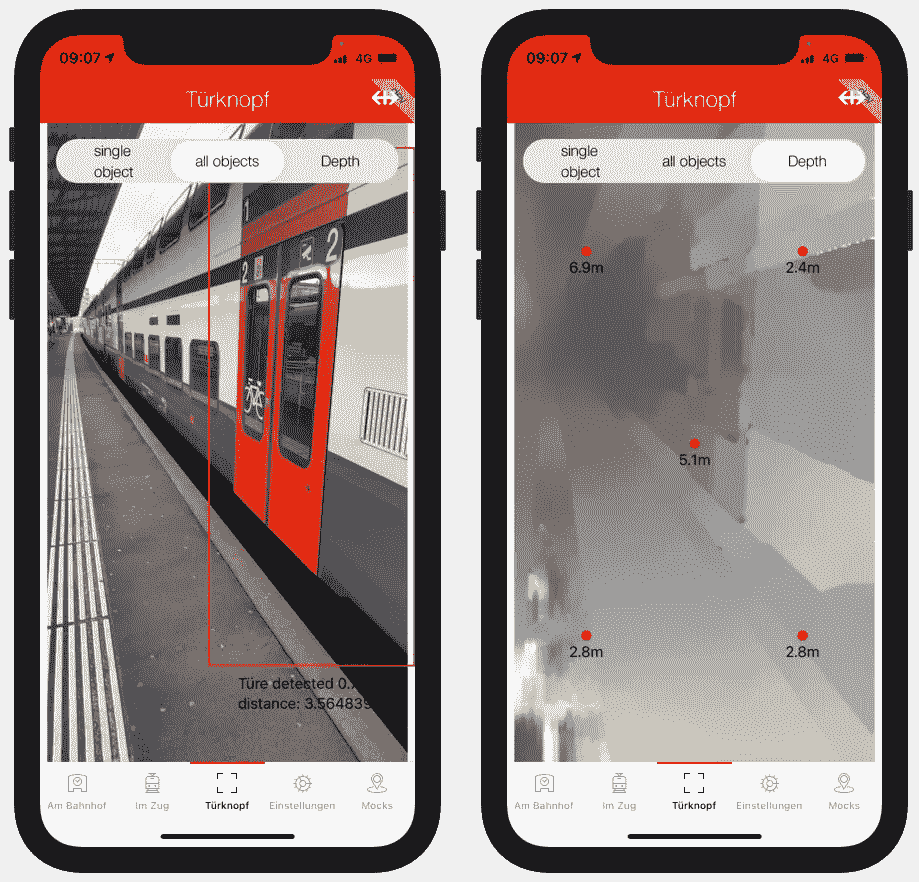
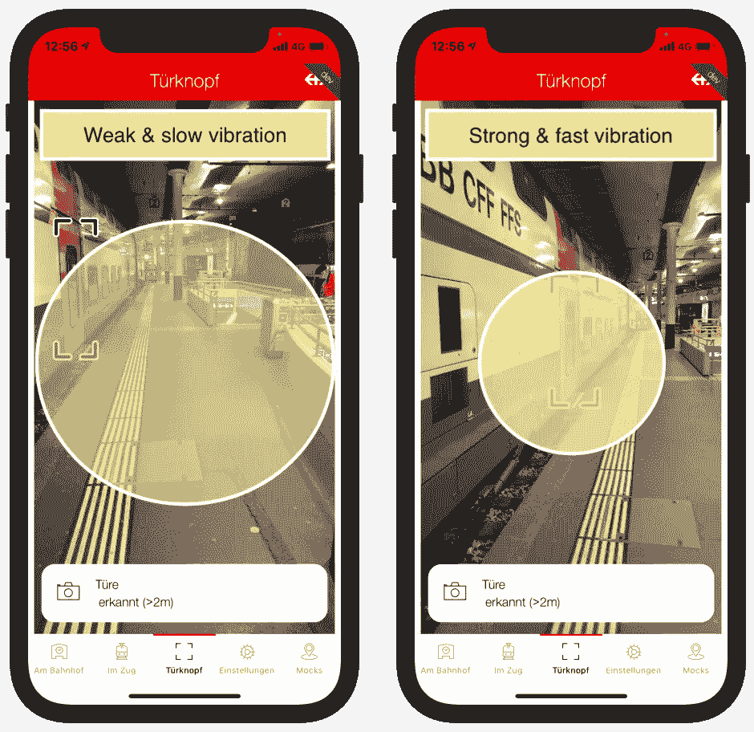
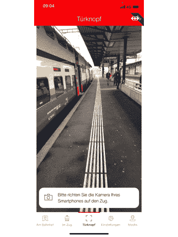

# 基于机器学习的视障导航系统

> 原文：<https://medium.com/geekculture/machine-learning-based-navigation-system-for-the-visually-impaired-26a8c3d0a3e7?source=collection_archive---------14----------------------->

在过去的几十年里，机器学习领域有了很大的发展。由于计算性能的巨大飞跃，即使是移动设备也可以以 30fps 的速度从摄像机直播流中执行对象检测。可能从中受益最大的人群之一实际上是盲人或视力受损者。视觉智能可以用来弥补他们失去的视力，并为他们识别周围的环境。

在这篇文章中，你将了解我们(作为一家铁路公司)如何使用机器学习和其他尖端技术来帮助视力障碍者的旅程。

# 用例

2020 年 12 月，我们发布了我们的应用程序“SBB 全纳”( [iOS](https://apps.apple.com/ch/app/sbb-inclusive/id1495023290) ， [Android](https://play.google.com/store/apps/details?id=ch.sbb.inclusive&hl=en&gl=US) )，专门针对视力不好的人。该应用程序可以检测到你坐在哪辆火车上，或者你在哪个火车站，并为你提供所有与你的情况相关的信息(显然该应用程序在可访问性方面进行了大量的[优化](https://appbakery.medium.com/designing-mobile-apps-for-accessibility-fe4ef7ef4e7f))。

视觉受损的人在使用公共交通工具时的一个痛点是找到进入火车或公共汽车的门(或门按钮，如果门是关闭的)。平台上有触觉引导线，这样他们就能感觉到平台的尽头在哪里。但是没有办法知道火车门在哪里。他们经常被迫用手来“扫描”火车上的车门按钮。虽然我们会说我们的火车很干净，但是它们仍然在外面运行。然而，安全问题要重要得多:想象一下，当一个盲人用手扫描火车时，如果火车突然启动会发生什么。

A blind person using tactile lines for navigation.

由于我们的团队在图像分类和物体检测方面非常有经验，我们决定利用我们的知识来帮助视觉障碍者。我们最初的想法是:

*   在火车站收集许多火车的照片，并给车门、车门按钮等贴上标签。然后训练可以识别这些对象的对象检测模型。
*   使用用户的手机摄像头实时拍摄模型。
*   使用 VoiceOver 和振动来引导用户找到门或门按钮(类似于雪崩信号灯的工作方式)。

由于大多数视障人士都是 iOS 用户，我们决定先从 iOS 的概念验证开始，如果我们的想法成功的话，我们将在以后跟进 Android。

# 收集图片和创建模型

虽然 Covid 的情况真的让整个世界屏息以待，但我们实际上能够利用它。许多员工无法继续他们的日常工作，所以我们伸出援手，请他们支持我们，在火车站拍照，并在家里贴上标签。我们使用微软的 CustomVision 平台进行标记过程(感谢微软让我们在这个用例中免费使用他们的平台)。我们还使用 CustomVision 来训练一个模型，然后我们可以在我们的应用程序中使用它。CustomVision 平台被证明是一个不错的选择，因为它非常容易用于我们所有的贴标机。

Labelling experience with CustomVision.

# 实时应用内物体检测

虽然 CustomVision 平台对于创建模型非常方便，但结果表明生成的 CoreML 模型并不是我们所期望的。CustomVision 会生成一个 CoreML v1 模型(v3 是当前的标准)，并强制您使用 Microsoft CustomVisionMobile 库。我们还注意到，微软的开发人员也是人:如果你配置错了，库就会崩溃，而不会给你任何出错的提示(致命错误)。几个小时后，我们仍然设法让它运行起来，并能够第一次在我们的应用程序中测试我们的模型。

First results after integrating the model in the app.

虽然我们能够在现代 iPhone 上每秒处理 30 张图像，但我们注意到它消耗了大量电池。所以我们决定将物体检测速率降低到每秒 1 个周期左右。这样做的缺点是——正如你可能想象的那样——当移动相机时，边界框不能平滑地更新。

幸运的是，我们找到了这个问题的解决方案，它被称为对象跟踪。对象跟踪是一种随着时间跟踪已经检测到的对象的帧的技术。在引擎盖下，对象跟踪也依赖于机器学习，但比对象检测消耗的能量少得多。

我们还必须在这里寻找最佳设置(特别是对象检测率)，所以我们允许测试用户动态地更改它。目前，甜蜜点似乎以每秒 1 帧的速率存在。

Playing with the settings to find the optimal configuration.

# 额外收获:测量距离

到目前为止，我们已经实现了第一个目标:知道车门按钮在哪里。然而我们仍然不知道，它有多远。为了测量它的距离，我们有两种不同的选择:

1.  **使用激光雷达传感器**
    ✅非常精确
    ❌只有最新最贵的 iPhone 12 Pro 配备了它。它只测量传感器垂直前方单点的距离。
2.  **使用深度数据**
    ✅可以在所有新款 iphones 上运行(至少有两个摄像头)。你得到了一个整个相机内容的“地形”图。
    ❌不太精确(特别是对于非常远的点)。

因为在我们的例子中，知道一扇门是 2.53 米还是 2.54 米并不重要，所以我们决定用 DepthData 进行实验。如果你在问自己，如何使用两个不同的相机计算距离，秘密在于两个相机使用的不同镜头(角度)。如果你知道一个物体在两幅不同图像中的位置，你就可以计算出它的距离。我们在这里不会涉及太多细节，但是如果你感兴趣的话，[这段视频](https://developer.apple.com/videos/play/wwdc2017/507/)会给你所有的答案。

现在，DepthData 将为包含测量距离的每一帧返回一个二维矩阵。由于使用这些矩阵的文本表示进行测试不太方便，我们决定直接在我们的相机流中可视化测量的距离。距离更远的像素会更暗，而靠近相机的像素会有更浅的灰色调。

Visualizing captured depth Data using graytones.

如果你仔细观察上面的图像，你会注意到测量的距离并不是超精确的。例如，中心的参考点距离右上角的参考点不超过 2 米。此外，深度数据似乎与一些特殊的模式，如触觉线斗争。然而，如果你不需要最好的精度，它工作得很好。好消息是:物体越近，深度数据就越有用。老实说，在开发过程中，探索深度数据是我们个人的亮点之一。

到现在为止，我们手头已经有了所有相关的信息:我们知道门(按钮)在哪里，并且我们可以计算它的距离。尽管如此，仍然缺少一些相关的东西。我们仍然需要引导视障用户到门口。

# 为盲人导航

到目前为止，视障人士可以通过 VoiceOver 和/或使用大尺寸内容来使用 SBB 全纳应用程序。然而，我们觉得这还不足以导航它们。幸运的是，来自其他领域的现有产品提供了大量的灵感。行人导航的一个例子是雪崩信标，一旦你靠近，它们就会发出更强更快的蜂鸣声来为用户导航。最终，我们决定尝试一种同时使用 VoiceOver 和振动强度/速度的解决方案(在 iOS 世界中也称为 CoreHaptics):

*   检测到的对象按优先顺序排列:开门>门按钮>关门。
*   初始检测时，VoiceOver 会读出优先级最高的对象。
*   到物体的距离在 VoiceOver 中以 3 种不同类别读出(大于 2 米、大于 0.5 米、小于 0.5 米)。
*   物体的方向(左/右，理论上也是上/下)是通过振动模式“感觉”的。

Navigation of blind persons using a combination of VoiceOver and vibration patterns.

# 第一印象

提出的解决方案会结束视力障碍者在试图登上火车或公共汽车时的痛苦吗？我们还不能给一个明确的答复。目前，我们的测试用户正在为我们测试这个新功能，并开始给出反馈。我们真的很想听听他们要说些什么。

一方面，我们非常有信心，因为探测物体和测量距离的技术部分似乎工作得很好，所以将它们导航到门口是可能的。另一方面，我们不太确定，如果我们的导航模式原封不动地投入生产。

Coach door / coach button detector demo.

除了导航模式之外，在这个新特性发布之前，还有一些东西需要改进:

*   门按钮识别还不能从远处工作(我们希望训练我们自己的基于 YOLO 的模型将改善这一点。[EPFL 洛桑学生在](https://devpost.com/software/blinddetector)[我们在劳扎克的挑战](https://lauzhack.com/challenges/sbb.html)期间获得的第一批结果似乎支持了这一论点。
*   对于某些火车类型，可以改进车门识别(这真的很简单:我们需要这些火车类型的更多图像)。