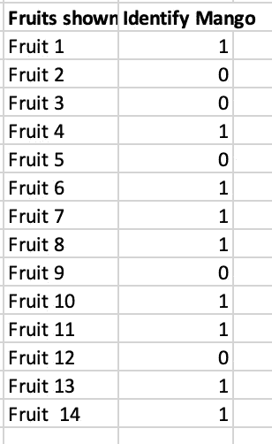
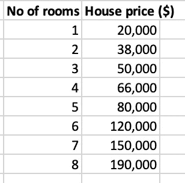
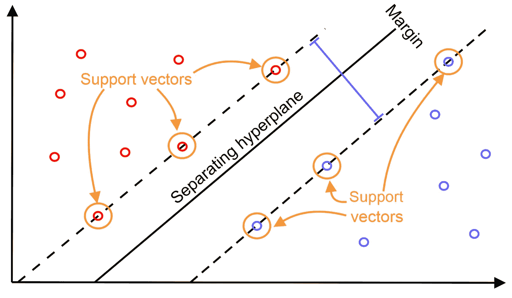
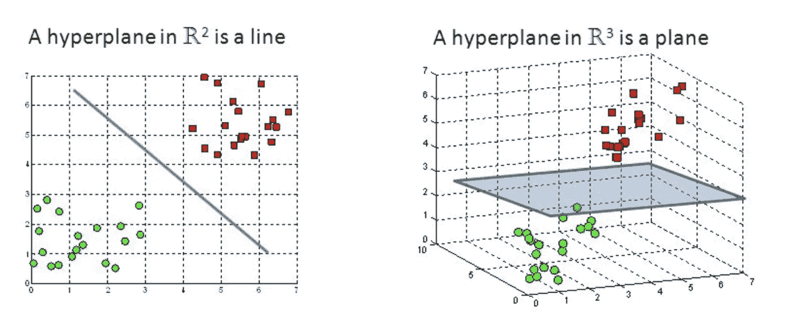
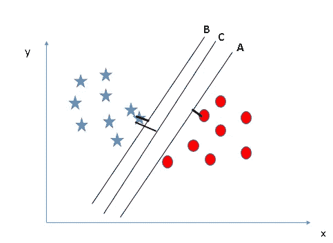
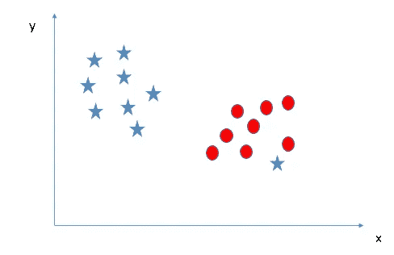
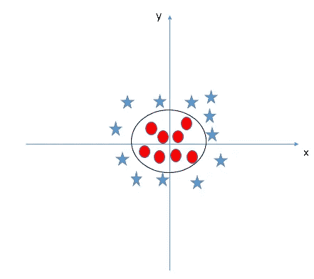

# 支持向量机算法的机器学习基础

> 原文：<https://medium.com/geekculture/machine-learning-basics-with-the-support-vector-machine-algorithm-caf296b38542?source=collection_archive---------14----------------------->


Image: [KDnuggets](https://www.google.com/url?sa=i&url=https%3A%2F%2Fwww.kdnuggets.com%2F2021%2F02%2Fmachine-learning-assumptions.html&psig=AOvVaw0BDc4o_zm_saxuIAGGiAt8&ust=1620485807151000&source=images&cd=vfe&ved=0CAMQjB1qFwoTCIil7_Xqt_ACFQAAAAAdAAAAABAD)

[机器学习](https://www.sas.com/en_us/insights/analytics/machine-learning.html#:~:text=Machine%20learning%20is%20a%20method,decisions%20with%20minimal%20human%20intervention.)是人工智能的一个分支，基于系统可以从数据中学习、识别模式并在最少人工干预的情况下做出决策的想法。

学习的过程始于观察或数据，如例子、直接经验或指导，以寻找数据中的模式，并根据我们提供的例子在未来做出更好的决策。主要目的是让计算机在没有人类干预或帮助的情况下自动学习，并相应地调整动作。

现在让我们把机器学习分成两个子类别；

**监督学习**是一种，你可以认为学习是由老师指导的。我们有一个充当教师的数据集，它的作用是训练计算机/机器。一旦机器得到训练，它就可以在获得全新数据时开始做出预测或决策。

例如，想象一台计算机是一名学生，我们是他/她的老师，我们希望学生(计算机)学习芒果的样子。我们将向学生展示一些不同水果的图片，包括一些芒果和其他水果的图片，如香蕉、苹果等。

当我们看到一个芒果，我们认为它是一个“芒果！”而当它不是芒果时，我们就认定它是“不，不是芒果！”在对学生做了几次之后，我们给学生看了一张图片，并问“这是芒果吗？”这个学生大部分时候会说“芒果！”或者“不，不是芒果！”取决于图片是什么。这种学习的艺术就是监督机器学习。

监督机器学习算法用于解决分类或回归问题。

一个**分类问题**有一个离散值作为它的输出。例如，上面教学生识别芒果的类比。它的产出要么是“芒果”，要么是“不是芒果”，没有中间地带。



Image showing randomly generated number

上图显示了分类数据的一个示例。我们有一个预测器(或一组预测器)和一个标签。在图像中，我们试图根据学生对水果的识别(预测器)来预测“芒果”(1)或“非芒果”(0)。

一个**回归问题**的输出是一个实数(带小数点的数)。例如，回归预测一个连续的目标变量 y。它允许您根据输入数据 x 估计一个值，如房价或体重。

给定房间数量，我们可以使用下表中的数据来估计房价。



Image showing randomly generated number

**无监督学习**只对输入数据进行操作，没有输出或任何标签。与监督学习不同，它没有老师来纠正机器。模型通过观察学习，并在数据中找到结构。一旦为模型提供了数据集，它就会通过在数据集中创建分类来自动查找数据集中的模式和关系。

假设我们向模型呈现苹果、香蕉和芒果的图像，那么它会根据一些模式和关系创建聚类，并将数据集划分到这些聚类中。现在，如果一个新数据被提供给模型，它会将它添加到一个已创建的分类中。

# **支持向量机**

支持向量机(SVM)是用于分类和回归问题的监督学习模型，如支持向量分类(SVC)和支持向量回归(SVR)。它用于较小的数据集，因为处理时间太长。他们可以解决线性和非线性问题，并使用边际的概念来分类数据点。

## **支持向量机是如何工作的？**

SVM 算法是基于寻找一个超平面的想法，该超平面清楚地将数据点分成不同的组。在 SVM，我们在 N 维空间(N-要素的数量)中绘制数据集中的每个数据点。为了将数据点分成两组，可以选择许多可能的超平面。我们的目标是找到一个具有最大余量的平面，即两组数据点之间的最大距离。最大化边缘距离提供了一些支持，以便可以更有把握地对未来的数据点进行分类。



Image: [Packt Subscription](https://www.google.com/url?sa=i&url=https%3A%2F%2Fsubscription.packtpub.com%2Fbook%2Fbig_data_and_business_intelligence%2F9781789345070%2F3%2Fch03lvl1sec30%2Fsvm-for-churn-prediction&psig=AOvVaw0KPciUO9qWLNIchHVHXphb&ust=1620469904861000&source=images&cd=vfe&ved=0CAMQjB1qFwoTCNDrj4qvt_ACFQAAAAAdAAAAABAs)

让我们探索一些 SVM 的术语

## **超平面**

超平面是帮助分类数据点的决策边界。落在超平面任一侧的数据点可以归属于不同的组。此外，超平面的维数取决于特征的数量。如果输入特征的数量是 2，那么超平面只是一条线。如果输入特征的数量是 3，则超平面变成二维平面。当特征的数量超过 3 时，就很难想象超平面了。见下图理解这个概念。



Image: [Towards Data Science](https://www.google.com/url?sa=i&url=https%3A%2F%2Ftowardsdatascience.com%2Fsupport-vector-machine-introduction-to-machine-learning-algorithms-934a444fca47&psig=AOvVaw0QOlIALHzR1L9XGiC8CSeI&ust=1620484579284000&source=images&cd=vfe&ved=0CAMQjB1qFwoTCKjBjNLlt_ACFQAAAAAdAAAAABAD)

**什么是支持向量？**

[支持向量](https://www.marktechpost.com/2021/03/25/introduction-to-support-vector-machines-svms/)是在超平面上或最接近超平面的数据点，并确定超平面的位置。使用这些支持向量，我们最大限度地提高利润率。删除支持向量将改变超平面的位置。支持向量与超平面等距，有助于构建 SVM。它们被称为支持向量，因为它们支持超平面，如果它们的位置移动，超平面也移动。

更进一步，让我们通过一个例子来理解 SVM 思想:

例如，你的老板在他的工作邮件中收到大量的信息，并要求你区分工作和非工作信息。现在，您希望设计一个函数(超平面)来区分这两种情况，这样，每当您收到一封非工作邮件时，它将被分类为垃圾邮件，而当收到一封工作邮件时，它将被分类为非垃圾邮件。

现在，我们将找到一些将数据分为垃圾邮件和非垃圾邮件的行。这将是一条线，使得两组中的每一组离最近点的距离最远。查看下面的图表，找出区分这两个类别的最佳线条(假设蓝色表示垃圾邮件，红色表示非垃圾邮件)。



Image: [AnalyticsVidhya.com](https://www.analyticsvidhya.com/blog/2017/09/understaing-support-vector-machine-example-code/)

如果你选择 C 线，你的直觉是正确的。从上面可以看出，与 A 和 b 相比，超平面 C 的边缘具有两个类的数据点之间的最大距离。因此，我们将右超平面命名为 C。

上图是一个**线性可分的例子**，在这个例子中，SVM 正试图寻找一个使裕度最大化的超平面，条件是两个类都被正确分类。但在现实中，数据集可能永远不会线性分离，所以超平面 100%正确分类的条件永远不会满足。

现在让我们考虑一下**在你老板的电子邮件中垃圾邮件和非垃圾邮件的非线性可分情况**。



Image: [AnalyticsVidhya.com](https://www.analyticsvidhya.com/blog/2017/09/understaing-support-vector-machine-example-code/)

在上面的图中，我无法使用直线将两个类别分为垃圾邮件和非垃圾邮件，因为其中一个蓝点(“垃圾邮件”)位于“非垃圾邮件”(红色)类别的范围内，属于异常值。SVM 算法具有忽略异常值并找到具有最大余量的超平面的特征。因此，我们可以说，SVM 分类对异常值是稳健的。

为了找到**的超平面，像上面的**、**这样的非线性可分情况**，SVM 算法有一种技术叫做[、**内核**、](https://en.wikipedia.org/wiki/Kernel_method)、**技巧**。SVM 核是采用低维输入空间并将其修改到高维空间的函数，即，它将不可分离问题转换为可分离问题。它主要用于非线性分离问题。很明显，它会进行一些复杂的数据修改，然后根据您设置的标签或输出找出区分数据的过程。

当我们在原始输入空间中观察超平面时，它看起来像一个圆:



Image: [AnalyticsVidhya.com](https://www.analyticsvidhya.com/blog/2017/09/understaing-support-vector-machine-example-code/)

## **使用 python 实现 SVM**

使用下面的[代码](https://github.com/Ifeoluwa96/SCA-MP-C4-Assessment/blob/main/Implementing%20SVM%20code.ipynb)使用[sci-kit learn](https://scikit-learn.org/stable/modules/svm.html) 库实现 SVM:

```
#importing sci-kit learn and other important librariesfrom sklearn.datasets import make_circlesfrom sklearn import svmimport matplotlib.pyplot as plt%matplotlib inlinefrom mpl_toolkits.mplot3d import Axes3Dimport numpy as np X,Y = make_circles(n_samples=500,noise=0.02)plt.scatter(X[:,0],X[:,1],c=Y)plt.show()def phi(X):""""Non Linear Transformation"""X1 = X[:,0]X2 = X[:,1]X3 = X1**2 + X2**2X_ = np.zeros((X.shape[0],3))print(X_.shape)X_[:,:-1] = XX_[:,-1] = X3return X_def plot3d(X,show=True):fig = plt.figure(figsize=(10,10))ax = fig.add_subplot(111,projection='3d')X1 = X[:,0]X2 = X[:,1]X3 = X[:,2]ax.scatter(X1,X2,X3,zdir='z',s=20,c=Y,depthshade=True)if(show==True):plt.show()return axax = plot3d(X_) # using the rbf kernel function to use the kernel tricksvc = svm.SVC(kernel="rbf")svc.fit(X,Y)svc.score(X,Y)
```

## SVM 的优势和劣势

## **优点:**

*   它工作得很好，有一个清晰的分离边界
*   在高维空间是有效的。
*   它在维数大于样本数的情况下是有效的。
*   它在决策函数中使用训练点的子集(称为支持向量)，因此它也是内存高效的。

## **缺点:**

*   当我们有大的数据集时，它表现不好，因为所需的训练时间更长
*   当数据集有更多噪声时，即目标类重叠时，它的性能也不是很好
*   SVM 没有直接提供概率估计，这些是通过昂贵的五重交叉验证计算出来的。它包含在 Python scikit-learn 库的相关 SVC 方法中。

在本文中，我们已经熟悉了机器学习和 SVM 算法的基础知识。我希望这能对你有所帮助。感谢阅读！！

请通过 [LinkedIn](http://linkedin.com/in/ifeoluwa-wuraola-72a750204) 和 [Twitter](https://twitter.com/Ifeooluwa) 与我联系。

## 资源

[https://www . analyticsvidhya . com/blog/2017/09/understanding-support-vector-machine-example-code/](https://www.analyticsvidhya.com/blog/2017/09/understaing-support-vector-machine-example-code/)

[https://www.edureka.co/blog/what-is-machine-learning/](https://www.edureka.co/blog/what-is-machine-learning/)

[https://www.expert.ai/blog/machine-learning-definition/](https://www.expert.ai/blog/machine-learning-definition/)