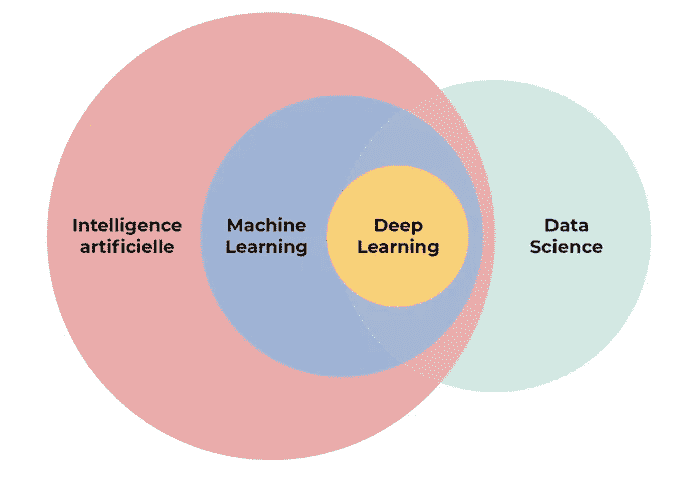
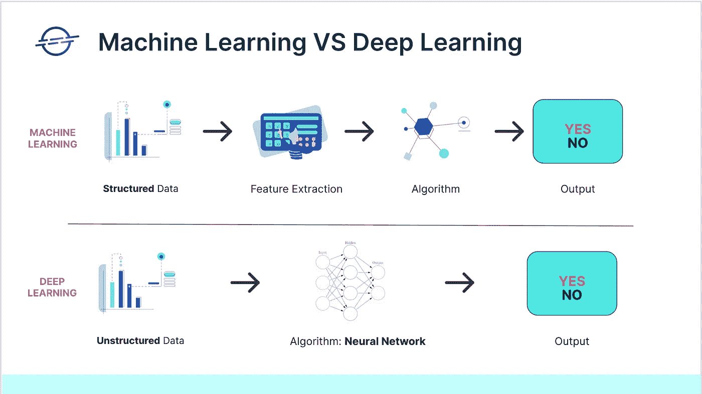
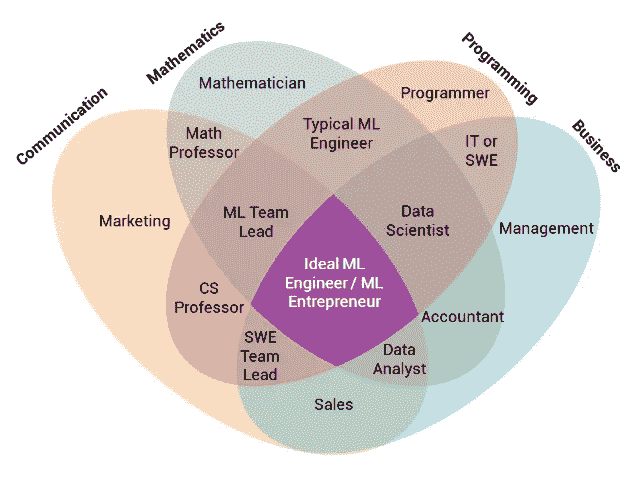
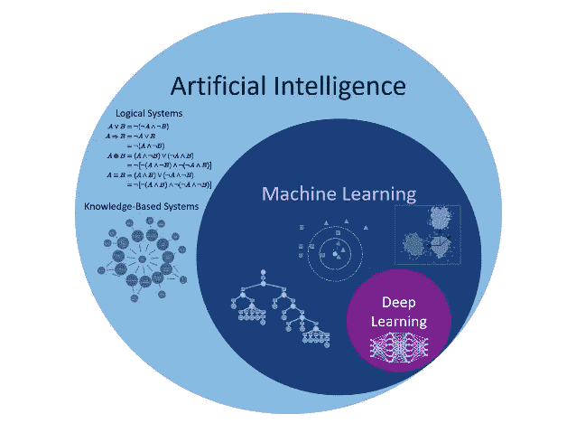

# 机器学习、数据科学和人工智能

> 原文：<https://medium.com/geekculture/machine-learning-data-science-and-artificial-intelligence-a45a2ffe9639?source=collection_archive---------5----------------------->

这篇文章的目的是强调这三大流行语的含义、区别、关系以及它们之间的联系。很多人混淆了这三个不同的领域。甚至一些 ML 工程师和一些数据科学家也很难在他们之间划清界限。我希望在读完这篇文章后，我们能搞清楚这一点。

2018 年，一份关于声称在产品和服务中使用人工智能的公司滥用的报告发布。据 the Verge 报道，40%声称使用 AI 的欧洲初创公司并不使用该技术。在 2017 年的 TechTalks 上，也偶然发现了一些公司的这种滥用，这些公司声称使用机器学习和先进的人工智能来收集和检查数以千计的用户数据，以增强用户对其产品和服务的体验。

我真的建议花时间检查他们在哪里相遇，在哪里不相遇。在这个阅读阶段，也花一些时间回答您关于数据科学家和 ML 工程师所做工作的问题，深度学习和数据分析都在其中，每项工作/技术需要什么工具和教育背景。

让我们从这句总结了三种技术之间关系的话开始

> “人工智能是一个更大的概念，用于创建可以模拟人类思维能力和行为的智能机器，而机器学习是人工智能的一个应用或子集，允许机器从数据中学习，而无需显式编程。数据科学处理大数据，包括数据清理、准备和分析。数据科学家从多个来源收集数据，并应用机器学习”。

很明显，这三个领域有所重叠，但是为了看出区别，让我们看一下它们各自的最终目标:

1.  **数据科学**是关于使用数据提供价值(金钱、增长、声誉等)。)到一个组织。
2.  **机器学习**是关于使用数据进行优化的推理和预测。
3.  **人工智能**是利用数据将类似人类的决策传递给机器。

## **人工智能**

英国数学家艾伦·图灵在 20 世纪 50 年代创造了“人工智能”一词。我们的目标是(现在也是)制造我们认为“智能”的机器(计算机)，能够执行各种任务。人工智能是一门科学，就像数学或生物学一样。它研究构建智能程序和机器的方法，这些程序和机器可以创造性地解决问题，这一直被认为是人类的特权。

人工智能不同于机器学习，因为它正在努力创造一个智能系统，可以执行各种复杂的任务*，而 ML 正在努力创造一种机器，只能执行那些经过训练的**特定任务**。*

*人工智能分为弱人工智能、一般人工智能和强人工智能。*

## *机器学习*

*机器学习是对计算机算法的研究，它允许计算机程序通过经验自动改进。机器学习是人工智能(AI)的一个子集，它为系统提供了自动学习和根据经验改进的能力，而无需显式编程。这里的基本前提是开发能够接收输入数据并利用统计模型预测输出的算法，同时随着新数据的出现更新输出。*

*ML 主要分为有监督学习、无监督学习、强化学习。*

*在**商业** ML ≈ AI 中，人工智能和机器学习在商业中通常指的是同一个东西。为什么？因为人工智能的大多数商业应用相当于监督学习，这是机器学习的一个子领域。*

> *“今天人工智能创造的 99%的经济价值都是通过一种人工智能来实现的，这种人工智能正在学习 A 到 B 或输入到输出的映射。”吴恩达。*

*不过，我给你举个例子，用 ML 和不用 ML 都可以解决的问题(因此 AI 不用 ML):物体检测。比如给定一个图像和一个物体，我想在图像上找到这个物体出现的地方，对于这个问题我们可以用 ML(物体检测，评分，概率方法)或者不用 ML(模板匹配，评分，OpenCV)。
机器学习对数据集起作用，AI 不一定。*

## *数据科学*

*数据科学是一个用于处理大数据的概念，包括数据清理、准备和分析。数据科学家从多个来源收集数据，并应用机器学习、预测分析和情感分析从收集的数据集中提取关键信息。*

*因为数据科学是多个学科的广义术语，所以机器学习适合数据科学。机器学习使用各种技术，如回归和监督聚类。另一方面，数据科学中的数据可能会也可能不会从机器或机械过程中演化而来。两者之间的主要区别在于，数据科学作为一个更广泛的术语，不仅关注算法和统计，还关注整个数据处理方法。*

## *数据科学家 vs 机器学习工程师*

*简而言之，数据科学是研究、构建和解释你已经建立的模型，而机器学习是该模型的产物。*

*总体而言，数据科学家可以从事多种工作，但主要职能是:*

1.  *与利益相关者会面以确定业务问题*
2.  *提取数据(SQL)*
3.  *EDA、特征工程、模型构建和预测(Python 和 Jupyter 笔记本)*
4.  *根据工作场所，将代码编译为。py 格式和/或酸洗模型*

*而机器学习工程师的工作可能是:*

1.  *数据科学模型的 pkl_file*
2.  *存储桶(GCP——谷歌云编辑器)*
3.  *DAG(用于安排模型的培训者和评估者)*
4.  *气流(可视化流程——ML 管道)*
5.  *Docker(容器和虚拟化)*

*数据科学:侧重于统计和算法，非监督和监督算法，回归和分类，解释结果，介绍和交流结果。*

*机器学习:专注于软件工程和编程、自动化、缩放、调度、将模型结果合并到表/仓库/UI 中。*

*因此，机器学习工程师部署由数据科学家构建的模型。*

## *深度学习*

*当我们谈论深度学习时，我们谈论的是由于神经网络而能够模仿人脑行为的算法，因此出现了人工智能这个术语。经常有人解释，机器学习和深度学习的区别在于，机器学习算法会处理定量的、结构化的数据(数值)，而深度学习算法会处理非结构化的数据，比如声音、文本、图像。所以区别在于特征提取。虽然，深度学习是机器学习的一个子集。*

**

*这是一个简短的概述，以表明这些经常被误用的术语并不是指同一个事物。正如我之前所说，一些 ML 工程师和数据科学家无法区分这两者之间的区别，或者他们对这两者之间的区别没有清晰的概念，可以用简单的语言来解释。所以在跳到机器学习、数据科学、AI、深度学习、数据分析……之前，花点时间，对你周围的世界有个清晰的看法。*

****