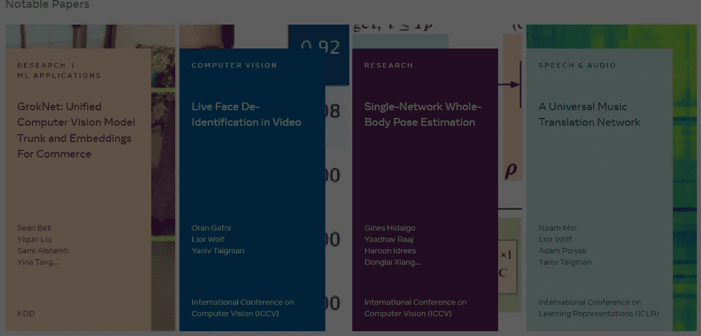
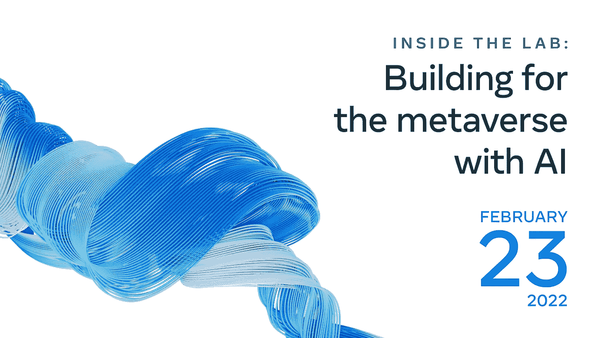
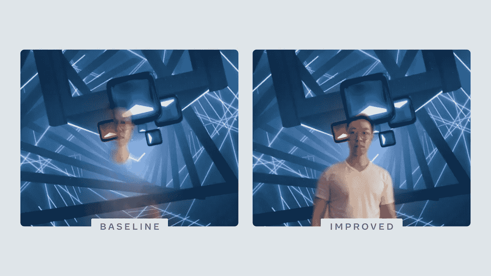
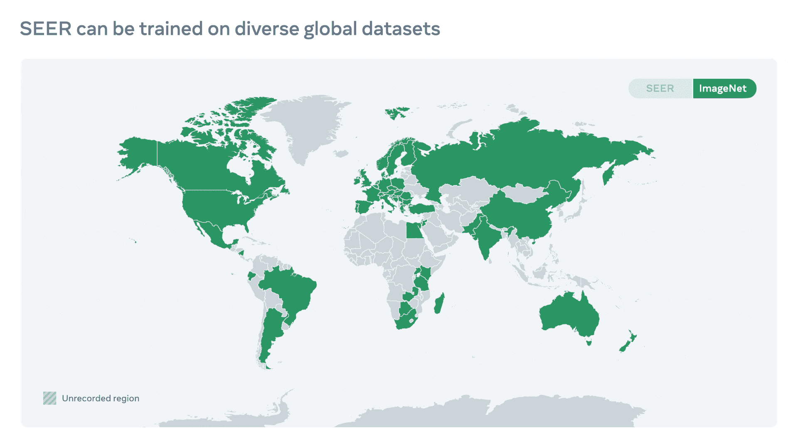
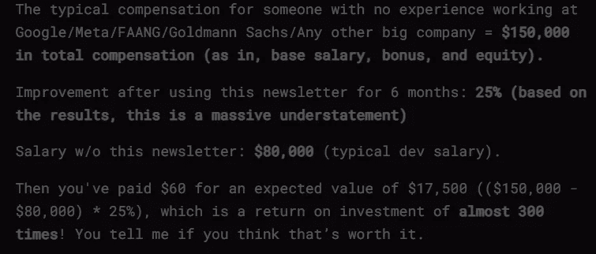

# 元宇宙的机器学习。Meta 的 AI 实验室为什么这么随机。

> 原文：<https://medium.com/geekculture/machine-learning-for-the-metaverse-why-metas-ai-lab-is-so-random-42975ab28a26?source=collection_archive---------3----------------------->

## 在查看了 Meta 脸书人工智能实验室的大量机器学习研究后，我注意到了一个模式

作为一个深度参与机器学习研究的人，我喜欢跟踪该领域的主要参与者。最大的玩家之一是 [Meta 的 AI 实验室](https://ai.facebook.com/)(有趣的是，链接仍然是【https://ai.facebook.com/】的)。利用他们可用的大量计算能力，团队能够从事对大多数组织来说不可能的项目。[虽然这对人工智能的开放性、可复制性和安全性来说是一个巨大的问题](https://medium.datadriveninvestor.com/the-machine-learning-research-crisis-you-should-know-about-c708b8b08ace)，但他们团队取得的巨大成果是不可否认的。

Some notable papers that Meta AI has published

当我浏览他们的论文时，我注意到一个非常有趣的趋势。在这篇文章中，我将涵盖这一趋势，以及它如何联系到 Meta 的元宇宙的愿望。随着虚拟现实成为如此新的技术(元宇宙的想法也是新的)，人们还没有真正弄清楚它如何在经济中发挥作用。看看 Meta 的战略就能很好地理解为什么马克·扎克伯格和 Meta 会向其投入数十亿美元。

# 一些背景

单独来看，Meta AI 研究团队发表的许多论文似乎非常随机。例如，2020 年，脸书人工智能推出了一种机器学习代理，可以将代码从一种编程语言翻译成另一种语言。代码没有使用规则，而是使用深度学习来实现前所未有的结果。在他们的帖子中分享，[深度学习在编程语言之间进行翻译](https://ai.facebook.com/blog/deep-learning-to-translate-between-programming-languages/)，人工智能代理使用自我监督学习，深度噪声和大量 Github 数据来工作。

The foresight of encoding languages into the same latent space is really good. Great for scalability

这项工作当然令人印象深刻，但它与 Meta 的儿童绘画动画师([使用 AI 制作儿童绘画动画](https://about.fb.com/news/2021/12/using-ai-to-animate-childrens-drawings/))或他们极其强大的少数镜头学习者([有害内容可以快速进化)关系不大。我们新的人工智能系统可以解决这个问题。](https://ai.facebook.com/blog/harmful-content-can-evolve-quickly-our-new-ai-system-adapts-to-tackle-it/))。[顺便提一下，所有这些以及更多的内容都在我的 YouTube 频道上有所报道。看看它，不要错过任何事情，并了解 ML。](https://www.youtube.com/channel/UC1JX4z0BxxNDzniJe1skzTQ)

Zuck has shown remarkable sense in finding ways to keep Facebook profitable

所有这些项目确实令人印象深刻，但它们背后似乎没有任何规律或理由。一个是自监督学习，另一个是自然语言处理的分类问题，第三个是计算机视觉和艺术中的类回归实现，那么为什么像 Meta 这样的营利性公司会把这么多资源投入到这么多的机器学习研究领域呢？为人类知识做贡献(他们大量开源)？研究人员很无聊？影响力？他们有太多的钱吗？

原来扎克的疯狂是有办法的。为了发现它，我们需要鸟瞰一下。

# 社交媒体领域的鸟瞰图

Twitter、脸书、YouTube、抖音、Reddit 和其他社交媒体平台(包括 Medium)通过人们的关注来赚钱。不同的平台侧重于不同的方面，并在该领域实现最大化。然而，在如此激烈的竞争下，事情肯定会变得非常糟糕，竞争对手会严重哄抬价格。这对底线来说太可怕了。

脸书的领导层认识到了这一点。这就是为什么他们决定发起一场新的战斗，而不是投入资源接管一个饱和的战场。因此，脸书成了 Meta。

在介绍 Meta 的演讲中，马克·扎克伯格谈到了技术是如何让人们“与任何人联系，传送到任何地方”。元宇宙应该是一系列的世界，人们可以根据自己的需求在办公室职员、游戏玩家和房地产大亨之间转换。元宇宙的大部分地区可能会像开放世界的 MMORPG 一样，允许人们相互交流。这与 Meta 的机器学习研究有什么联系？

# 将 Meta 的人工智能研究情境化

想想这个世界有多大，有多复杂。不同地区和群体之间的差异有多大。元宇宙要兑现承诺，就需要能够以可持续的方式处理这一问题(以及更多问题)。这听起来很难，但 Meta 的疯狂小伙子们正在尝试这样做。到目前为止，他们做得很好。

You can watch this event replay here: [https://fb.watch/bGRL4g0c6h/](https://fb.watch/bGRL4g0c6h/)

想想世界上所有的语言。想想那些你永远无法交流的人，因为你们不会说共同的语言。还记得用非母语表达自己的挣扎吗？为了让元宇宙发挥作用，语言障碍必须实时解决。回车，[教 AI 实时翻译 100 种口语和书面语](https://ai.facebook.com/blog/teaching-ai-to-translate-100s-of-spoken-and-written-languages-in-real-time/)。或者[伪标注:使用多语言未标注数据的语音识别](https://ai.facebook.com/blog/pseudo-labeling-speech-recognition-using-multilingual-unlabeled-data/)

> Meta AI 宣布了一项建立语言和机器翻译工具的长期努力，该工具将包括世界上大多数语言。这包括两个新项目。第一个是不让一种语言掉队，我们正在建立一个新的高级人工智能模型，它可以从具有更少训练样本的语言中学习，我们将使用它来实现数百种语言的专家质量翻译，从阿斯图里亚斯语到卢甘达语到乌尔都语。第二个是通用语音翻译器，我们正在设计一种新颖的方法，将一种语言的语音实时翻译成另一种语言，这样我们就可以支持没有标准书写系统的语言以及那些既有书面语又有口语的语言。

如果人们想利用元宇宙来休闲，表达自己的能力是至关重要的。进入前面提到的动画代理。想为变焦会议准备点什么吗？[为视频通话、远程呈现和 AR](https://ai.facebook.com/blog/creating-better-virtual-backdrops-for-video-calling-remote-presence-and-ar/) 创建更好的虚拟背景。

一旦元宇宙起飞，全世界将会上传数万亿未经剪辑的图片。这些图像将是杂乱的，在内容和质量上有大量的变化。人工智能需要浏览它们，并识别重要的方面。你知道什么， [SEER 10B:通过对不同数据集的自我监督学习实现更好、更公平的计算机视觉](https://ai.facebook.com/blog/seer-10b-better-fairer-computer-vision-through-self-supervised-learning-training-on-diverse-datasets/)是另一份脸书出版物。

SEER has been revolutionizing Computer Vision since its introduction.

这篇论文的作者是这样说的:

> 特别是，推进计算机视觉是建设元宇宙的重要组成部分。例如，要建造能够引导你找到放错地方的钥匙或向你展示如何制作最喜爱的食谱的 AR 眼镜，我们将需要像人一样理解视觉世界的机器。他们不仅需要在堪萨斯和京都的厨房里工作，还需要在吉隆坡、金沙萨和世界各地的其他地方工作。这意味着要认识到日常物品的所有不同变化，比如房门钥匙、炉子或香料。SEER 在实现这一强大性能方面开辟了新天地。

在元宇宙有一次积极的经历怎么样？无论元宇宙多么可行，如果有骚扰、欺凌或其他有害互动的可能性，人们都不会使用它。在那里，我们可以结合各种研究元素，从初学者到语言翻译和计算机视觉模型。加入他们在 Deepfake 检测方面的工作([创建数据集和对 deepfakes 的挑战](https://ai.facebook.com/blog/deepfake-detection-challenge?utm_source=hp))以及他们在推动新的学习范式方面的努力( [Yann LeCun 关于让人工智能系统像动物和人类一样学习和推理的愿景](https://ai.facebook.com/blog/yann-lecun-advances-in-ai-research/))，以帮助他们的人工智能代理捕捉任何恶意行为。

# 关闭

看起来元研究关注世界上所有事物的原因是他们确实必须这样做。马克·扎克伯格和梅塔试图将我们的生活拖入元宇宙。为了成功，他们必须复制许多我们认为理所当然的系统。

Why you should subscribe to my newsletter

元宇宙肯定要来了。公司已经开始想方设法从向元宇宙的转变中获利。重要的是我们也要学会这样做。随着世界变得虚拟化，学习如何编码对于一份高薪的好工作至关重要。我创造了[编码面试，使用通过指导多人进入顶级科技公司而发现的新技术，使面试变得简单](https://codinginterviewsmadesimple.substack.com/)。时事通讯旨在帮助你成功，避免你在 Leetcode 上浪费时间。

You can look at my articles and reviews by other successful students for more success stories and detailed tips for success

为了帮助我写更好的文章和了解你[填写这份调查(匿名)](https://forms.gle/7MfQmKhEhyBTMDUD7)。最多花 3 分钟，让我提高工作质量。

如果你也有任何有趣的工作/项目/想法给我，请随时联系我。总是很乐意听你说完。

以下是我的 Venmo 和 Paypal 对我工作的金钱支持。任何数额都值得赞赏，并有很大帮助。捐赠解锁独家内容，如论文分析、特殊代码、咨询和特定辅导:

https://account.venmo.com/u/FNU-Devansh

贝宝:【paypal.me/ISeeThings 

# 向我伸出手

使用下面的链接查看我的其他内容，了解更多关于辅导的信息，或者只是打个招呼。另外，查看免费的罗宾汉推荐链接。我们都得到一个免费的股票(你不用放任何钱)，对你没有任何风险。**所以不使用它只是失去免费的钱。**

查看我在 Medium 上的其他文章。:[https://rb.gy/zn1aiu](https://rb.gy/oaojch)

我的 YouTube:[https://rb.gy/88iwdd](https://rb.gy/88iwdd)

在 LinkedIn 上联系我。我们来连线:[https://rb.gy/m5ok2y](https://rb.gy/f7ltuj)

我的 insta gram:[https://rb.gy/gmvuy9](https://rb.gy/gmvuy9)

我的推特:[https://twitter.com/Machine01776819](https://twitter.com/Machine01776819)

如果你正在准备编码/技术面试:[https://codinginterviewsmadesimple.substack.com/](https://codinginterviewsmadesimple.substack.com/)

获得罗宾汉的免费股票:[https://join.robinhood.com/fnud75](https://www.youtube.com/redirect?redir_token=QUFFLUhqa0xDdC1jTW9nSU91WXlCSFhEVkJ0emJvN1FaUXxBQ3Jtc0ttWkRObUdfem1DZzIyZElfcXVZNGlVNE1xSUc4aVhSVkxBVGtHMWpmei1lWWVKNzlDUXVJR24ydHBtWG1PSXNaMlBMWDQycnlIVXNMYjJZWjdXcHNZQWNnaFBnQUhCV2dNVERQajFLTTVNMV9NVnA3UQ%3D%3D&q=https%3A%2F%2Fjoin.robinhood.com%2Ffnud75&v=WAYRtSj0ces&event=video_description)