# 机器学习基础:成本函数和梯度下降

> 原文：<https://medium.com/geekculture/machine-learning-fundamentals-cost-function-and-gradient-descent-904234019ef9?source=collection_archive---------6----------------------->

## 每个数据科学家或 ML 工程师都应该知道的 ML 概念

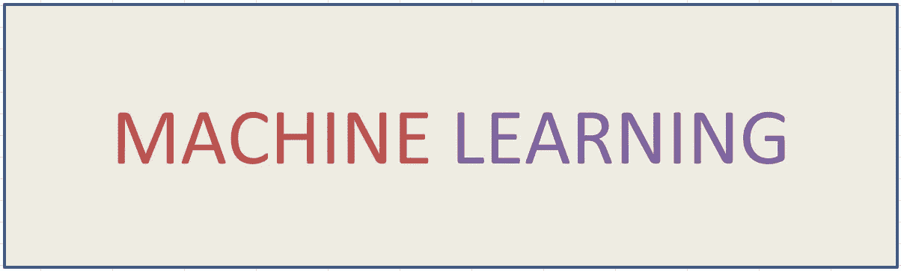

Machine Learning Fundamentals (Pic by Author)

## **简介**

成本函数和梯度下降是学习机器学习算法如何工作时你应该了解的最重要的概念之一。在这篇博客中，我们将看看这些概念背后的直觉。

我们将选择最简单的机器学习算法，即线性回归算法来理解这些概念。

我们将依次讨论以下主题:

1.  *了解线性回归模型，*
2.  *成本函数，和*
3.  *梯度下降。*

## 线性回归

机器学习模型试图捕捉输入特征和输出特征之间的关系。想象一下，我们有数千人的身高和体重数据。我们想利用这些数据创建一个机器学习模型，以一个人的身高作为输入，预测这个人的体重。

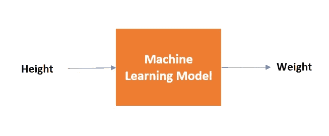

如果我们观察人的体重(磅)和身高(英寸)之间的关系，我们可以看到这种关系看起来是线性的，即随着身高的增加，体重也增加。

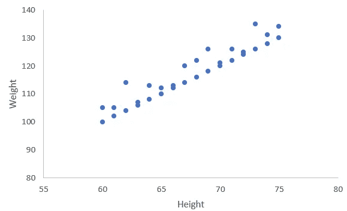

输入要素(身高)和输出要素(体重)之间的这种关系可以通过线性回归模型来捕捉，该模型会尝试对此数据拟合直线。

下面是一个简单线性回归模型的直线方程:

> Y = mx + c

y 是输出要素(权重)，m 是线的斜率，x 是输入要素(高度)，c 是截距(如下图所示，高度为 0 时权重等于 c)。

> Y = m(0) + c = c

对于斜率“m”和常数“c”的不同值，我们将得到不同的线，如下图所示。

# 线性回归如何找到最佳拟合线？

现在，问题是线性回归模型如何找到最适合我们数据的直线？

答案是代价函数和梯度下降！

首先，我们来看看成本函数。

## 价值函数

成本函数是一个数学函数，它被最小化以获得斜率“m”和常数“c”的最佳值。与线性回归相关的成本函数称为均方误差，可表示如下:

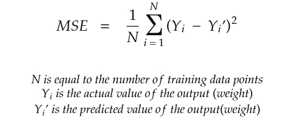

Mean square error (Image by Author)

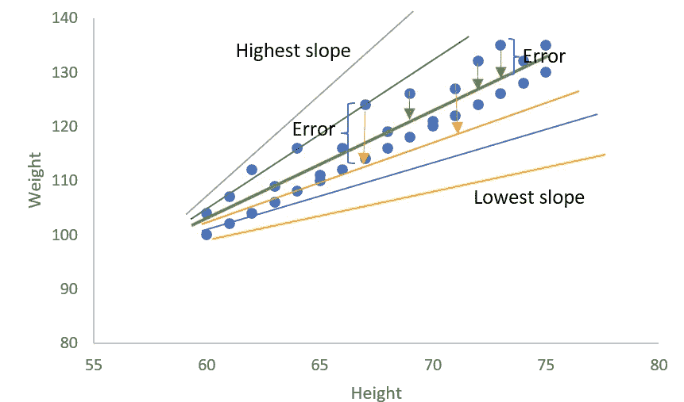

Error: Difference between actual and predicted. (Image by Author)

假设实际重量和预测重量如下:

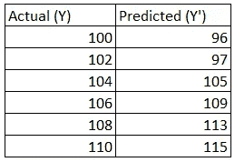

Actual vs Predicted Weights

我们可以计算 MSE 如下:

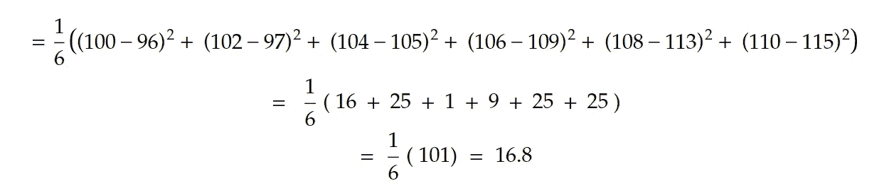

我们可以稍微调整一下等式，使计算变得更加简单。

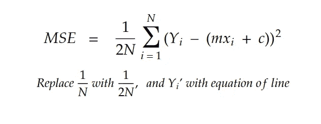

The updated sum of square error

现在，MSE 的值将基于斜率‘m’和常数‘c’的值的变化而变化。

**现在，我们需要获得‘m’和‘c’的最佳值，以使 MSE 最小**。直觉上，我们希望预测的重量尽可能接近实际重量。

但是我们怎么做呢？“m”和“c”的组合可能有很多种，我们无法一一测试。

梯度下降就是解决方案！

## 梯度下降

梯度下降是一种最小化函数结果的技术，在线性回归的情况下，函数结果是均方误差。

让我们了解一下梯度下降在线性回归的情况下是如何工作的。

线性回归(MSE)的成本函数是一个凸函数，即在斜率“m”和常数“c”的值范围内只有一个最小值，如下图所示(成本函数由 J(m，c)表示)。

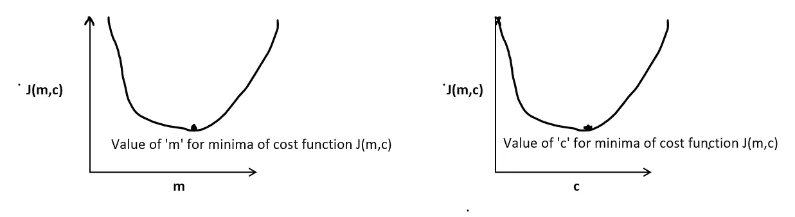

数学上，梯度下降通过计算对应于‘m’和‘c’当前值的**偏导数或斜率**来工作，如下所示。在每一步，“m”和“c”的值同时更新。这些值将持续更新，直到我们达到成本函数达到最小值的‘m’和‘c’的值。

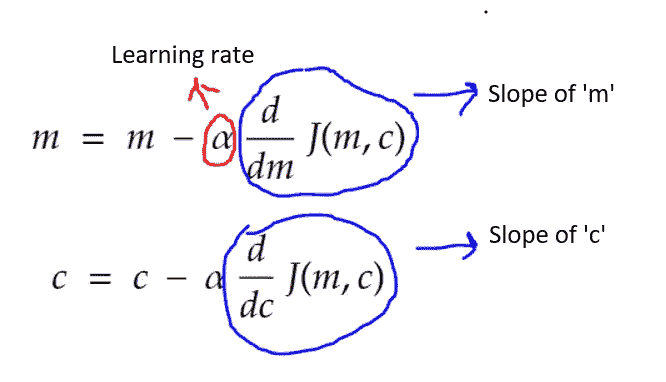

> *学习率(或 alpha)是‘m’或‘c’的值更新的速率。α的值越大，对‘m’或‘c’的值的更新就越大。*

如果斜率为负，则‘m’的值增加—学习率*‘m’的斜率，如果斜率为正，则‘m’的值减少—学习率*‘m’的斜率。c 的值也是如此。

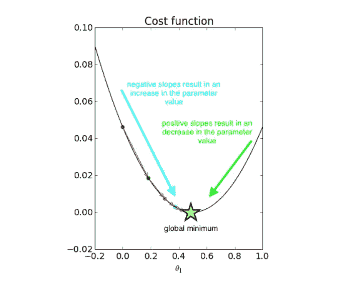

Pic Credits: [jeremyjordan](https://www.jeremyjordan.me/)

现在，回到我们的偏导数项，这是偏导数如何应用于成本函数(如果你觉得这太数学化，你可以跳过)。

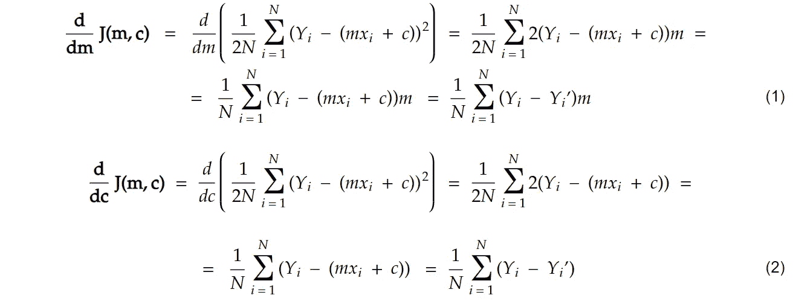

## 摘要

每个机器学习模型都有一个成本函数，在线性回归的情况下是均方误差，基于这个函数，模型评估预测值与实际值的接近程度。

梯度下降用于达到成本函数的最小值。直观地，梯度下降在每一步找到成本函数的斜率，并沿着山谷向下行进到达最低点(成本函数的最小值)。

## **谢谢你！**

首先，你应该在收件箱里收到我的帖子。 [***在这里做*** *！*](https://anmol3015.medium.com/subscribe) *其次，如果你喜欢体验媒介的自己，可以考虑通过* [***报名成为会员***](https://anmol3015.medium.com/membership) *来支持我和其他几千名作家。它每个月只需要 5 美元，它极大地支持了我们，作家，而且你也有机会通过你的写作赚钱。*