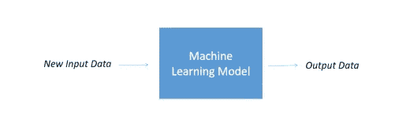
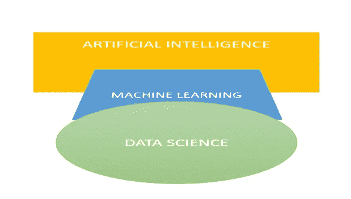
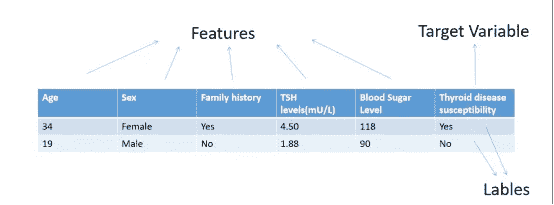

# 生物信息学中的机器学习——生物学、计算机科学和统计学的交叉:简单解释

> 原文：<https://medium.com/geekculture/machine-learning-in-bioinformatics-an-intersection-of-biology-computer-science-and-statistics-88f354dce905?source=collection_archive---------14----------------------->

## AI/ML 与数据科学的概念构建和比较，重点是其在生物信息学研究中的应用。

进入大数据、人工智能、数据科学和信息时代，除了服务器和人类之外，各个领域都在产生大量数据，如传感器、手机、IT 行业、卫生部门、医疗和生物技术设备，如 MRI 扫描仪、生物传感器、微阵列检测、高性能技术、科学研究等。

此外，数字化是一种称为物联网(IoT)的新趋势，旨在将所有人造物品(如家用电器、汽车、武器、交通灯等)联网，这些物品相互通信，共享通过众多传感器捕获的数据，以预测和做出智能运营决策，这种趋势已经出现，并正在快速增长，从而创建机器对机器的连接和大量数据。

考虑到生成数据的年增量，到 2020 年底可能达到 440 亿字节(44 万亿千兆字节)(来源:国际数据公司，INDC_1672)。

Photo by [Kevin Ku](https://unsplash.com/@ikukevk?utm_source=medium&utm_medium=referral) on [Unsplash](https://unsplash.com?utm_source=medium&utm_medium=referral)

然而，并不是所有生成的数据都可以用预测分析的实用观点来看，只有一小部分是有用的，称为“元数据或富目标数据”

生物信息学研究中生物数据集的明显增长对复杂和可优化的数据分析工具、标准化的大数据架构以及应对两个主要挫折的方法提出了更高的要求，这两个主要挫折包括有效的数据存储和从这些猖獗且不断增长的数据集中提取有价值的医学相关信息，这不仅包括注释，还包括以可测试模型的形式提供相关信息，以获得预测和预测信息，使用计算机科学和统计学(如人工智能(AI)或机器学习(ML))的交叉进行决策和智能控制。

人工智能、数据科学、机器学习、深度学习已经成为当今时代的流行语，并且经常被错误地和互换地使用。

*非计算机专业毕业生想到的问题是:这些单词都一样吗？他们有相同的目标吗？有什么区别？*

让我们全部回答，

人工智能包括一组庞大的工具，这些工具结合了计算机科学和强大的数据集，用于使计算机理性和智能地解决各种复杂的组合问题，模仿人类思维的问题解决和决策技能。

它包括各种子集，如机器学习、深度学习、机器人、神经网络等。，由人工智能算法组成，并与人工智能一起提及。在所有子集中，机器学习是人工智能中最受欢迎的子集之一，并且有许多与其他几个领域重叠的应用。

机器学习被定义为现实世界过程的统计表示，基于每天生成的大量数据集，采用一套使用人工智能算法的计算工具，通过使用示例数据或过去的经验来优化模型或性能标准。ML 的两个主要目标是预测未来事件，如天气预报、游戏中的下一步棋、机器人决定其路径等。，并推断事件的原因、各种发生模式及其行为。它是统计学和计算机科学的交叉学科，不需要显式编程。ML 模型从现有数据中学习模式，并将其应用于新数据，为了做出准确的预测，它需要高质量的数据。

Existing data is loaded inside a ML model to generate predicted and descriptive data (Source: Image by Author)

人工智能和数据科学有着不同的目标，人工智能指的是计算机的智能，而数据科学是关于使用数据来发现和交流数据的洞察力。ML 是一个重要的工具，它使用 AI 算法来执行数据科学相关的工作，以迭代和交互的方式将数据转换为相关的知识。因此，明确区分这三个术语。

Source: Image by Author

***机器学习模型有 3 种:***

1.  **强化学习** : ML 模型用于决定潜在复杂环境中的顺序动作，这需要复杂的数学计算、强大的计算机基础设施，以及根据要执行的任务准备模拟环境。计算机使用试错法来解决如此复杂的问题，让机器从错误中学习。人工智能算法根据它执行的动作获得奖励或惩罚。例如类似游戏的情况，自动驾驶汽车，决定国际象棋移动，等等。

在讨论其他两种类型之前，让我们首先了解数据在数据集中的特征:

在数据集中，数据分为目标变量、目标变量的标注和要素。目标变量是我们想要预测的变量，标签可以是数字或类别形式的值，例如真/假或是/否等。特征是记录为观察值的不同信息，用于预测目标变量。机器学习模型一次分析许多特征，以找到不同特征之间的关系。我们输入标签和特征作为数据来训练模型。

An example of Thyroid disease dataset comprising categorization of the datasets into Features, Target Variable and Labels(Source: Image by Author)

2.**监督学习**:在监督机器学习模型中，训练数据是有标签的。我们输入标签和特征，如年龄、家族史、共病情况，以训练模型并进行预测研究。

3.**无监督学习**:在无监督机器学习模型中，训练数据是没有标签的，它只有特征。参考包含甲状腺疾病患者信息的数据集的常见示例。我们知道每个病人对不同的治疗有不同的反应。因此，我们可以使用无监督的 ML 模型来理解患者的不同“类型/类别”,绕过对聚类模型的特征观察，以基于特征相似性来获得患者的类别。因此，对患者进行分组，并针对每一类研究更好的治疗方法。

现在，如果一个新病人来了，那么我们可以将特征输入到无监督的 ML 模型中，并获得他们适合的病人“类型”,并相应地开出治疗处方，而不会有太多延迟。在现实世界中，数据并不总是带有标签，标签需要大量的手工劳动。因此，无监督学习模型是常见的和更可取的，因为没有标签&模型找到它的模式。

无监督学习主要用于异常检测和聚类，即基于相似性将数据分成组。

***AL/ML 在生物学中的应用***

人工智能/人工智能技术应用于生物研究和开发的各个领域，用于提取相关知识、预测和描述性分析，如基因组学、蛋白质组学、文本挖掘、系统和结构生物学、微阵列等。

来到**基因组学**，它是计算生物学中最受欢迎和最重要的领域之一，鉴于基因组序列的数量不断增加，需要大量的生物信息学工具来处理数据，以生成有用的信息，如位置和基因结构，非编码 RNA 基因和基因调控元件的识别。计算 AI/ML 模型被用来预测新发现的基因和 RNA 二级结构的基因功能。

**蛋白质组学**涉及对蛋白质的大规模研究，蛋白质是活生物体的重要组成部分，具有将基因中包含的信息转化为生命的各种功能，并需要计算&统计应用，如隐马尔可夫模型、ML/AI、神经网络，以解决非常复杂和组合的蛋白质 3D 结构预测，该预测进一步用于深入了解蛋白质的功能和预测。

它还应用于**系统生物学**中，其中生物学和机器学习相结合，AI/ML 模型用于模拟细胞、生物、遗传和代谢网络以及信号转导途径内部发生的生命过程。

各种**进化研究**利用机器学习和统计方法来构建进化树。系统进化树是生物进化关系的示意图，反映了不同物种是如何从一系列基于不同特征(如形态学、新陈代谢等)的共同祖先进化而来的。

计算模型还用于管理和分析来自**微阵列分析**的复杂和大型实验数据集，这需要对形成训练数据(要学习的现有数据)进行预处理，以训练和构建 ML 模型，然后进行分析。微阵列数据在表达模式识别、遗传和代谢网络诱导和分类中有应用。

**文本数据挖掘**涉及将非结构化文本转换为标准化和结构化的数据格式，这种格式更容易存储和处理，以便分析和机器学习算法使用复杂和高级的分析技术(如深度学习算法、支持向量机(SVM)、朴素贝叶斯等)来探索非结构化数据中的隐藏关系，从而获得洞察力和有意义的模式。

***结束语***

像我们这样的生物信息学家使用当今的大数据分析工具所面临的挑战之一是，它们以批处理模式操作，非常慢，几乎没有针对迭代处理的优化，并且在操作之间具有高度的数据依赖性。

但是，多视图机器学习算法的出现无可挑剔地降低了限制、I/O 成本和增加的迭代处理。ML 工具是生物信息学数据分析中最常用和最有前途的工具之一，用于使用各种技术(如采样、分布式计算和特征选择)来分析小规模和大规模的数据。人们正在做出大量努力，使用增量、并行和多视图聚类机器学习模型来扩展生物学中的大数据，以处理复杂的生物信息学问题，并使研究变得高效和经济。

我个人认为，我们生物学研究人员需要学习人工智能/人工智能模型工作背后的主要概念，并涉足计算机科学和统计，以便获得有价值的见解，并用跨学科的方法解决当前的问题。总的来说，我在网上看到了很多关于 AI/ML 的文章，但是大多数都充斥着技术词汇和复杂的定义。经过大量的时间，搜索和 YouTube 视频，我终于理解了基本概念，并希望用简单的语言来分享它。这篇文章是为了向大家介绍 AI/ML 的基础知识以及它们之间的区别。

在下面附上我最喜欢的文章和 YouTube 视频的链接:

1.  机器学习基础|什么是机器学习| Simplilearn 机器学习简介:[https://youtu.be/ukzFI9rgwfU](https://youtu.be/ukzFI9rgwfU)
2.  人工智能 VS ML VS DL VS 数据科学作者:https://youtu.be/k2P_pHQDlp0
3.  Larranaga P 等人，(2006)，生物信息学中的机器学习，《生物信息学简报》第 7 卷，第 1 期:【https://doi.org/10.1093/bib/bbk007 
4.  Naresh E 等人，(2020)，机器学习在生物信息学研究中的影响，电子章节:[https://link . springer . com/Chapter/10.1007/978-981-15-2445-5 _ 4](https://link.springer.com/chapter/10.1007/978-981-15-2445-5_4)