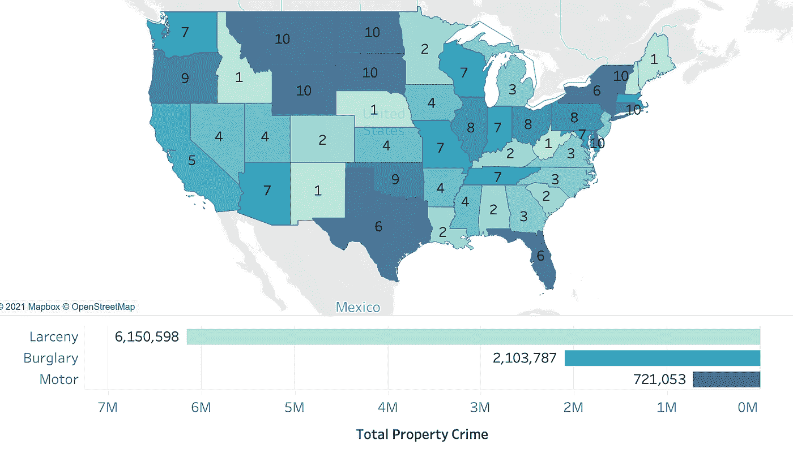
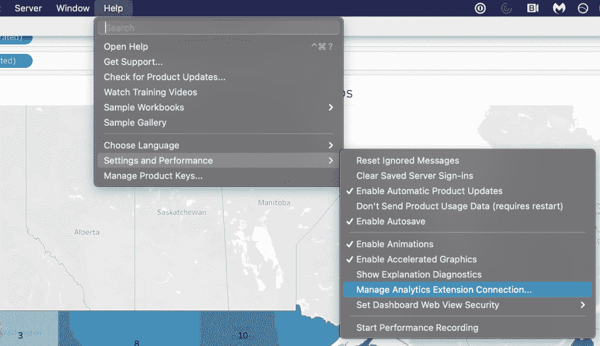
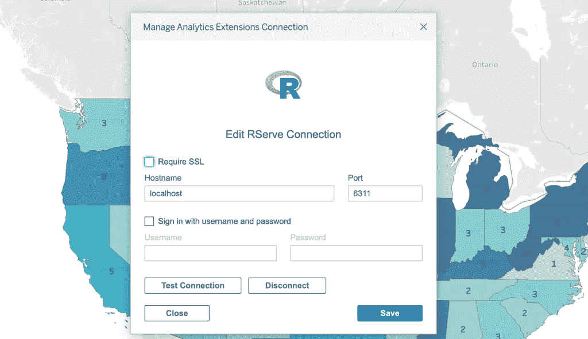
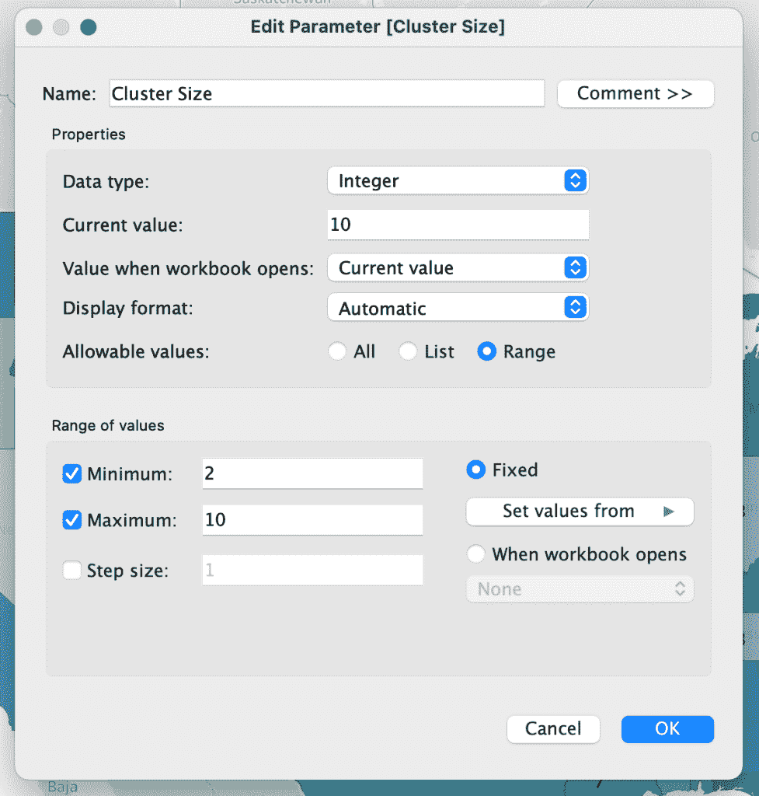
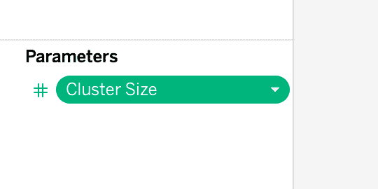
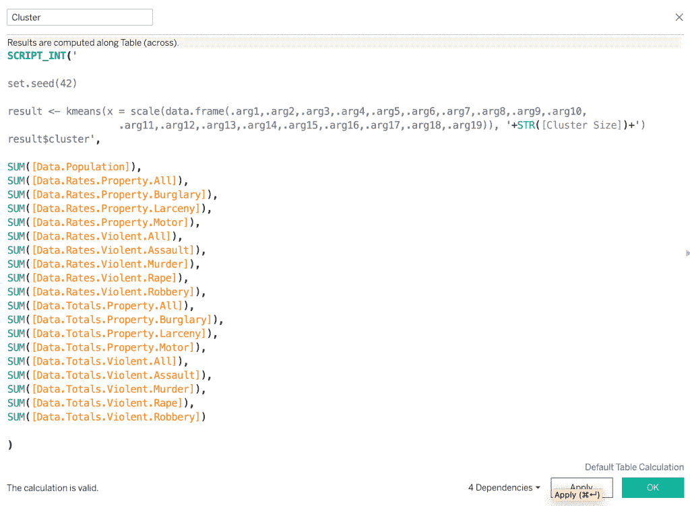
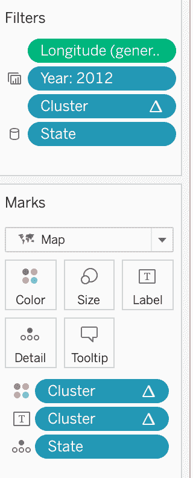
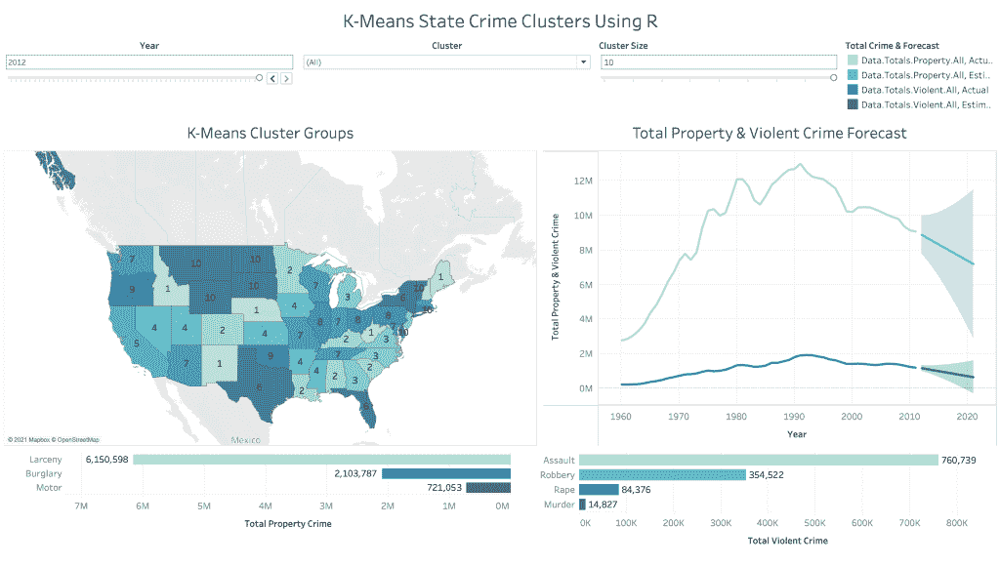
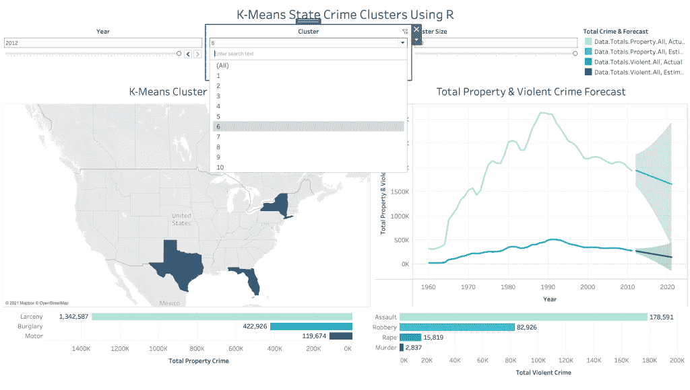
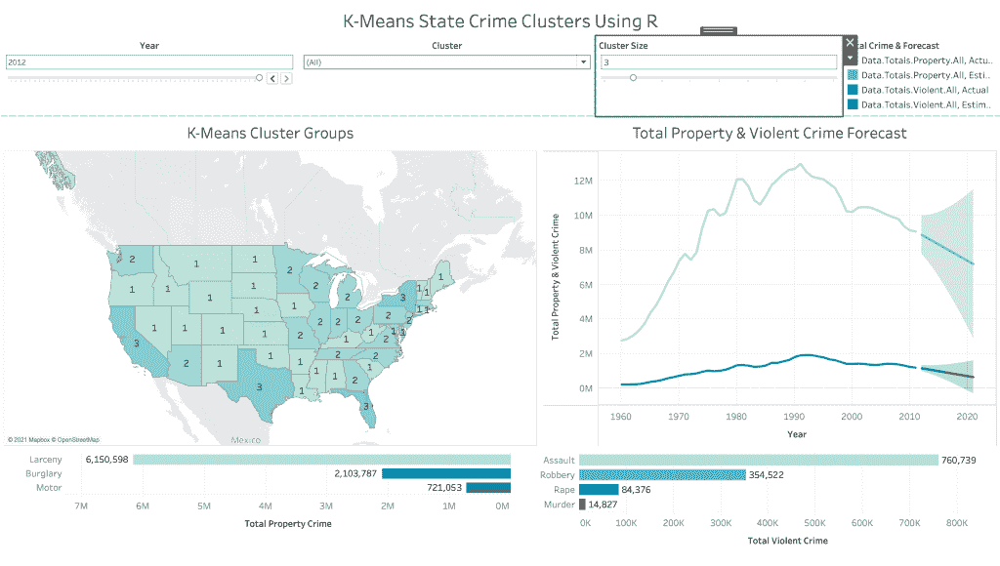

# 基于 R 和动态 K 均值聚类的 Tableau 机器学习

> 原文：<https://medium.com/geekculture/machine-learning-in-tableau-using-r-dynamic-k-means-clustering-78593e08c36?source=collection_archive---------30----------------------->



下面是一个简单的教程，介绍如何在 Tableau 中使用 R 统计语言来实现更高级的 ML 特性，包括聚类。

虽然 Tableau 最近引入了一些[集群](https://help.tableau.com/current/pro/desktop/en-us/clustering.htm)功能，但是我想探索将我的 Tableau 工作簿与 R 统计语言连接起来，以获得一种更加细致和可调的方法。使用 R，我现在可以做一些事情，例如设置可再现性的种子，缩放我的因子，调整超级参数，例如开始聚类中心的数量，调整最大迭代次数，甚至从 R 中的 [kmeans()](https://www.rdocumentation.org/packages/stats/versions/3.6.2/topics/kmeans) 函数中选择聚类算法。这里要注意的另一点是，这非常简单，尤其是如果您习惯使用 R。您还可以轻松地以交互方式更改聚类的数量，并能够实时直观地看到变化，这是您在 Tableau 中无法做到的。以下是可供选择的算法:

```
algorithm = C("Hartigan-Wong", "Lloyd", "Forgy", "MacQueen")
```

这些可能对有特别微妙的情况要建模的分析师非常有益。我认为在 Tableau 中使用 R 的唯一真正的缺点是，你不能再轻松地*共享仪表板，甚至对 Tableau 公开。这是因为 Tableau 在幕后建立了与本地计算机上的 RStudio 的连接。*

***数据***

*我使用的数据集来自统一犯罪报告统计。犯罪统计数据可通过美国司法部和联邦调查局公开查阅。该数据集包含美国各州多年来的犯罪率和总犯罪率信息。犯罪报告分为两大类:财产和暴力犯罪。财产犯罪指的是入室盗窃、盗窃和与汽车有关的犯罪，而暴力犯罪指的是袭击、谋杀、强奸和抢劫。这些报告从 1960 年到 2012 年。[可以在这里找到链接](https://corgis-edu.github.io/corgis/csv/state_crime/)！*

***在 RStudio 中安装 RServe***

*第一步是打开 RStudio 并安装[r server](https://www.rforge.net/Rserve/doc.html)。获得最新版本很重要，并确保它与您的 r 版本相匹配。*

```
*install.packages("Rserve", "Rserve_1.8-6.tgz", "http://www.rforge.net/")library(Rserve)Rserve(args = "--no-save")*
```

***在 Tableau 中设置连接***

*下一步是打开 Tableau Desktop 并建立分析扩展连接。下面是 Tableau 的一个教程，可以帮助你完成这个过程( [Tableau Rserve 教程](https://help.tableau.com/current/prep/en-us/prep_scripts._R.htm))。*

****

***为集群大小创建参数***

*将数据加载到 Tableau 后，您需要做的第一件事是创建一个参数，该参数将控制 R 函数中生成的聚类数。最终结果将是一个滑块或下拉菜单，允许动态控制函数和图表中生成的聚类数。我将它设置为从 2 到 10 的整数，这是我感兴趣的集群的最小和最大数量。*

****

***为聚类创建计算字段***

*下一步是创建一个计算字段来存放 R 代码。我使用了 **SCRIPT_INT()** 函数，因为我想以整数形式输出集群编号。其他输出还有其他选项。这可能看起来很奇怪，但每个因素都被替换为**。argX** 在 R 代码中，然后接下来将是对应于每个. argX 的所有因子参数的列表。它们也需要以聚合形式， **SUM([Factor])** ，但是这不会影响计算，所以不要担心。之前创建的参数用于计算，并作为函数末尾的 **STR()** 变量输入，这将是动态的，并基于参数控制。这是我的计算字段，注意使用了 **scale()** 函数和 **set.seed()** 。*

**

***拖动集群到**过滤器**和**标记卡*

*现在，就像 Tableau 中的任何计算字段一样，您可以将字段拖到过滤器和标记卡中。我还必须拖动状态变量，然后确保使用状态变量计算过滤器。*

****

***仪表盘中的动态集群***

*在构建了仪表板并添加了过滤器之后，您现在可以通过下拉菜单或滑块动态地更改集群的数量。这是对 Tableau 使用 R 所特有的，并且是分析集群数量如何影响集群的一个很好的工具。*

******

*请点击这里查看我的其他项目:*

*[](https://samsdataprojects.wordpress.com) [## 最近的项目

### 这里有一个项目使用统计计算机模拟来回答有多少超额预订座位会导致…

samsdataprojects.wordpress.com](https://samsdataprojects.wordpress.com) 

或者我在这里公开的场景:

 [## Tableau 公共

### 编辑描述

public.tableau.com](https://public.tableau.com/profile/sam.brady#!/) 

请点击这里联系 LinkedIn:

[](https://www.linkedin.com/in/sam-brady-15b726191/) [## 萨姆·布雷迪-佐治亚理工学院-美国加利福尼亚州圣地亚哥县|…

### 富有创造力的数学家，从教育领域深入到数据科学和机器学习领域。目前…

www.linkedin.com](https://www.linkedin.com/in/sam-brady-15b726191/) 

感谢阅读！*