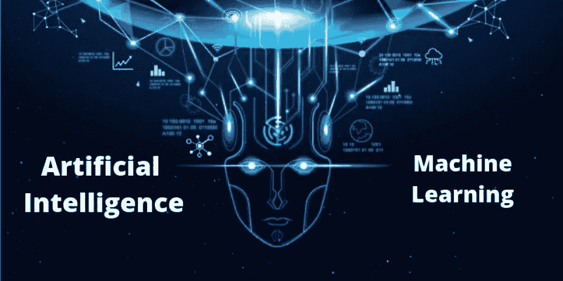
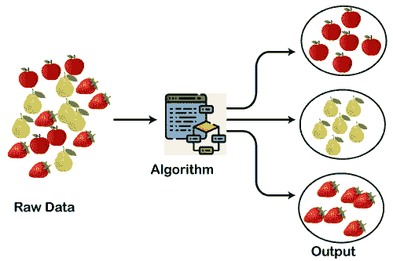

# 机器学习简介

> 原文：<https://medium.com/geekculture/machine-learning-introduction-c7c0b40ad6d1?source=collection_archive---------25----------------------->

Taken from Hackr.io

**人工智能(AI)** ，**机器学习(ML)** 是你现在经常听到的词。是吗？

如果是，并且您想了解这些主题，那么您来对地方了。

今天，我们将发现这些话题，并对它们进行简要介绍。

# 1.什么是人工智能？

人工智能是机器执行某些任务的能力，这些任务需要人类和动物展示的智能。这个定义经常被认为是来自 20 世纪 50 年代的马文·明斯基和约翰·麦卡锡，他们也被称为该领域的父亲。

这是一个广泛的主题，包含机器学习作为一个子类。

# 2.什么是机器学习？

机器学习的理念是，有一些通用算法可以告诉你关于一组数据的一些有趣的事情，而你不必针对该问题编写任何自定义代码。您不必编写代码，只需向通用算法提供数据，它就会根据数据构建逻辑。

# 2.1.这一切是何时以及如何开始的？

第一个人工操作的计算机系统 ENIAC 是在 20 世纪 40 年代发明的。在那个时候,“计算机”这个词被用来称呼具有密集的数值计算能力的人，所以，ENIAC 被称为数值计算机器！嗯，你可能会说跟学习无关？！错了，从一开始这个想法就是建造一台能够模仿人类思维和学习的机器。

在 20 世纪 50 年代，我们看到第一个计算机游戏程序声称能够击败国际跳棋的世界冠军。这创造了历史。

多亏了统计学，机器学习在 20 世纪 90 年代变得非常有名。计算机科学和统计学的交叉催生了人工智能中的概率方法。这使得该领域进一步转向数据驱动的方法。作为一个亮点，IBM 的深蓝系统击败了国际象棋世界冠军，特级大师加里·卡斯帕罗夫。

我们可以认为 90 年代是机器学习的黄金时代之一。在这十年中，对这一领域作出了重大贡献。

# **2.2。机器学习算法**

你可以认为机器学习算法属于两个主要类别之一——**监督学习**和**非监督学习**。区别很简单，但很关键。

# **2.2.1。监督学习**

监督学习是一种创造人工智能(AI)的方法，在这种方法中，计算机算法在已经为特定输出标记的输入数据上进行训练。对模型进行训练，直到它能够检测到输入数据和输出标注之间的潜在模式和关系，使其能够在呈现前所未见的数据时产生准确的标注结果。

Taken from javatpoint

**迷茫？？**

让我们用一个例子来简化它。

假设你是一名房地产经纪人。你的业务在增长，所以你雇佣了一群新的见习特工来帮助你。但有一个问题——你可以看一眼房子，对房子的价值有一个相当好的想法，但你的学员没有你的经验，所以他们不知道如何给房子定价。

为了帮助你的受训者(也许还能让你腾出时间去度假)，你决定写一个小应用程序，它可以根据房子的大小、邻居等来估计你所在地区的房子的价值。，以及类似的房子卖了多少钱。

所以，你写下你所在城市每 3 个月有人卖一套房子。对于每栋房子，你都要写下一堆细节——卧室数量、平方英尺大小、邻居等等。但最重要的是，你写下最终售价。利用这些书面数据，我们想创建一个程序来估算你所在地区的其他房子的价值。这叫做**监督学习**。

**听起来很棒？？**

# 2.2.2.无监督学习

**无监督学习**是一种机器学习技术，其中用户不需要监督模型。相反，它允许模型自己发现以前未被发现的模式和信息。它主要处理未标记的数据。

Taken from javatpoint

**这么多技术？？**

这里有一个例子。

让我们回到我们最初的房地产经纪人的例子。如果你不知道每栋房子的销售价格会怎样？即使你只知道大小，位置等等。事实证明，你仍然可以做一些很酷的事情。

这有点像有人给你一张纸上的一系列数字，并说“我真的不知道这些数字是什么意思，但也许你可以找出是否有一种模式或分组或什么的——祝你好运！”

那么，如何利用这些数据呢？首先，你可以有一个算法来自动识别数据中不同的细分市场。也许你会发现当地大学附近的购房者确实喜欢有很多卧室的小房子，但郊区的购房者更喜欢有很多平方英尺的 3 卧室房子。了解这些不同类型的客户有助于指导你的营销工作。从数据中获得这些见解很简单**无监督学习。**

我们的互动到此结束，这是对**人工智能和机器学习**的简单介绍。

> "没有应用的教育只是娱乐。"
> —蒂姆·桑德斯