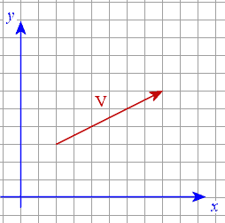
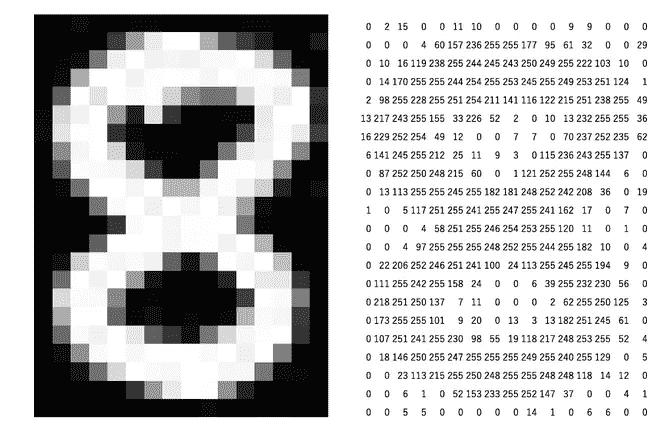
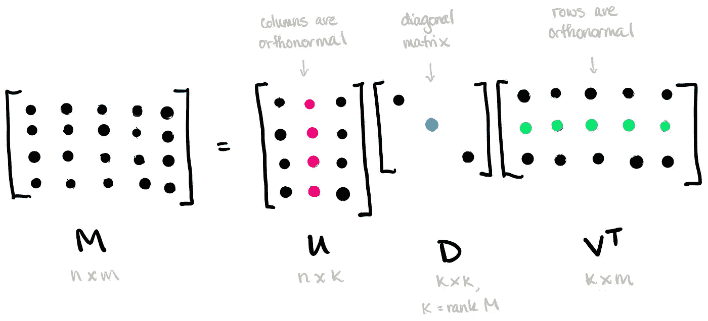

# 机器学习是关于向量和矩阵计算的

> 原文：<https://medium.com/geekculture/machine-learning-is-all-about-vector-and-matrix-computations-8292c0176393?source=collection_archive---------13----------------------->

## 向量矩阵

## 在实现机器学习算法之前你需要知道的所有事情


Photo by [Antoine Dautry](https://unsplash.com/@antoine1003?utm_source=medium&utm_medium=referral) on [Unsplash](https://unsplash.com?utm_source=medium&utm_medium=referral)

机器学习是过去几年被很多人谈论的新炒作。从物流、保险、汽车，甚至医药的各个行业都在尝试实现机器学习，以根据自己的问题做出预测。在保险业，机器学习可以预测可能会产生保单的潜在客户，保险公司可以根据创建的保单改善其财务预测。汽车行业可以生产能够检测周围环境的自动驾驶汽车。在医学领域，机器学习可以根据肺炎、肺癌等的检测进行预测。这些是机器学习在解决现实世界问题方面有多么强大的几个例子，几年前还只是一个原型。在深入研究这些复杂的问题之前，我们必须先了解一些基本的东西，例如在深入研究机器学习之前掌握向量和矩阵计算。向量和矩阵是两个基本的东西，它们是机器学习在解决上述简单到复杂问题中的能力的基础。

**数据表示**

数据可以用任何格式表示，如文本、图像、音频等。我们将运行机器学习算法的计算机无法理解这种类型的数据。因此，这些类型的数据被转换成矢量表示，以使计算机能够运行最大似然算法。所以，我们想到了一个问题

> 什么是向量，为什么向量在机器学习中很重要？

用一种可以理解的方式来说，**向量**是一个一维数组，其中有方向和长度。所有 n 个元素的向量的总和称为 **n 维向量空间**。如果向量中有 3 个条目，则称为**三维向量空间**。如果向量中有 5 个条目，则称为 5**-维向量空间，**以此类推**。**那么，这个术语与机器学习有什么关系呢？特征向量是其条目代表对象特征的向量。例如，我们有一个向量，由房子(对象)的价格(y 轴)和大小(x 轴)条目组成(二维向量空间)。红色向量表示有大小和价格实体的房子。



2-dimensional vector space

包含这些实体的向量空间称为特征空间。我们可以看到的另一个例子是通过图像。图像由 0–255 的像素值组成。值越低，颜色越深。正如你在下图中看到的，8 号灰度图像由许多像素组成。您可以通过从 0–0，0–29，0–0，0–1 直到 0–0 展平每一行来将此图像表示为矢量表示。

```
 [0 
                                  2
                                  15
                                  0
                                  .
                                  .
                                  6
                                  0
                                  0 ]
```



Image in Pixels

您可能会发现的另一种数据类型是一些文档中的文本。你的任务是将这种类型的文档转换成矢量。你可以通过一种叫做“一个热编码”的标准方法来做到这一点，在这种方法中，给每个单词分配 1 或 0。例如，我们有 4 个不同的单词，它们用一键编码表示，如下所示

```
**[0 0 0 1] as apple
[0 0 1 0] as mango
[0 1 0 0] as cat
[1 0 0 0] as tiger**
```

你也可以使用尽可能多的单词，你可以把它们转换成一个向量。然而，大量具有这种表示的单词可以创建一个稀疏向量，其中会有许多零。这种表示的另一个警告是，通过在向量之间进行点积，单词之间缺乏相似性上下文。如果你记得点积将产生一个标量值(除了这个公式之外，如果你想要更广泛的上下文，你可以检查你的线性代数教科书)。你可以看到向量苹果和芒果的乘积为 0，这意味着没有相似性。其实这两个词有一些相似之处(水果)。另一个警告是这种表示会消耗大量的计算资源。当您实现需要矩阵计算来解决特定问题的机器学习算法时，您会知道这一点。

```
**apple vector x mango vector equal to 0 which means there is no similarity**
```

我们可以用来解决使用一种热编码方法的问题的另一种向量表示是向量嵌入。向量嵌入是将向量表示从高维空间降低到低维空间的过程。通过执行**矩阵分解可以找到矢量嵌入。**是寻找一个向量作为替换向量在更小的维空间中表示的变换。矩阵因式分解背后的简单思想就像是，如果我们将三个数字(6，2，5)相乘可以得到 60。你可以把这 3 个数字想象成 3 个矩阵，产生下图所示的 M(60)矩阵。我们通过使用**奇异值分解**来实现矩阵分解。

```
60 = 6*2*5
```



Matrix Factorization in the context of vector embedding/ SVD

SVD 超出了本文的范围。如果你有兴趣，可以去[SVD 入门教程和讲解，了解一下 SVD 的概念。](https://web.mit.edu/be.400/www/SVD/Singular_Value_Decomposition.htm)

# 感谢您的阅读！

我真的很感激！🤗*如果你喜欢这个帖子并想看更多，可以考虑* [***关注我***](https://naiborhujosua.medium.com/) *。我发布与机器学习和深度学习相关的主题。我尽量让我的帖子简单而精确，总是提供可视化和模拟。*


**Josua Naiborhu** 是一名业务发展分析师，后来变成了一名自学成才的机器学习工程师。他的兴趣包括**统计学习、预测建模和可解释机器学习**。他喜欢跑步，这教会他不要放弃做任何事情，即使是在实施**机器学习生命周期(MLOps)** 的时候。除了追求他对机器学习的热情，他还热衷于投资印度尼西亚证券交易所和加密货币。他一直在跑 2015 年**雅加达马拉松和 2019 年**大阪马拉松的全程马拉松。他的下一个梦想是参加波士顿马拉松赛、TCS 纽约市马拉松赛和伦敦维珍马拉松赛(T21)。

> 你可以在 [**LinkedIn**](https://www.linkedin.com/in/josuanaiborhu/) ， [**Twitter**](https://twitter.com/naiborhu_josua) ， [G **ithub**](https://github.com/naiborhujosua) ，[***ka ggle***](https://www.kaggle.com/naiborhujosua)上与他联系或者直接在他的[**个人网站**](https://naiborhujosua.github.io/mlnotes_josua/) **上与他联系。**