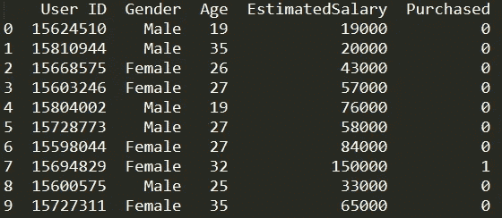
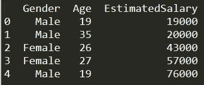
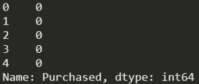
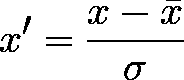
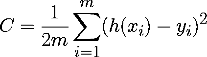
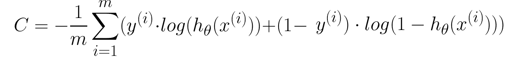
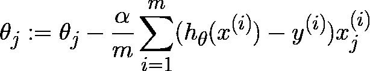
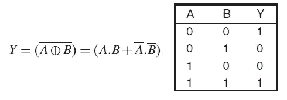

# Python 中的机器学习逻辑回归从零开始

> 原文：<https://medium.com/geekculture/machine-learning-logistic-regression-in-python-from-scratch-3d9e2875f27a?source=collection_archive---------3----------------------->


分类是监督学习的两个分支之一。顾名思义，它根据对象的特性将对象分成组或类。

逻辑回归是最常用的分类算法之一。在本文中，我将展示该算法的 Python 实现。它将一步一步地继续，我们将从头开始构建算法。

## 现在让我们深入研究代码！

# 1.加载和数据准备。

最初，将导入 pandas 模块，使用“read_csv”读取包含数据集的 csv 文件，并使用“head”函数打印出前 10 行:

```
import pandas as pddf = pd.read_csv('Social_Network_Ads.csv')
print(df.head(10))
```



查看数据集，算法的目标是*消费者是否已经购买了产品*。这就是为什么它会是 **y 值。**

在给定的特性中，“用户 ID”不会有任何影响，因为它对消费者购买产品没有任何影响。在这种情况下，我们只剩下 3 个特征:性别、年龄和估计工资。这三个特征将成为**的 X 值。**

```
X = df[['Gender', 'Age', 'EstimatedSalary']]
y = df['Purchased']
```

现在，X 和 y 数据集将如下所示:



与线性回归一样，逻辑回归中也有偏差项。以这种方式，**一列 1**将被添加到 x .的开头，因为它在矩阵乘法中非常方便。

这里，“m”是数据集中的行数。

```
import numpy as npm = X.shape[0]
a = np.ones((m, 1))
X.insert(loc = 0, column = 'Ones', value = a)
```

由于我们在连续特征中有一个分类数据(性别)，我们需要用**虚拟变量来处理它。**在使用虚拟变量时，如果有(n)个类别，则(n-1)个变量就足以将其转换为连续数据。在我们的例子中，将生成“性别 _ 男性”列，如果值为“1”，则表示男性，反之亦然，如果值为“0”，则表示女性。

```
X.loc[X['Gender'] == 'Male', 'Gender_Male'] = 1         #1 if male
X.loc[X['Gender'] == 'Female', 'Gender_Male'] = 0       #0 if femaledel X['Gender']               #delete intial gender column
```

此外，工资和年龄列的比例并不接近，这将对模型的准确性造成严重问题。我们将使用一种称为标准化的**特征缩放**技术:



这里，

*   x̅是中庸之道；
*   σ是标准差。

```
age_std = X['Age'].std()
age_ave = X['Age'].mean()sala_std = X['EstimatedSalary'].std()
sala_ave = X['EstimatedSalary'].mean()X['Age'] = (X['Age'].subtract(age_ave)).divide(age_std)
X['EstimatedSalary'] =(X['EstimatedSalary'].subtract(sala_ave)).divide(sala_std)
```

像往常一样，我们将数据集分为测试集和训练集:

```
from sklearn.model_selection import train_test_split
X_train, X_test, y_train, y_test = train_test_split(X, y, random_state=42)
```

到目前为止，这项工作是在熊猫数据帧上完成的，因为我们只需要修改数据集。但是现在，当我们开始对数据集进行**数学运算**时，我们将熊猫数据帧转换成 **numpy 数组**。由于这个原因，numpy 阵列在计算上有更好的速度，并且它们提供了矩阵运算的很大可变性。

```
X_train, X_test, y_train, y_test = X_train.to_numpy(), X_test.to_numpy(), y_train.to_numpy(), y_test.to_numpy()
```

# 2.功能

**Sigmoid 函数**接受一个输入，仅返回 0 和 1 之间的输出*。在逻辑回归中，你计算样本在一个类别中的概率，概率用 0 到 1 之间的数字*表示。因此，Sigmoid 函数是逻辑回归中的关键函数之一。**

****

```
**def sigmoid(z):
 return (1/(1+np.exp(-z)))**
```

****逻辑回归中的假设**与线性回归相同，但有一点不同。在逻辑回归中，假设的输出只需要在 0 和 1 之间。因为它显示了一个物体在某一类中的*概率*，概率不能小于 0 也不能大于 1。为此，使用 Sigmoid 函数，这是与线性回归中假设的区别。**

**“matmul”是 numpy 模块的一个功能，用于矩阵乘法。**

```
**def h(theta, X):
 return sigmoid(np.matmul(X, theta))**
```

****成本函数**决定了模型与数据集的拟合程度。如果它的量级很高，则意味着模型不适合数据集，如果它的量级很低，则意味着模型可以使用。因此，优化算法试图最小化成本函数值，换句话说，试图使模型更好地适应数据集。**

**如果我们回到线性回归，它的成本函数是:**

****

**如果在逻辑回归中使用相同的成本函数，我们将有一个非凸函数，梯度下降将无法优化它，因为将有多个最小值。非凸性的原因是，用于计算假设的 sigmoid 函数是非线性函数。因此，我们将使用**一个不同的成本函数:****

****

```
**def cost_function(X, y, theta, m): y = y.reshape(y.shape[0], 1)
 H = h(theta, X)return (sum((y)*np.log(H) + (1-y)*np.log(1-H))) / (-m)**
```

****梯度下降**的作用是优化θ参数。它的方程是由成本函数的求导得到的。它类似于线性回归中的梯度下降函数，但由于假设函数不同，这些梯度下降函数也不相同。**

**为了简单起见，代码是用分离的操作一步一步编写的。你可以很容易地遵循这个等式:**

****

```
**def gradient_descent(theta, X, y, alfa, m): H = h(theta, X)
 H = H.reshape((H.shape[0],)) diff = np.subtract(H, y)
 a = np.matmul(np.transpose(X), diff).reshape((theta.shape[0],1))

 theta = theta - (alfa/m) * a return theta**
```

**在算法期间，梯度下降运行多次，准确地说，是在迭代次数上。在一些迭代之后，成本函数的值降低，并且看到成本函数的值是好的实践。因为在某一点之后，成本函数值不变或变化极小。在这种情况下，在该点之后反复运行梯度下降是没有用的，并且在下一次尝试中减少迭代次数。**

**因此，我们将所有这些操作组合在一起——定义迭代次数，选择在多少次迭代后您希望看到成本函数的返回，称为梯度下降函数，成为一个函数，这个函数称为**训练函数。****

```
**def train(X, y, theta, alfa, m, num_iter): for i in range(num_iter):
    theta = gradient_descent(theta, X, y, alfa, m) if i % 200== 0:
      print("Cost: ", cost_function(X, y, theta, m))return theta**
```

****预测函数**以θ和 X 为输入，通过比较假设(h)的答案和阈值，返回“0”或“1”。通常，阈值选择为 0.5，但可以在函数中设置为任何所需的值:**

```
**def predict(X, theta, threshold = 0.5):

 a = h(theta, X)
 a [a >= threshold] = 1
 a [a < threshold]  = 0return a**
```

****评分函数**用于计算模型的准确度。“y1”是数据集中给定的答案，“y2”是模型计算的答案。分数函数比较它们，并找出正确预测的答案的百分比。**

**我使用了 xnor 门，如果值相同，它返回 1，如果值不相等，它返回 0:**

****

```
**def score(y1, y2): #y1 is the correct answers
 #y2 is calculated by the model y1 = y1.reshape(y1.shape[0], 1)
 y2 = y2.reshape(y2.shape[0], 1) y1_not = (1 - y1).reshape(y1.shape[0], 1)
 y2_not = (1 - y2).reshape(y1.shape[0], 1) a = np.multiply(y1_not, y2_not) + np.multiply(y1, y2)   
 #1 means  correct prediction, 0 means wrong prediction

 ones_ = np.count_nonzero(a == 1)  #count ones to get the percentage return (ones_ / y1.shape[0]) * 100**
```

# **3.参数和调用函数的初始化**

**为了初始化 theta，我们需要知道与数据集中的列数相同的特征数。另一方面，在梯度下降中需要样本数。所以我们用 shape 函数找到这两个值，它返回 numpy 数组中的行数和列数:**

```
**m = X_train.shape[0]  #number of rows
n = X_train.shape[1]  #number of columns**
```

**θ向量包含将被算法优化的参数。元素的数量应该与特征的数量相同，这就是为什么我们用“n”行零来初始化它。**

**迭代次数最初定义为 3000 左右的值，通过查看成本函数的值，您可以在以后减少或增加它:如果成本函数不再减少，就没有必要一遍又一遍地运行算法，因此我们设置较少的迭代次数。另一方面，如果成本函数仍然变小，您可以增加迭代次数，并观察它是否提高了模型性能。**

**α是算法的学习速率。其值在 0.001 和 10 之间变化。同样，没有一个确切的数字对每个模型都是最佳的。您需要观察哪个值适合您的模型。**

```
**theta = np.zeros((n, 1))
num_iter = 2000
alfa = 0.3**
```

**现在所有需要的值都设置好了，我们终于可以**运行这个节目了**！**

**这里，训练函数使用**训练集**返回优化的 theta 向量，theta 向量用于预测**测试集**中的答案。之后，我们返回 score 来查看我们的模型表现如何。**

```
**opt_theta = train(X_train, y_train, theta, alfa, m, num_iter)
y_ = predict(X_test, opt_theta)
print("Accuracy: ", score(y_test, y_))**
```

**数据集及全部代码:[https://github . com/anarabiyev/Logistic-Regression-Python-implementation-from scratch](https://github.com/anarabiyev/Logistic-Regression-Python-implementation-from-scratch)**

# **参考**

**[特征缩放标准化](https://en.wikipedia.org/wiki/Feature_scaling#Standardization_(Z-score_Normalization))**

**理论背景:[https://www.coursera.org/learn/machine-learning](https://www.coursera.org/learn/machine-learning)**