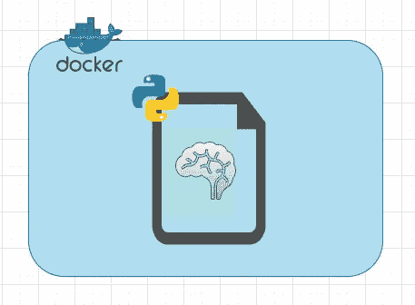
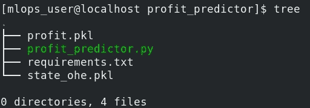
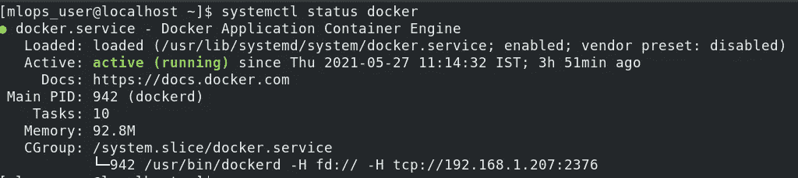
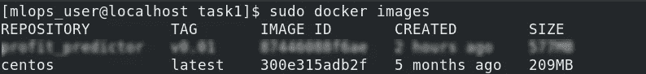
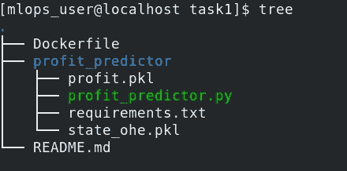
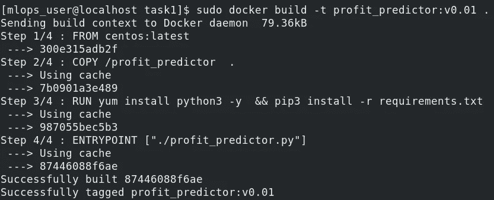
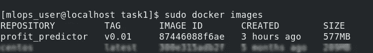
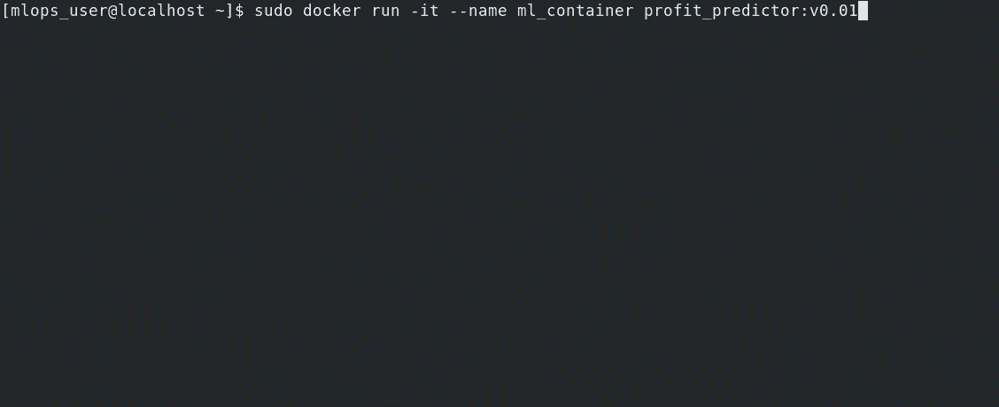

# Docker 容器中的机器学习模型

> 原文：<https://medium.com/geekculture/machine-learning-model-inside-a-docker-container-1bf7c7076a0c?source=collection_archive---------30----------------------->

自过去十年以来，人们比以往任何时候都更需要整合不同领域的技术。这些集成了来自多个领域的技术的领域需求很大，因为它们为公司的软件/服务生产流水线提供了灵活性。这种杂交域的例子有 DevOps、MLOps 等。



本文将讨论一个 MLOps 域的最基本功能的例子。我们将在 Docker 容器中部署我们的机器学习模型。我们将使用 Red Hat Linux 8 作为 docker 主机，使用 Centos 的映像作为 Docker 映像。

Docker 使开发人员能够将应用程序(在我们的例子中，是一个机器学习预测器脚本)打包到容器中——标准化的可执行组件，这些组件将源代码与在任何环境中运行代码所需的所有操作系统(OS)库和依赖项相结合。简而言之，我们将能够在一个单独的操作系统中运行一个机器学习代码，只需要满足我们的脚本执行所需的要求。

# 让我们开始这个项目吧

## 创建项目目录

```
$ mkdir profit_predict/
```

## 获取 python 脚本和所需的文件

我准备了一个 python 脚本，将用于预测。该模型预测了创业公司的利润，考虑了“R&D 支出”、“管理支出”、“营销支出”、“国家支出”等因素。这是一个回归任务。

```
$ cat profit_predict/profit_predict.py#!/usr/bin/python3import joblib
import pandas as pdmodel = joblib.load('profit.pkl')
ohe = joblib.load('state_ohe.pkl')class Profit:

    def __init__(self,data):
        self.data = data

    def predict(self):
        d_data = ohe.transform(data)
        predict = model.predict(d_data)[0]
        print(f"This approximate profit made by the startup is: ${predict}\n")

if __name__ == "__main__":
    print("************************")
    print("Statup Profit Calculator")
    print("************************\n\n")
    rnd = float(input('Enter Rnd Cost: '))
    admin = float(input('Enter Administation Cost: '))
    market = float(input('Enter Marketing Spend: '))
    city = input('Enter State [New York,California,Florida]: ')
    data = pd.DataFrame([rnd,admin,market,city],index=['R&D Spend', 'Administration', 'Marketing Spend', 'State']).T
    obj = Profit(data)
    obj.predict()
```

我已经复制了 python 脚本所需的 pickle 文件目录。此外，我们需要一个 requirements.txt 文件来在容器上安装模块和依赖项。

requirements.txt 文件可以由

```
$ pip3 freeze > profit_predict/requirements.txt
```

最后，我们的目录看起来像这样:



确保您的 Docker 守护程序已启动并正在运行:



## 从 DockerHub 中提取 Docker 图像

```
$ sudo docker pull centos:latest
```



## **创建 Dockerfile**

让我们创建一个 Dockerfile 来执行容器内部的各种操作。

*注:创建 Dockerfile* ***外*** *项目目录【profit _ predictor】*

```
$ cat DockerfileFROM centos:latestCOPY /profit_predictor  .RUN yum install python3 -y  && pip3 install -r requirements.txtENTRYPOINT ["./profit_predictor.py"]
```

这个 docker 文件将使用 centos 映像将 profit_predictor 目录的内容复制到容器的 root 用户的主目录中。然后我们将安装 python3，后面是 requirements.txt 文件。最后，我们将提供可执行脚本的位置作为容器的入口点。

整个树应该看起来像这样:



## 构建 DockerFile 文件

一旦我们的项目空间准备就绪，让我们使用 docker 文件构建图像。

```
$ sudo docker build -t profit_predictor:v0.01
```



映像已成功创建…



## 运行容器

```
$ sudo docker run -it --name ml_container profit_predictor:v0.01
```



我们已经在 docker 容器中成功运行了机器学习模型！

您可以在下面的资源库中找到代码:

[](https://github.com/gitwit-mistry/Profit_Predictor_Docker) [## git wit-Mistry/Profit _ Predictor _ Docker

### 通过在 GitHub 上创建一个帐户，为 git wit-Mistry/Profit _ Predictor _ Docker 开发做出贡献。

github.com](https://github.com/gitwit-mistry/Profit_Predictor_Docker) 

您可以通过以下方式与我联系:

 [## Prathamesh Mistry - MLOPS 暑期实习生-Linux world Informatics Pvt Ltd | LinkedIn

### 查看 Prathamesh Mistry 在世界上最大的职业社区 LinkedIn 上的个人资料。Prathamesh 列出了 4 项工作…

www.linkedin.com](https://www.linkedin.com/in/prathamesh-mistry/)