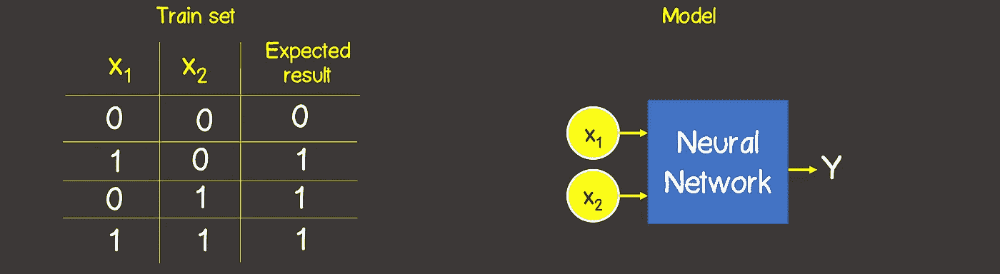
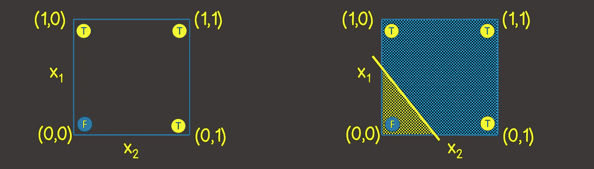
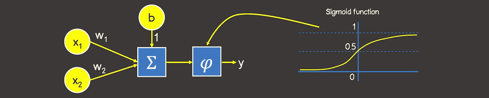
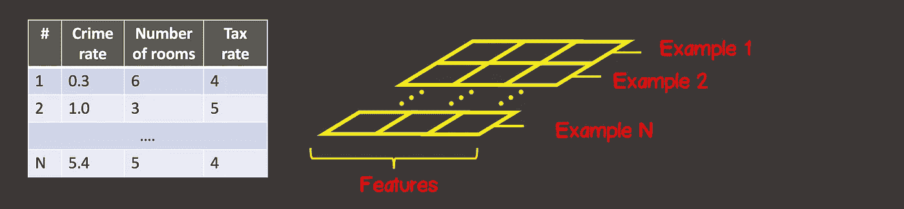
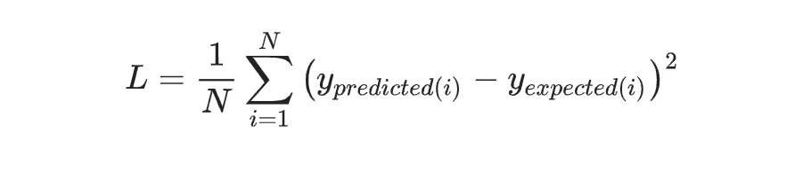
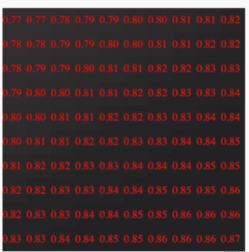
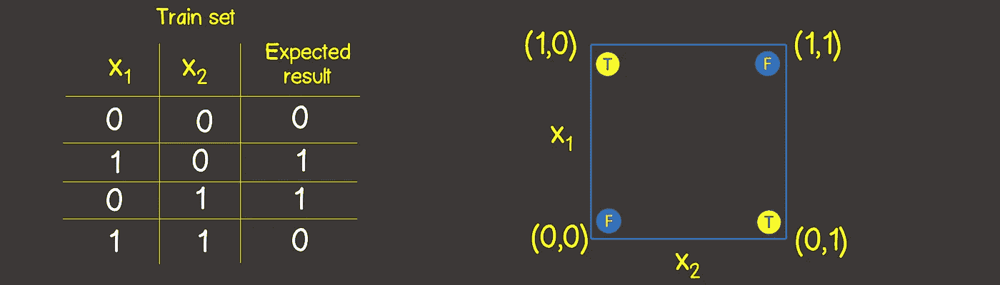
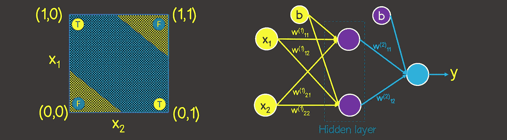
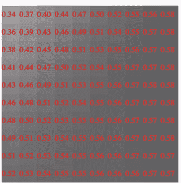

# 机器学习:建模还是；与 TensorFlowJS 异或

> 原文：<https://medium.com/geekculture/machine-learning-modeling-or-xor-with-tensorflowjs-d9c03c5bd17e?source=collection_archive---------21----------------------->

在本文中，我们将使用 TensorFlow.js 实现逻辑运算 or 和 XOR 的模型。这项任务可以被视为机器学习世界中的“Hello World”程序，每个人在学习新东西时都已经遵循了该程序。相信我，这不会花很多时间。

我们遵循所有的步骤，让你得到一个简单的想法，这个过程可能看起来像什么，并插入这种经验和方法，以建立新的神经网络。

**建模或逻辑运算**

好了，让我们开始构建一个逻辑运算或的神经元网络。首先，想象我们的模型是一个黑盒，它的内容稍后会被发现。但是现在我们知道我们的模型(黑盒)应该有多少输入和输出——2 个输入和 1 个输出(图 1)。对于模型学习，我们当然也需要一个训练集。在我们的例子中，它显示了 4 个可用样本的集合以及每个样本的一个预期输出:

*   输入:[[0，0]、[0，1]、[1，0]、[1，2]]
*   输出:[[0]、[1]、[1]、[1]]

Figure 1

让我们用轴 X1 和 X2 在坐标平面上描绘火车集合。它让我们更好地理解神经网络应该是哪种拓扑结构。

Figure 2

我们需要画一条线把飞机分成两部分。所有“真”值在右侧，所有“假”值在左侧(图 2，右侧)。我们还知道，神经网络(感知器)中的一个神经元非常适合解决这个任务。感知器的输出值取决于输入信号，计算如下:

但这是一条线的方程，这意味着一个神经元理论上可以按照我们的预期来划分我们的表面。

由于我们的输出值属于范围[0，1]，我们还需要应用 sigmoid 激活函数。好吧，我们这个特定任务的黑盒可能看起来像这样:

Figure 3

让我们在 TensorFlow 模型中转换我们的模型原型。首先，我们需要在张量中转换我们的火车集合。**张量** —仅仅是一个数据容器，它可能有 N 个轴和沿着每个轴的任意数量的元素。我们大多数人已经熟悉了数学中的张量——向量(单轴张量),矩阵(双轴张量——行和列)。

在 TensorFlow 中，每个张量的第一个轴(轴 0)负责定位来自训练集的所有可用样本(图 4)。

Figure 4

在我们的例子中，我们的训练集中有 4 个样本(图 1)，因此输入张量沿第一轴(轴 0)有 4 个元素。训练样本的每个元素是由两个元素 X1，X2 组成的向量。因此，输入张量具有轴(矩阵)，沿第一轴有 4 个元素，沿第二轴有 2 个元素。

同样，我们需要以同样的方式为模型创建一个输出张量:

让我们创建我们的 tensorflow 模型，它有一个层，其中有一个神经元，从 TensorFlow API 本身可以直观地理解它:

任何模型的创建都是从调用***TF . sequence***方法开始的，该方法为我们的模型创建一个框架。主构建模型块是一个层，我们可以定义任意多的层。在我们的例子中，我们只有一个仅包含一个神经元的层，这一层被称为**密集**层，这意味着下一层中的每个神经元都与前一层中的每个神经元有连接。假设我们有两个致密层。第一层有 N 个神经元，第二层有 M 个神经元，那么连接的普通计数将是(N+1)×M，这里的 1 是偏差。由于我们在该层中只有一个神经元，因此 **unit = 1。**同样对于第一层，我们需要定义模型有多少输入——在我们的例子中是 2，因此 **inputShape = [2]** 。请注意，为第一层之外的其他层设置 **inputShape** 是没有意义的，因为 TensorFlow 可能会根据前一层的模型拓扑自己计算它

每一层可能有自己的激活函数，因为我们的输出值应该属于范围[0，1]它被定义为 sigmoid 激活函数。TensorFlow 中实现的所有激活功能在[这里](https://js.tensorflow.org/api/latest/#layers.activation)可用。

我们需要完成最后一步——编译模型并定义两个强制参数:损失函数和优化器。**损失函数**是确定算法输出和给定目标值之间误差的函数。**优化器**负责计算导致损失函数值最小化的模型的新权重。

我们将随机梯度下降设置为优化器，具有等于 0.1 的恒定学习速率

在 TensorFlow 中实现的所有优化器的列表你可以在这里找到: [tf.train.sgd](https://js.tensorflow.org/api/latest/#train.sgd) ， [tf.train.momentum](https://js.tensorflow.org/api/latest/#train.momentum) ， [tf.train.adagrad](https://js.tensorflow.org/api/latest/#train.adagrad) ， [tf.train.adadelta](https://js.tensorflow.org/api/latest/#train.adadelta) ， [tf.train.adam](https://js.tensorflow.org/api/latest/#train.adam) ， [tf.train.adamax](https://js.tensorflow.org/api/latest/#train.adamax) ， [tf.train.rmsprop](https://js.tensorflow.org/api/latest/#train.rmsprop) 。

损失函数设置为均方根误差:

最后一步是一个学习过程，我们只需要为创建的模型调用 **fit** 方法，并为输入和预期结果设置一个训练张量(输出张量):

我们已经设定了学习过程应该由 100 个学习步骤(学习时期的数量)组成；此外，在每个新的时期，输入数据应该以随机顺序进行混洗(混洗=真)，这将加快模型收敛的过程，因为在我们的训练数据集中只有很少的实例(只有 4 个样本)。

训练过程完成后，我们可以使用 predict 方法，该方法根据新的输入信号计算输出值。

***generate inputs***方法只是生成一个 10x10 的样本数据集，将坐标平面分成 100 个方块:

在这里，您可以看到实际的学习过程:

Figure 5

此处代码为:[https://plnkr.co/edit/FUYbevLR6PbyddIa](https://plnkr.co/edit/FUYbevLR6PbyddIa?preview)

**建模异或逻辑运算**

在图 6 中为这个操作提供的训练集，也把这个集合放在一个坐标平面中，方式与我们对 or 函数所做的一样

Figure 6

请注意，与 or 运算不同，我们不能用一条线来分割坐标平面，所以一边都是假值，另一边都是真值。但是我们可以使用两行代码(图 7，左侧):

显然，在这种情况下，一个神经元不足以解决这个任务。我们应该至少有一个额外的 2 个神经元层，它将模拟坐标平面上 2 条线的行为(图 7，右)。

Figure 7

我们应该只对以前实现的代码做几处修改。首先，我们需要建立一个新的列车组:

让我们根据图 7 改变模型拓扑，对吗:

在这里，您可以看到实际的学习过程:

Figure 8

在这里输入代码:[https://plnkr.co/edit/pF8dCwQuzurgCgTu](https://plnkr.co/edit/pF8dCwQuzurgCgTu)