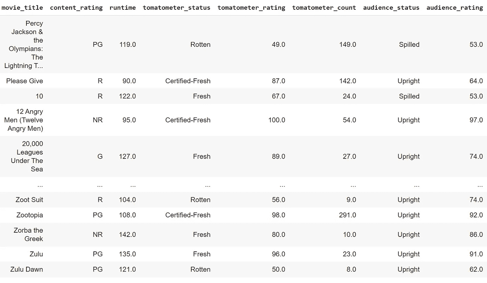
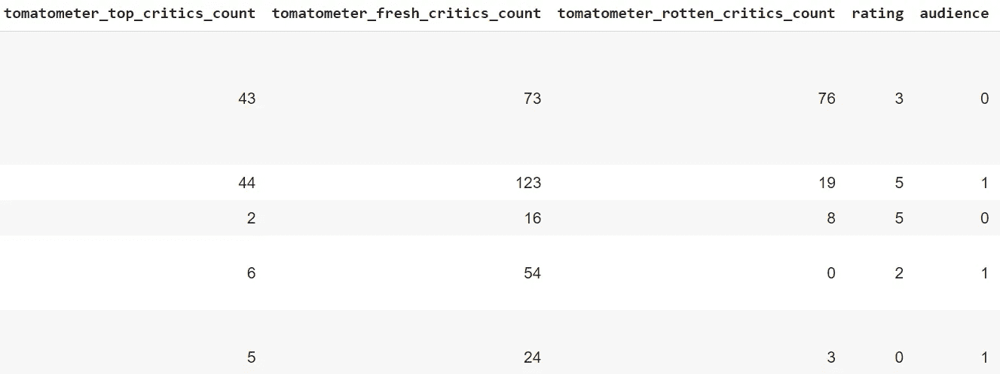
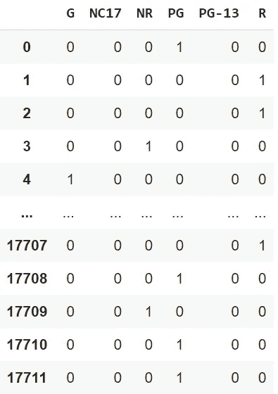

# 机器学习:一键编码与整数编码

> 原文：<https://medium.com/geekculture/machine-learning-one-hot-encoding-vs-integer-encoding-f180eb831cf1?source=collection_archive---------3----------------------->

在建模环境中，哪一个比另一个更有效？

先说第一件事:我为什么写这篇文章？嗯，当我在做一个机器学习项目时，我遇到了这个问题，我不知道该选择哪个。所以我不得不花几分钟时间去谷歌，找到一种形式优于另一种形式的原因。我发现了一些有用的信息，决定写这篇文章来分享我学到的东西。希望它能帮助其他面临同样问题的人。


Photo by [Kevin Ku](https://unsplash.com/es/@ikukevk?utm_source=medium&utm_medium=referral) on [Unsplash](https://unsplash.com?utm_source=medium&utm_medium=referral)

但是在开始之前，到底什么是一键编码和整数编码？这两种方法是在预处理阶段对数据进行数字编码的选项。事实上，为了让计算机理解你提供的输入，它必须被转换成数值，这就是一键编码和整数编码的用武之地。为了说明这一点，我将举一个让我问自己这个问题的例子。利用腐烂的西红柿的数据，我想建立一个模型，预测一部电影是否会被归类为“腐烂”、“新鲜”或“合格-新鲜”。你可以在 [StrataScratch](https://platform.stratascratch.com/data-projects/rotten-tomatoes-movies-rating-prediction) 上找到完整的项目数据。在我的数据框中，我有几个必须转换成数值的特征，例如，内容分级(“PG”、“R”等)。)，以及观众状态(“溢出”或“直立”)。



Here is my dataframe before using any form of encoding.

在这里，我可以选择使用一键编码或整数编码。在后者中，每个类别被分配一个唯一的整数，整数值用于表示数据集中的类别。当时，这就是我使用的方法——老实说，我喜欢这种方法的唯一原因只是因为我不想在我的 df 中有太多的列。为此，我使用了 sklearn.preprocessing 中的`LabelEncoder()`,最后得到了这个结果:



最后两列是我的新分类数据，用整数表示。它的优点是实现起来非常简单。这里的代码很简单:

```
LE = LabelEncoder()
movies_cl['audience'] = LE.fit_transform(movies_cl['audience_status']
```

它还有保持顺序关系的优点，然而，**这也是你不应该使用它的原因之一。**事实上，整数编码通过暗示类别之间的自然排序，会在数据中引入偏差。这可能会导致使用编码数据的机器学习模型性能不佳或出现意外结果。例如，模型可能会做出介于编码类别之间的预测，这可能无法准确反映原始数据。此外，它意味着一个类别比另一个类别更相似。例如，如果我们将类别“红色”、“绿色”和“蓝色”分别编码为 1、2 和 3，则编码值将暗示“红色”比“蓝色”更接近“绿色”。它会导致不正确的假设和结论。

在这种情况下，没有顺序关系，最好使用一键编码。这将为每个类别创建一个新列，每个列都有一个值 0 或 1，以指示给定样本中是否存在该类别。

一键编码的一个优点是它允许模型更容易和有效地学习。这是因为每个输入值都被表示为一个二进制向量，其中只有向量的一个元素被设置为 1，其余的被设置为 0。这使得模型更容易了解输入值和目标输出之间的关系，因为模型可以根据不同输入值的唯一二进制表示来轻松区分它们。

要轻松做到这一点，您可以使用熊猫的`get_dummies()`，这将为您提供以下结果:



Result from get_dummies()

你也可以使用 sklearn.preprocessing `OneHotEncoder()`，它显然比[更适合机器学习](https://stackoverflow.com/questions/36631163/what-are-the-pros-and-cons-between-get-dummies-pandas-and-onehotencoder-sciki)。然后，您可以将此要素放入原始数据框中，并删除旧列。

因此，我们可以看到，它实际上并不比整数编码更复杂，而且一键编码有更多的优势。

*   首先，one-hot 编码通常被认为是比整数编码更有表现力的编码，因为它可以更准确地表示数据及其关系。的确，它能更好地代表一个类别的有无。。例如，如果样本属于“红色”和“绿色”类别，则该样本的独热编码表示将是[1，0，1](第一和第三列中为 1，第二列中为 0)。这准确地反映了样本属于“红色”和“绿色”类别，而不属于“蓝色”类别的事实。相反，同一样本的整数编码表示将是[1，2]，这不提供关于“蓝色”类别存在与否的任何信息。
*   该模型还可以**更容易地处理以前没有见过的新输入**值。例如，如果模型已在一组输入值(包括值“红色”、“绿色”和“蓝色”)上进行了训练，然后它接收到一个新的输入值“黄色”，则它可以很容易地将这个新值表示为一个二进制向量，并基于其训练进行预测。
*   最后，就内存和计算成本而言，独热编码也可以是**更有效的**，因为二进制向量通常比相应的整数编码更短、更稀疏。这对于大型数据集或复杂模型尤其重要。

但是，您必须注意，一次性编码可能会导致高维数据和多重共线性，这可能会降低模型的准确性。

但是为什么我会问自己那么多关于那两种方法的问题呢？嗯，仅仅是因为我看到 Stratascratch 解决方案对内容分级使用了一次性编码方法，而我选择用整数编码来表示它，我不明白它为什么要这样做，因为它对其他分类值使用了整数编码。老实说，我不是 100%确定在这种情况下，绝对有必要使用 one-hot 编码，因为我的结果和 Stratascratch 的一样好(可能是因为内容评级在这个模型的构建中可能不是一个非常重要的特征，我们也可以在其中找到一些平凡感)。

我希望这篇文章能帮助你更好地理解这两种方法之间的区别以及各自的优缺点。我主要希望您选择一个版本而不是另一个，因为您真正理解它对您的模型意味着什么，而不是像我一开始那样，因为您不想在您的数据框架中有太多的列……我至少很高兴它激起了我足够的兴趣来研究它。