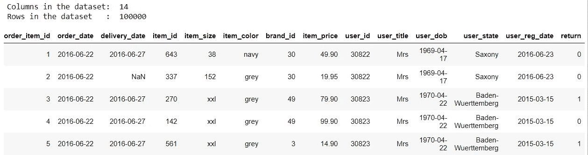
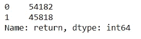
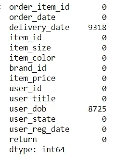
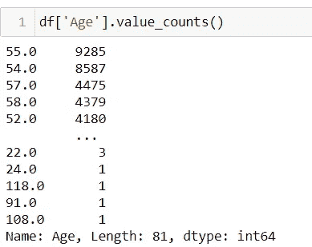
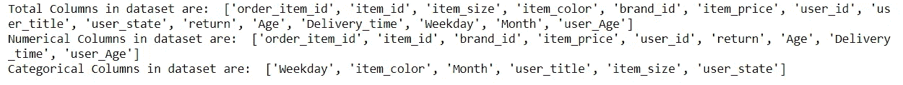
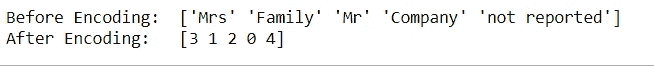
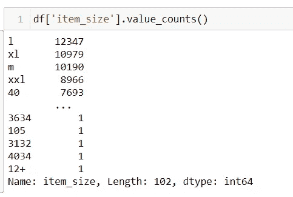
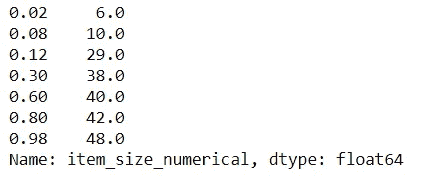
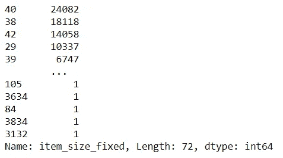
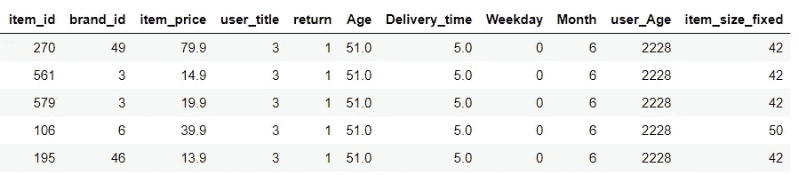

# 面向初学者的机器学习管道——零售退货数据集第一部分

> 原文：<https://medium.com/geekculture/machine-learning-pipeline-for-beginners-retail-returns-dataset-part-i-2132cfcc9e6a?source=collection_archive---------11----------------------->


你可能听说过*机器学习，*考虑到它在过去十年中是多么著名和有影响力。许多人可能对它的工作原理没有足够的了解，但仍然认为它是“神奇的”,我们使用数据准确地预测将会发生什么。随着该领域的应用越来越多，没有该领域经验的人发现这很有趣，并希望探索幕后真正发生的事情。在本文中，我们将探索这种魔力，并学习在给定一些数据的情况下构建一个机器学习(ML)模型。它将帮助初学者理解基本的 ML 管道。

首先，我们谈谈我们的数据集。我们的数据集来自一家在线零售商店，该商店希望了解哪些客户会退回他们购买的商品。在商品被退回的情况下，商店不得不面对运费方面的损失，因为大多数商店提供免费送货。为了减少这种损失，商店旨在发现消费者退货的可能性，以便采取一些应对措施。您可以从第 2 部分文章底部的 Github 链接下载数据集和完整的代码。让我们看看我们正在处理的数据集内部:

```
#Reading the dataset
df=pd.read_csv("training_set.csv")#finding total rows and columns
print ("Columns in the dataset: ", df.shape[1])
print ("Rows in the dataset   : ", df.shape[0])df.head()
```



我们注意到我们总共有 14 列。在这 14 个变量中， *return* 列是目标变量，其中值 1 表示客户将返回一个项目，值 0 表示客户不会返回。我们在数据集中总共有 100，000 行。让我们看看目标特性中的值的比率:

```
df['return'].value_counts()
```



我们注意到在我们的数据集中有几乎相等数量的 *1 的*和 *0 的*。这方面否定了阶级不平衡，给了我们一个平衡的数据集。

由于我们的目标是讨论整个 ML 管道，我们不能直接进入建模。我们首先要使我们的数据集适合建模。这包括数据清理、预处理、特征工程和特征选择。让我们从数据清理步骤开始。

## 数据清理和预处理:

我们的首要任务是寻找空值或缺失值，因为它们与我们的模型无关。我们可以在每一列中搜索它们，如下所示:

```
#checking the count of null values in each column
df.isna().sum()
```



现在，大多数列都有 0 个空值，但是有 2 列有几个空值。有一些方法可以恰当地处理这些价值观。我将解释如下 3 个基本方法:

1.  从数据集中完全删除这两列。然而，由于只有大约 10 %的值丢失，这看起来不是一个有利的选择。此外，这些列似乎对以后的使用很有用。
2.  删除缺少值的行。如果存在可以忽略不计数量的空值，这种方法可以工作，但是在这种情况下，我们可能会丢失大约 18，000 条数据记录，这是完全不可接受的。
3.  用相应列的平均值或中值替换缺失的数据值。这个步骤也被称为*数据输入。*它包括计算已知值的平均值或中值，并用它代替空值。这是一种很好的做法，因为它不会丢失数据。不幸的是，在我们的例子中，我们无法计算平均日期并替换它，因此我们将不得不稍后执行特征工程。

我们继续上面的选项 3，并继续进行所述的特征工程步骤，如下所示:

## 特征工程:

在本节中，我们将格式化几个特性(列)，使它们对我们更有用。我们看到日期/时间格式有几个特性。要从中提取有意义的信息，我们先从 *user_dob 说起。*为了使这个特性简单易懂，我们通过从当前日期中减去出生日期来提取客户的年龄。此外，因为我们知道这个列有空值，所以我们稍后用计算出的年龄的中值替换它们。相关的代码看起来会像这样:

```
*#function to convert date to speicif format*
**def** __datetime(date_str):

    *#for null values set dob as current date to identify them as their age will be 0*
    **if** date_str**!=**date_str:
        date_str**=**str(date**.**today())

    **return** datetime**.**strptime(date_str, '%Y-%m-%d')

*#subtracting dob with current date and converting to years.*
df['Age']**=**(__datetime(str(date**.**today()))**-**df**.**user_dob**.**apply(__datetime))**/**365
df['Age']**=**df**.**Age**.**apply(**lambda** x: int(str(x)**.**split(" ")[0]) )
```

上面的代码计算所有消费者的年龄。为了执行数据输入，一个好的做法是找到每个类的平均值或中值，并用这个新计算的值替换每个空值。我发现中间值通常比平均值好，并在本文中使用了它。

```
#function to impute 0 values
def imputing_age(x,y):
    x0=x[x['return']==1] # subset comprising of return
    x1=x[x['return']==0] # subset comprising of non-return
    x0[y] =x0[y].map( lambda x : x0[y].median() if x == 0 else x) #replacing returns 0s with returns median
    x1[y] =x1[y].map( lambda x : x1[y].median() if x == 0 else x) #replacing non-returns 0s with non-returns median
    return pd.concat([x0,x1])#Imputing 0 values with median for each class
df=imputing_age(df,'Age')
```

我们可以看到，我们已经成功地将日期/时间数据转换为数字数据。



我们可以对交付和订单日期执行类似的步骤。我们可以通过从交付日期中减去订单日期来计算订单交付所需的时间。这可能是一个可行的功能，因为如果他们的交付花费了大量的时间，消费者可能会退货。此外，我们可以从日期中找到交付月份或工作日，因为周一交付的项目有更高的退货机会，或者在复活节或圣诞节期间订购的项目更有可能被保留。请在第 2 部分文章底部提到的 Github 链接上找到这一步的完整代码。

计算完这些特征后，我们可以像以前一样对*交货时间*、*月份*、*工作日*进行类似的数据输入。我们可以做类似的步骤，比如为 *user_reg* 计算年龄。提取有用的特征后，我们可以如下移除原始列:

```
df.drop(['order_date','delivery_date','user_reg_date','user_dob'], axis=1,inplace=True)
```

## 分类列:

机器学习模型是基于数学输入的。他们只理解数值，并对其执行计算以产生结果。由于我们的数据集包含非数值数据，也称为分类数据，我们必须对其进行处理，以使其可用。让我们看看我们的分类数据列:

```
#getting total columns
cols=df.columns
print("Total Columns in dataset are: ",list(cols))#getting only numerical columns
numerical_cols=df._get_numeric_data().columns
print("Numerical Columns in dataset are: ",list(numerical_cols))#getting categorical columns by subtracting numerical columns from total columns
categorical_cols=set(list(cols))-set(list(numerical_cols))
print("Categorical Columns in dataset are: ",list(categorical_cols))
```



我们观察到有多个分类列。对于月份和工作日，我们可以很容易地将它们转换成数字格式，1–12 表示月份，0–6 表示工作日。对于其他列，我们有多种方法，也就是说，我们可以一次性编码，或者只给一个值分配一个数字标签。在这个初学者教程中，我倾向于通过使用内置库来使用标签编码。让我们对 *user_title* 进行标签编码:

```
le = preprocessing.LabelEncoder()
print ("Before Encoding: ",df['user_title'].unique())#encoding user_title to numerical values
df['user_title'] = le.fit_transform(df.user_title.values)print ("After Encoding:  ",df['user_title'].unique())
```



我们可以看到，在编码之前，我们有 5 个不同值的分类数据，但现在编码之后，我们有数字数据。我们不需要为月/工作日使用库，因为我们可以为它分配我们自己的编码。 *Item_size* 是下一个重要的分类变量。让我们看看它的价值:



我们可以看到，项目大小混合了非数值和数值。这个方面很有趣，因为我们只需要转换几个值。一个问题出现了，因为我们没有任何关于 xl、l 和 xxl 在数值上的含义的映射，所以我们不能简单地替换它们。基于真实世界的场景，我们可以有把握地假设 xxl > xl > l 等等。因此，我们可以根据分类值的数量将数字数据分成 5-6 组，然后将每组分配给一个值类别。我们可以很容易地用分位数做到这一点，分位数根据值将数据分成组。

```
def item_map(x):
    #removing + sign from sizes
    x=x.replace("+","")

    #if size is categorical replace it with nan
    if x.isnumeric()==False:  
        x=np.nan
    return float(x)
df['item_size_numerical']=df.item_size.apply(item_map)
df.item_size_numerical.quantile([0.02,0.08,.12, .3,.6, .8,0.98])
```



这里我们有 6 个分位数，0.98 表示位于数据的 98%以上的值，0.02 表示位于 2%的值。因此，我们可以说 48 大于 98%的值，所以我们可以将 xxxl 赋给它，并对其他分位数进行类似的迭代。

```
def item_map_category(x):
    x=x.replace("+","")
    if x.isnumeric()==False:  
        if x=='xxxl':
            x=48
        elif x=='xxl':
            x=42
        elif x=='xl':
            x=40
        elif x=='l':
            x=38
        elif x=='m':
            x=29
        elif x=='s':
            x=10
        elif x=='xs':
            x=6
        else: #for non-reported size we choosing mid value
            x=40
    return int(x)
df['item_size_fixed']=df.item_size.apply(item_map_category)
df.item_size_fixed.value_counts()
```

现在，这会将我们所有的非数字大小转换为数字值，如下所示:



现在我们有了固定的项目大小，接下来的两个分类变量是颜色和状态。我们可以有把握地推断，颜色和状态对回报率几乎没有影响，因此它们对模型没有用处。此外，我们还可以删除其他冗余列，如 id。我们最终清理的数据集现在已准备好进行建模，如下所示:



**结论:**

这就完成了我们的预建模阶段。我们已经详细完成了所有需要的步骤，并对我们的数据集进行建模充满信心。您可以在此处查看如何对上述预处理数据集进行预测:

[https://wahabaftab . medium . com/machine-learning-pipeline-for-初学者-retail-returns-dataset-part-ii-57 CD 8 b 8 a 0743](https://wahabaftab.medium.com/machine-learning-pipeline-for-beginners-retail-returns-dataset-part-ii-57cd8b8a0743)

如果你认为有些地方是错误的或者需要一些改变，请随时添加任何评论，反馈是非常感谢的。