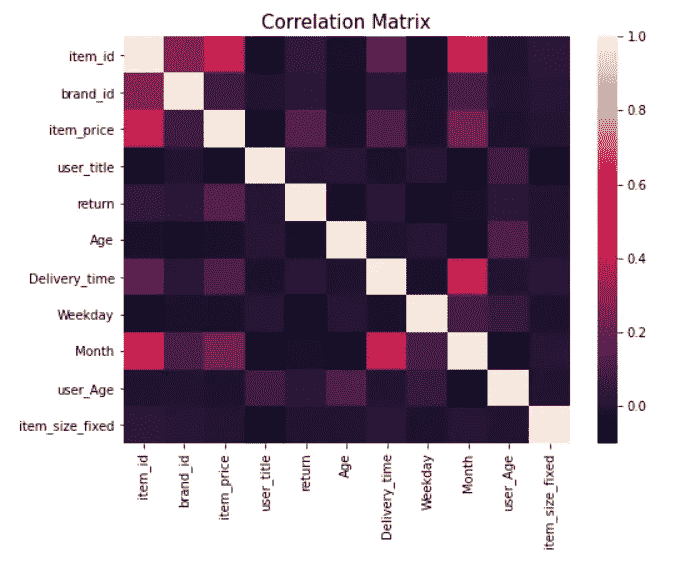
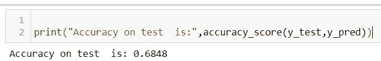

# 面向初学者的机器学习管道-零售退货数据集第二部分

> 原文：<https://medium.com/geekculture/machine-learning-pipeline-for-beginners-retail-returns-dataset-part-ii-57cd8b8a0743?source=collection_archive---------23----------------------->


本文将帮助您理解机器学习管道的建模方面，我们已经完成了预建模阶段，您可以在这里看到:

[https://wahabaftab . medium . com/machine-learning-pipeline-for-初学者-retail-returns-dataset-part-I-2132 FCC 9 e 6 a](https://wahabaftab.medium.com/machine-learning-pipeline-for-beginners-retail-returns-dataset-part-i-2132cfcc9e6a)

第 1 部分和第 2 部分的完整代码也在本文末尾给出。现在让我们直接进入数据集建模！

## 建模:

在建模之前，一个好的做法是查看一些特征是否相同或提供相同的信息。这种性质的多个特征对于我们的模型来说是多余的。我们将关联矩阵可视化，以了解各种特征如何相互关联:



Correlation Matrix

颜色越浅意味着相关性越高，反之亦然。我们观察到所有列都是独立的，彼此之间几乎没有相关性。因此，它们有不同的贡献，并提供对我们的模型有用的各种工件。现在让我们从建模开始。首先，我们将数据分为训练集和测试集。因为我们有 100k 行，15%数据的测试集似乎足够了。

```
x = df.drop(['return'],axis=1) #training features
y = df['return'] # target variable
X_train, X_test1, y_train, y_test= train_test_split(x, y, test_size=0.15, random_state=42)#converting to numpy array
X_train= np.array(X_train)
y_train = np.array(y_train)
X_test1 = np.array(X_test1)
y_test = np.array(y_test)
```

下一步是数据规范化，这将提高模型的效率和性能。我们的数据集包含不同范围的列值。这使得模型更难学习。我们可以通过将数据标准化到 0-1 的范围来解决这个问题。

```
#normalizing features
sc = StandardScaler()
X_train = sc.fit_transform(X_train)
X_test = sc.transform (X_test1)
```

这将我们的数据标准化为 0–1 值。标准标量适合我们的训练数据集，并根据测试集和训练集的这些值对我们的数据进行标准化。很多人犯的错误是 ***拟合在测试集*** 上，但是我们只需要 ***转换测试集不拟合它*** 。

对于建模，有几种算法，如决策树、逻辑回归、SVM、随机森林和 XGBoost 等。对这些算法的深入和详细的解释需要一篇自己的博客文章。在这里，我概述了选择这些算法的原因。由于我们的问题属于二进制分类，即我们必须预测一个人是否会返回一个项目(2 值~二进制)，我们使用分类器，并且所有提到的算法都适用于二进制分类。决策树分类器通常优于其他分类器，并且对异常值更鲁棒，因此使用它们是合适的。Random forest 和 XGBoost 都是基于决策树的算法，使用集成技术，是决策树的更高级版本，也是当前最先进的技术。XGBoost 理解起来有点复杂，但 Random Forest 只是利用多个决策树，汇集它们的结果，并预测投票最高的类。让我们用随机森林来解决我们的问题。有一个内置的库，我们可以调用它来应用随机森林，如下所示:

```
clf=RandomForestClassifier(random_state=1,n_estimators=200,class_weight='balanced',
                    min_samples_leaf=5,
                       min_samples_split=10)# Train Decision Tree Classifer
clf = clf.fit(X_train,y_train)
```

上面的代码训练我们的分类器。函数内的值，如 *n_estimators* 、*类权重、*等。是我们手动调整以获得最佳性能的超参数。我们的模型现在已经训练好了。让我们对它进行一些测试:

```
y_pred = clf.predict(X_test) #use the model to predict on the validation data
```

这里我们使用测试集来看看我们的模型预测了什么。然后，我们可以将预测值与原始值进行比较，看看模型的表现如何。



我们可以看到，该模型在测试集上达到了 68%的准确率，这还不错。我们还可以使用其他指标来衡量性能，如 F1 分数、精确度、召回率或 ROC 的 AUC。

**未来工作:**

我在最终的代码中应用了这些度量标准，并且在没有目标特性的情况下对完全看不见的数据进行了预测。在最终代码中可以随意跳过成本部分。最后，我们完成了一个基本的初学者级别的机器学习流水线。进一步发展，我们可以做这样的事情:

*   使用平均值而不是中位数
*   在某些地方使用一次性编码代替标签编码
*   移除异常值
*   使用不同的算法
*   超参数调谐
*   使用不同的性能指标

## 最终注释:

这篇文章和第一部分是为那些对机器学习充满热情并且想要学习的初学者准备的。希望看完这个你有所收获。请随时添加任何意见。非常感谢您的任何反馈。不要犹豫分享这个！谢谢大家！

## 最终代码:

[https://github . com/wahababtab/Machine-Learning-Pipeline-for-初学者](https://github.com/wahabaftab/Machine-Learning-Pipeline-for-Beginners)