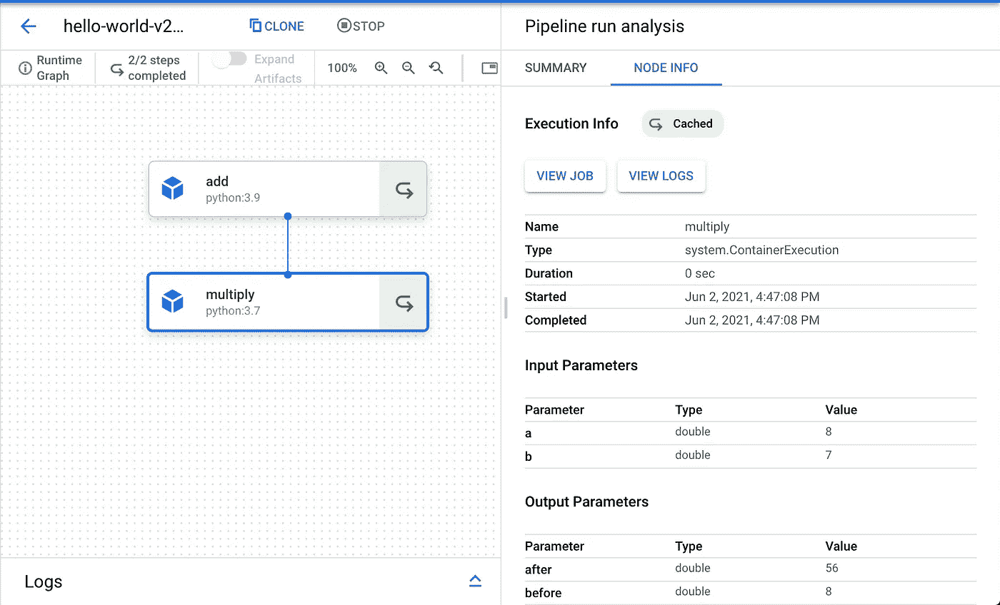

# 谷歌云平台的机器学习管道(第一部分)

> 原文：<https://medium.com/geekculture/machine-learning-pipelines-with-google-cloud-platform-a3697d0ab8fb?source=collection_archive---------20----------------------->

5 月 18 日，谷歌云公布**Vertex AI**；*一个托管的机器学习(ML)平台。*他们声称，与竞争平台相比，它需要的代码少了 80%(*谷歌云内部研究，2021 年 5 月)。*

Vertex 有几个组件来简化数据科学家/ML 工程师的生活，如功能存储、轻松部署模型的端点、托管数据集、笔记本(实际上是相同的旧 Jupyter 笔记本)和我最喜欢的部分:管道！

首先，我们来看看对于新人来说什么是机器学习管道。实际上，它是一个完整的工作流，封装了开发和部署 ML 模型时的所有小步骤。这对于几个原因是有用的，如**训练** - **服务偏差、模式验证、数据漂移或概念漂移、连续训练、模型监控**等。但是这个话题应该有自己的博文。TLDR，*你可以把你的训练过程分成更小的部分，这样当出现问题时你可以很容易地调试它，而且你也可以把它作为一个单独的程序来运行。*然后你可以回来看看是怎么回事。

好了，我们别兜圈子了，写点代码吧。我将向您展示一个玩具示例，足以让您理解 ML 管道的整个概念。然后你可以写你自己的代码，做最复杂的任务，如导入数据，特征工程，培训和服务。

首先，让我们导入必要的库:

Import necessary libraries

这些模块看起来像我们的老朋友坏脾气库伯弗洛！是的，但是有一个简单的变化:我们有了第 2 版，它允许我们直接从裸 Python 函数中创建组件。

在我们进入有趣的部分之前，让我们建立我们的 GCP 环境，以摆脱我们以后可能会有的头痛。

Set up Google Cloud Environment

即使开始看起来很复杂，但不要害怕；我会解释这一切。

在第一行中，我输入了一个简单的 shell 命令来检索您的 google cloud 默认项目 id。它返回一个列表，所以我们只得到[0]索引。

接下来，我们定义了区域和存储桶名称来存储和检索对象。如果你不知道什么是 bucket，你可以把它想象成你本地文件系统上的一个目录(但是记住它不是一个目录，google 使用的是 [GFS](https://static.googleusercontent.com/media/research.google.com/en//archive/gfs-sosp2003.pdf) ，它是 Hadoop 的 HDFS 的祖先)。

然后我们需要一些[环境变量](/chingu/an-introduction-to-environment-variables-and-how-to-use-them-f602f66d15fa#:~:text=An%20environment%20variable%20is%20a,at%20a%20point%20in%20time.)，因此我们使用一个 [Jupyter 魔法](/chingu/an-introduction-to-environment-variables-and-how-to-use-them-f602f66d15fa#:~:text=An%20environment%20variable%20is%20a,at%20a%20point%20in%20time.)。简单地说，%env:列出了所有的环境变量/值，我们在这里需要 PATH 变量。

最后，我们定义管道根——一个简单的桶。

让我们实例化 kfp 客户端 API:

Instantiate KFP Client API

在您从 marketplace 部署了一个 Kubeflow(实际上是一个托管的 kubernetes 集群)之后，您可以获得 KFP(Kubeflow Pipelines) API 所需的链接。

让我们进入有趣的部分，定义我们的第一个组件。

我们使用组件[装饰器](https://www.programiz.com/python-programming/decorator)并定义简单的 python 函数。在我们进入组件的参数之前*(它们都是可选的，所以可以随意跳过这一部分)*我需要提到每个组件实际上都是一个容器；就像码头集装箱一样。因此，我们可能有组件的 yaml 文件(或者你可以说 [dockerfile](https://docs.docker.com/engine/reference/builder/) 用于多个容器),这是一个如何设置和运行每个容器的简单手稿。

有了它，“add_component.yaml”就在那里，以防我们需要重新构建同一个组件。我们指定将哪个 python 图像用于这个所谓的容器。

现在，第二部分:

这一次，我将输出指定为 NamedTuple。当您希望其他组件以*元数据句柄*的形式访问这些组件时，它就派上了用场，这超出了本文的范围。把它想象成组件的一个属性，我们可以像到达一个 numpy 数组的形状(my_array.shape)一样到达它。现在这不重要。

现在我们有了两个组件，我们可以构建一个简单的 hello-world 管道。我们只需要一个名称和一个根路径来存储工件。然后，您可以定义一个函数(我们将在编译时使用它)来使用我们刚刚在上面创建的组件。

Building pipeline

所有的步骤都是不言自明的；我们定义了我们的管道名称(我们将在 vertex ai 平台上看到)，一个可选的描述和一个管道根。我们有 PIPELINE_ROOT 变量，但是为了让您的工作更容易，我再次定义了它。接下来，我们需要编译管道。感觉像是 Keras 的模特，对吧？

Compiling pipeline

编译方法需要我们上面定义的管道函数。您可能还记得，这个函数消耗组件。Compile 方法也需要一个路径来保存 json 对象。我们可以在顶点管道界面中使用这个对象来导入我们的管道，我们可以调用 GCP API 让它为我们运行。既然你正在读这篇文章，我推断你和我一样正在为一场灾难而奔波。

我们实例化了 GCP AI 平台(可以说是老版本的 Vertex)，我们给她她需要的东西，我们的项目 id 和区域。然后我们调用“create_run_from_job_spec”函数，我们使用了上面提到的 json 对象。

如果我们前往 GCP 顶点人工智能仪表板，并点击管道，选择我们的“hello-world”管道，我们将看到运行时图。注意，第二个组件的输出就像我们定义的“之前”和“之后”一样。

Vertex Pipelines Dashboard UI

就这样，我们刚刚运行了我们的第一个玩具管道。如果我们已经训练了一个模型，我们可以在模型中看到它，并且可以创建一个端点，通过一个简单的 REST API 调用在生产中使用它。