# 使用 Docker、Python Rest APIs 以及 Flask 和 Kubernetes 进行实时机器学习预测:在线推理

> 原文：<https://medium.com/geekculture/machine-learning-prediction-in-real-time-using-docker-python-rest-apis-with-flask-and-kubernetes-fae08cd42e67?source=collection_archive---------2----------------------->

## 用于机器和深度学习的 Kubernetes、Docker、Python、Scikit-Learn 和 Flask:如何扩展数据科学家的工作


Photo by Annamária Borsos

本文的想法是创建一个 Docker 容器，使用 Python APIs 和 Flask，通过经过训练的机器学习模型来执行在线推理。为了学习这个概念，我们将使用 Docker 和 Flask-RESTful 实现在线推理(线性判别分析和多层感知器神经网络模型)。

首先，让我们考虑以下文件:

- **Dockerfile**

- **train.py**

- **api.py**

- **requirements.txt**

- **train.csv**

- **test.json**

你可以在 [GitHub](https://github.com/xaviervasques/Kubernetes-ML-Online.git) 上找到所有的文件。

# flask-RESTful API

构建 API 的第一步是考虑我们想要处理的数据，我们想要如何处理它，以及我们想要 API 产生什么样的输出。在我们的例子中，我们将使用 **test.json** 文件，其中有 1300 行 EEG 数据，每行有 160 个特征(列)。我们希望我们的 API 满足以下要求:

- API 1:我们给 API 一个行号，它将从所选行中提取数据并打印出来。

- API 2:我们将为 API 提供一个行号，该 API 将提取所选行，将新数据注入模型并检索分类预测(数据中的#字母变量)

- API 3:我们将要求 API 获取 **test.json** 文件中的所有数据，并立即为我们打印模型的分类分数。

最后，我们希望通过发出 HTTP 请求来访问这些进程。

让我们来看看 **api.py** 文件:

在导入包括开源 web 微框架 Flask 在内的依赖项之后，第一步是设置写在 docker 文件中的环境变量。我们还需要加载我们的线性判别分析和多层感知器神经网络序列化模型。我们通过编写 **app = Flask(__name__)来创建 Flask 应用程序。**然后，我们创建三个 Flask 路由，这样我们就可以在该路由上服务 HTTP 流量:

-[http://0 . 0 . 0 . 0:5000/line/250](http://0.0.0.0:5000/line/250):从 test.json 中获取数据，并返回由变量 Line 定义的请求行(本例中我们希望提取行号为 250 的数据)

-[http://0 . 0 . 0 . 0:5000/prediction/51](http://0.0.0.0:5000/prediction/51):通过注入请求的数据，从 LDA 和神经网络训练模型返回分类预测(在本例中，我们希望注入第 51 行的数据)

-[http://0 . 0 . 0 . 0:5000/score](http://0.0.0.0:5000/score):返回神经网络和 LDA 推理模型对所有可用数据的分类得分( **test.json** )。

Flask routes 允许我们通过向 URL ( [http://0.0.0.0:5000](http://0.0.0.0:5000/) )添加我们的过程名称( **/line/ < Line >，/prediction/ < int:Line >，/score** )来从 API 请求我们需要的内容。无论我们添加什么数据， **api.py** 总是会返回我们请求的输出。

# 机器学习模型

**train.py** 是一个 python 脚本，它从 csv 文件(train.csv)中获取数据并对其进行规范化，然后训练两个模型对数据进行分类(使用 scikit-learn)。该脚本保存了两个模型:线性判别分析(clf_lda)和神经网络多层感知器(clf_NN):

# 在线推理的 Docker 图像

我们准备建立我们的码头工人形象。首先，我们需要我们的 **Dockerfile** 和 **jupyter/scipy-notebook** 图像作为我们的基本图像。我们还需要设置我们的环境变量并安装 joblib，以允许我们的训练模型和 flask(**requirements . txt**)的序列化和反序列化。我们将 **train.csv** 、 **test.json** 、 **train.py** 和 **api.py** 文件复制到镜像中。然后，我们运行 **train.py** ，它将拟合并序列化机器学习模型，作为我们映像构建过程的一部分。

这是:

为了构建这个映像，我们运行以下命令:

```
docker build -t my-kube-api -f Dockerfile .
```

现在让我们测试我们的容器的运行情况。

# 运行 Docker 在线推理

现在，我们的目标是在本地运行我们的在线推理，以测试一切是否运行良好。运行我们的 docker 容器意味着每次客户端向/line/ <line>、/prediction/ <line>、/score 端点发出 POST 请求时，我们将显示请求的数据(row)，使用我们的预训练模型预测我们注入的数据的类别，并使用所有可用数据预测我们的预训练模型的得分。为了启动 web 服务器，我们将运行 Docker 容器和 **api.py** :</line></line>

```
docker run -it -p 5000:5000 my-kube-api python3 api.py
```

**-p** 标志将容器中的端口 5000 暴露给我们的主机上的端口 5000， **-it** 标志允许我们查看来自容器的日志，并且我们在 **my-api** 映像中运行 **python3 api.py** 。

输出如下所示:

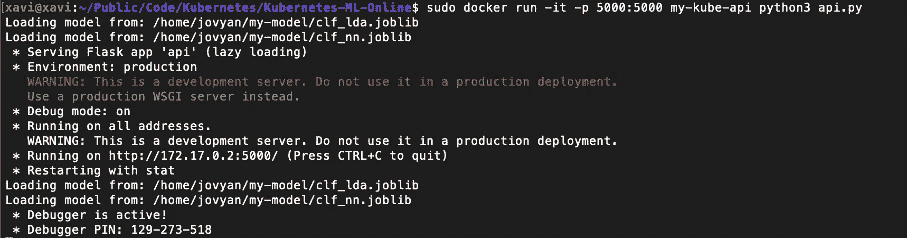

您可以看到我们运行在 [http://172.17.0.2:5000/](http://172.17.0.2:5000/) 上，现在我们可以使用 web 浏览器或 **curl** 命令向 IP 地址发出 POST 请求。

如果我们卷曲或使用我们的网络浏览器:

```
curl [http://172.17.0.2:5000/line/23](http://172.17.0.2:5000/line/232)
```

我们将从我们的数据(test.json)中提取第 23 行:

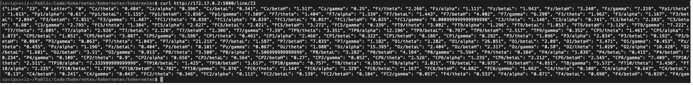

如果我们键入以下 curl 命令:

```
curl [http://172.17.0.2:5000/prediction/23](http://172.17.0.2:5000/prediction/232)
```

我们将看到以下输出:

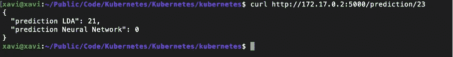

上述输出意味着 LDA 模型将提供的数据(第 23 行)分类为字母 21 (U ),而多层感知器神经网络将数据分类为字母 0 (A)。这两个模型不一致。

如果我们打字

```
curl [http://172.17.0.2:5000/score](http://172.17.0.2:5000/score)
```

我们将看到我们的模型在整个数据集上的得分:

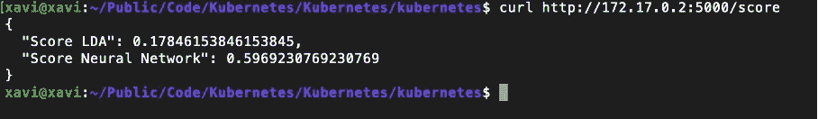

正如我们所看到的，我们应该更信任多层感知器神经网络，其准确度分数为 0.59，即使分数不是很高。有些工作要做，以提高准确性！

既然我们的应用程序工作正常，我们可以进入下一步，在 Kubernetes 集群中部署它。但在此之前，让我们使用 CLI 将映像推送到存储库:

```
docker logindocker tag my-kube-api:latest xaviervasques/my-kube-api:latestdocker push xaviervasques/my-kube-api:latest
```

# 创建并准备虚拟机

要安装我们的 Kubernetes 集群，让我们创建虚拟机或使用裸机服务器。本文中的所有指令都是使用 Ubuntu 版本 20.04 创建的虚拟机进行测试的:

-kub master:2 vpus，4096MB 内存，20GB 驱动器空间

-kube node 1:2 vcpu，4096MB 内存，20GB 驱动器空间

我们启用了虚拟机和主机之间的流量。

切换到 root，确保关闭交换，并在/etc/fstab 中注释掉引用交换:

```
swapoff -avim /etc/fstab
```

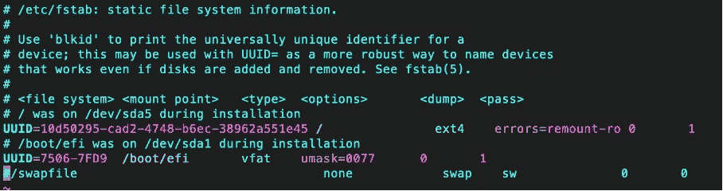

# Kubeadm 装置

首先，我们将在每个虚拟机中安装 docker 引擎(在我们的例子中:kubmaster 和 kubenode1)。要安装它，你可以选择你喜欢的方法([https://docs.docker.com/engine/install](https://docs.docker.com/engine/install/))。我们将使用存储库。下面的不同步骤将更新 apt 包索引，安装包以允许 apt 通过 https 使用存储库，添加 Docker 的官方 GPG 密钥，设置稳定的存储库，并安装最新版本的 Docker 引擎和 containerd。

```
sudo apt-get updatesudo apt-get install \
    apt-transport-https \
    ca-certificates \
    curl \
    gnupg \
    lsb-releasecurl -fsSL https://download.docker.com/linux/ubuntu/gpg | sudo gpg ---dearmor -o /usr/share/keyrings/docker-archive-keyring.gpgecho \
"deb [arch=amd64 signed-by=/usr/share/keyrings/docker-archive-keyring.gpg] https://download.docker.com/linux/ubuntu \
$(lsb_release -cs) stable" | sudo tee /etc/apt/sources.list.d/docker.list > /dev/nullsudo apt-get updatesudo apt-get install docker-ce docker-ce-cli containerd.io
```

然后，在切换到 root (sudo -s)之后，我们执行一个 *curl* 来获取 gpg 密钥，这将允许我们使用 Kubernetes 二进制文件:kubectl、kubeadm、kubelet

```
curl -s [https://packages.cloud.google.com/apt/doc/apt-key.gpg](https://packages.cloud.google.com/apt/doc/apt-key.gpg) | apt-key add -
```

我们添加了对 Google 存储库的访问权限([http://apt . kubernetes . io](http://apt.kubernetes.io/))，这将允许我们下载并安装二进制文件:

```
add-apt-repository “deb [http://apt.kubernetes.io/](http://apt.kubernetes.io/) kubernetes-xenial main”
```

要安装二进制文件，我们需要执行以下操作:

```
apt-get install -y kubelet kubeadm kubectl kubernetes-cnisystemctl enable kubelet
```

所有这些步骤都必须在集群的所有节点(主节点和节点)中完成。

# 创建一个 Kubernetes 集群

现在，我们已经在所有节点中安装了必要的包，我们将进行初始化和网络工作，以连接 Kubernetes 集群的不同部分。

要启动主节点，请连接到主节点并键入:

```
root@kubmaster:~# kubeadm init --apiserver-advertise-address=192.168.1.55 --node-name $HOSTNAME --pod-network-cidr=10.244.0.0/16
```

192.168.1.55 是我们之前定义的主节点(kubmaster)的 IP 地址，10.244.0.0/16 用于定义 Kubernetes 内部网络的范围，Kubernetes 将使用该范围来分配其网络内的 IP 地址。

我们得到以下输出:

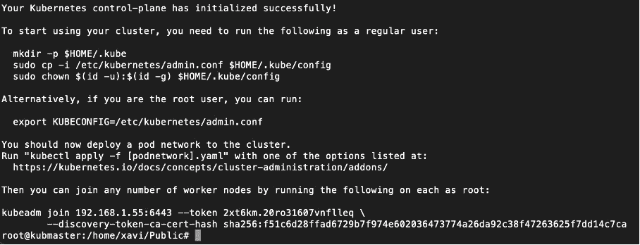

正如您在输出中看到的，要开始使用我们的集群，我们需要创建配置文件来使用 kubectl(作为一个普通用户):

```
mkdir -p $HOME/.kubecp -i /etc/kubernetes/admin.conf $HOME/.kube/configchown $(id -u):$(id -g) $HOME/.kube/config
```

为了建立内部网络，我们需要在集群中的节点之间提供一个网络。为此，我们将使用法兰绒，这是配置为 Kubernetes 设计的第 3 层网络结构的一种非常简单易行的方法。我们需要提供管理内部网络的可能性(在所有节点启动命令):

```
sysctl net.bridge.bridge-nf-call-iptables=1
```

然后，我们通过在主节点中键入以下命令，在在线配置文件(kube-法兰绒. yml)的帮助下安装法兰绒网络:

```
kubectl apply -f [https://raw.githubusercontent.com/coreos/flannel/master/Documentation/kube-flannel.yml](https://raw.githubusercontent.com/coreos/flannel/master/Documentation/kube-flannel.yml)
```

我们检查主节点中 pod 的状态(法兰绒网络、kube-调度程序、kube-apiserver、kube-控制器-管理器、kube-代理、管理内部 DNS 的 pod、存储 etcd 配置的 pod 等):

```
kubectl get pods --all-namespaces
```

如果一切都在运行，是时候将节点加入主节点了。为此，我们复制先前生成的令牌，并在节点(kubenode1)中键入以下命令:

```
kubeadm join 192.168.1.55:6443 --token 08hcql.zbbieukn1h96f1px \    --discovery-token-ca-cert-hash sha256:851d02642c9b2177dd89c8e7cf7178c36185d61799eaaec4fec99b172809373f
```

回到主节点，键入以下命令检查状态:

```
kubectl get pods --all-namespaces
```

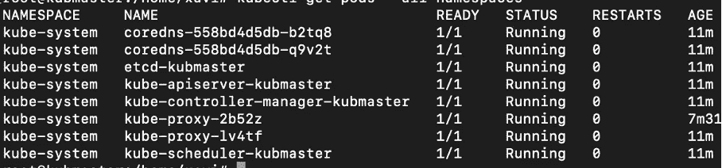

如果您在主节点中键入下面的命令，我们可以看到我们的主节点和 kubnode1 都准备好了:

```
kubectl get nodes
```


# 将集装箱化 ML 模型部署到 Kubernetes

当我们有多个需要逐个执行的 YAML 文件时，管理起来会变得困难或者重复。为了使它更容易，我们可以使用 Kustomize 工具。

连接到主节点(kubmaster)并安装 Kustomize:

```
curl -s https://api.github.com/repos/kubernetes-sigs/kustomize/releases |\
grep browser_download |\
grep linux |\
cut -d '"' -f 4 |\
grep /kustomize/v |\
sort | tail -n 1 |\
xargs curl -O -L && \
tar xzf ./kustomize_v*_linux_amd64.tar.gz && \
mv kustomize /usr/bin/
```

在主节点中创建一个名为“base”的文件夹，并在其中创建以下 YAML 文件:

*   namespace.yaml
*   部署. yaml
*   service.yaml
*   kustomization.yaml

**namespace.yaml** 文件为 Kubernetes 资源提供了一个范围:

**deployment.yaml** 将让我们管理一组相同的吊舱。如果我们不使用部署，我们将需要手动创建、更新和删除一组 pod。这也是一种轻松自动缩放应用程序的方式。在我们的示例中，我们决定创建两个 pod(副本)，加载我们之前推送的 Docker 映像，并运行我们的 **api.py** 脚本。

这个 **service.yaml** 文件将把我们在一组 Pods 上运行的应用程序公开为一个网络服务。

最后，我们创建了 **kustomization.yaml** 文件:

为了部署我们的应用程序，我们在主节点中使用这个命令:

```
kubectl apply --kustomize=${PWD}/base/ --record=true
```

要查看部署到此名称空间中的所有组件:

```
kubectl get ns
```

我们应该获得以下输出:

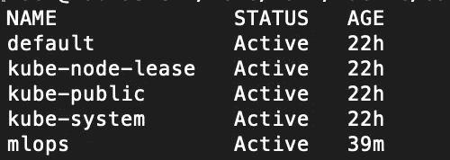

要查看部署的状态，我们可以使用以下命令:

```
kubectl get deployment -n mlops
```

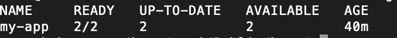

要查看服务的状态，我们使用以下命令:

```
kubectl get service -n mlops
```

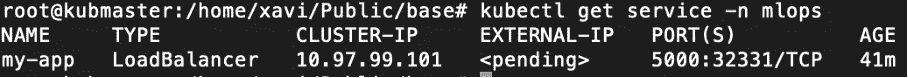

我们现在可以通过 curl 或您的 web 浏览器来使用我们的部署模型了:

```
curl [http://10.97.99.101:5000/line/23](http://10.97.99.101:5000/line/23)
```

我们将从我们的数据( **test.json** )中提取第 23 行:

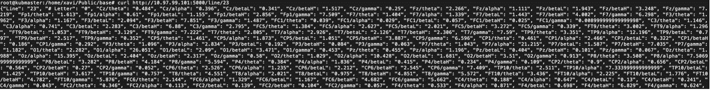

如果我们键入以下 curl 命令:

```
curl [http://10.97.99.101:5000/prediction/23](http://10.97.99.101:5000/prediction/23)
```

我们将看到以下输出:

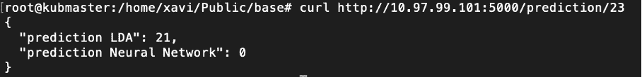

如果我们使用以下命令:

```
curl [http://10.97.99.101:5000/score](http://10.97.99.101:5000/score)
```

我们将看到我们的模型在整个数据集上的得分:

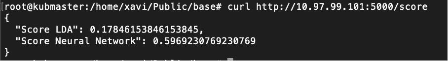

**消息来源**

[https://developer . IBM . com/technologies/containers/tutorials/scalable-python-app-with-kubernetes/](https://developer.ibm.com/technologies/containers/tutorials/scalable-python-app-with-kubernetes/)

[https://cloud . Google . com/community/tutorials/kubernetes-ml-ops](https://cloud.google.com/community/tutorials/kubernetes-ml-ops)