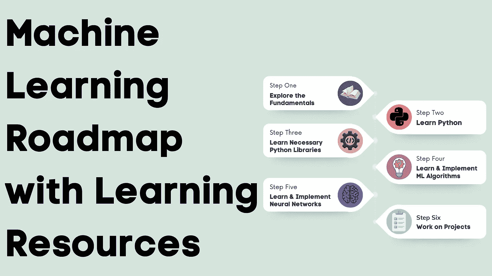

# 带有学习资源的机器学习路线图

> 原文：<https://medium.com/geekculture/machine-learning-roadmap-with-learning-resources-a979d65ee731?source=collection_archive---------6----------------------->

在机器学习中，我们使用数据和算法来构建智能系统。未来十年，你将探索许多新的高薪工作，这些工作需要你了解机器学习。所以你今天花在学习机器学习上的时间永远不会浪费。因此，如果你正在寻找一个可以遵循的学习机器学习的完整路线图，这篇文章就是为你准备的。在本文中，我将带您浏览一个机器学习路线图，其中包含您可以成为机器学习专家的所有学习资源。

# 机器学习路线图

这里有一个完整的路线图，你可以按照它一步一步地学习机器学习:

1.  探索机器学习的基础
2.  学习 Python
3.  学习必要的 Python 库
4.  学习和实现机器学习算法
5.  学习和实现神经网络
6.  从事项目工作

现在让我们逐一探索路线图的每一步。

## 第一步:探索机器学习的基础

当我们开始学习驾驶汽车时，我们会被介绍汽车的部件、类型和驾驶规则。同理，你需要把机器学习的所有基础都过一遍，才能知道你要学什么，要学多少。

以下是学习机器学习基础知识的一些最佳资源:

1.  [**理解机器学习:从理论到算法**](https://www.cs.huji.ac.il/~shais/UnderstandingMachineLearning/understanding-machine-learning-theory-algorithms.pdf) (书)
2.  [**机器学习的数学**](https://mml-book.github.io/book/mml-book.pdf) (本书)
3.  [**谷歌开发者的机器学习速成班**](https://developers.google.com/machine-learning/crash-course)

## 第二步:学习 Python

机器学习路线图的下一步是学习 Python。Python 是进行数值计算和处理数据的最佳编程语言之一。作为一名 Python 开发者，你会在机器学习领域找到很多机会。

以下是学习 Python 的一些最佳资源:

1.  [**与 Tim**](https://www.youtube.com/watch?v=sxTmJE4k0ho) 一起完成 Tech 的 Python 课程(YouTube)
2.  [**Python 课程由 Freecodecamp**](https://www.youtube.com/watch?v=rfscVS0vtbw)**(YouTube)**

## **步骤 3:学习必要的 Python 库**

**学习 Python 之后，机器学习路线图的下一步是学习在使用 Python 处理数据和实现机器学习时所需的必要 Python 库。**

**以下是机器学习需要学习的必要 Python 库:**

1.  **[**NumPy**](https://numpy.org/doc/stable/user/absolute_beginners.html)**
2.  **[**熊猫**](https://pandas.pydata.org/docs/getting_started/intro_tutorials/index.html)**
3.  **[**Matplotlib**](https://matplotlib.org/stable/tutorials/introductory/quick_start.html)**
4.  **[**Scikit-learn**](https://scikit-learn.org/stable/)**
5.  ****
6.  ****[**张量流**](https://www.tensorflow.org/tutorials)****

## ****第四步:学习和实现机器学习算法****

****机器学习路线图的下一步是学习机器学习算法及其使用 Python 的实现。****

****以下是一些你需要学习的最重要的机器学习算法:****

1.  ****线性回归****
2.  ****逻辑回归****
3.  ****消极攻击的****
4.  ****朴素贝叶斯****
5.  ****支持向量机****
6.  ****决策树****
7.  ****k-最近邻****
8.  ****随机森林****
9.  ****k 均值****
10.  ****基于密度的噪声应用空间聚类****
11.  ****主成分分析****
12.  ****核主成分分析****
13.  ****t-SNE****
14.  ****推测的****

****您可以从下面提到的资源中了解所有这些算法及其使用 Python 的实现:****

1.  ****[**掌握机器学习算法**](https://www.amazon.in/Mastering-Machine-Learning-Algorithms-understanding/dp/1838820299/ref=asc_df_1838820299/?tag=googleshopdes-21&linkCode=df0&hvadid=397006584880&hvpos=&hvnetw=g&hvrand=3453716822966656975&hvpone=&hvptwo=&hvqmt=&hvdev=c&hvdvcmdl=&hvlocint=&hvlocphy=1007751&hvtargid=pla-895703148234&psc=1&ext_vrnc=hi)****
2.  ****[**机器学习算法&模型**](/coders-camp/all-machine-learning-algorithms-models-explained-adcd95d5fb3c)****

## ****步骤 5:学习和实现神经网络****

****机器学习路线图的下一步是学习神经网络架构及其使用 Python 的实现。****

****以下是你需要学习的一些最重要的神经网络架构:****

1.  ****感知器****
2.  ****人工神经网络****
3.  ****多层感知器****
4.  ****放射状网络****
5.  ****卷积神经网络****
6.  ****递归神经网络****
7.  ****长短期记忆****

****以下是一些资源，您可以通过它们来了解所有这些神经网络架构:****

1.  ****[**深度学习介绍**](https://www.youtube.com/watch?v=AhE8RhPGH1A) (YouTube)****
2.  ****[**深度学习用 Python**](https://www.manning.com/books/deep-learning-with-python) (本书)****
3.  ****[**初学者深度学习**](https://www.amazon.in/Deep-Learning-Beginners-beginners-learning/dp/1838640851/ref=sr_1_3?crid=2MQIMZN04EMES&keywords=deep+learning+for+beginners&qid=1670317147&sprefix=deep+learning+for+beginners%2Caps%2C232&sr=8-3) (本书)****
4.  ****[**机器学习基础**](https://www.youtube.com/playlist?list=PLOU2XLYxmsII9mzQ-Xxug4l2o04JBrkLV) (YouTube)****

## ****第六步:参与项目****

****机器学习路线图的下一步是致力于项目以实现你所学到的东西。作为一个初学者，做一些适合初学者的项目。以下是一些适用于初学者的机器学习项目想法:****

1.  ****鸢尾花分类****
2.  ****加州房价预测****
3.  ****股票价格预测****
4.  ****客户细分****

****上面提到的所有项目想法在机器学习社区都很受欢迎，所以作为初学者，你会很容易在互联网上找到许多资源来从事这些项目。****

****做了初级项目后，可以从 [**这里**](https://thecleverprogrammer.com/2022/03/09/data-science-projects/) 探索更多的数据科学和机器学习项目。****

# ****摘要****

****因此，下面是一个完整的路线图，你可以按照它一步一步地学习机器学习:****

1.  ****探索机器学习的基础****
2.  ****学习 Python****
3.  ****学习必要的 Python 库****
4.  ****学习和实现机器学习算法****
5.  ****学习和实现神经网络****
6.  ****从事项目工作****

****我希望你喜欢这篇关于带有学习资源的机器学习路线图的文章。欢迎在下面的评论区提出有价值的问题。****