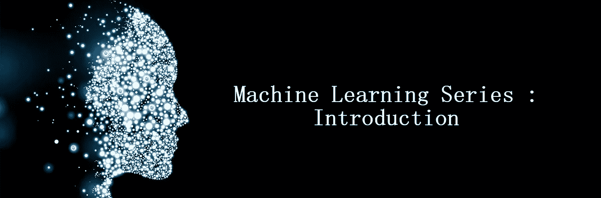
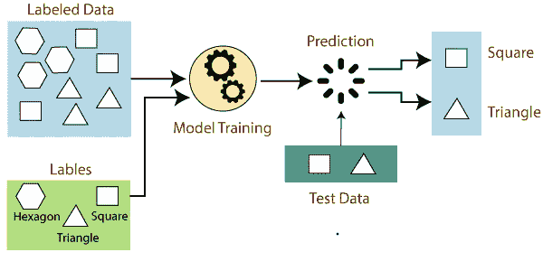
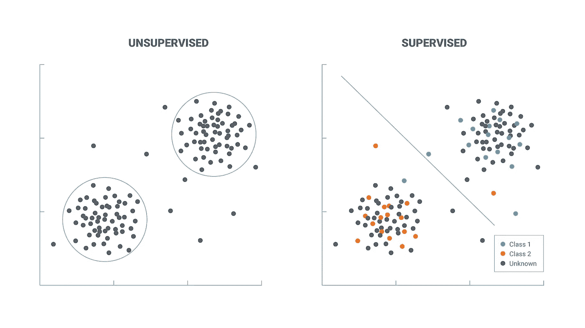
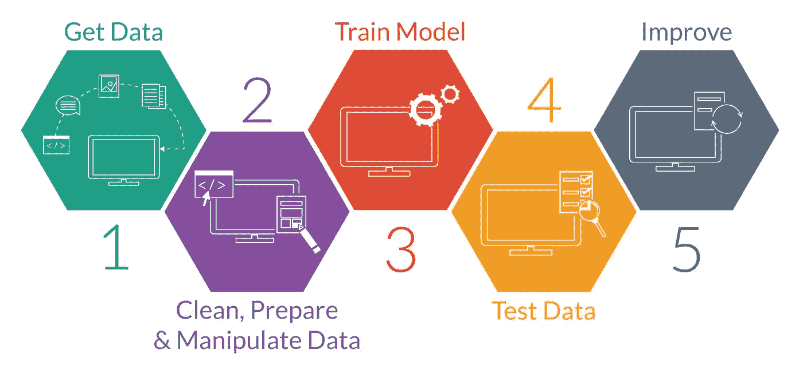

# 机器学习系列:简介

> 原文：<https://medium.com/geekculture/machine-learning-series-introduction-2483b1278891?source=collection_archive---------21----------------------->

在过去的几十年里，机器学习已经成为我们生活中如此重要的一部分，而我们甚至都不知道。几乎所有的技术领域都受到机器学习应用的影响。从广告定位到自然语言处理，再到人工智能机器人，机器学习的应用非常广泛，令人兴奋！

 [## 机器学习的应用

### 机器学习是当今技术的一个时髦词，它每天都在快速增长。我们正在使用机器…

www.javatpoint.com](https://www.javatpoint.com/applications-of-machine-learning) 

# 什么是机器学习？

我们看到，在当今这个时代，机器学习的应用无处不在。那么，机器学习到底是什么？阿瑟·塞缪尔在 1959 年对机器学习的早期定义，

> “机器学习是一个研究领域，它赋予计算机无需显式编程就能学习的能力”

机器学习真的是人工智能的一个应用。人工智能或 AI 是任何允许计算机模仿人类智能的技术。机器学习最重要的特征是学习和根据经验改进任务的能力。

如上图所示，深度学习是机器学习的子集，机器学习是人工智能的子集。在真正解释机器学习如何工作之前，我们需要首先了解知识的类型或事物是如何学习的。

## 陈述性知识

陈述性知识是个人事实的积累。一点一点地记忆事实导致知识的积累。这种学习方式的局限性在于实际观察的时间和存储这些事实的记忆。

> “知道什么”

> 例子，
> 
> 印度的首都是新德里。
> 
> 地球的重力加速度是 9.807 米/秒

## 强制性知识

命令性知识或程序性知识是从现有知识中推导出来的知识。这类知识的局限性在于它在推导过程中的准确性。它本质上是假设过去的数据可以预测未来。

> “知道怎么做”

> 例子，
> 
> 一个指令，“把松饼烤一个小时”。为了处理这个指令，系统需要预先知道各种事情，比如什么是松饼？松饼已经在烤箱里了吗？等等。

# 机器学习的基本范式

> 1)观察一组例子或训练数据。
> 
> 2)推断生成该数据的过程
> 
> 3)使用推断的知识对看不见的数据或测试数据进行预测。

这一范式类似于人类学习事物的方式。人脑感知世界，然后对感知到的信息进行处理，并根据大脑接收到的信息做出理性的决策。机器学习的上述范例中的两种类型的变体是监督学习和非监督学习。

## 监督学习

监督学习是指给机器学习模型一组特征或标签对，以找到一个规则来预测与以前看不见的输入相关联的标签。它在训练集中使用带标签的输入和输出数据。

## 无监督学习

无监督学习是当机器学习模型被给定一组没有标签的特征向量，以将它们分组到簇中或为组创建标签。

# 机器学习的历史

数百年前，人们就已经开始讨论能够思考的机器的想法。机器学习历史上的一些重大里程碑和发现是，

 [## 人工智能的历史

### 对于研究人员来说，人工智能不是一个新词，也不是一项新技术。这项技术比……

www.javatpoint.com](https://www.javatpoint.com/history-of-artificial-intelligence) 

点击以上链接，了解更多关于人工智能及其历史的信息。

> *—****1763 年发现的贝叶斯定理。***
> 
> “贝叶斯定理描述了基于可能与事件相关的条件的先验知识的事件概率。”
> 
> *—****1805 年发现的最小二乘理论。***
> 
> “这是一个统计过程，通过最小化绘制曲线上的点的偏移或残差的总和来找到一组数据点的最佳拟合”
> 
> *—****1913 年发现的马尔可夫链。***
> 
> “这是一个描述一系列可能事件的模型，其中每个事件的概率只取决于前一个事件达到的状态。”
> 
> *—****20 世纪 50 年代艾伦·图灵关于图灵测试的著作。***
> 
> *—****1957 年发现的感知机***
> 
> “这是一种线性分类器。它是一个单层神经网络。”
> 
> *—* ***最近邻算法发现于 1967 年。***
> 
> —1970 年使用反向传播来训练前馈神经网络。
> 
> *—****1982 年发现的递归神经网络。***
> 
> *—****90 年代支持向量机。***

# 机器学习过程

1.  识别手头问题的类型——这是第一步。简单的条件程序或基于规则的引擎能解决问题吗？还是需要基于一系列数据的预测？ML 处理后一种类型的问题。
2.  **收集和准备数据** —收集和准备与问题相关的数据是下一步。预测的质量取决于所收集的与问题相关的信息的质量和数量。在这个阶段，收集的数据被分成训练和测试数据集。
3.  **训练方法** —在这个阶段，根据要解决问题的性质选择一种训练方法。
4.  **训练模型** —训练模型，帮助它识别收集的数据集中的模式。在这个阶段调整内部权重，使数据的某些部分比其他部分更有优势，从而发展成更好的模型。
5.  **测试数据** —在训练之后，我们通过对照测试数据集分析模型的性能来评估我们的模型。
6.  **参数调整** —接下来是参数调整，我们将更新参数以获得更好的模型性能。
7.  **预测**—最后阶段是实际预测和检验模型的准确性。

本系列的下一部分，

 [## 机器学习系列:回归-1

### 机器学习领域的一个重要概念是回归。通过一个例子了解回归。

medium.com](/@1runx3na/machine-learning-series-regression-1-3568dafb6b22) 

参考资料:

 [## GitHub -微软/ML-初学者:12 周，25 节课，50 次测验，经典机器学习…

### 🌍环游世界，通过世界文化探索机器学习🌍Azure Cloud 倡导…

github.com](https://github.com/microsoft/ML-For-Beginners)