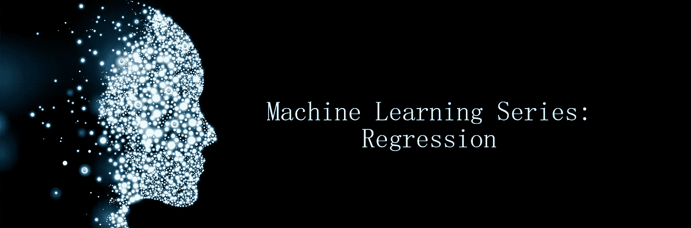
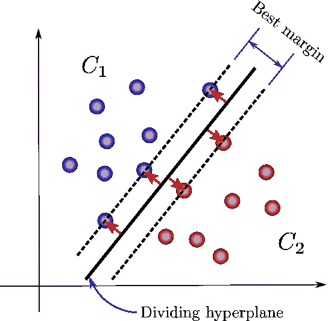
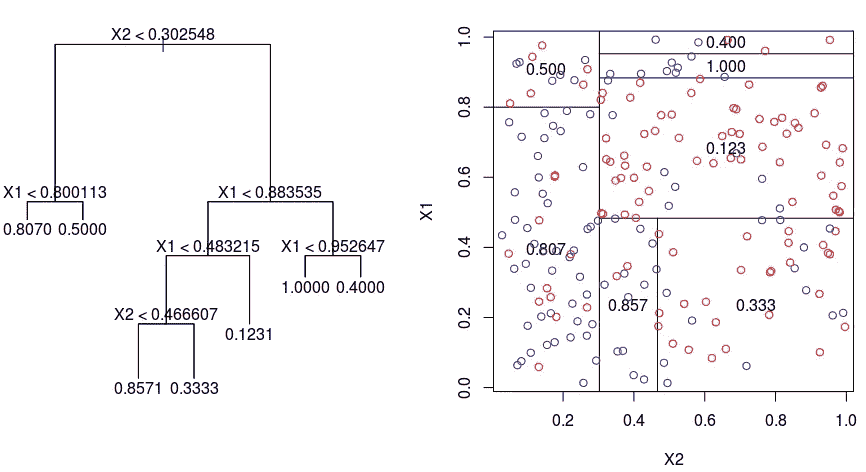

# 机器学习系列:回归-1

> 原文：<https://medium.com/geekculture/machine-learning-series-regression-1-3568dafb6b22?source=collection_archive---------9----------------------->

Series 1: Regression

机器学习领域的一个重要概念是回归。回归算法的目标是在呈现给它的数据之间绘制最佳拟合直线或曲线。它实际上是一种监督学习技术，可以通过估计一个变量如何影响另一个变量来建立变量之间的关系。要了解关于回归及其在机器学习中的使用的更多和更深入的细节，请参考此链接，

 [## 机器学习中的回归分析

### 回归分析是一种统计方法，用于模拟从属(目标)和独立…

www.javatpoint.com](https://www.javatpoint.com/regression-analysis-in-machine-learning#:~:text=Regression%20is%20a%20supervised%20learning,one%20or%20more%20predictor%20variables.) 

理解回归的概念以及如何在机器学习中使用回归的最佳方式是实际查看示例。如果你去 Scikit-Learn 的网站，你可以看到各种机器学习算法的无数例子。

 [## sci kit-学习。

### “我们使用 scikit-learn 来支持前沿基础研究[...]" "我认为这是我设计过的最棒的 ML 套装…

scikit-learn.org](https://scikit-learn.org/stable/) 

# 先决条件

在深入示例程序之前，我们需要在系统中安装以下内容，

1.  Python 3+
2.  Jupyter 笔记本
3.  sci kit-学习

我们要做的例子是由 scikit-learn 提供的。看一看，然后回来。

 [## 线性回归示例-糖尿病

### 以下示例仅使用了糖尿病数据集的第一个特征，以说明…中的数据点

scikit-learn.org](https://scikit-learn.org/stable/auto_examples/linear_model/plot_ols.html#sphx-glr-auto-examples-linear-model-plot-ols-py) 

Scikit 提供糖尿病患者的数据集。我们将确定数据集中的特征如何影响疾病的发展，并进而预测哪些患者对哪种治疗会有更好的反应。

首先，我们需要确定在我们的案例中需要使用哪种类型的回归算法。有不同类型的回归算法。

# 回归的类型

我们需要对回归算法的类型有一个基本的了解，以便理解为我们的模型选择哪一个。

> 线性回归

线性回归显示了自变量和因变量之间的线性关系。如果只有一个输入变量，那么它被称为简单线性回归。如果有一个以上的输入变量，那么它被称为多元线性回归。线性回归在寻找数值方面非常有用。

> 逻辑回归

这种类型的回归算法用于解决分类问题。它适用于 0 或 1、是或否、垃圾邮件或非垃圾邮件等分类变量。

> 多项式回归

它使用线性模型对非线性数据集进行建模。如果存在由非线性形式的数据点组成的数据集，则使用多项式回归，因为线性回归不能最好地拟合这些数据点。

> 支持向量回归

支持向量机算法可以用于回归以及分类问题。支持向量回归是一种适用于连续变量的回归算法。

> 决策树回归

这种类型的算法可用于解决分类和数字数据。它生成一个树，每个内部节点代表一个属性的“测试”，每个分支代表测试的结果，每个叶节点代表最终的决策或结果。决策树的集合导致随机森林，这是最强大的监督学习算法之一，能够执行回归和分类。

# 糖尿病示例

现在来看这个例子，糖尿病数据集包含 442 个关于糖尿病的数据样本，有 10 个特征变量。由于我们处理的是数字数据，为了简化对回归的理解，我们在模型中使用了简单的线性回归。

我们绘制的散点图显示了疾病进展与身体质量指数之间的关系，另一个散点图显示了疾病进展与血压之间的关系。您也可以尝试数据集的其他功能。

本系列的下一部分，

 [## 机器学习系列:回归-2(数据可视化)

### 数据可视化对于理解数据集的本质和需要解决的问题非常重要

medium.com](/@1runx3na/machine-learning-series-regression-2-data-visualization-ef08b4a81c05) 

参考，

 [## ML-初学者/2-回归

### 在北美，万圣节前夕，南瓜经常被雕刻成吓人的脸。让我们了解更多关于这些迷人的…

github.com](https://github.com/microsoft/ML-For-Beginners/tree/main/2-Regression)