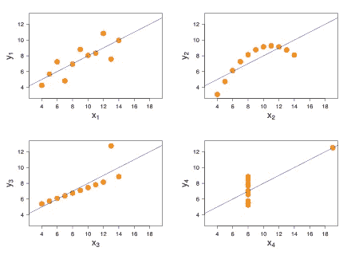
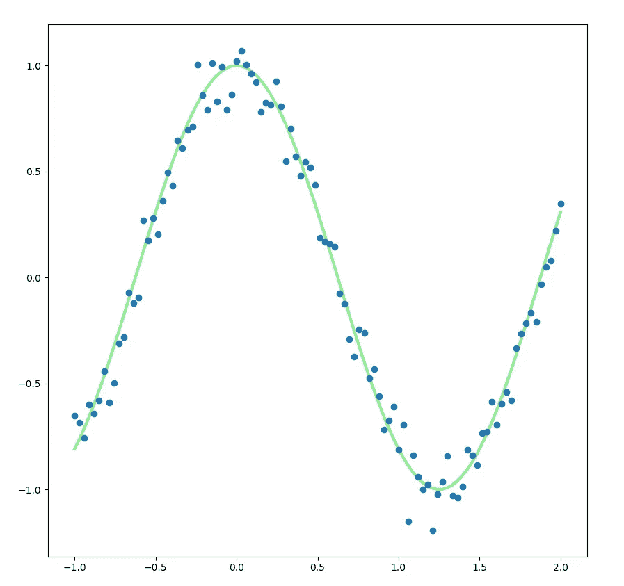

# 机器学习系列:回归-3(更多示例)

> 原文：<https://medium.com/geekculture/machine-learning-series-regression-3-more-examples-2e3f827d5e18?source=collection_archive---------19----------------------->

之前，我们学习了使用糖尿病数据集进行回归的基础知识，然后我们学习了如何使用南瓜数据集可视化数据。现在，我们更深入地研究回归算法，以加深我们的知识。

我们将集中讨论基本的线性回归和多项式回归。

# 基本线性回归

正如我们已经讨论过的，线性回归显示了自变量和因变量之间的线性关系。

在执行线性回归算法后，我们在糖尿病示例中得到的结果线称为回归线。我们需要理解的另一个概念是最小二乘回归线。

## 最小二乘回归线

它是使数据点到回归线的垂直距离尽可能小的线。术语“最小二乘法”意味着回归线周围的所有数据点都被平方，然后相加。最终的总数应该越少越好。

表示回归线(也称为最佳拟合线)的方程，

> **Y = a + bX**
> 
> 其中“Y”是因变量，“X”是自变量，“b”是直线的斜率，“a”是 Y 截距(X=0 时 Y 的值)

## 相关系数

我们需要了解的另一个术语是 X 和 y 之间的相关系数。它只是衡量两个变量之间的关系有多强的一个指标。在散点图中，如果数据点更接近回归线，则相关性较高，而高度不均匀分散的数据点相关性较低。

 [## 皮尔逊相关和线性回归

### 相关性或简单线性回归分析可以确定两个数值变量是否显著线性相关

sites.utexas.edu](http://sites.utexas.edu/sos/guided/inferential/numeric/bivariate/cor/) 

因此，好的线性回归模型将是具有高相关系数的模型。

我们将在另一个例子中看到所有这些，我们将再次使用南瓜数据集。我们将预测哪包南瓜的价格最高。

# 多项式回归

我们也已经讨论过多项式回归。在这种类型的回归中，自变量“y”和因变量“x”之间的关系被建模为“x”中的 n 次多项式。这种回归产生一条曲线来更好地拟合非线性数据。

有时关系不能仅仅用直线绘制，因此我们需要多项式回归。

同样，我们将通过同一个南瓜例子来学习多项式回归。

正如我们可以看到的，多项式回归比线性回归对我们的数据集给出了更好的准确性。我们还观察到准确性取决于相关性。相关性越高，精确度越高，反之亦然。

本系列的下一部分，

 [## 机器学习系列:回归-4(逻辑回归)

### 之前，我们学习了基本的线性回归和多项式回归。现在，我们将专注于…

medium.com](/@1runx3na/machine-learning-series-regression-4-logistic-regression-e52325042d39) 

参考，

 [## GitHub-tion x3na/ML-初学者:12 周，25 节课，50 次测验，经典机器学习…

### 🌍环游世界，通过世界文化探索机器学习🌍Azure Cloud 倡导…

github.com](https://github.com/tionx3na/ML-For-Beginners)