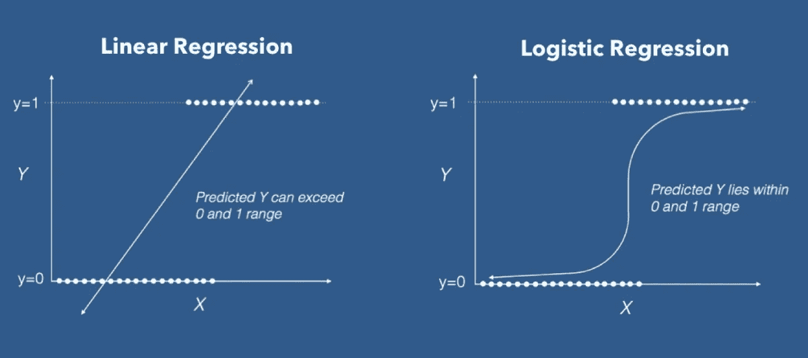

# 机器学习系列:回归-4(逻辑回归)

> 原文：<https://medium.com/geekculture/machine-learning-series-regression-4-logistic-regression-e52325042d39?source=collection_archive---------41----------------------->

之前，我们学习了基本的线性回归和多项式回归。现在，我们将集中讨论逻辑回归。

逻辑回归用于模拟某个类别或事件的概率。例如，*是不是垃圾邮件？动物是快乐的还是悲伤的？物体是硬的还是软的？*

同样，我们将通过一个例子来学习这种回归方法。我们将再次回到南瓜数据集。

# 逻辑回归

逻辑回归是在给定输入变量的情况下，对离散结果的概率进行建模的过程。它是一个分类模型，而不是回归模型。对于二元和线性分类问题，逻辑回归是一种简单且更有效的方法。它是一个分类模型，非常容易实现，并且利用线性可分的类实现了非常好的性能。

了解更多关于逻辑回归，

 [## 逻辑回归—详细概述

### 逻辑回归在二十世纪早期被用于生物科学。它后来被用于许多社会…

towardsdatascience.com](https://towardsdatascience.com/logistic-regression-detailed-overview-46c4da4303bc) 

# 逻辑回归的类型

不同类型的逻辑回归如下:

> **二元分类** —在这种逻辑回归中，目标变量或因变量只有两个可能的值。
> 
> **多项逻辑回归** —目标变量可以取三个或更多的值，但这些值没有任何明确的顺序或偏好。
> 
> **有序逻辑回归** —目标变量有三个或更多可能的值，这些值有一个顺序或偏好。

在前面的例子中，我们看到相关性越高，预测就越好。线性回归就是如此。但对于 logistic 回归来说，情况完全相反。弱相关性非常适合逻辑回归。还要注意，与线性回归相比，逻辑回归需要更清晰和更多的数据才能表现良好。

# **用于逻辑回归的南瓜数据集**

如果我们仔细观察南瓜数据集，我们会发现南瓜的‘颜色’是一个二进制数据。它不是‘橙色’就是‘白色’。给定一些变量，我们将会看到给定的南瓜是橙色还是白色。这类问题用逻辑回归更容易解决。

# 结论

我们建立了模型，预测了南瓜的颜色，并用测试集进行了测试。我们观察到我们有一个真阴性的下降量，它高于假阳性和假阴性。我们还绘制了 ROC 曲线，它在 y 轴上显示真阳性，在 x 轴上显示假阳性率。然后，我们计算了我们模型的 AUC 分数，大约为 0.697，这是我们模型的下降值。

参考，

 [## GitHub-tion x3na/ML-初学者:12 周，25 节课，50 次测验，经典机器学习…

### 🌍环游世界，通过世界文化探索机器学习🌍Azure Cloud 倡导…

github.com](https://github.com/tionx3na/ML-For-Beginners)