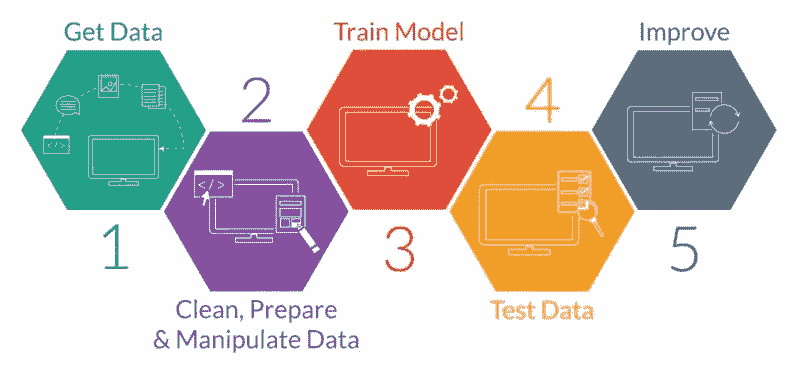
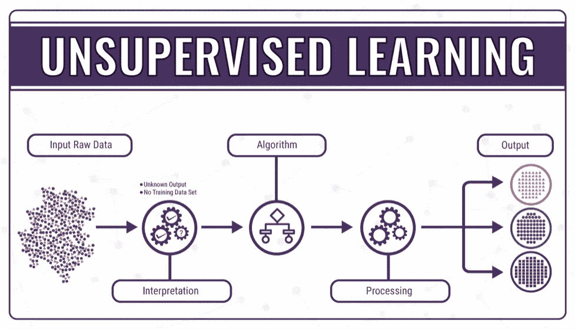
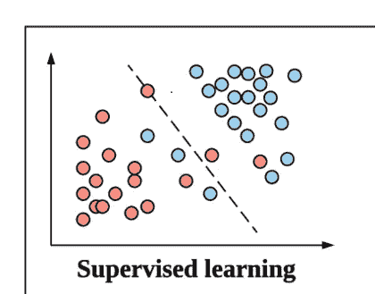
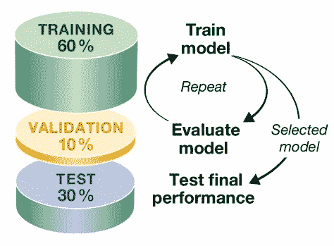
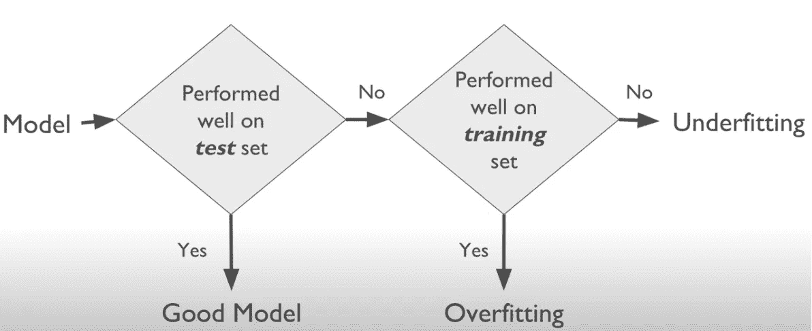

# 简化的机器学习

> 原文：<https://medium.com/geekculture/machine-learning-simplified-5f1e1960b86c?source=collection_archive---------20----------------------->

# ML 简介

那么什么是机器学习呢？嗯，如果你在互联网上查找，它会说是*算法可以从观察数据*中学习，并可以根据它做出预测。

但在现实中，这些技术通常非常简单:**我们获得一组观察数据，我们拟合一条线，然后我们可以使用这条线来进行预测**。

# **机器学习的类型**

让我们来谈谈我们所说的两种不同类型的机器学习，监督的和非监督的。

## 1.无监督学习

无监督学习的基本定义是 ***不给你的模型任何答案去学习*** 。你只是将它呈现为一组数据，而一个无人监管的**模型试图从给定的信息中理解**。

***例题***

有不同的对象；球、立方体和骰子。我有某种算法，可以根据某种相似性度量，将这些对象聚类成彼此相似的东西。

所以问题是你不一定知道算法会得出什么。这主要取决于我给它的项目间相似性的度量。但有时你会发现一些令人惊讶的集群，它们的出现出乎你的意料。

这就是无监督学习的意义所在。

## 2.监督学习

现在，相比之下，监督学习是一种情况，我们有一组*答案，模型可以从*中学习。

因此，我们给它一组训练数据，在这种情况下，模型从中学习，**它可以推断出特征**和我们想要的类别之间的关系，然后将其应用于未知的新值，并预测关于它们的信息。

***例题***

因此，我有一组已知的汽车和它们的实际售价，我根据这组完整的答案训练模型，然后我可以创建一个模型，用来预测我以前没有见过的新车的价格。

## 3.强化学习

在强化学习中，一个模型面临一个类似游戏的情况。它被各种软件和机器用来寻找在特定情况下它应该采取的最佳行为或路径。该模型对其执行的操作获得奖励或惩罚。它的目标是最大化总报酬。

由模型来决定如何执行任务以获得最大回报，从完全随机的试验开始，到复杂的策略和超人的技能结束

***例题***

为了让自动驾驶汽车行驶并遵守法律规则，程序员*无法预测道路上可能发生的一切*。程序员不用构建冗长的“如果-那么”指令，而是让强化学习代理能够从**奖励和惩罚**系统中学习。

# 评估监督学习

## 列车测试

我们可以使用一个叫做训练/测试的技巧。

如果我把我想让我的模型学习的观察数据分成两组:**一个训练集**和**一个测试集**。

我根据我称之为训练集的数据建立我的模型。

我保留了我的另一部分数据，我将使用它进行测试，然后我可以评估模型，看看它是否能成功预测我的测试数据的正确答案。

## 检测数据的原因？

它给了我一个非常具体的方法来测试我的模型在看不见的数据上有多好，因为我实际上有一点数据可以用来测试。然后，您可以使用 r 平方或均方根误差等其他指标来定量衡量它的表现。

## 成功实施培训测试的要点

*   训练和测试 ***集应该足够大*** 以包含数据中的所有变化和异常值。
*   确保 ***数据选择是随机的*** :因为在你的数据中可能有一些连续的模式。*(防止过度拟合的好方法。)*

# 列车测试的问题

## 过度拟合

因此，如果你的模型过度拟合，只是偏离了它的方式去*接受你的训练数据中的异常值。*模型学习训练数据集中的细节和噪声，以至于对模型在新数据集上的性能产生负面影响。

**过度拟合的迹象:**测试或验证数据集的误差远大于训练数据集的误差。

## 过度拟合的解决方案

1.  **交叉验证**

使用您的初始训练数据**生成多个小型训练测试分割**。在标准的 k-fold 交叉验证中，我们*将数据分成 k 个子集*，称为 folds。交叉验证允许您仅使用您的原始训练数据集来调整超参数。

2.**降低复杂性**

通过降低模型的复杂性，使其足够简单，不会过度拟合。可以实现的一些动作包括修剪决策树、减少神经网络中的参数数量以及在神经网络上使用 dropout。

## 欠拟合

它指的是既不能对训练数据集建模也不能推广到新数据集的模型。这不是一个合适的模型，而且很明显，因为它在训练数据集上的性能很差。

## 欠拟合的解决方案

1.  **增加模型复杂度**

您的模型可能不适合，仅仅是因为它不够复杂，不足以捕捉数据中的模式。使用更复杂的模型，例如从线性模型切换到非线性模型，通常有助于解决拟合不足的问题。

2.**减少正规化**

默认情况下，您使用的算法包括正则化参数，旨在防止过度拟合。有时，它们会阻止算法学习。降低它们的价值通常会有所帮助。

## 指导的一般流程图

感谢你阅读这篇文章，我希望你喜欢并且今天学到了一些新的东西。如果您有任何问题，请随时通过我的博客联系我，我将非常乐意帮助您。

保持安全和愉快的学习！

*参考文献*

 [## 混合分类和连续数据的无监督聚类

### 最近，我必须对包含连续和分类特征的数据进行聚类。标准…

www.tomasbeuzen.com](https://www.tomasbeuzen.com/post/clustering-mixed-data/)  [## 初学者从零开始理解机器学习

### 机器学习是我们现在到处都能听到的术语。当我在 2016 年 4 月开始我的 ML 之旅时…

www.houseofbots.com](https://www.houseofbots.com/news-detail/3581-4-understand-the-machine-learning-from-scratch-for-beginners)  [## 为什么无监督机器学习是网络安全的未来

### 随着我们走向更加依赖网络安全的未来，并非所有的人工智能都是平等的…

technative.io](https://technative.io/why-unsupervised-machine-learning-is-the-future-of-cybersecurity/)