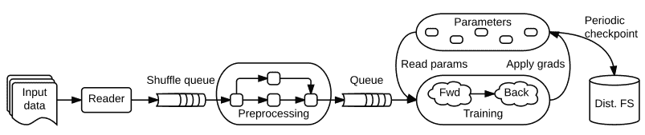
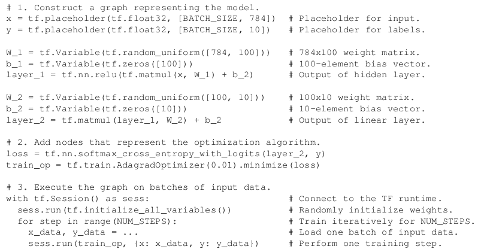
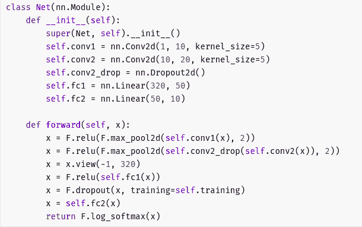
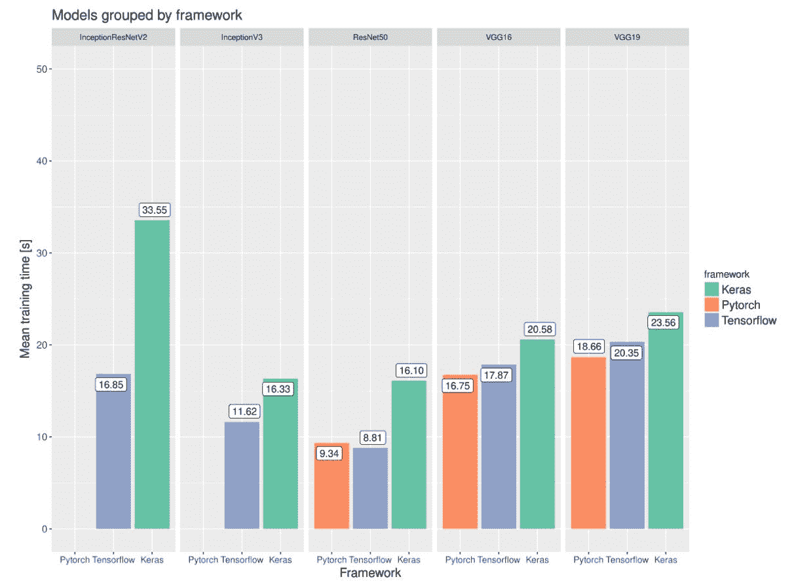
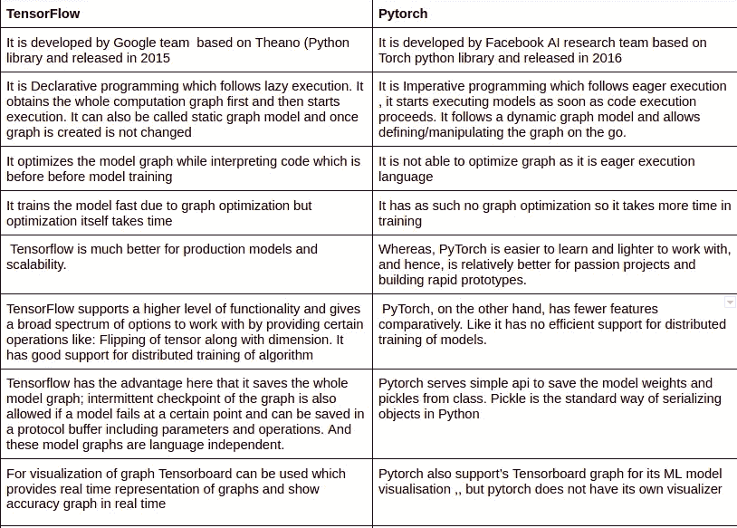
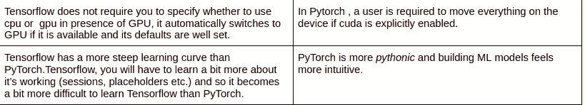
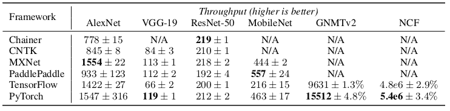
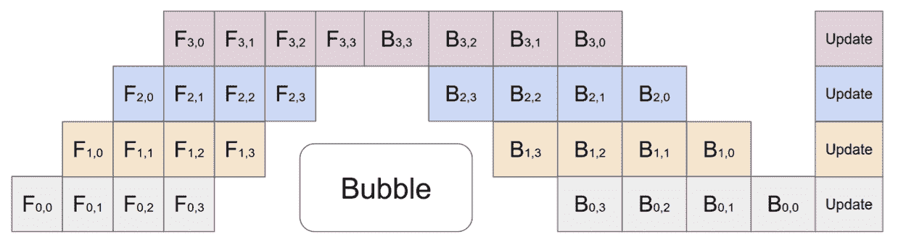
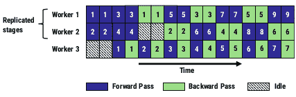
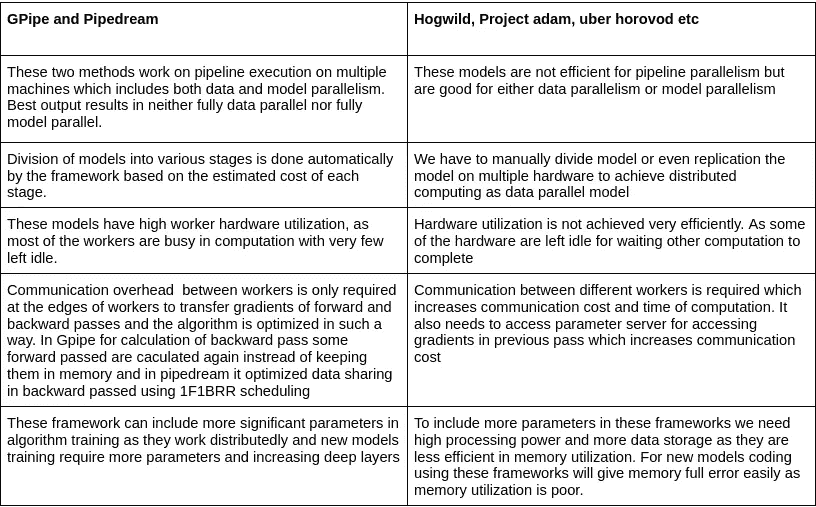

# 机器学习系统比较

> 原文：<https://medium.com/geekculture/machine-learning-systems-comparison-16e58f40926d?source=collection_archive---------38----------------------->

**概述:**

在本文中，我将揭示 Pytorch 和 Tensorflow 等传统深度学习框架与 Gpipe 和 Pipedream 等新框架的对比，这些新框架遵循管道并行，即数据并行和模型并行。本文还将解释在描述框架的优点和缺点时应该使用哪个框架。

**第一部分:**

**摘要:**

Tensorflow 和 Pytorch 是研究和生产中使用最广泛的机器学习系统，因为它们具有可扩展性、灵活性、易于理解的架构、简单的编码以及可用的大型社区基础，这有助于轻松解决问题并及时修复它们。但是这两种架构都有其局限性和优点，我们在选择它们时需要记住这些。Pytorch 是由脸书人工智能团队在 2016 年开发的，它有一个支持 C++的 python 接口。另一方面，Tensorflow 由谷歌大脑团队开发，于 2015 年发布。

**张量流系统:**

Tensorflow 是基于 Theona (Python 数学计算库)的开源库数值计算和大规模机器学习。Tensor 是库的核心框架，负责 TensorFlow 中的所有计算。张量是一个表示所有类型数据的 n 维向量或矩阵。值具有相同的数据类型，在张量中具有已知的形状。TensorFlow 使用图形框架。在训练期间，图形收集并描述所有的系列计算。

可移植性允许我们保存计算结果以供立即使用或以后使用。

A schematic TensorFlow dataflow graph for a training pipeline, containing subgraphs for reading input data,
preprocessing, training, and checkpointing state.

训练管道的示意性 TensorFlow 数据流图，包含用于读取输入数据、预处理、训练和检查点状态的子图。

优点 **:**

1.  它有用户友好的界面，如果我们熟悉 python，很容易学会
2.  Tensorboard 是一个非常棒的工具，用于可视化和监控模型图形，并查看深度学习模型如何执行
3.  它有来自谷歌工程师的强大的社区支持，并不时发布更新
4.  它还支持 Tensorflow Lite 等移动设备，从 Tensorflow 到 Tensorflow Lite 的移植非常流畅
5.  它基于惰性执行技术，即我们必须首先定义图的所有计算，然后输入数据，模型开始运行。因此，图形是在运行代码之前创建的，这允许图形级别的优化，从而加快模型的训练。
6.  Tensorfow 还支持 CUDA 库进行并行计算和模型的所有分布式训练。
7.  对于分布式模型，它有一个完善的参数服务器架构，用于存储梯度和参数，并在需要时提取它们。

缺点 **:**

1.  Tensorflow 采用了惰性执行技术，并在创建图形后对其进行了优化，因此它的代码编译速度有点慢。
2.  默认的 Tensorflow“定义并运行”模式使得调试非常困难。
3.  Tensorfow 在设备管理方面进行了精简，即使使用一个 GPU，系统仍会使用 GPU 上的所有可用内存。

Sample Tensorflow code with Python API for Handwritten text MNIST digit classification problem . Image is of size 28x28 and 10 output classes

**Pytorch:**

PyTorch 是基于 Torch 库的开源机器学习库，由脸书人工智能研究实验室(FAIR)开发。它是在修改后的 BSD 许可下发布的免费开源软件。它有两个高级功能张量计算(如 numpy 数组)与 GPU 加速和 DNN 建立在自动微分方法。它还实现了 Optim 模块，该模块已经实现了用于 ML 训练的优化算法。神经网络模块有助于定义高级计算图形。

优势:

1.  使深度神经网络模型透明的用户友好架构
2.  包含许多用于测试目的的预训练模型，并支持分布式计算。
3.  有有用的调试工具，如 PyCharm 调试器。
4.  我研究一种急切执行技术，一旦我们开始定义模型，它就开始执行，它有一个动态图形，这意味着我们可以操纵和更新代码上的图形。此功能在 RNN 的多长度输入中很有用。
5.  它支持使用数据复制训练的分布式训练。它在多个设备上复制模型，在训练过程中，每个模型副本将被提供不同的输入数据集，框架负责梯度通信以保持模型副本同步，并与梯度计算重叠以加速训练

缺点:

1.  它在训练模型时有点慢，因为它由于急切的执行过程而错过了图优化方法。
2.  它缺少用于监视和可视化的接口，例如 Tensorboard(尽管 tensor board 可以从外部连接)

Pytorch model code for mnist Dataset.

【Pytorch 和 Tensorflow 的共同特征

1.  这两个库都用于解决深度机器学习问题和大量预训练模型资源。
2.  他们都有一个很好的社区来支持它的开发和测试。
3.  在小规模服务器端部署的情况下，这两个框架都很容易包装
4.  这两个项目都有清晰的文档和大量的用户。两者都有支持者和反对者，两者都有大量的用户前来寻求建议。

【Pytorch 和 tensorflow 的区别:

结果:

Tensorfow 和 pytorch 是让开发人员的生活变得轻松的伟大工具，这完全取决于开发人员的要求，应该首选哪一个。

正如上面所讨论的，这两种工具各有利弊，而且它们背后都有一个很好的社区在工作，只是让这些框架变得更好，改进缺点，这将使比较更具挑战性，差异更不明显。

最后，它们相互影响，在淘汰过时的解决方案的同时复制最方便的解决方案。这很可能在不久的将来，这两个框架相似到无法区分的地步。

Here is a comparison of Tensorflow and Pytorch throughput on training of various known good quality models.

**第二部分:**

近年来，机器学习数据集和模型的规模一直在不断增加，这导致了模型准确性的提高，并有助于将它们部署到现实世界中。为了处理这种类型的数据和模型，硬件加速和存储空间也一直在改进，但速度较慢。因此，为了处理这些数据，我们必须寻找不同的方法，如并行性，即在不同的机器上训练机器学习模型。有一些小的模式，不太复杂，可以很容易地在并行设置中训练，但现实世界的应用并不那么简单。我们需要在不同的并行机器之间进行适当的同步，这是一个昂贵的操作和性能下降的瓶颈。

**GPipe:**

为了克服这个问题，Google Brain 团队提出了这个并行机器学习架构 GPipe。它在多个硬件上训练大型模型，首先划分模式，性能提高近 1:1，论文显示在 4 倍硬件上处理能力提高 3.5 倍。

Gpipe 的优势:

1.  Gpipe 有助于 ML 模型包含更多的模型参数，从而获得更好的训练结果。AmoebaNet 是 2017 年 image net 的获胜者，它的扩展版本是由谷歌团队使用 Gpipe 创建的，它包括更大的图像(480 x 480)大小，并在 ImageNet，CIFAR-10，CIFAR-10 和其他计算机视觉指标上取得了最先进的结果。
2.  Gpipe 自动分析 tensorflow 模型，并将模型和训练数据分配给多个可用的硬件设备，并应用反向传播技术。

建筑:

GPipe 采用流水线结构，即模型并行和数据并行。它通过改进以前的流水线模型来增强该模型:自动并行和设备内存优化。

1.  自动并行

Gpipe 在输入中接收机器学习模型、小批量和可用硬件设备的数量。然后，它将各层划分为不同的阶段，并将小批量划分为微批量。这里将模型分为 K 个阶段，每个阶段的代价通过其激活函数和训练数据内容来估计。为了计算成本，它在模型中运行少量数据，给出每个阶段的估计成本，并在每个层的帮助下，将成本模型分成 K 个阶段，保持每个阶段的成本与其他阶段相等，并相应地进行划分。

1.  设备内存优化

在神经网络中计算反向传递时，将首先计算正向传递激活。因此，如果我们在神经网络中有一个 N 大小和 L 层的微批，在完成正向传递之后，我们需要在我们的存储器中有一个 O(N×L)激活存储。因此，Gpipe 优化了内存使用，它不是在最终前向传递中保持 N x 1 个激活，而是仅保持最终层的 N 个激活，并且当它从最后一层开始反向传播时，前向传递结果被重新计算并保存在内存中。在计算单个样本的反向通过后，激活被丢弃，并为下一个样本的反向通过重新计算。这种方法在设备存储器中一次只保存一组激活，这为其提供了用于 O(N)次前向传递计算的存储空间。

The above image shows the GPipe model and how sequential layers are divided into parallel layers. Here the model is divided into 4 layer and mini batch size in 4 micro batches so that all layers are utilized fully. Fi,k is the forward computation of ith model layer and kth micro batch. And Bi,k is a backward computation of ith model layer and kth micro batch. To calculate Bi,k we need Bi+1,k and immediate activation Fi,k. So we can see that there is high utilization of resources with very less left out bubble space available.

**微软 pieddream:**

Pipedream 是微软针对分布式机器学习算法训练的解决方案。它使用管道并行化来并行化模型，这意味着数据和模型并行化。数据被分成小批，然后输入分布式模型。

型号描述:

模型首先根据可用 GPU 硬件设备的数量分成相等的部分。这里相等部分意味着每个计算和激活函数的成本相等。成本的计算方法是在模型中输入少量数据，然后计算每个阶段的成本。

向后和向前都在每个阶段传递计算。在每一遍中，多个小批量被一个接一个地送入并行模型，使 GPU 模型保持忙碌。

在到达最后一级之后，梯度异步地逐级反向传播

它使用一个向前一个向后的循环调度，提高了 GPU 的利用率。

模型阶段在不同交替之间的向后和向前传递之间交替。

1F1B 减少了流水线停顿和可忽略的算法刷新时间。

本文在不同阶段使用 1F1B 循环调度，使得特定的小批量梯度向后传递，计算准确。Pipedream 定期检查点模型参数以处理容错。PipeDream 需要较少的工作节点之间的通信，因为流水线执行中的每个工作节点只需要将梯度和输出激活的子集仅传送给一个单独的其他工作节点。此外，PipeDream 将计算和通信分离开来，从而实现更简单的并行处理。

An example PipeDream pipeline with 3 workers and 2 stages. We assume that forward and backward passes in the first stage take two time units, while forward and backward passes in the second stage take only a single time unit. The first stage in this pipeline is replicated twice so that each stage sustains roughly the same throughput. It shows great utilization of hardware workers as Idle time is very less left.

**第三部分:不同机器学习系统的比较。**

我们将把非常规模型 GPipe 和 Pipe dream 与下述模型进行比较:

1.  疯狂的
2.  优步·霍罗沃德
3.  参数服务器架构
4.  不信任
5.  亚当项目
6.  佩图姆

**参考文献:**

1.  [https://towards data science . com/explained-gpipe-training-giant-neural-nets-using-pipeline-parallelism-341 b 63 bfc 74 b](https://towardsdatascience.com/explained-gpipe-training-giant-neural-nets-using-pipeline-parallelism-341b63bfc74b)
2.  PyTorch:命令式的高性能深度学习库。
3.  TensorFlow:大规模机器学习系统。
4.  PipeDream:用于 DNN 训练的通用流水线并行技术。
5.  GPipe:通过微批处理流水线并行实现轻松扩展。
6.  https://www.geeksforgeeks.org/pytorch-v-s-tensorflow/