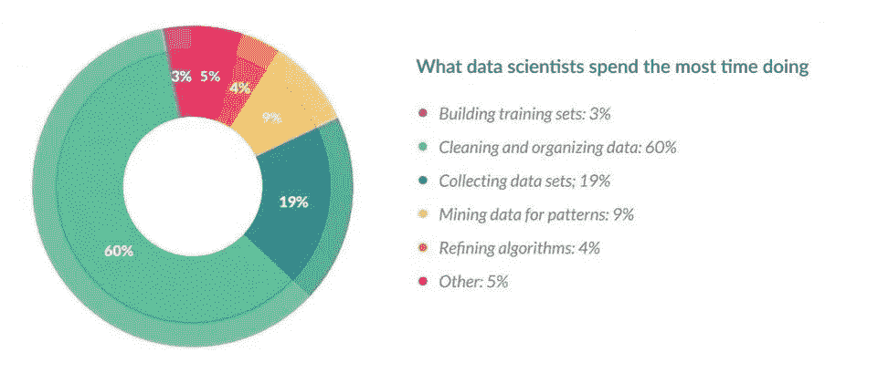
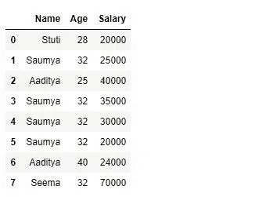
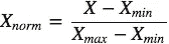
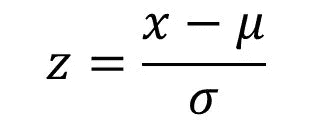
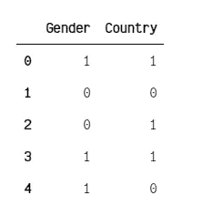
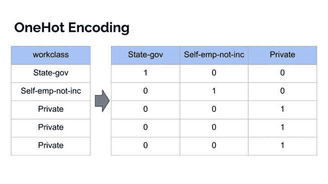
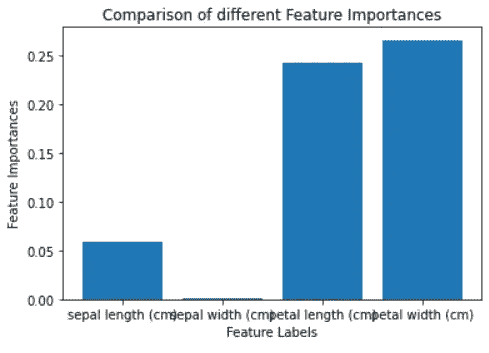

# 机器学习教程—面向初学者的特征工程和特征选择

> 原文：<https://medium.com/geekculture/machine-learning-tutorial-feature-engineering-and-feature-selection-for-beginners-dd15b9d354?source=collection_archive---------8----------------------->


他们说**数据**是新的**石油**，但是我们并不直接使用其来源的石油。在我们将它用于不同目的之前，它必须经过处理和清洗。
这同样适用于数据，我们不直接从它的来源使用它。它也必须被处理。


Oil industry

对于机器学习和数据科学的初学者来说，这可能是一个挑战，因为数据来自不同的来源，具有不同的数据类型。因此，您不能对不同类型的数据应用相同的清理和处理方法。

> *“可以从数据中提取信息，就像可以从石油中提取能量一样。”-* [*阿德奥拉*](/@adeolaadesina)

你必须根据你所掌握的数据来学习和运用方法。然后你可以从中获得洞察力，或者用它来进行机器学习或者深度学习算法的训练。

看完这篇文章，你会知道:

*   什么是特征工程和特征选择。
*   处理数据集中缺失数据的不同方法。
*   处理连续特征的不同方法。
*   处理分类特征的不同方法。
*   不同的特征选择方法。

让我们开始吧。🚀

# 什么是特征工程？

特征工程是指在使用机器学习创建**预测模型**时，在您的数据集中选择并**转换**变量/特征的过程。

因此，在用机器学习算法训练数据之前，您必须从您收集的**原始数据集**中提取特征。
否则，很难获得对数据的深刻见解。

> *拷问数据，它什么都会招供。—罗纳德·科斯*

特征工程有两个目标:

*   准备适当的输入数据集，与机器学习算法要求兼容。
*   提高机器学习模型的**性能**。



CrowdFlower Survey

根据 CrowdFlower 对 80 名数据科学家的调查，数据科学家花费 **60%** 的时间清理和组织数据。这就是为什么拥有特征工程和选择的技能是非常重要的。

> *“归根结底，有些机器学习项目成功了，有些失败了。有什么区别？轻松最重要的因素是*的**特性**的使用华盛顿大学的 Pedro Domingos 教授

可以从以下链接阅读他的论文:[《关于机器学习需要知道的几件有用的事情](https://homes.cs.washington.edu/~pedrod/papers/cacm12.pdf)》。

既然您知道了为什么需要学习不同的特征工程技术，那么让我们从学习处理缺失数据的不同方法开始。

# 如何处理丢失的数据

处理缺失数据非常重要，因为许多机器学习算法不支持具有缺失值的数据。如果数据集中有缺失值，可能会导致一些机器学习算法出错和性能下降。

以下是您可以在数据集中找到的常见缺失值列表。

*   不适用的
*   空
*   空的
*   ?
*   没有人
*   空的
*   -
*   圆盘烤饼

让我们学习不同的方法来解决缺失数据的问题。

# 变量删除

变量删除包括根据具体情况删除缺少值的变量(列)。当变量中有很多缺失值，并且变量相对不太重要时，这种方法是有意义的。

唯一值得删除变量的情况是当它的缺失值超过观察值的 60%时。

```
# import packages
import numpy as np 
import pandas as pd 

# read dataset 
data = pd.read_csv('path/to/data')

#set threshold
threshold = 0.7

# dropping columns with missing value rate higher than threshold
data = data[data.columns[data.isnull().mean() < threshold]]
```

在上面的代码片段中，你可以看到我如何使用 NumPy 和 pandas 来加载数据集，并将阈值设置为 **0.7** 。这意味着任何缺失值超过观察值的 **70%** 的列都将从数据集中删除。

我建议您根据数据集的大小来设置阈值。

# 均值或中位数插补

另一种常见的技术是使用非缺失观测值的平均值或中值。此策略可应用于具有数值数据的要素。

```
# filling missing values with medians of the columns
data = data.fillna(data.median())
```

在上面的例子中，我们使用**中值方法**来填充数据集中缺失的值。

# 最常见的值

该方法用列/特征中的**最大出现值**替换缺失值。这是处理**分类**列/特性的一个好选择。

```
# filling missing values with medians of the columns
data['column_name'].fillna(data['column_name'].value_counts().idxmax(). inplace=True)
```

这里我们使用 pandas 的 **value_counts()** 方法来计算列中每个唯一值的出现次数，然后用最常见的值填充缺失的值。

# 如何处理连续特征

数据集中的连续要素具有不同的值范围。连续特征的常见例子有年龄、工资、价格和身高。

在训练机器学习算法之前，处理数据集中的连续特征非常重要。如果您使用不同范围的值来训练模型，模型将不会很好地执行。

当我说不同范围的值时，我指的是什么？假设您有一个数据集，它有两个连续的特征，**年龄，**和**薪水**。年龄的范围和薪水的范围是不同的，这可能会引起问题。



以下是处理连续特征的一些常用方法:

# 最小-最大归一化

对于要素中的每个值，最小-最大归一化会减去要素中的最小值，然后除以其范围。该范围是原始最大值和原始最小值之间的差值。



最后，它缩放在 **0** 和 **1 之间的固定范围内的所有值。**

您可以使用 Scikit-learn 中的[**minmax scaler**](https://scikit-learn.org/stable/modules/generated/sklearn.preprocessing.MinMaxScaler.html)**方法，通过将每个要素缩放到给定范围来变换要素:**

```
from sklearn.preprocessing import MinMaxScaler
import numpy as np

# 4 samples/observations and 2 variables/features
data = np.array([[4, 6], [11, 34], [10, 17], [1, 5]])

# create scaler method
scaler = MinMaxScaler(feature_range=(0,1))

# fit and transform the data
scaled_data = scaler.fit_transform(data)

print(scaled_data)

# [[0.3        0.03448276]
#  [1\.         1\.        ] 
#  [0.9        0.4137931 ] 
#  [0\.         0\.        ]]
```

**如你所见，我们的数据已经被转换，范围在 **0** 和 **1** 之间。**

# **标准化**

**标准化确保每个特征都有一个平均值 **0** 和一个标准偏差 **1** ，使所有特征达到相同的量级。**

**如果特征的标准偏差是 ***不同*** ，它们的范围也会不同。**

****

**x = observation, μ = mean , σ = standard deviation**

**您可以使用 Scikit-learn 中的[**standard scaler**](https://scikit-learn.org/stable/modules/generated/sklearn.preprocessing.StandardScaler.html#sklearn.preprocessing.StandardScaler)方法，通过移除平均值并缩放至标准偏差 **1** 来标准化特征:**

```
from sklearn.preprocessing import StandardScaler
import numpy as np

# 4 samples/observations and 2 variables/features
data = np.array([[4, 1], [11, 1], [10, 4], [1, 11]])

# create scaler method 
scaler = StandardScaler()

# fit and transform the data
scaled_data = scaler.fit_transform(data)

print(scaled_data)

# [[-0.60192927 -0.79558708]
#  [ 1.08347268 -0.79558708] 
#  [ 0.84270097 -0.06119901] 
#  [-1.32424438  1.65237317]]
```

**让我们验证每个特征(列)的平均值是 **0** :**

```
print(scaled_data.mean(axis=0))
```

**`[0\. 0.]`**

**并且每个特征(列)的标准偏差是 **1** :**

```
print(scaled_data.std(axis=0))
```

**`[1\. 1.]`**

# **如何处理分类特征**

**分类特征表示可以分组的数据类型。比如性别，受教育程度。**

**任何非数字值都需要*转换*为整数或浮点数，以便在大多数机器学习库中使用。**

**处理分类特征的常用方法有:**

# **标签编码**

**标签编码只是将一列中的每个分类值转换成一个数字。**

**建议使用标签编码将其转换为二进制变量。**

**在以下示例中，您将学习如何使用 Scikit-learn 中的 [**LableEncoder**](https://scikit-learn.org/stable/modules/generated/sklearn.preprocessing.LabelEncoder.html) 将分类值转换为二进制:**

```
# import packages
import numpy as np 
import pandas as pd 
from sklearn.preprocessing import LabelEncoder

# intialise data of lists.
data = {'Gender':['male', 'female', 'female', 'male','male'],
        'Country':['Tanzania','Kenya', 'Tanzania', 'Tanzania','Kenya']}

# Create DataFrame
data = pd.DataFrame(data)

# create label encoder object
le = LabelEncoder()

data['Gender']= le.fit_transform(data['Gender'])
data['Country']= le.fit_transform(data['Country'])

print(data)
```

****

**Transformed Data**

# **一次热编码**

**到目前为止，表示分类变量最常见的方法是使用一键编码，或 N 选 1 编码方法，也称为哑变量。**

**虚拟变量背后的思想是用一个或多个值为 0 和 1 的新特征替换分类变量。**

****

**在下面的例子中，我们将使用 Scikit-learn 库中的编码器。 [**LabelEncoder**](https://scikit-learn.org/stable/modules/generated/sklearn.preprocessing.LabelEncoder.html) 将帮助我们从数据中创建标签的整数编码，而 [**OneHotEncoder**](https://scikit-learn.org/stable/modules/generated/sklearn.preprocessing.OneHotEncoder.html) 将创建整数编码值的一次性编码。**

```
# import packages 
import numpy as np 
from sklearn.preprocessing import OneHotEncoder, LabelEncoder

# define example
data = np.array(['cold', 'cold', 'warm', 'cold', 'hot', 'hot', 'warm', 'cold', 'warm', 'hot'])

# integer encode
label_encoder = LabelEncoder()

#fit and transform the data
integer_encoded = label_encoder.fit_transform(data)
print(integer_encoded)

# one-hot encode
onehot_encoder = OneHotEncoder(sparse=False)

#reshape the data
integer_encoded = integer_encoded.reshape(len(integer_encoded), 1)

#fit and transform the data
onehot_encoded = onehot_encoder.fit_transform(integer_encoded)

print(onehot_encoded)
```

**这是 **LabelEncoder** 方法对 **integer_encoded** 的输出:**

**`[0 0 2 0 1 1 2 0 2 1]`**

**这是**onehotencoded**通过 **OneHotEncoder** 方法的输出:**

```
[[1\. 0\. 0.] 
 [1\. 0\. 0.] 
 [0\. 0\. 1.] 
 [1\. 0\. 0.] 
 [0\. 1\. 0.] 
 [0\. 1\. 0.] 
 [0\. 0\. 1.] 
 [1\. 0\. 0.] 
 [0\. 0\. 1.] 
 [0\. 1\. 0.]]
```

# **什么是特征选择？**

**要素选择是自动或手动选择对预测变量或输出贡献最大的要素的过程。**

****

**数据中存在不相关的特征会降低机器学习模型的准确性。**

**使用特征选择的主要原因是:**

*   **它使机器学习算法能够更快地训练。**
*   **它降低了模型的复杂性，使其更容易解释。**
*   **如果选择了正确的子集，就可以提高模型的准确性。**
*   **它减少了过度拟合。**

> ***“我通过选择所有特征准备了一个模型，我得到了大约****65%****的准确度，这对于预测模型来说不是很好，在做了一些特征选择和特征工程后，没有对我的模型代码做任何逻辑更改，我的准确度跃升到了***81%*，这非常令人印象深刻”——作者 Raheel Shaikh*****

***特征选择的常用方法有:***

# ***单变量选择***

***统计测试有助于选择与数据集中的目标要素关系最密切的独立要素。比如卡方检验。***

***Scikit-learn 库提供了 [**SelectKBest**](https://scikit-learn.org/stable/modules/generated/sklearn.feature_selection.SelectKBest.html) 类，该类可用于一套不同的统计测试，以选择特定数量的特性。***

***在下面的例子中，我们使用带有卡氏检验的 **SelectKBest** 类来寻找虹膜数据集的最佳特征:***

```
*# Load packages
from sklearn.datasets import load_iris
from sklearn.feature_selection import SelectKBest
from sklearn.feature_selection import chi2

# Load iris data
iris_dataset = load_iris()

# Create features and target
X = iris_dataset.data
y = iris_dataset.target

# Convert to categorical data by converting data to integers
X = X.astype(int)

# Two features with highest chi-squared statistics are selected
chi2_features = SelectKBest(chi2, k = 2)
X_kbest_features = chi2_features.fit_transform(X, y)

# Reduced features
print('Original feature number:', X.shape[1])
print('Reduced feature number:', X_kbest_features.shape[1])*
```

***原始特征号:4
减少的特征号:2***

***如您所见，卡方检验帮助我们从最初的 4 个特征中选择出与目标特征关系最密切的两个重要的独立特征。***

***你可以在这里了解更多关于卡方检验的信息:[“机器学习卡方检验的温和介绍](https://machinelearningmastery.com/chi-squared-test-for-machine-learning/)”。***

# ***特征重要性***

***要素重要性为数据的每个要素提供了一个分数。分数越高，**越重要**或**相关**该功能对你的目标功能越重要。***

***特征重要性是一个内置类，带有基于树的分类器，例如:***

*   ***随机森林分类器***
*   ***额外树分类器***

***在下面的例子中，我们将把额外的树分类器训练到 iris 数据集中，并使用内置的类**。feature_importances_** 计算每个特性的重要性:***

```
*# Load libraries
from sklearn.datasets import load_iris
import matplotlib.pyplot as plt
from sklearn.ensemble import ExtraTreesClassifier

# Load iris data
iris_dataset = load_iris()

# Create features and target
X = iris_dataset.data
y = iris_dataset.target

# Convert to categorical data by converting data to integers
X = X.astype(int)

 # Building the model
extra_tree_forest = ExtraTreesClassifier(n_estimators = 5,
                                        criterion ='entropy', max_features = 2)

# Training the model
extra_tree_forest.fit(X, y)

# Computing the importance of each feature
feature_importance = extra_tree_forest.feature_importances_

# Normalizing the individual importances
feature_importance_normalized = np.std([tree.feature_importances_ for tree in 
                                        extra_tree_forest.estimators_],
                                        axis = 0)

# Plotting a Bar Graph to compare the models
plt.bar(iris_dataset.feature_names, feature_importance_normalized)
plt.xlabel('Feature Labels')
plt.ylabel('Feature Importances')
plt.title('Comparison of different Feature Importances')
plt.show()*
```

******

***Important features***

***上图显示最重要的特征是*和 ***花瓣宽度(cm)*** ，最不重要的特征是 ***萼片宽度(cms)*** 。这意味着您可以使用最重要的功能来训练您的模型并获得最佳性能。****

# ****相关矩阵热图****

****相关性显示了特征之间或与目标特征之间的关系。****

****相关性可以是正的(增加一个特征值会增加目标变量的值)，也可以是负的(增加一个特征值会减少目标变量的值)。****

****在以下示例中，我们将使用 Scikit-learn 库中的 Boston house prices 数据集和 pandas 中的[**corr()**](https://pandas.pydata.org/pandas-docs/stable/reference/api/pandas.DataFrame.corr.html)**方法来查找 dataframe 中所有要素的成对相关性:******

```
****# Load libraries
from sklearn.datasets import load_boston
import matplotlib.pyplot as plt
import seaborn as sns

# load boston data
boston_dataset = load_boston()

# create a daframe for boston data
boston = pd.DataFrame(boston_dataset.data, columns=boston_dataset.feature_names)

# Convert to categorical data by converting data to integers
#X = X.astype(int)

#ploting the heatmap for correlation
ax = sns.heatmap(boston.corr().round(2), annot=True)****
```

************

******相关系数范围从-1 到 1。如果该值接近 1，则意味着这两个特征之间有很强的正相关性。当接近-1 时，特征具有很强的负相关性。******

******在上图中，可以看到**税**和 **RAD** 特征具有 s *trong 正相关*而 **DIS** 和 **NOX** 特征具有*强负相关。*******

******如果您发现数据集中有一些相互关联的要素，这意味着它们传达了相同的信息。建议去掉其中一个。******

******你可以在这里阅读更多关于这方面的内容:[在监督学习中，为什么有关联的特征是不好的？](https://datascience.stackexchange.com/questions/24452/in-supervised-learning-why-is-it-bad-to-have-correlated-features)******

# ******结论******

******我在本文中解释的方法将帮助您准备大部分的**结构化数据集**。但是如果您正在处理非结构化数据集，比如图像、文本和音频，您将不得不学习本文中没有解释的不同方法。******

******以下文章将帮助您了解如何为机器学习项目准备图像或文本数据集:******

*   ******[为 CNN 准备和扩充图像数据的最佳实践——杰森·布朗利](https://machinelearningmastery.com/best-practices-for-preparing-and-augmenting-image-data-for-convolutional-neural-networks/)******
*   ******[图像预处理——卡努玛王子](https://towardsdatascience.com/image-pre-processing-c1aec0be3edf)******
*   ******[NLP 文本预处理:实用指南和模板——翁家豪](https://towardsdatascience.com/nlp-text-preprocessing-a-practical-guide-and-template-d80874676e79)******
*   ******[如何使用 Texthero 为您的 NLP 项目准备基于文本的数据集——Davis David](https://www.freecodecamp.org/news/how-to-work-and-understand-text-based-dataset-with-texthero/)******

********恭喜**👏👏**，**你已经熬到这篇文章的结尾了！我希望你学到了一些新的东西，对你的下一个机器学习或数据科学项目有所帮助。******

******如果你学到了新的东西或者喜欢阅读这篇文章，请分享给其他人看。在那之前，下期帖子再见！******

******你也可以在 Twitter 上找到我 [@Davis_McDavid](https://twitter.com/Davis_McDavid) 。******

******本文首发于 [Freecodecamp。](https://www.freecodecamp.org/news/feature-engineering-and-feature-selection-for-beginners/)******