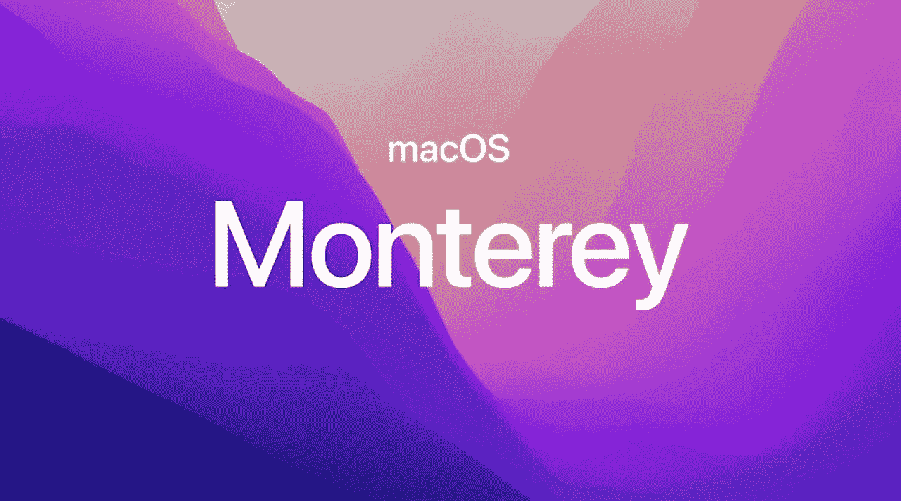
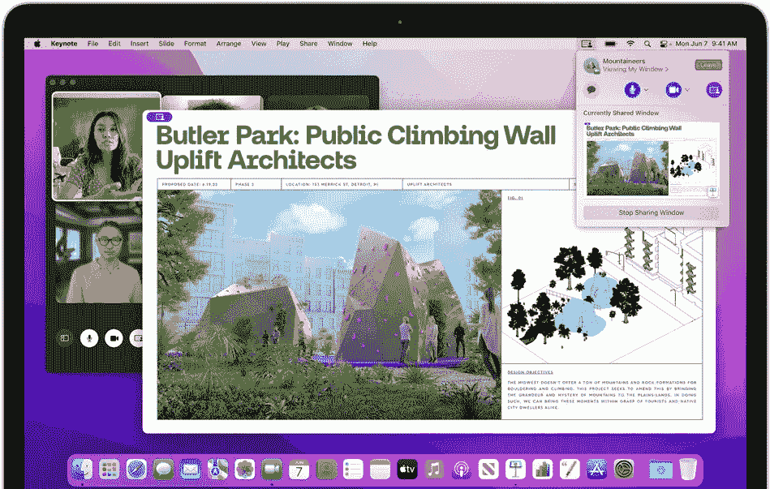
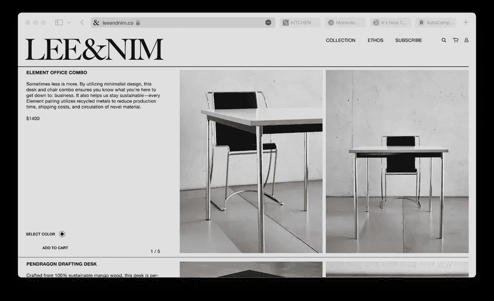
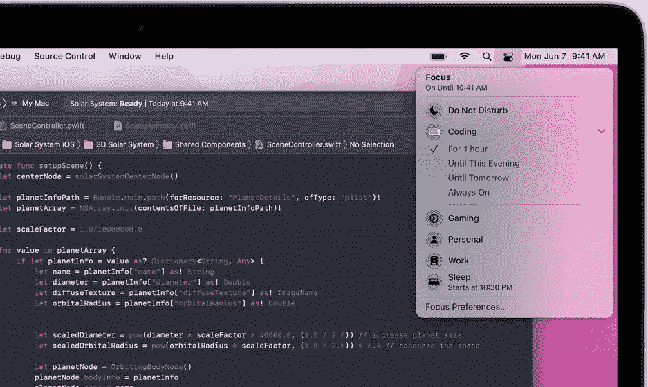
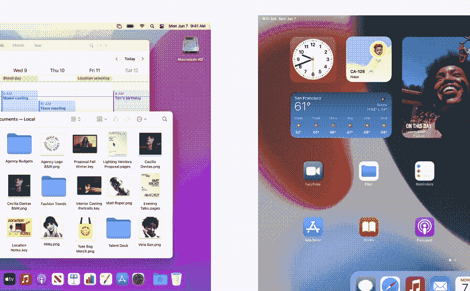

# 马科斯·蒙特里:有什么新消息？

> 原文：<https://medium.com/geekculture/macos-monterey-whats-new-705edc62d546?source=collection_archive---------64----------------------->

## 让我们深入到 macOS Monterey 的新版本。

image from appleinsider.com

WWDC 21 日发布了 macOS 的新版本，macOS 12 或 macOS Monterey。大苏尔的继任者更大程度上更新了 FaceTime、Messages、Safari。让 FaceTime 更像它的竞争对手，Messages 现在与你分享，Safari 现在有了标签组和重新设计的侧边栏。

# 用户界面更改

UI 与 Big Sur 基本相同，但在菜单栏上有一些变化。

image from apple.com

# FaceTime

蒙特雷最新的部分是 FaceTime。FaceTime 现在有空间音频，可以创建一个声场，帮助对话像面对面一样容易流动。您朋友的声音被分散开来，听起来就像来自他们在通话中所处的方向。FaceTime update 还包括网格视图、纵向视图、语音隔离模式、通过链接加入 FaceTime 通话的能力、在浏览器中加入 FaceTime 通话以及屏幕共享。

image from apple.com

# 信息

消息也与你分享。这给用户带来了内容(图像、链接等)的好处。)在“信息”中与您分享的内容也可以在其他应用程序中查看，例如，如果我的朋友分享了一个新闻博客的链接，它也会显示在新闻应用程序的“与您分享”部分中。

image from apple.com

# 旅行队

Safari 现在有一个简化的标签栏、集成的智能搜索栏、重新设计的更圆润的标签、标签组和重新设计的侧栏。Safari 现在看起来好多了！

image from apple.com

# 焦点

专注地将您的设备与您的心态相匹配。根据您当前的操作自动过滤通知。打开“请勿打扰”以关闭一切，或者从工作、个人时间、睡眠、健身、游戏、阅读或驾驶的建议焦点中进行选择。你也可以自己创造。

image from apple.com

# 通用控制

现在有了万能控制，你可以在 Mac 和键盘上同时使用鼠标或键盘。您可以在设备之间拖放内容，现在通用控制最多可以支持三个设备。

video from apple.com converted to GIF

# 快捷指令

基本上，快捷方式是 Automator 的新替代品，但它有一个更友好的用户界面，不适合开发人员。

image from apple.com

# 兼容 macOS Monterey 的设备

*   2016 年或之后的 MacBook 机型
*   2015 年或之后的 MacBook Air 机型
*   2015 年或之后的 MacBook Pro 机型
*   2014 年秋季或之后的 Mac mini 机型
*   2015 年秋季或之后的 iMac 机型
*   iMac Pro(所有型号)
*   2013 年或更高版本的 Mac Pro 机型

# 结论

所以你有它！这些都是 macOS Monterey 的重大更新。要了解更多关于新更新的信息，请点击这里。

# 愿原力与你同在！