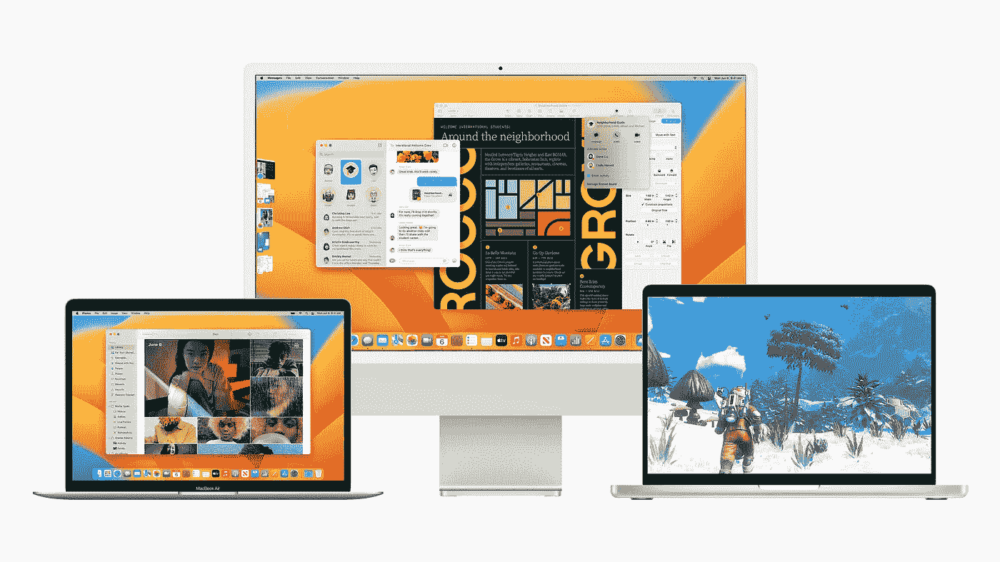

# MAC OS Ventura:OS 13 有什么新功能

> 原文：<https://medium.com/geekculture/macos-ventura-whats-new-in-os-13-5fb93f791456?source=collection_archive---------0----------------------->

## 文图拉正式命名为 macOS 13

> “macOS Ventura 包括强大的功能和新的创新，有助于使 Mac 体验更好。”—克雷格·费德里吉

苹果的 macOS 在几年内有了一些巨大的变化，在大苏尔进行了全面的设计革新。苹果还是…