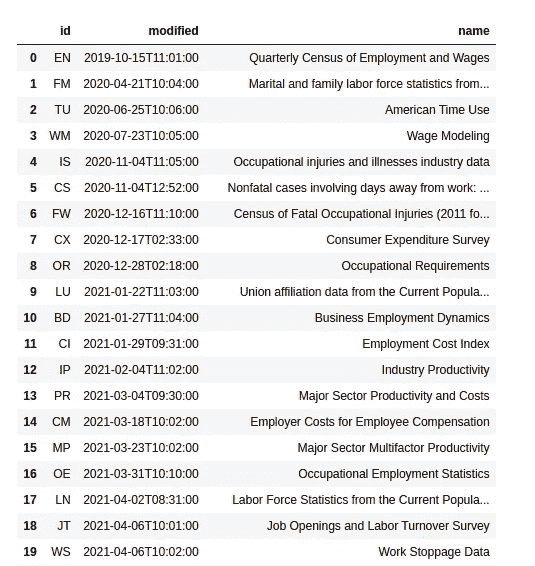
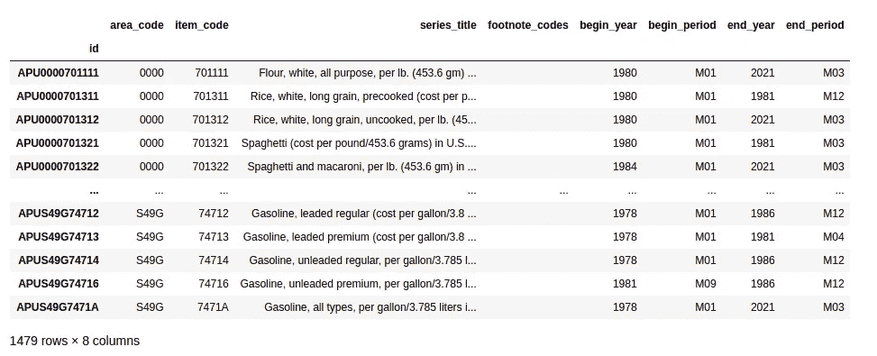
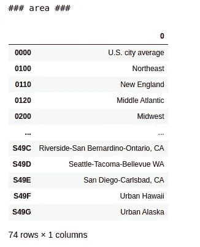
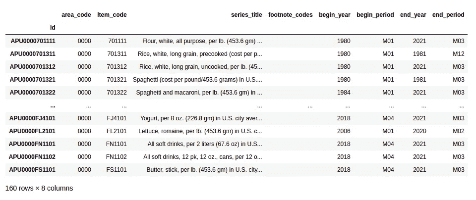
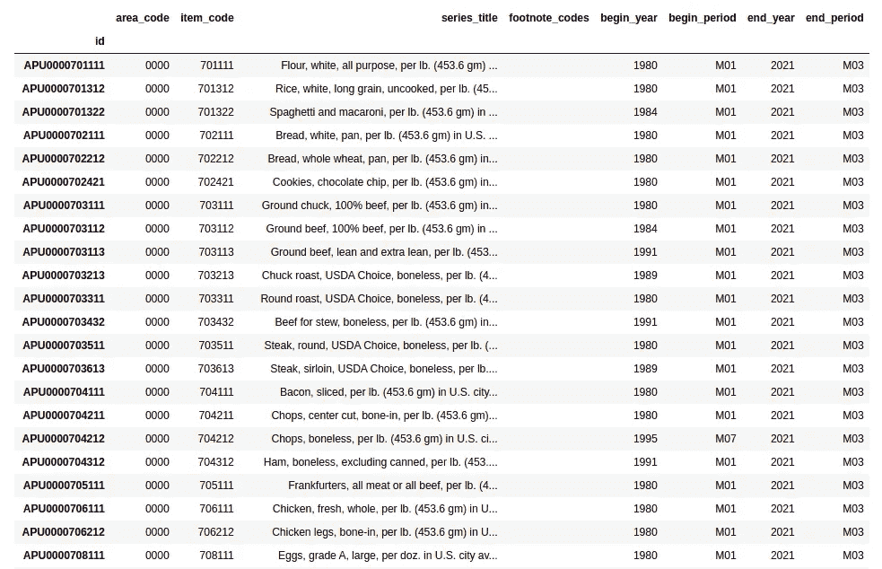
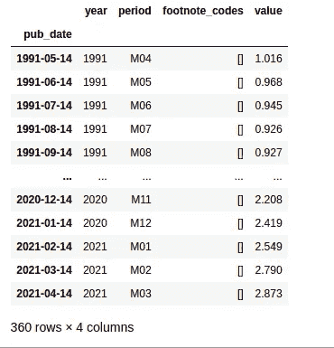
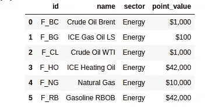

# 带有量化指标的宏观经济数据

> 原文：<https://medium.com/geekculture/macroeconomic-data-with-quantiacs-8c2b18257e29?source=collection_archive---------20----------------------->

[](https://www.quantiacs.com)**quanti ACS 为用户提供来自* [*美国劳工统计局*](https://www.bls.gov) *的宏观经济数据。这些数据可以用* [*云*](https://quantiacs.com/personalpage/login) *或* [*本地下载*](https://quantiacs.com/documentation/en/user_guide/local_development.html) *进行进一步分析。在这篇文章中，我们展示了如何使用宏观经济数据来开发一个交易算法。**

# *劳工统计局数据*

*美国劳工统计局是美国政府在劳工经济和统计领域的主要机构。它提供了几个有趣类别的宏观经济数据:价格、就业和失业、薪酬和工作条件以及生产率。*

**

*Photo by [Vlad Busuioc](https://unsplash.com/@juvx?utm_source=unsplash&utm_medium=referral&utm_content=creditCopyText) on [Unsplash](https://unsplash.com/s/photos/economy?utm_source=unsplash&utm_medium=referral&utm_content=creditCopyText)*

*美国国会和其他联邦机构利用劳工统计局提供的宏观经济数据做出关键决策。它们对于学术研究来说是非常重要的数据。此外，对于定量分析师来说，它们是一个有趣的想法来源，可以补充市场数据，用于开发交易算法。*

*[Quantiacs](http://www.quantiacs.com) 已经在其[云](https://quantiacs.com/personalpage/login)上实现了这些数据集，并使它们也可用于[您机器上的本地使用](https://quantiacs.com/documentation/en/user_guide/local_development.html)。*

# *检查数据集*

*数据被组织在 **34 个数据集**中，这些数据集可通过以下方式进行检查:*

```
*import pandas as pd
import numpy as npimport qnt.data as qndatadbs = qndata.blsgov.load_db_list()display(pd.DataFrame(dbs))*
```

*结果是一个表格，其中显示了上次可用更新的日期和时间以及每个数据集的名称:*

**

*每个数据集包含几个可用作指标的**时间序列**。*

*对于这个例子，我们使用`AP`，包含**平均消费价格**的数据集。它们是根据为编制 [**消费者价格指数**](https://www.bls.gov/cpi/) 而收集的价格，为家庭燃料、汽车燃料和食品项目计算的。*

*让我们加载并显示包含在`AP`数据集中的时间序列:*

```
*series_list = list(qndata.blsgov.load_series_list('AP'))

display(pd.DataFrame(series_list).set_index('id'))*
```

*`AP`平均价格数据集包含 **1479 个时间序列**，每个时间序列有 **8 个不同的字段**:*

**

*一些字段对于时间序列的意义是显而易见的:`series_title`、`begin_year`或`end_year`无需解释。其他字段乍一看不明显，应检查其含义:例如`area_code`、`item_code`、`begin_period` 和`end_period`就是这种情况。*

*可以使用以下方法检查含义:*

```
*meta = qndata.blsgov.load_db_meta('AP')

**for** k **in** meta.keys():
    print('### ' + k + " ###")
    m = meta[k]

    **if** type(m) == str:
        *# show only the first line if this is a text entry:*
        print(m.split('**\n**')[0])
        print('...')
        *# full text option, uncomment:*
        *# print(m)* 

    **if** type(m) == dict:
        *# convert dictionaries to pandas DataFrame:*
        df = pd.DataFrame(meta[k].values())
        df = df.set_index(np.array(list(meta[k].keys())))
        display(df)*
```

*`area_code`列反映了与时间序列相关的**美国地区**，例如 0000 代表整个美国；*

**

*让我们只选择与整个美国相关的时间序列；*

```
*us_series_list = [s **for** s **in** series_list \
  **if** s['area_code'] == '0000']

display(pd.DataFrame(us_series_list).set_index('id'))*
```

*我们从最初的 1479 个时序中获得了 160 个时序。这些是**全球美国时间序列**，它们与预测全球金融市场更相关:*

**

*让我们从 **55 个时间序列**中选择一个子集，这些时间序列目前正在更新，并且至少有 20 年的历史:*

```
*actual_us_series_list = [s **for** s **in** us_series_list \
    **if** s['begin_year'] <= '2000' **and** s['end_year'] == '2021' ]

display(pd.DataFrame(actual_us_series_list).set_index('id'))*
```

*这些时间序列的长度足以对交易想法进行回溯测试:*

**

*现在，我们可以加载其中一个系列，并将其用于我们的策略。让我们关注能源市场。我们按月考虑燃料油`APU000072511`:*

```
*series_data = qndata.blsgov.load_series_data('APU000072511', \
              tail = 30*365)

*# convert to pandas.DataFrame:*
series_data = pd.DataFrame(series_data)
series_data = series_data.set_index('pub_date')

*# remove yearly average data, see period dictionary:*
series_data = series_data[series_data['period'] != 'M13']

series_data*
```

*并获得一个可用于开发交易算法的时间序列:*

**

# ***交易算法***

**

*Photo by [Maksym Kaharlytskyi](https://unsplash.com/@qwitka?utm_source=unsplash&utm_medium=referral&utm_content=creditCopyText) on [Unsplash](https://unsplash.com/s/photos/fuel?utm_source=unsplash&utm_medium=referral&utm_content=creditCopyText)*

*我们关注**能源市场**,我们使用以下工具进行检查:*

```
*futures_list = qndata.futures_load_list()

energy_futures_list = [f **for** f **in** futures_list \
    **if** f['sector'] == 'Energy']

pd.DataFrame(energy_futures_list)*
```

*并获得:*

**

*我们使用**原油 WTI** 期货合约 F_CL，并开发一个简单的策略，该策略使用燃料油作为外部指标:*

```
*import xarray as xr
import numpy as np
import pandas as pd

import qnt.ta as qnta
import qnt.backtester as qnbt
import qnt.data as qndata

def load_data(period):

    futures = qndata.futures_load_data(assets=['F_CL'], \
             tail=period, dims=('time','field','asset'))

    ap = qndata.blsgov.load_series_data('APU000072511', tail=period)

    *# convert to pandas.DataFrame:*
    ap = pd.DataFrame(ap)
    ap = ap.set_index('pub_date')

    *# remove yearly average data, see period dictionary:*
    ap = ap[ap['period'] != 'M13']

    *# convert to xarray:*
    ap = ap['value'].to_xarray().rename(pub_date='time').\
      assign_coords(time=pd.to_datetime(ap.index.values))

    *# return both time series:*
    return dict(ap=ap, futures=futures), futures.time.values

def window(data, max_date: np.datetime64, lookback_period: int):
    *# the window function isolates data which are 
    # needed for one iteration of the backtester call*

    min_date = max_date - np.timedelta64(lookback_period, 'D')

    return dict(
        futures = data['futures'].sel(time=slice(min_date, \
                  max_date)),
        ap = data['ap'].sel(time=slice(min_date, max_date))
    )

def strategy(data, state):

    close = data['futures'].sel(field='close')
    ap = data['ap']

    *# the strategy complements indicators based on the 
    # Futures price with macro data and goes long/short 
    # or takes no exposure:* if ap.isel(time=-1) > ap.isel(time=-2) \
            and close.isel(time=-1) > close.isel(time=-20):
        return xr.ones_like(close.isel(time=-1)), 1

    elif ap.isel(time=-1) < ap.isel(time=-2) \
            and ap.isel(time=-2) < ap.isel(time=-3) \
            and ap.isel(time=-3) < ap.isel(time=-4) \
            and close.isel(time=-1) < close.isel(time=-40):
        return -xr.ones_like(close.isel(time=-1)), 1 

    *# When the state is None, we are in the beginning
    # and no weights were generated.*
    *# We use buy'n'hold to fill these first days.*
    elif state is None: 
        return xr.ones_like(close.isel(time=-1)), None

    else:
        return xr.zeros_like(close.isel(time=-1)), 1

weights, state = qnbt.backtest(
    competition_type='futures',
    load_data=load_data,
    window=window,
    lookback_period=365,
    start_date='2006-01-01',
    strategy=strategy,
    analyze=True,
    build_plots=True
)*
```

*此策略可用作改进的起点(注意，性能是积极的，但样本内夏普比率小于 1，因此应该改进系统以便提交):*

**

*[**源代码**](https://github.com/quantiacs/strategy-futures-bls/blob/master/strategy.ipynb) 在我们的 [GitHub 页面](https://github.com/quantiacs)公开发布，并且可以在[你的](https://quantiacs.com/personalpage/login)账号 [**Quantiacs**](https://www.quantiacs.com) 找到。*

*你有意见吗？让我们现在就进入 [**论坛**](https://quantiacs.com/community/) 页面吧！*