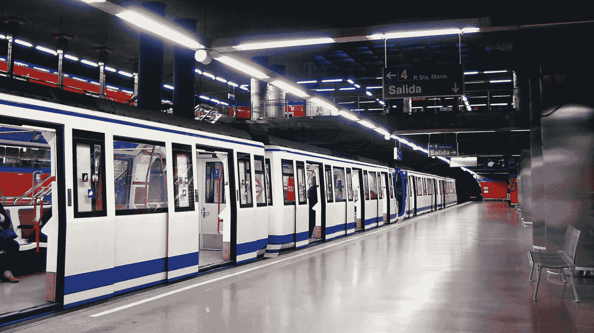

# 马德里的模块化地铁

> 原文：<https://medium.com/geekculture/madridss-modular-metro-733abaaaf429?source=collection_archive---------1----------------------->

## 如何以一半的成本和两倍的速度建造一条地铁，大多数人会说这是不可能的。但是马德里做到了。以下是方法。

Madrid Metro (source: [Wikimedia Commons](https://commons.wikimedia.org/wiki/File:Metro_Madrid_Mar_de_Cristal_station.jpg))

马德里地铁的领导层负责了历史上规模最大、速度最快的地铁扩建工程之一。他们成功了，因为他们理解了速度和模块化的重要性，这两个概念不是…