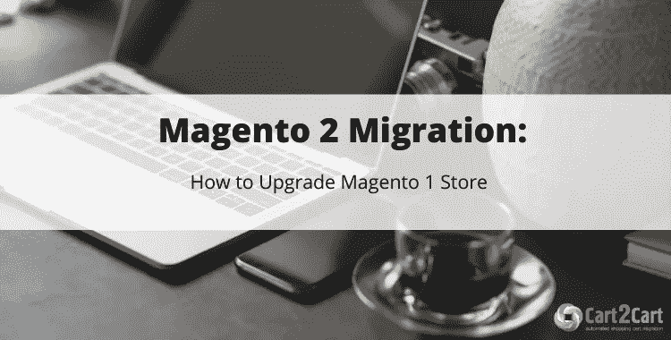
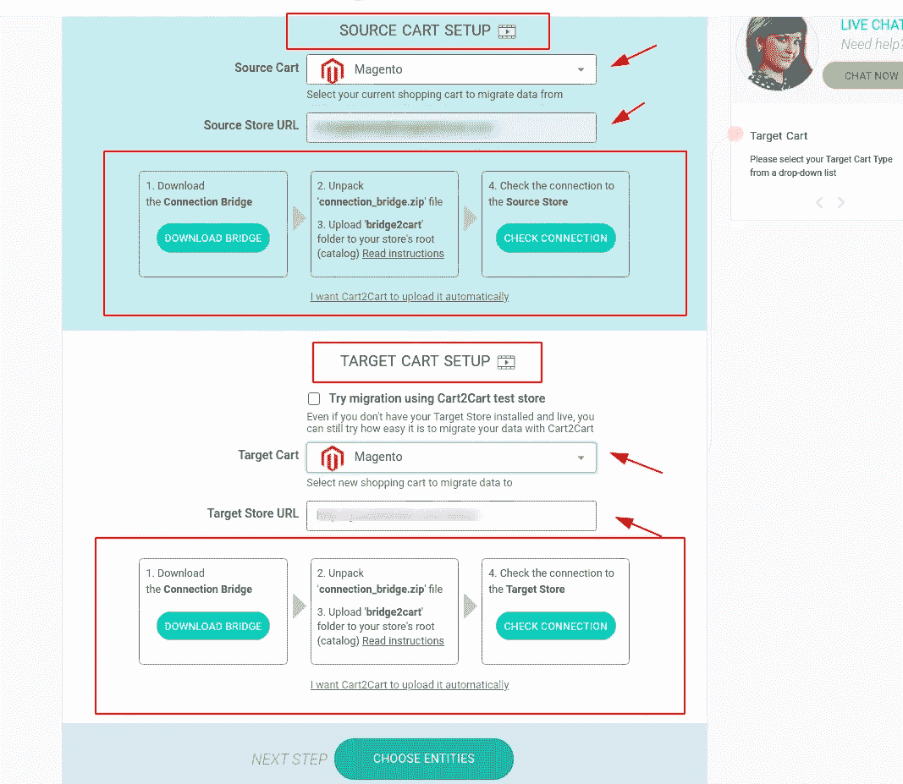
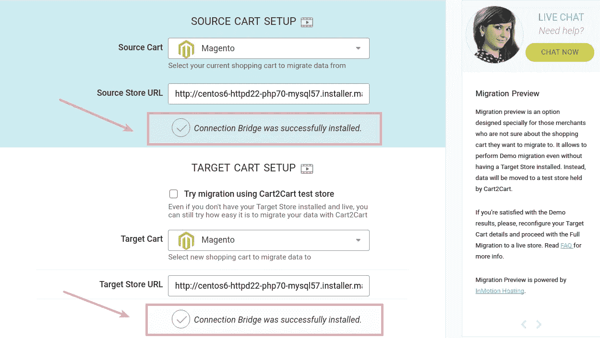
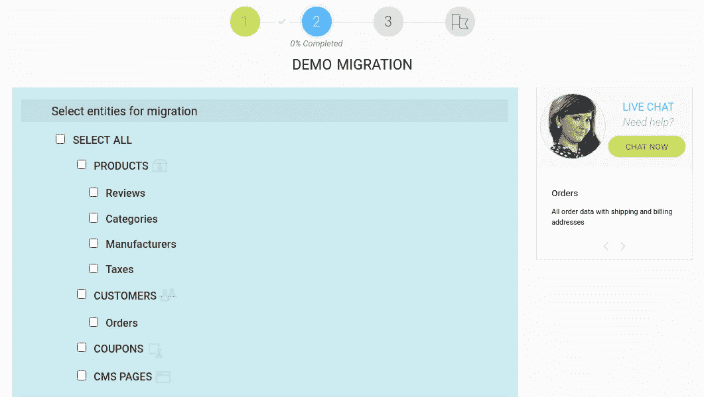
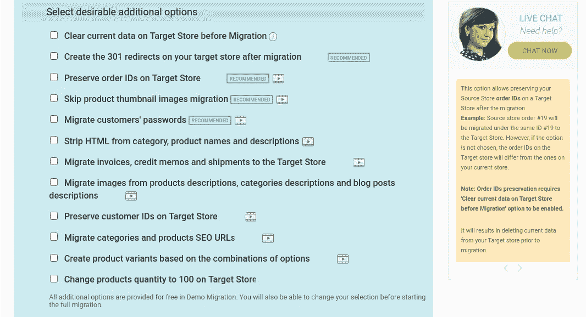
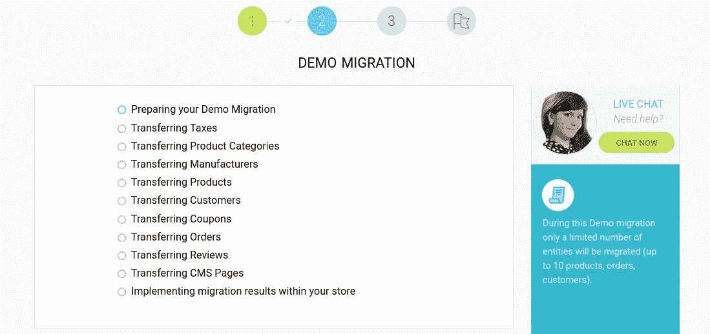
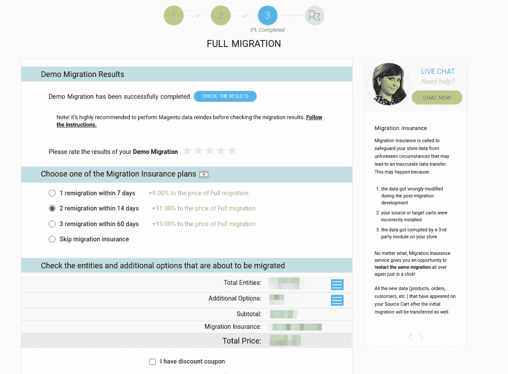

# Magento 1 升级到 2。自动化方法[+2021 指南]

> 原文：<https://medium.com/geekculture/magento-1-upgrade-to-2-an-automated-approach-2021-guide-9572c790ad0b?source=collection_archive---------60----------------------->

Magento 电子商务巨头[已于 2020 年正式关闭对 Magento 1](https://magento.com/blog/magento-news/supporting-magento-1-through-june-2020) 的支持。因此，那些在 Magento 1.x 上建立商店的商家可能会为安全威胁、缺乏更新、很少甚至没有开发者的帮助等形式的意外事件敞开大门。如果你想把 Magento 1 升级到 Magento 2(强烈推荐),但是不知道从哪里开始，你就来对地方了。

在 *的情况下，你已经决定离开当前的 Magento 平台，转而选择另一个电子商务解决方案，但发现很难决定坚持使用哪一个购物车，post* [*5 个强大的 Magento 替代方案值得一试*](https://www.shopping-cart-migration.com/carts-reviews/magento/5-magento-alternatives-run-store?utm_source=medium.com&utm_medium=referral&utm_term=magento-1-to-magento-2-upgrade&utm_campaign=how-to-posts) *可能会派上用场。*

# 为什么要升级到 Magento 2？

对于那些愿意继续使用 Magento 的人来说，为什么要升级到它的第二版是一个显而易见的问题。基本上，Magento 2 包含了基本的改进:

*   *在技术层面上，*
*   *在模块化方面(后端和前端)，*
*   *在性能方面。*

因此，如果在 Magento 1 停产后仍有重要理由继续使用它，以下是您应该了解的主要风险和影响:

*   *你的店铺现在面临安全风险*
*   *你错过了电子商务创新*
*   *维护你的 Magento 1.x 商店现在更贵了*
*   *您正在失去 PCI 合规性*
*   *分机不可用或出现故障*

# 如何将 Magento 1 升级到 Magento 2？

基本上，有几种方法可以完成 Magento 1 到 2 的升级。例如，你可以**雇佣一个有经验的开发人员或者甚至一组专家(如果你的商店有一个巨大的产品数据库)来执行转移。然而，这种方式将花费你一大笔钱，因为专业人士通常会为这项工作收取可观的费用。向 Magento 2 导入产品、订单、客户和其他必要信息的更智能的方式是利用**自动化迁移服务**。在市场上现有的公司中，寻找有丰富经验和优秀客户反馈的公司。**

利用像 [Cart2Cart](https://www.shopping-cart-migration.com/?utm_source=medium.com&utm_medium=referral&utm_term=magento-1-to-magento-2-upgrade&utm_campaign=how-to-posts) 这样的工具对技术人员和非技术人员来说都是最佳的解决方案。商店导入过程是直观的，并且在转移过程本身中需要最少的人工参与。你只需要提供你的商店的凭证，选择你想要导出的 Magento 1 数据，该服务将完成剩下的工作。此外，如果您有任何与迁移相关的问题，您可以获得全天候支持。

# 如何从 Magento 1 升级到 Magento 2？

**注** : *由于软件有全新的架构，1 版和 2 版的差异非常大，与其说是升级，不如说是数据迁移。*

**预迁移步骤**

在迁移之前，请确保执行 Magento 1 的存储备份。如果您在数据导入过程中遇到任何问题(*例如损坏、不完整或丢失的文件*，您可以通过将数据恢复到原始状态来修复任何可能的问题。此外，如果您还没有安装新的 Magento 2，您可以从迁移预览选项中受益，以观察导入的数据(产品、订单、属性等)如何。)会看上新 Magento 2 店。

## 设置来源和目标购物车

将 Magento 指定为源和目标购物车，并在迁移向导的匹配字段中提供它们的 URL 地址。

## 连接商店

通过下载并安装连接桥来连接您的两个商店:

只需按照迁移向导中提供的说明进行操作。

## 指定迁移实体和附加选项

首先，查看 Magento 升级页面，了解在将 Magento 1 升级到 Magento 2 时可以传输哪些数据:

完成后，选择您希望从现有 Magento 1 商店导入到新 Magento 2 的实体。当谈到其他迁移选项时，它们完全由您来决定哪一个有用。

但是，我们建议考虑以下选项:

*   选择“*创建 301 重定向到您的目标商店*”选项，使旧链接在新商店上工作。
*   “*在目标商店*上保留源商店订单 id”选项将帮助您在迁移后在新的 Magento 2 商店上保存 Magento 1 商店订单 id。
*   在“*迁移客户密码*”选项的帮助下，您的客户可以通过他们当前的商店凭证登录您的新 Magento 商店。

## 测试演示迁移

一旦您指定了迁移向导的所有必填字段，您就有机会检查正在传输有限数量项目的服务。它根本不需要太多时间，并且允许将多达 10 个产品实体移动到目标商店。

## 启动完全迁移

只有当您对演示结果满意时，您才可以启动完整的数据库迁移。花点时间检查您之前指定的数据，然后按“开始完整迁移”按钮。现在，您可以关闭浏览器窗口，继续运营您的业务。您将收到迁移完成的通知信。

# 迁移后建议

即使您已经成功完成了迁移过程，在投入使用之前，仍有一些提示需要考虑。首先，花时间**检查新店是否有任何可能的错误**。此外，建议**通知您的客户**有关升级的事宜，并要求他们让您了解任何问题。

**就是这样！现在你看到了** [**执行 Magento 1 到 2 的升级**](https://www.shopping-cart-migration.com/shopping-cart-migration-options/223-magento-to-magento-migration?utm_source=medium.com&utm_medium=referral&utm_term=magento-1-to-magento-2-upgrade&utm_campaign=how-to-posts) **是多么容易，而无需深入到堆积如山的代码和脚本中。**

# 最常见的问题

有可能将 Magento 主题和扩展迁移到新的 Magento 2 商店吗？

*很遗憾，从 Magento 1 升级到 Magento 2 或其他电子商务平台时，无法导入您当前的主题。或者，你可以找到一个免费的或购买一个质量现成的主题，并将其应用到您的新店。*

*与主题迁移类似，扩展迁移也是不可能的。相反，您需要为 Magento 2 或另一个提供与 Magento 1 相同功能的平台找到并安装新模块。*

**Magento 有哪些替代品？**

*简而言之，WooCommerce、BigCommerce、Shopify、PrestaShop、OpenCart 和 Magento 2 是全球店主在离开 Magento 1.x 时选择的电子商务平台。如果你正在寻找更直观、更实惠的产品，你可以试试 Shopify。那些已经熟悉 WordPress 的商家会发现使用 WooCommerce 很容易。如果你担心网上交易的安全性——big commerce 可能是最好的选择。但如果你对 Magento 1 感到舒服，就把它升级到最新的 2.x 版本。*

我可以免费试用 Cart2Cart 吗？

是的，Cart2Cart 迁移服务为其客户提供免费的 [*演示迁移*](https://app.shopping-cart-migration.com/?utm_source=medium.com&utm_medium=referral&utm_term=magento-1-to-magento-2-upgrade&utm_campaign=how-to-posts) *功能(测试迁移)。它允许从您当前的 Magento 1 商店导出数据类型(最多 10 个产品和与之相关的客户/订单),然后在大约 10-15 分钟内将其粘贴到新的 Magento 2。如果您对演示结果满意，您可以继续进行完全(付费)数据库传输。*