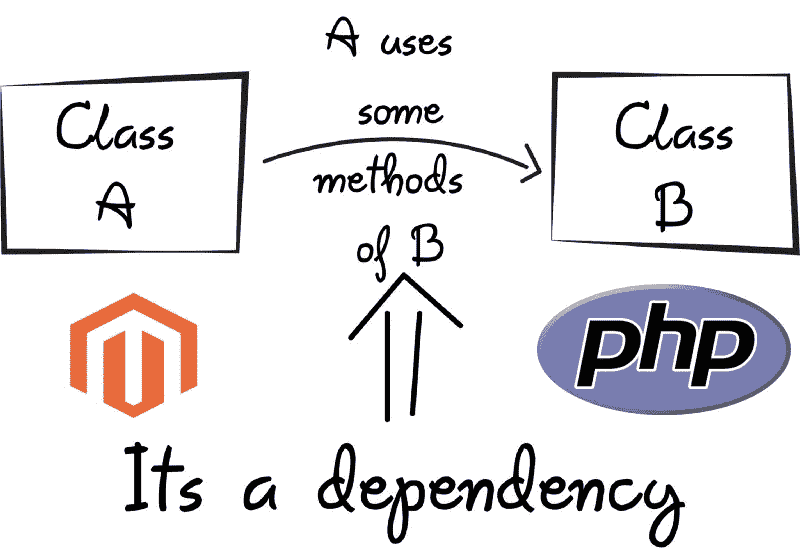

# Magento 2 (DI)依赖注入地狱架构

> 原文：<https://medium.com/geekculture/magento-2-di-dependency-injection-hell-architecture-228fd2c4d9a3?source=collection_archive---------31----------------------->

Magento 2 使用依赖注入来替换 Magento 1.x 中的`Mage`类提供的功能。

依赖注入是一种设计模式，它允许对象 A 向提供这些依赖关系的外部对象 B 声明其依赖关系。A 声明的依赖项通常是类接口，B 提供的依赖项是这些接口的具体实现。

这允许代码的松散耦合，因为对象 A 不再需要关心初始化它自己的依赖项。对象 B 根据配置或期望的行为决定向对象 A 提供哪些实现。



对于扩展开发人员来说，这是一个需要理解的重要概念，因为它构成了 Magento 如何组成其类的基础。

# 对象管理器阿迪容器

`[ObjectManager](https://devdocs.magento.com/guides/v2.4/extension-dev-guide/object-manager.html)`是一个 Magento 服务类，它在引导过程开始时实例化对象。

Magento 使用类构造函数签名来检索关于对象的构造函数依赖关系的信息。当构造一个类时，对象管理器将在`di.xml`文件中定义的类的依赖项注入到类构造函数中。

因为对象管理器间接提供它的服务，所以你的类不应该依赖于`ObjectManager`对象本身。唯一的例外是需要环境设置的具有复杂逻辑和集成测试的定制工厂。

# Magento 2 中使用的依赖注入示例

以下代码示例强调了 Magento 2 中使用的两种依赖注入:

```
namespace Magento\Backend\Model\Menu;class Builder
{
    /**
     * @var \Magento\Backend\Model\Menu\Item\Factory
     */
    private $_itemFactory; /**
     * @param \Magento\Backend\Model\Menu\Item\Factory $menuItemFactory
     */
    public function __construct(
        \Magento\Backend\Model\Menu\Item\Factory $menuItemFactory,  // Service dependency
    ) {
        $this->_itemFactory = $menuItemFactory;
    } /**
     * @param \Magento\Backend\Model\Menu\Builder\AbstractCommand
     */
    public function processCommand(\Magento\Backend\Model\Menu\Builder\AbstractCommand $command) // API param
    {
        // processCommand Code
    }
}
```

# 构造函数注入

在代码示例中，`Builder`类在其构造函数中声明了它对`Factory`和`Menu`类的依赖。Magento 使用`di.xml`文件来决定将哪些实现注入到`Builder`类中。

像大多数模式一样，依赖注入是问题的解决方案。因此，首先要问自己是否有这个问题。如果不是，那么使用该模式很可能会使代码*变得更糟*。我们在 M1 有阿迪问题吗？不，M1 有`Mage calas as a dependancy mager.`

我们在 M1 有了下一个方法:

`**Mage::getSingleton()**`将首先检查同一个类实例是否存在于内存中。如果实例被创建，那么它将从内存中返回相同的对象。

`**Mage::getModel()**`将在每次对象存在于配置中时创建该对象的新实例。

Magento 1 中的依赖注入有问题吗？不，我们没有。为什么我们在 M2 使用它？仅仅因为有人从易贝或 Adobe 告诉我们应该这样做。

## Magento 2 中依赖地狱的例子:

```
class Order extends AbstractModel implements EntityInterface, OrderInterface{/**     * @param \Magento\Framework\Model\Context $context     * @param \Magento\Framework\Registry $registry     * @param \Magento\Framework\Api\ExtensionAttributesFactory $extensionFactory     * @param AttributeValueFactory $customAttributeFactory     * @param \Magento\Framework\Stdlib\DateTime\TimezoneInterface $timezone     * @param \Magento\Store\Model\StoreManagerInterface $storeManager     * @param Order\Config $orderConfig     * @param \Magento\Catalog\Api\ProductRepositoryInterface $productRepository     * @param \Magento\Sales\Model\ResourceModel\Order\Item\CollectionFactory $orderItemCollectionFactory     * @param \Magento\Catalog\Model\Product\Visibility $productVisibility     * @param \Magento\Sales\Api\InvoiceManagementInterface $invoiceManagement     * @param \Magento\Directory\Model\CurrencyFactory $currencyFactory     * @param \Magento\Eav\Model\Config $eavConfig     * @param Order\Status\HistoryFactory $orderHistoryFactory     * @param \Magento\Sales\Model\ResourceModel\Order\Address\CollectionFactory $addressCollectionFactory     * @param \Magento\Sales\Model\ResourceModel\Order\Payment\CollectionFactory $paymentCollectionFactory     * @param \Magento\Sales\Model\ResourceModel\Order\Status\History\CollectionFactory $historyCollectionFactory     * @param \Magento\Sales\Model\ResourceModel\Order\Invoice\CollectionFactory $invoiceCollectionFactory     * @param \Magento\Sales\Model\ResourceModel\Order\Shipment\CollectionFactory $shipmentCollectionFactory     * @param \Magento\Sales\Model\ResourceModel\Order\Creditmemo\CollectionFactory $memoCollectionFactory     * @param \Magento\Sales\Model\ResourceModel\Order\Shipment\Track\CollectionFactory $trackCollectionFactory     * @param ResourceModel\Order\CollectionFactory $salesOrderCollectionFactory     * @param PriceCurrencyInterface $priceCurrency     * @param \Magento\Catalog\Model\ResourceModel\Product\CollectionFactory $productListFactory     * @param \Magento\Framework\Model\ResourceModel\AbstractResource|null $resource     * @param \Magento\Framework\Data\Collection\AbstractDb|null $resourceCollection     * @param array $data     * @param ResolverInterface|null $localeResolver     * @param ProductOption|null $productOption     * @param OrderItemRepositoryInterface|null $itemRepository     * @param SearchCriteriaBuilder|null $searchCriteriaBuilder     * @param ScopeConfigInterface|null $scopeConfig     * @param RegionFactory|null $regionFactory     * @param RegionResource|null $regionResource     * @SuppressWarnings(PHPMD.ExcessiveParameterList)     */    public function __construct(        \Magento\Framework\Model\Context $context,        \Magento\Framework\Registry $registry,        \Magento\Framework\Api\ExtensionAttributesFactory $extensionFactory,        AttributeValueFactory $customAttributeFactory,        \Magento\Framework\Stdlib\DateTime\TimezoneInterface $timezone,        \Magento\Store\Model\StoreManagerInterface $storeManager,        \Magento\Sales\Model\Order\Config $orderConfig,        \Magento\Catalog\Api\ProductRepositoryInterface $productRepository,        \Magento\Sales\Model\ResourceModel\Order\Item\CollectionFactory $orderItemCollectionFactory,        \Magento\Catalog\Model\Product\Visibility $productVisibility,        \Magento\Sales\Api\InvoiceManagementInterface $invoiceManagement,        \Magento\Directory\Model\CurrencyFactory $currencyFactory,        \Magento\Eav\Model\Config $eavConfig,        \Magento\Sales\Model\Order\Status\HistoryFactory $orderHistoryFactory,        \Magento\Sales\Model\ResourceModel\Order\Address\CollectionFactory $addressCollectionFactory,        \Magento\Sales\Model\ResourceModel\Order\Payment\CollectionFactory $paymentCollectionFactory,        \Magento\Sales\Model\ResourceModel\Order\Status\History\CollectionFactory $historyCollectionFactory,        \Magento\Sales\Model\ResourceModel\Order\Invoice\CollectionFactory $invoiceCollectionFactory,        \Magento\Sales\Model\ResourceModel\Order\Shipment\CollectionFactory $shipmentCollectionFactory,        \Magento\Sales\Model\ResourceModel\Order\Creditmemo\CollectionFactory $memoCollectionFactory,        \Magento\Sales\Model\ResourceModel\Order\Shipment\Track\CollectionFactory $trackCollectionFactory,        \Magento\Sales\Model\ResourceModel\Order\CollectionFactory $salesOrderCollectionFactory,        PriceCurrencyInterface $priceCurrency,        \Magento\Catalog\Model\ResourceModel\Product\CollectionFactory $productListFactory,        \Magento\Framework\Model\ResourceModel\AbstractResource $resource = null,        \Magento\Framework\Data\Collection\AbstractDb $resourceCollection = null,        array $data = [],        ResolverInterface $localeResolver = null,        ProductOption $productOption = null,        OrderItemRepositoryInterface $itemRepository = null,        SearchCriteriaBuilder $searchCriteriaBuilder = null,        ScopeConfigInterface $scopeConfig = null,        RegionFactory $regionFactory = null,        RegionResource $regionResource = null,        StatusLabel $statusLabel = null    ) {        $this->_storeManager = $storeManager;        $this->_orderConfig = $orderConfig;        $this->productRepository = $productRepository;        $this->productListFactory = $productListFactory;        $this->timezone = $timezone;        $this->_orderItemCollectionFactory = $orderItemCollectionFactory;        $this->_productVisibility = $productVisibility;        $this->invoiceManagement = $invoiceManagement;        $this->_currencyFactory = $currencyFactory;        $this->_eavConfig = $eavConfig;        $this->_orderHistoryFactory = $orderHistoryFactory;        $this->_addressCollectionFactory = $addressCollectionFactory;        $this->_paymentCollectionFactory = $paymentCollectionFactory;        $this->_historyCollectionFactory = $historyCollectionFactory;        $this->_invoiceCollectionFactory = $invoiceCollectionFactory;        $this->_shipmentCollectionFactory = $shipmentCollectionFactory;        $this->_memoCollectionFactory = $memoCollectionFactory;        $this->_trackCollectionFactory = $trackCollectionFactory;        $this->salesOrderCollectionFactory = $salesOrderCollectionFactory;        $this->priceCurrency = $priceCurrency;        $this->localeResolver = $localeResolver ?: ObjectManager::getInstance()->get(ResolverInterface::class);        $this->productOption = $productOption ?: ObjectManager::getInstance()->get(ProductOption::class);        $this->itemRepository = $itemRepository ?: ObjectManager::getInstance()            ->get(OrderItemRepositoryInterface::class);        $this->searchCriteriaBuilder = $searchCriteriaBuilder ?: ObjectManager::getInstance()            ->get(SearchCriteriaBuilder::class);        $this->scopeConfig = $scopeConfig ?: ObjectManager::getInstance()->get(ScopeConfigInterface::class);        $this->regionFactory = $regionFactory ?: ObjectManager::getInstance()->get(RegionFactory::class);        $this->regionResource = $regionResource ?: ObjectManager::getInstance()->get(RegionResource::class);        $this->regionItems = [];        $this->statusLabel = $statusLabel ?: ObjectManager::getInstance()->get(StatusLabel::class);        parent::__construct(            $context,            $registry,            $extensionFactory,            $customAttributeFactory,            $resource,            $resourceCollection,            $data        );    }
```

首先考虑是否可以减少或消除依赖性。在其他条件相同的情况下，我们希望系统中的每个组件尽可能少地依赖。如果依赖性消失了，注射与否的问题就变得没有意义了！

考虑一个模块，它从外部服务下载一些数据，解析这些数据，执行一些复杂的分析，并将结果写入文件。

解决方案就是通过 **ObjectManager** 或 **Mage:getSingelton()** 将分析从输入/输出中分离出来。如果把分析提取到一个没有副作用的模块，测试起来会容易很多。请注意，嘲讽是一种代码味道——它并不总是可以避免的，但一般来说，如果您可以不依赖于嘲讽进行测试，那会更好。因此，通过消除依赖性，您避免了 DI 应该减轻的问题。请注意，这样的设计也更符合 SRP。

我想强调的是，DI 并不一定促进 SRP 或者其他好的设计原则，比如关注点分离、高内聚/低耦合等等。这可能会适得其反。考虑一个在内部使用另一个类 B 的类 A。b 仅由 A 使用，因此被完全封装，可以被视为实现细节。如果您将它改为将 B 注入 A 的构造函数中，那么您已经暴露了这个实现细节，现在关于这个依赖关系以及如何初始化 B、B 的生命周期等等的知识必须存在于系统中与 A 分开的某个其他位置。因此，您有一个带有泄漏问题的总体更差的体系结构。

另一方面，在某些情况下，DI 确实很有用。例如，对于像日志记录器这样有副作用的全局服务。

问题是当模式和架构本身成为目标而不是工具时。只是问“我们应该使用 DI 吗？”有点本末倒置。你应该问:“我们有问题吗？”以及“这个问题的最佳解决方案是什么？”

你的问题的一部分可以归结为:“我们应该创建多余的接口来满足模式的需求吗？”你可能已经意识到这个问题的答案了——绝对不是**！任何告诉你不是这样的人都是在试图向你推销东西——很可能是昂贵的 Magento 2 咨询时间。一个接口只有代表一个抽象才有价值。仅仅模仿单个类的表面的接口被称为“头接口”，这是一个已知的反模式。**

我听过的最大的废话是禁止在类中使用对象管理器，只有 DI 应该被使用。然而，这只是另一个愚蠢的 Magento 2 最佳实践。Magento 2 DI 在引擎盖下使用 ObjecManager。如果你想用什么东西，你可以用它。

从鼓励依赖(DI)依赖注入到迫使复杂性移出类并进入类之间的链接，这可能并不总是令人满意或容易管理的。因此，为了帮助您获得关于 Magento DI 的完整信息，这里有一些使用依赖注入的其他缺点。

*   依赖注入创建了要求由构造代码提供配置细节的客户机。当存在明显的违约时，这可能会很困难。
*   依赖注入会使代码难以跟踪(阅读)，因为它将行为与构造分开。这意味着开发人员必须参考更多的文件来了解系统的运行情况。
*   它需要更多的样板代码和前期开发工作。

所以，Magento 2 DI 容器只不过是典型 Java DI 容器的多余抄袭，带有难看的基于 XML 的(di.xml)语法。

最好的方法是在使用 Magento 2 最佳实践之前，同时使用 DI 和对象管理器，而不是仅仅使用 DI。