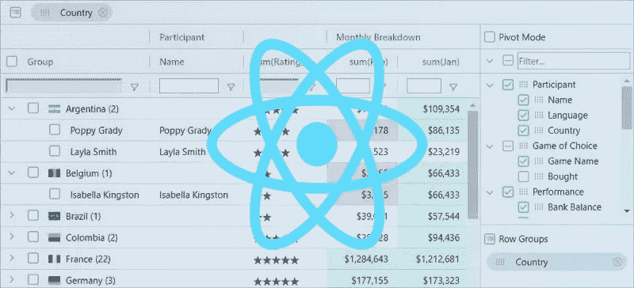

# Magento Adobe 商务网格 UI 组件与 React。Js 组件

> 原文：<https://medium.com/geekculture/magento-adobe-commerce-grid-ui-component-vs-react-js-component-12aa7bcab67c?source=collection_archive---------30----------------------->

Magento 网格用于表示、过滤和排序 Magento 后端的各种数据。它们还用于执行大量操作，如更新和删除。本教程将向您展示如何创建一个简单的管理网格。

让我们看看 Magento 的 Adob Commerce Implemntation UI 架构实现与 React JS 网格有何不同。



Magento 2 在前端利用敲除 JS 文件。它执行模型视图视图-模型设计大纲，这对于创建动态 UI 非常方便。

要创建 Magento 网格，您需要执行下一步:

使用 Knockout JS 在 Magento 2 的前端制作数据网格时，您应该遵循以下步骤:

1.  构建网格视图模型
2.  网格视图-模型中的 Execute _prepareItems()函数
3.  网格视图-模型中的 Execute _prepareColumns()函数
4.  表单价格呈现视图-模型
5.  表单模板文件
6.  表单动作控制器
7.  表单块类
8.  声明布局文件
9.  表单模板。phtml

**构建网格视图模型**

```
/app/code/[NameSpace]/[ModuleName]/view/frontend/web/js/view/grid.jsdefine ( [ 'jquery', 'ko', 'uiComponent', '[NameSpace]_[ModuleName]/js/view/grid/price' ], function ($, ko, component, priceRender) { "use strict"; return component.extend({ items: ko.observableArray([]), columns: ko.observableArray([]), defaults: { template: '[NameSpace]_[ModuleName]/grid', }, initialize: function () { this._super(); this._render(); }, _render: function() { this._prepareColumns(); this._prepareItems();                }, _prepareItems: function () { }, _prepareColumns: function () { }, addItem: function (item) { item.columns = this.columns; this.items.push(item); }, addItems: function (items) { for (var i in items) { this.addItem(items[i]); } }, addColumn: function (column) { this.columns.push(column); } }); });
```

这个视图模型将把网格的数据放入它的模板文件:[NameSpace]_[ModuleName]/grid 中，该文件存储在

```
/app/code/[NameSpace]/[ModuleName]/view/frontend/web/template/grid.html
```

**网格视图-模型中的 Execute _prepareItems()函数**

在这个函数中，您列出了想要在网格中展示的所有项目。如果您在此功能中修改了项目列表，前端页面上的网格数据将会自动修改。

```
_prepareItems: function () {var items = [ {name: "AK-74", sales: 352, price: 75.95}, {name: "Colt 911", sales: 89, price: 190.00}, {name: "M-16", sales: 152, price: 25.00},{name: "IMI Uzi", sales: 1, price: 99.95},{name: "Heckler & Koch G3", sales: 0, price: 6350},];this.addItems(items);}
```

**网格视图-模型中的 Execute _prepareColumns()函数**

在这个函数中，您声明了网格中显示的所有列。

```
_prepareColumns: function () { this.addColumn({headerText: "Item Name", rowText: "name", renderer: ''}); this.addColumn({headerText: "Sales Count", rowText: "sales", renderer: ''}); this.addColumn({headerText: "Price", rowText: "price", renderer: priceRender()});}
```

*   **HeaderText:** 列的标题
*   **rowText** :项目元素(名称、销售&价格)
*   **渲染器:**在这个模型中，如果想要修改列的显示格式，可以使用渲染器

**表单价格渲染视图-模型**

这个视图模型将帮助你解释商品的价格质量

```
/app/code/[NameSpace]/[ModuleName]/view/frontend/web/js/view/grid/price.jsdefine [ 'jquery', 'ko', 'uiComponent',], function ($, ko, component) { "use strict"; return component.extend({ render: function (item) { return "$" + item.price.toFixed(2); } }); });
```

**表单模板文件**

模板是 Knockout JS 中的分析，这是一个 HTML 文件

```
/app/code/[NameSpace]/[ModuleName]/view/frontend/web/template/grid.html<table class="data table base list"> <thead><tr data-bind="foreach: columns"><th data-bind="text: headerText"></th></tr></thead><tbody data-bind="foreach: items"> <tr data-bind="foreach: columns"><td><span data-bind="text:  renderer ? renderer.render($parent) : $parent[rowText] "></span></td> </tr></tbody></table>
```

**表单动作控制器**

```
/app/code/[NameSpace]/[ModuleName]/Controller/Index/View.php<?phpnamespace [NameSpace]\[ModuleName]\Controller\Index;class View extends \Magento\Framework\App\Action\Action{/*** @var \Magento\Framework\View\Result\PageFactory*/protected $_resultPageFactory;/*** Index constructor.* @param \Magento\Framework\App\Action\Context $context* @param \Magento\Framework\View\Result\PageFactory $resultPageFactory*/public function __construct(\Magento\Framework\App\Action\Context $context, \Magento\Framework\View\Result\PageFactory $resultPageFactory){ $this->_resultPageFactory = $resultPageFactory; parent::__construct($context);}/*** @return \Magento\Framework\View\Result\Page*/public function execute(){ return $this->_resultPageFactory->create();}}
```

**表格块类**

```
/app/code/[NameSpace]/[ModuleName]/Block/ViewAbstract.php<?phpnamespace [NameSpace]\[ModuleName]\Block;class ViewAbstract extends \Magento\Framework\View\Element\Template{/*** @var \Magento\Checkout\Model\CompositeConfigProvider*/protected $configProvider;/*** @var array*/protected $_layoutProcessors;/*** Lists constructor.* @param \Magento\Framework\View\Element\Template\Context $context* @param array $layoutProcessors* @param array $data*/public function __construct( \Magento\Framework\View\Element\Template\Context $context, \Magento\Checkout\Model\CompositeConfigProvider $configProvider, array $layoutProcessors = [],array $data = []) { parent::__construct($context, $data);$this->configProvider = $configProvider; $this->_layoutProcessors = $layoutProcessors;}/*** @return string*/public function getJsLayout(){ foreach ($this->_layoutProcessors as $processor) { $this->jsLayout = $processor->process($this->jsLayout); } return parent::getJsLayout();}}
```

**申报布局文件**

```
/app/code/[NameSpace]/[ModuleName]/Block/view/frontend/layout/[modulename]_index_view.xml<?xml version="1.0"?><page layout='1column' xmlns:xsi="http://www.w3.org/2001/XMLSchema-instance"xsi:noNamespaceSchemaLocation="urn:magento:framework:View/Layout/etc/page_configuration.xsd" ><body> <referenceContainer name="content"> <block class="[NameSpace]\[ModuleName]\Block\ViewAbstract" before="-" cacheable="false" template="[NameSpace]_[ModuleName]::grid.phtml">  <arguments> <argument name="jsLayout" xsi:type="array"> <item name="components" xsi:type="array"><item name="sample-grid" xsi:type="array"> <item name="component" xsi:type="string">[NameSpace]_[ModuleName]/js/view/grid</item> </item> </item></argument> </arguments> </block> </referenceContainer></body></page>
```

**表单模板。phtml**

```
/app/code/[NameSpace]/[ModuleName]/Block/view/frontend/template/grid.phtml<div id="block-sample-grid" data-bind="scope:'sample-grid'" class="block"><!-- ko template: getTemplate() --><!-- /ko --><script type="text/x-magento-init"> {"#block-sample-grid": { "Magento_Ui/js/core/app": <?php /* @escapeNotVerified */ echo $block->getJsLayout();?> }}</script></div>
```

Magento UI 简直一塌糊涂。难怪软件开发商拒绝使用 Adobe Commerce。这是一堆 PHP、XML 和奇怪的 JS 格式

## React Magento 网格实现

让我们看看如何用 Magento 实现 React 网格 UI 组件:

```
import React from “react”;import ReactDOM from “react-dom”;import ReactDataGrid from “react-data-grid”;import “./styles.css”;const columns = [{ key: “id”, name: “ID”, editable: true },{ key: “title”, name: “Title”, editable: true },{ key: “complete”, name: “Complete”, editable: true }];const rows = [{ id: 0, title: “Task 1”, complete: 20 },{ id: 1, title: “Task 2”, complete: 40 },{ id: 2, title: “Task 3”, complete: 60 }];class Example extends React.Component {state = { rows };onGridRowsUpdated = ({ fromRow, toRow, updated }) => {this.setState(state => {const rows = state.rows.slice();for (let i = fromRow; i <= toRow; i++) {rows[i] = { …rows[i], …updated };}return { rows };});};render() {return (<ReactMagentoDataGridcolumns={columns}rowGetter={i => this.state.rows[i]}rowsCount={3}onGridRowsUpdated={this.onGridRowsUpdated}enableCellSelect={true}/>);}}const rootElement = document.getElementById(“root”);ReactDOM.render(<Example />, rootElement);
```

要将 React JS 组件嵌入到 Magento 中，您应该阅读以下说明:

[https://yegorshytikov . medium . com/how-to-use-react-js-with-magento-2-ed 5 e 9 F3 cf 9 Fe](https://yegorshytikov.medium.com/how-to-use-react-js-with-magento-2-ed5e9f3cf9fe)