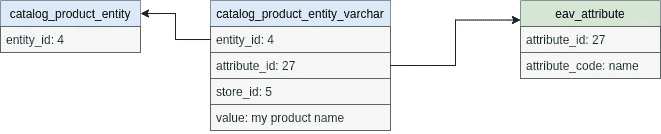
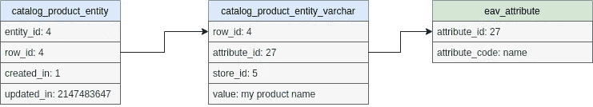
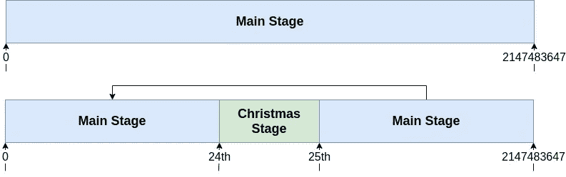
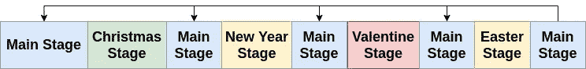

# magento Commerce——Staging——它是什么及其黑暗的秘密

> 原文：<https://medium.com/geekculture/magento-commerce-staging-what-it-is-and-its-dark-secret-985b393a8fc5?source=collection_archive---------9----------------------->

## Magento2 Commerce 不久前推出了“staging”功能。这个功能在理论上很棒，但有一个不为人知的秘密。


首先，让我们看看这种暂存功能是什么？

你可能需要一个特定的页面，比如 CMS 页面，或者一个产品，甚至是一个分类页面，在一个特定的时间和日期改变。例如，你在圣诞节销售一种产品，你想在 24 号午夜停止销售。

暂存功能允许您在后台为产品、类别或 CMS 页面配置多个状态。例如，我们可以为我们的产品创建一个阶段，以便在 12 月 23 日启用它，并在 24 日午夜禁用它。这意味着在 22 日 23 时 59 分访问该网站的顾客将无法找到该产品。但是如果他们在 23 日 00h01m 访问该网站，他们会(几乎)访问。

您可以使用它来更改任何产品属性；您还可以使用它来更改类别页面，例如在页面上临时添加横幅，或者在给定时间发布类别。

如果没有这一点，您将需要一个管理员在给定的时间做更改，即使这样，他可能会晚做一些更改；犯一个错误…这一切都自动化了。

你可以走得相当远，有连续的阶段；同样，如果我们保持我们的圣诞主题，我们可以制作一个类似 CMS 页面上显示的降临节日历。每天页面都会自动更新。您甚至可以在给定阶段看到页面的预览，这允许您验证您的更改。

这个特性当然有一些限制，其中之一就是时区。如果你的网站在多个时区销售，而你希望你的更改在有问题的时区生效，你将无法做到这一点。有一些方法可以解决这个问题，但是它需要大量的重复，仍然有局限性。

第二个问题来自数据的存储方式。因此，让我们看看如何分期工作，以了解这个问题。

# 阶段是如何存储的？

Magento 使用 EAV 来存储其值，因此某个商店的产品名称将存储如下:



这基本上意味着产品“4”在*目录 _ 产品 _ 实体*表中有一个条目，在*目录 _ 产品 _ 实体 _varchar* 表中有多个条目来存储所有的文本值。

当分级模块被启用时，结构改变，



*目录 _ 产品 _ 实体*表变化比较大；我们在表中添加了 3 个新列。 ***entity_id*** 不再是表的主键，现在是 ***row_id。*** 这意味着同一产品可以有多行。***created _ in***&***updated _ in***列允许我们在给定的时间加载“适当的”阶段。

我们还要注意，存储在 varchar 表中的值对于每一行都是重复的。因此，我们不是每个产品都有一个值，而是每个产品和版本都有一个值。这似乎合乎逻辑。

有了 staging，所有对产品的查询都会自动添加一个新条件:

*((main _ table . created _ in≤1615385079)和(main _ table . updated _ in>1615385079))*

这样，所有使用产品集合的查询将只加载一个产品一次，即使它有多个阶段。怎么会这样如果我们有一个从 24 号开始到 25 号结束的阶段(从 1 号开始并且永远不会结束的基本阶段),查询应该会找到这两个阶段。

是的，这就是为什么“主”阶段在数据库中被分成两部分:



因此，我们在数据库中存储了该产品的 3 个副本。这使得这些阶段可以在前端非常高效地工作。但是 edition 是如何工作的呢？

假设我们创建了我们的舞台“圣诞舞台”,我们仍然在 12 月 21 日。我们现在修复我们产品上的某些东西；对从 0 开始到 24 号结束的第一阶段进行更改？当 25 号到来时，我们的改变消失了？不是。有一个附加的表，***staging _ update***将数据库中的这些“期间”相互联系起来。因此，当您编辑“主阶段”时，它将在数据库中更新 0–24 期以及 25 至无限期的条目。

您可能已经开始看到这里的问题了。但首先，让我们看看搜索会受到什么影响。

# 为什么数据库结构是这样一个问题？

当你开始有很多阶段时，问题就出现了:



我们有 5 个阶段，但在数据库中，数据被复制了 9 次。这意味着数据库中有((2 * nb_stage) -1)个条目。因此，我们在数据库中复制数据，我们知道这是一种不好的做法，我不认为需要时间在这里解释。

第二个问题更实际；当我们试图拯救产品时，它就会出现。你拥有的阶段越多，“主阶段”就变得越支离破碎，越难以更新；使得产品上的保存操作越来越慢。

最后，没有清理方法，一旦复活节过去，我们可以想象删除旧的阶段，并删除一些重复的数据。没有什么是天生的。

# 技术的

## 查询是如何改变的

如前所述，可分级实体上的所有查询都被更改，这是通过由分级模块(magento/module-staging)添加的 from rendered 完成的，该模块具有类*Magento \ Staging \ Model \ Select \ from renderer*。

如果希望防止将此条件添加到查询中，可以通过添加以下代码来实现:

```
$select->setPart("disable_staging_preview", true)
```

您很少需要这样做；除非您试图通过一个查询获得所有阶段的数据。

## 搜索和指数化

转移功能不会改变任何索引表或弹性索引。相反，我们有了一个新的 cron“staging _ apply _ version”。这将搜索所有需要重新编制索引的可停滞实体。

这引入了第二个限制，如果许多实体需要在给定时间切换，索引将会延迟，因为它们的更新将花费大量时间。

# 结论

Magento 的 staging 模块非常有用，尤其是对于不太复杂的对象，比如 CMS 页面或价格规则。如果您的数据库相对较小，它也可以安全地用于产品和类别。

我的主要问题是，它是默认安装在 Magento 的商业版中的，它应该是集成商可选安装的。该模块广泛地修改了数据库结构，这意味着一旦安装就不容易被删除。所以最好只在需要的时候安装。很多项目没有理由就安装和启用了这些模块，通常在网站上工作的开发人员没有考虑到这一点，导致在实际使用时出现错误。所以容易产生 bug。

*编辑 1:添加了额外的信息，说明在代码的什么地方对可分级实体的查询进行了修改，以及如何禁用它。我还补充了一些关于指数化(搜索)如何受阶段影响的信息。*