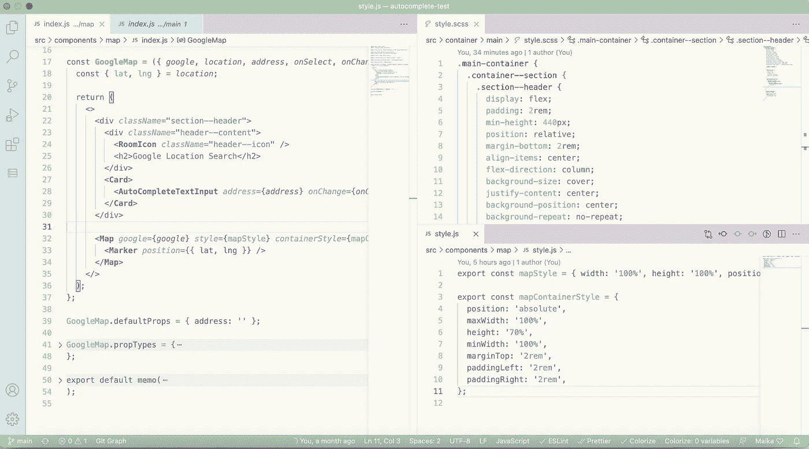

# 基于 React 维护干净的代码—第 1 部分

> 原文：<https://medium.com/geekculture/maintain-a-clean-code-based-in-react-part-1-989dcba6892b?source=collection_archive---------15----------------------->


Photo by [Clément Hélardot](https://unsplash.com/@clemhlrdt?utm_source=unsplash&utm_medium=referral&utm_content=creditCopyText) on [Unsplash](https://unsplash.com/s/photos/programming?utm_source=unsplash&utm_medium=referral&utm_content=creditCopyText)

# 前言

您是否曾经遇到过这样的情况:您提交的代码被拒绝，或者收到项目负责人的负面反馈？不要让所有这些负面情绪压倒你，打击你的积极性，让我们走出一步，创造一些更好的东西！

作为一名工程师，我们不只是编写只有计算机才能理解的代码。相反，我们正在编写“人类可以理解”的代码。实践干净的代码将帮助你维护和构建一个更好的 react 项目。我知道一开始会很有挑战性，但是相信我，最终你会帮助自己在项目开发的道路上生存下来。

这里有一些关于改进和维护 react 项目的建议和提示。所以让我们激情燃烧吧！

# 1.进口报表


Photo by [Ferenc Almasi](https://unsplash.com/@flowforfrank?utm_source=unsplash&utm_medium=referral&utm_content=creditCopyText) on [Unsplash](https://unsplash.com/s/photos/javascript?utm_source=unsplash&utm_medium=referral&utm_content=creditCopyText)

这将是在你的 react 代码中组织的第一部分。

我们可以通过 ***相对导入*** 和 ***绝对导入*** 来导入文件和模块。在大多数情况下，特别是当你在处理一个大规模的项目时，强烈推荐设置和使用 ***绝对导入*** 以获得更好的可读性和重构。告别`../../../xxxx`嵌套文件夹路径地狱。

在这种情况下，我想出了一套****React Import Structure(RIS)***”来以一种更整洁和可维护的方式组织依赖关系，如下:*

*下面是一堆 import 语句的不太好的例子，因为它们没有条理，可读性差。*

*现在，您可以看到按照上面提到的结构重新组织导入语句后的不同之处。现在干净多了，不是吗？*

# *2.风格的分离*

**

*Photo by [Maik Jonietz](https://unsplash.com/@der_maik_?utm_source=unsplash&utm_medium=referral&utm_content=creditCopyText) on [Unsplash](https://unsplash.com/s/photos/css?utm_source=unsplash&utm_medium=referral&utm_content=creditCopyText)*

*创建的 UI 组件越多，得到的样式表就越长。尽量避免内联样式，因为它在 CSS 特性支持方面有局限性。将样式和组件代码放在同一个文件中并不是一个好的做法，因为这将使事情变得更混乱，更难维护。*

*因此，最好将样式代码分离到另一个文件中，然后仅在必要时导入它，这也是帮助减小文件大小的一种方式。下面是将样式代码拆分到不同文件中的示例:*

**

*Sample of stylesheet splitting || [VSCode Theme Name: Sodagreen Theme](https://marketplace.visualstudio.com/items?itemName=ayakoSky.sodagreen-theme)*

# *3.功能的分离和重用*

*这和上面的概念是一样的。在一个组件文件中有太多的函数也是一种灾难。假设您正在创建一个大型组件，您添加了香料、糖和一切“好”的东西，很快您的文件将轻松增长超过 1000 行代码，但最终 Powerpuff girls 可能不会出来，或者它会产生不太令人满意的性能结果。*

**

*Professor Utonium*

*因此，拆分业务逻辑和功能是更好的选择，因为它可以在项目中全局重用。另一方面，它确实提供了一个更干净和可维护的基于。通常我会把那些分离出来的逻辑保存在`src`目录下的一个`utils`文件夹里，以便更好的管理。这是我的方法，你可以考虑自己的方式来组织它。*

# *4.移除未使用的 3C*

**

*你一定想知道这里有哪些**3c**。*

*不是典型的*车，现金，信用卡**

*相反，它们是:*

> *标题、注释、代码*

*删除不必要的和冗余的代码将显著提高代码质量，同时也减少了包的大小。添加评论是一个很棒的习惯，但是只在必要的时候添加。*

*此外，您可以集成 ESLint 和 Prettier 来帮助跟踪和利用项目中的编码标准。从这里，您可以注意到是否有任何未使用的库。如果你很确定你迟早不会使用这些依赖项，并且它不会影响你的项目，建议是卸载它们以减少项目规模。*

**React 项目* *中 ESLint 和 React 的* [*配置在此阅读。*](https://unicorn-sky.medium.com/configures-eslint-prettier-in-react-hooks-project-81db775a6db0)*

# *5.标准命名约定*

**

*Photo by [Call Me Fred](https://unsplash.com/@callmefred?utm_source=unsplash&utm_medium=referral&utm_content=creditCopyText) on [Unsplash](https://unsplash.com/s/photos/standard?utm_source=unsplash&utm_medium=referral&utm_content=creditCopyText)*

*谈到编码，有不同类型的命名惯例，如 **PascalCase、camelCase、kebab-case、snack_case** 等。*

*理想情况下，它是设置一个主要的命名约定，以便根据您的项目获得一个简洁易读的代码。例如，您可以选择 **camelCase** 作为您的业务逻辑和函数，选择 **PascalCase** 作为您的组件名，选择大写的 **SNACK_CASE** 作为您的全局变量。*

```
*// PascalCase
const NewComponent = () => (<div>Loading...</div>);// camelCase
const getResponses = () => console.log(responses);// SNACK_CASE
const PRIMARY_COLOR = 'blue';*
```

# *结论*

**

*Photo by [Samantha Gades](https://unsplash.com/@srosinger3997?utm_source=unsplash&utm_medium=referral&utm_content=creditCopyText) on [Unsplash](https://unsplash.com/s/photos/clean?utm_source=unsplash&utm_medium=referral&utm_content=creditCopyText)*

*代码重组的过程一开始会有点痛苦，但是现在更糟总比以后更糟好。随着时间的推移，你肯定会从中变得更加有益:*

*   *具有良好可读性和可维护性的组织良好的代码。*
*   *以另一种方式提高应用程序的性能。*
*   *来自你的队友和其他未来加入的开发者的爱和尊重。*
*   *发现更多的自己。☺*

*感谢阅读，干杯！*