# 在 UITableView 单元格中制作横幅广告(Swift 5)

> 原文：<https://medium.com/geekculture/make-a-banner-ad-in-uitableview-cell-swift-5-4a3dfee57610?source=collection_archive---------14----------------------->


Photo by [Jordan Whitt](https://unsplash.com/@jwwhitt) on [Splash](https://unsplash.com/)

在应用程序中看到横幅广告是非常常见的，尤其是在商业应用程序中。所以我觉得这是我练习的好题目。我们先来看看演示:

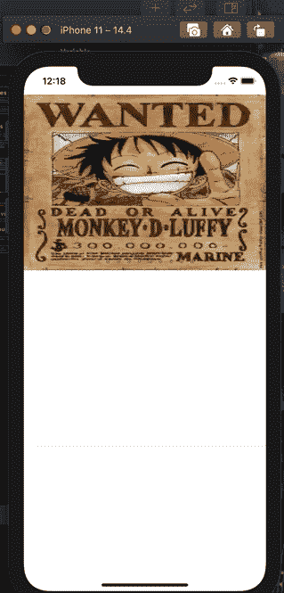

制作 banner 有两种方式，第一种是 UICollectionView，第二种是 UIScrollView + UIPageView。而在这篇文章中，我将向你展示如何通过 UIScrollView + UIPageView 制作横幅广告。

# 我从这次实践中学到的是:

*   更熟悉 UIScrollView 和 UIPageControl
*   如何同步页面和点
*   滚动 UITableView 不会影响横幅

# 我们开始吧！

首先，我们需要在横幅广告中显示几张图片，所以只需将它们放在 Assets.xcassets 文件中。我把图片命名为 0 到 9，因为添加到 UIScrollView 会更方便，我后面会解释。

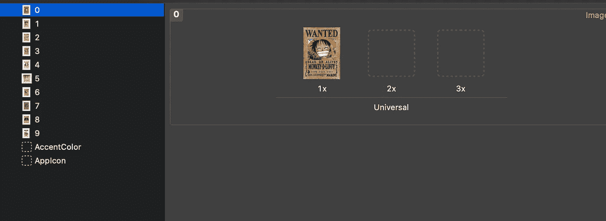

接下来，让我们在代码中创建一个 UITableView。我注册 2 个单元格的原因是因为第一个是横幅广告，另一个是你想在屏幕上显示的任何东西。

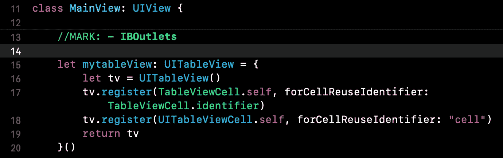

好，那我们就把我们的主要角色(UIScrollView & UIPageView)放在单元格里吧。但在此之前，我们需要为要注册的 UITableView 声明一个标识符。然后，我们需要创建一个数组来存储要放入 UIScrollView 的图像。

因为我们使用 for-in 循环将图像追加到数组中，所以最好同时设置帧，因为每个图像的 x 坐标应该是屏幕宽度乘以数组中的索引。这就是为什么我把这些图片命名为从 0 到 9，这正是我们想要的。

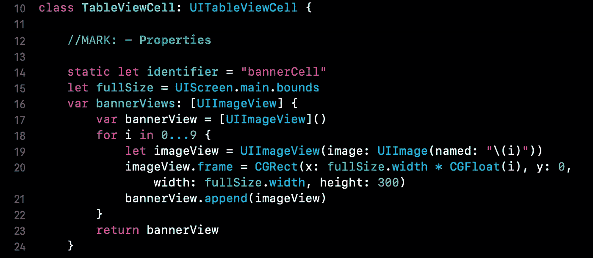

然后只需为 UIScrollView & UIPageControl 设置细节即可。对于设置 UIScrollView 的内容大小，应该是屏幕宽度乘以图片数(第 31 行)，并且记得将图片添加到 UIScrollView 中。(第 35 行)

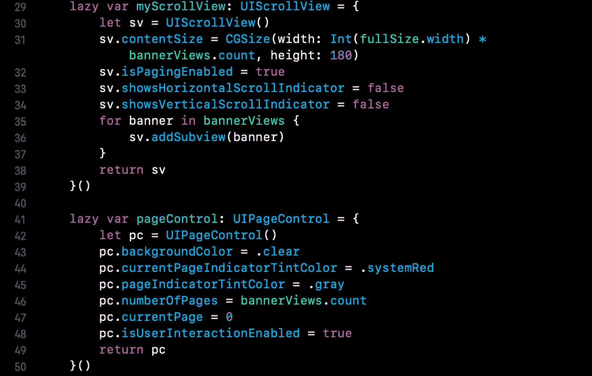

现在，我们可以转到 ViewController 来设置最终部分。首先，我创建一个枚举来区分我们想要控制哪个部分。我还需要一个与我们在视图中设置的数组相同的数组，因为我们将需要它来设置我们的 TableViewController 函数。

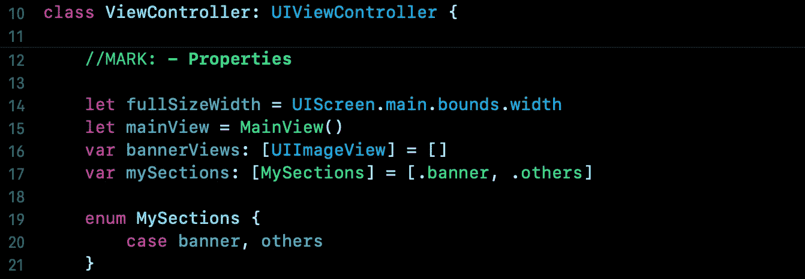

让我们将 UITableView 委托和 dataSource 设置为 self，并实现这些函数。如果我们使用 Enum 来分隔各个部分，而不是数字，我们的代码会更清晰，可读性更好。

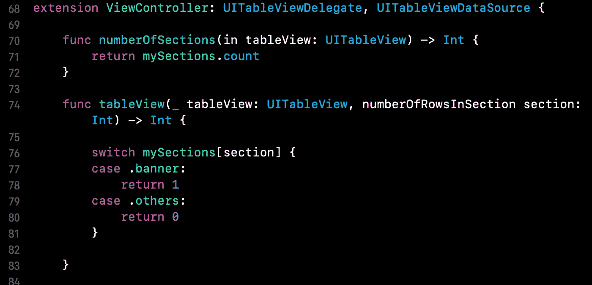

在 cellForRowAt 函数中，记住将我们刚刚声明的数组设置为等于我们在 UITableViewCell 中设置的数组。并将 UIScrollView 的委托设置为等于 self。

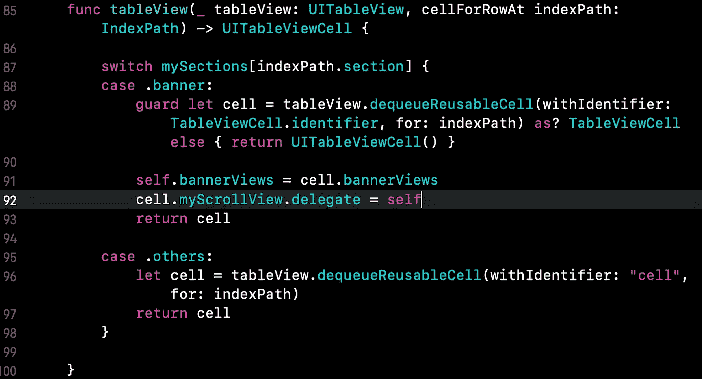

现在，如果你运行应用程序，你会看到你的 UIScrollView 和 UIPageControl 出现在你的单元格中，但高度不是我们想要的。因此，我们需要为每个部分设置高度。


你的应用现在应该是这样的:

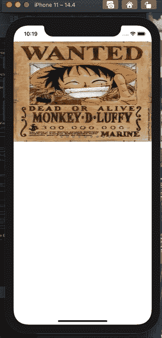

好吧，我们需要做几件事。当我滑动 UIScrollView 视图时，我希望圆点移动到正确的位置。当我单击这个点时，我希望它向前移动，UIScrollView 将转到正确的页面。

为了达到这个目的，我们需要再设置两个变量。xOffset 是 UIScrollView 的 x 坐标，currentPage 是 UIPageView 的点。并且一旦当前页面改变，xOffset 也将改变。

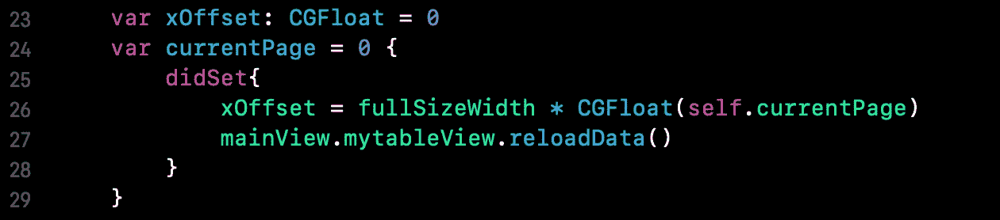

我们还需要 2 个函数来知道用户是向左滑动还是向右滑动。如果用户向左滑动，那么圆点应该向前移动。所以用户每次触发这个函数，currentPage 都会加 1。一旦它大于 bannerViews 中的最后一个索引，它将变为 0。对于 swipeRight 来说，这个概念是相同的，但它是相反的。

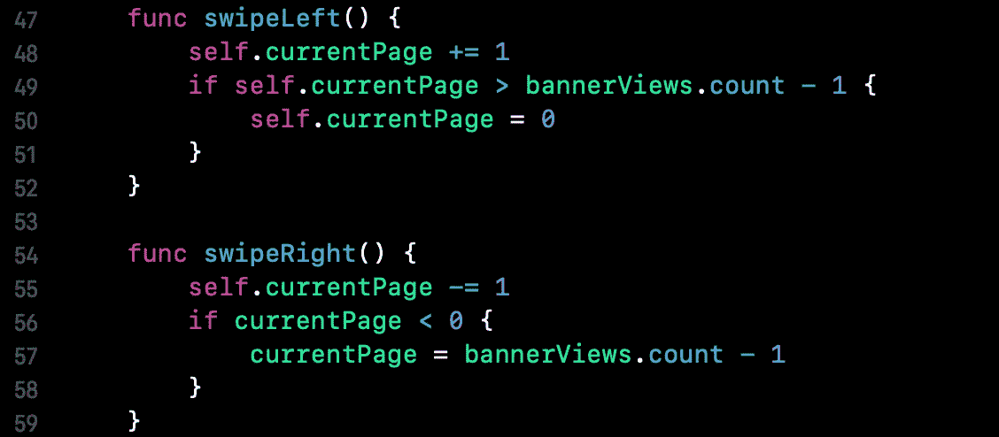

然后只需转到 cellForRow，将 UIPageControl 的 currentPage 和 UIScrollView 的 xOffset 设置为等于我们刚刚声明的 currentPage 和 xOffset。

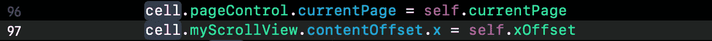

最后，为了检测用户是向左还是向右滑动，我们需要使用 scrollViewDidEndDecelerating 函数。translatedPoint.x 基本上是正数或者负数。当用户向左滑动时，translatedPoint.x 将为负，如果用户向右滑动，它将为正。所以只要把正确的功能放在正确的地方。


现在，当你滑动你的 UIScrollView 视图时，圆点应该能够移动到正确的位置。你可能会感到困惑，因为当你点击 UIPageControl 时没有任何反应，那是因为我们还没有这样做。所以，让我们为我们的 UIPageControl 添加一个函数。

实际上这很简单，当我单击 UIPageControl 的点时，我希望它前进，所以只需将 swipeLeft()放在 pageControlDidTap()中。

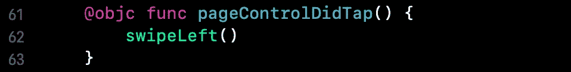

现在一切都应该没问题了。所以是时候设置定时器让它自动滚动了！

首先，让我们创建一个计时器，它将每 3 秒触发一次。因为我希望它向前移动，所以计时器的功能将被 swipedLeft()。请记住将 setTimer()放入 ViewDidLoad 中，并且不要忘记在 swipedLeft()前面添加@objc，否则我们无法构建和运行该应用程序。

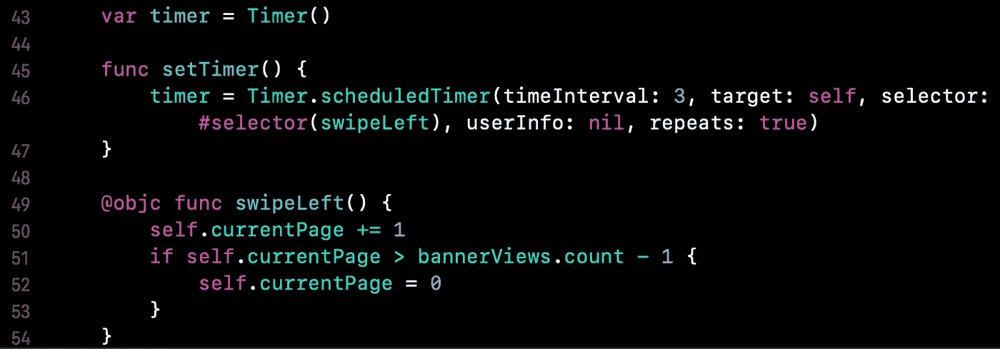

现在，你的 app 应该就像下面的 gif。我们可以改进的地方很少:

*   添加动画
*   当我们触摸 UIScrollView 或 UIPageControl 时停止计时器


我们可以调用 invalidate()来停止计时器，所以只要把这个函数放在任何我们想要停止它的地方。在这种情况下，当我单击 UIPageControl 并拖动 UIScrollView 时，我将调用该函数。

一旦用户停止拖动，不要忘记重启计时器(第 124 行)。

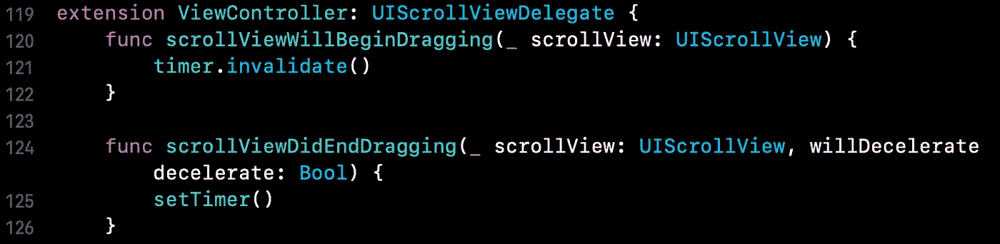

好，那么让我们在代码中添加动画。当 UIScrollView 的 x 坐标改变时，我们希望它有动画效果。所以只要把我们设置 UIScrollView 的 x 偏移量等于 self.xOffset 的代码放在 UIView 的 animate 函数中。


现在，你可能认为一切都很好，但你会发现当你滚动 UITableview 时，你的横幅广告会受到影响。这是因为 UITableView 和 UIScrollView 共享同一个 ScrollView。那么如何解决这个问题呢？

只需确定 scrollView 是否为 UITableView 即可。如果是，那就什么都不要做。代码如下所示。

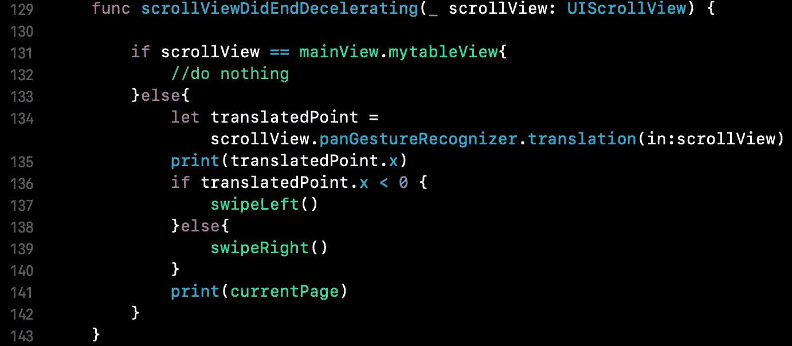

这是我这个项目的 Github:

```
[https://github.com/Sheng-Ping-Wang/AdBannerDemo/tree/main](https://github.com/Sheng-Ping-Wang/AdBannerDemo/tree/main)
```

希望这篇文章对想深入了解 UIScrollView & UIPageControl 的人有所帮助。如有任何意见，请留言。谢谢！