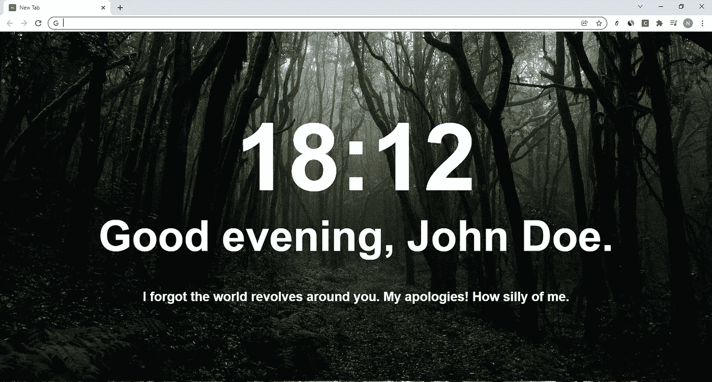
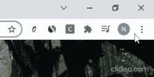
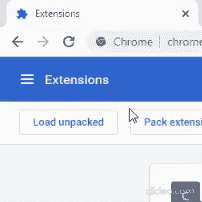

# 克隆拥有 300 多万活跃用户的 momentum chrome extension

> 原文：<https://medium.com/geekculture/make-a-clone-of-momentum-chrome-extension-which-has-3m-active-users-332c28525add?source=collection_archive---------5----------------------->

嗯，不是真正的克隆。我想对这个非常受欢迎的扩展做一个模仿，并给它一个扭转。本教程是从初学者到初学者，我将详细介绍什么是 chrome 扩展以及任何 chrome 扩展的基本架构。

让我们直入主题，这是我们的新标签在本教程结束时的样子，正如你所看到的，我不是通过引用和想法来激励用户，而是通过烘烤来激励自己



所以，chrome 扩展最基本的类型是为你的浏览器添加功能的扩展，另一种是主题。Chrome 主题是我们在本教程中要做的。

对于任何 chrome 扩展，基本组件是一个 manifest.json 文件，它可以被视为您的浏览器的说明手册，然后我们有一个内容脚本，后台脚本，一个 HTML 文件和一个 CSS 文件。

# 开始吧！

让我们做一些编码，好吗？👩‍💻

我个人使用 atom 来编码，它是免费且易于使用的，坦率地说，作为一个初学者，我没有太多使用其他 IDE 的经验，所以我们打算使用它。这里是你如何[获得 atom](https://atom.io/) 的方法，但是你可以随意选择任何 IDE，这对本教程来说应该没什么影响。

# 设置 manifest.json 文件

我们将放在一起的第一件事是一个 manifest.json 文件，它看起来像这样:

```
{
    "name": "momentum parody",
    "version": "1.0",
    "description": "roast you",
    "manifest_version": 3,
    "chrome_url_overrides": {
        "newtab": "homepage.html"
    }
}
```

这是一个 JSON 文件，以 JavaScript Object Notation (JSON)格式存储简单的数据结构和对象。

前几个字段是不言自明的，我们在其中命名我们的扩展，给它一个版本、描述和 manifest version 3，这是本文发表时的最新版本。然后你会注意到“chrome_url_overrides”，它定义了打开什么页面，而不是默认的 chrome 新标签，在我们的例子中是 homepage.html 的*。*

# 新建标签 HTML 文件

创建一个新文件，命名为 homepage.html。现在，我们将致力于 chrome 标签的布局，每次打开一个新标签时都会看到这个布局。我们需要的主要元素是当前时间、对用户的问候以及我们将从本地数组中随机生成的烤肉。

如果您对 HTML 有所了解，这个文件非常容易阅读和理解:

```
<!DOCTYPE html>
<html><head>
    <meta charset="UTF-8">
    <meta name="viewport" content="width=device-width, initial-scale=1.0">
    <meta http-equiv="X-UA-Compatible" content="ie=edge">
    <link rel="stylesheet" href="homepagecss.css">
    <title>New Tab</title>
</head><body style="background-image: url('your-image-url.jpg');">
    <h1 id="currentTime"> </h1>
    <h1 id="greetingHeading"> </h1>
    <h1 id="roasts"> </h1> <script src="random_roast.js"></script>
    <script src="time.js"></script></body></html>
```

定义头部和元数据，如果你是 HTML 新手，阅读一下[头部标签](https://www.w3schools.com/html/html_head.asp#:~:text=The%20element%20is%20a,scripts%2C%20and%20other%20meta%20information.)会很有帮助。在 head 标签中，我们定义了 CSS 文件(我们将在后面讨论)和新标签的标题，例如，“HTML head Elements”是标签的标题，如下所示。


然后我们在[主体标签](https://www.w3schools.com/tags/tag_body.asp)中定义元素，我们给它一个像本地图像的样式，你可以选择任何一个，但是我从 [Unsplash 选择了一个漂亮的森林主题图像。](https://www.istockphoto.com/photo/nature-gm1360246100-433331271?utm_source=unsplash&utm_medium=affiliate&utm_campaign=srp_photos_top&utm_content=https%3A%2F%2Funsplash.com%2Fs%2Fphotos%2Fpexels-francesco&utm_term=pexels%20francesco%3A%3A%3A)

```
<body style="background-image: url('pexels-francesco-ungaro-1671324.jpg');">
</body>
```

现在在 body 标签中，我们将添加我们的时间，问候用户，并使用 header 标签 h1 随机生成烤肉。

```
<body style="background-image: url('pexels-francesco-ungaro-1671324.jpg');">
    <h1 id="currentTime"> </h1>
    <h1 id="greetingHeading"> </h1>
    <h1 id="roasts"> </h1>
</body>
```

目前，HTML 文件不会做任何事情，只是简单地显示图像，因为我们还没有定义 h1 头的内容。我们将使用 JavaScript 来添加显示当前时间的功能，根据时间问候用户，并从本地数组中生成随机烘烤

# 使用 JavaScript 中的日期对象显示当前时间和问候语

创建一个新文件并将其命名为 time.js，为了实现这个功能，我们将在 JavaScript 中使用 date 对象。对象返回本地系统的当前日期和时间。

```
function updateTime(){var today = new Date();
if(today.getMinutes() < 10){
  var time = today.getHours() + ":0" + today.getMinutes();
}
else if(today.getMinutes() >= 10){
  var time = today.getHours() + ":" + today.getMinutes();
}
var t = document.getElementById('currentTime');
t.innerHTML = time;
```

日期和时间在今天变量中返回，我们使用*。getHours()* 和*。getMinutes()* 以 HH:MM (24 小时制)格式显示时间。Javascript 不会将时间返回为 01 或 09，如果。如果小于 10，则获取分钟数，因此我们需要在字符串中添加一个 0，如果分钟数小于 10，则将我们的时间格式更正为 HH:MM，如这行代码所示。

```
if(today.getMinutes() < 10){
  var time = today.getHours() + ":0" + today.getMinutes();
}
```

我们现在可以实现 if 和 else 语句来检查当前的时间，并向用户输出正确的问候。*document . getelementbyId()*和 *innerHTML* 帮助我们使用在 HTML 文件中定义的 id 输出问候。

```
const greet1 = "Good morning, John Doe.";
const greet2 = "Good afternoon, John Doe.";
const greet3 = "Good evening, John Doe.";var greeting = document.getElementById('greetingHeading');if (today.getHours() > 4 && today.getHours() < 12) {
  greeting.innerHTML = greet1;
}
if(today.getHours() >= 12 && today.getHours() < 16){
  greeting.innerHTML = greet2;
}
if(today.getHours() >= 16 && today.getHours() <= 24){
  greeting.innerHTML = greet3;
}
```

最后一步是自动更新时间，我们可以通过添加 *setInterval(函数，时间(毫秒))*来完成。 *setInterval()* 函数接受两个变量，第一个是你要更新的函数名，第二个是函数的更新频率。

```
setInterval(updateTime, 10);
```

# 从本地数组输出随机烘烤

我们会新建一个文件，命名为*random _ bake . js*。在这个文件中，我们将用你选择的烤肉制作一个常量数组，你可以随意填充。让我们再次从 id 为“roasts”的 HTML 文件中获取我们的空标签，并使用 *innerHTML* 和一个简单的随机化函数，我们可以随机化每次打开新标签时显示在屏幕上的 roasts。

```
const roasts = ["roast 1","roast 2","roast 3","add your own roasts"];var roast = document.getElementById('roasts');
roast.innerHTML = roasts[Math.floor(Math.random() * roasts.length)];
```

# 使用 CSS 给我们的 homepage.html 添加样式

新建一个 CSS 文件，命名为 *homepage_style.css* 。我选择了一种看起来和[动量扩展](https://momentumdash.com/)中使用的字体非常相似的字体，为了更好的可读性，我把所有的文字都保持为白色，但是，你可以随意摆弄。

```
*{
    color: white;
}#greetingHeading{
    margin-top: 0in;
    font-size: 1in;
    font-family: -apple-system, BlinkMacSystemFont, "Neue Haas Grotesk Text Pro", "Helvetica Neue", Helvetica, Arial, sans-serif;
    text-align: center;
}#currentTime{
    margin-top: 1.7in;
    margin-bottom: 0in;
    font-size: 2.2in;
    font-family: -apple-system, BlinkMacSystemFont, "Neue Haas Grotesk Text Pro", "Helvetica Neue", Helvetica, Arial, sans-serif;
    text-align: center;
}
#roasts{ font-size: 0.3in;
    font-family: -apple-system, BlinkMacSystemFont, "Neue Haas Grotesk Text Pro", "Helvetica Neue", Helvetica, Arial, sans-serif;
    text-align: center;
}
```

# 把这一切放在一起，🧰

现在，你应该有一个名为 *manifest.json，homepage.html，time.js，random _ bake . js，*和 *homepage_style.css* 的文件。一旦你把所有这些文件放在一个文件夹中，你就可以启动你的 chrome 扩展了！现在，在 chrome 上的搜索栏中键入 *chrome://extensions/* 或者从 chrome 工具栏右上角的按钮导航到扩展页面，然后打开开发者模式👩‍💻👨‍💻



**Turn on developer mode in chrome browser**

之后，点击加载解压缩，并选择与您的所有文件的文件夹。



**Click on Load Unpacked and select the folder with all your files**

瞧，你有了你的第一个 chrome 扩展。但是从现在开始你打开的每一个新标签都会侮辱你。如果您不想再使用该扩展，您可以随时禁用或删除它。如果您有任何问题，请告诉我，我会尽快回复您！

这里是这个项目的 [Github 链接](https://github.com/aggarwalnatik/momentum_parody)供你参考🙂