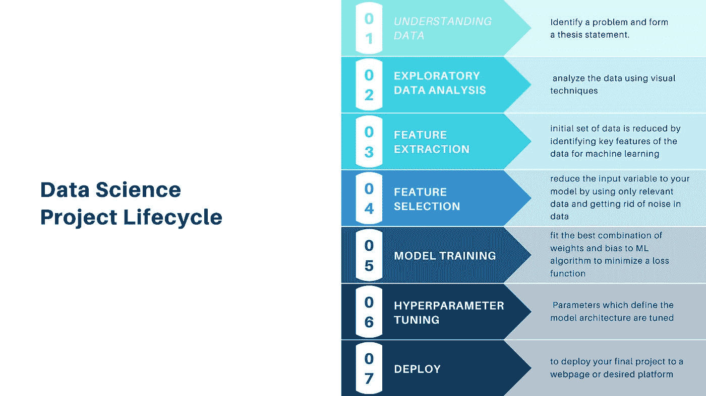
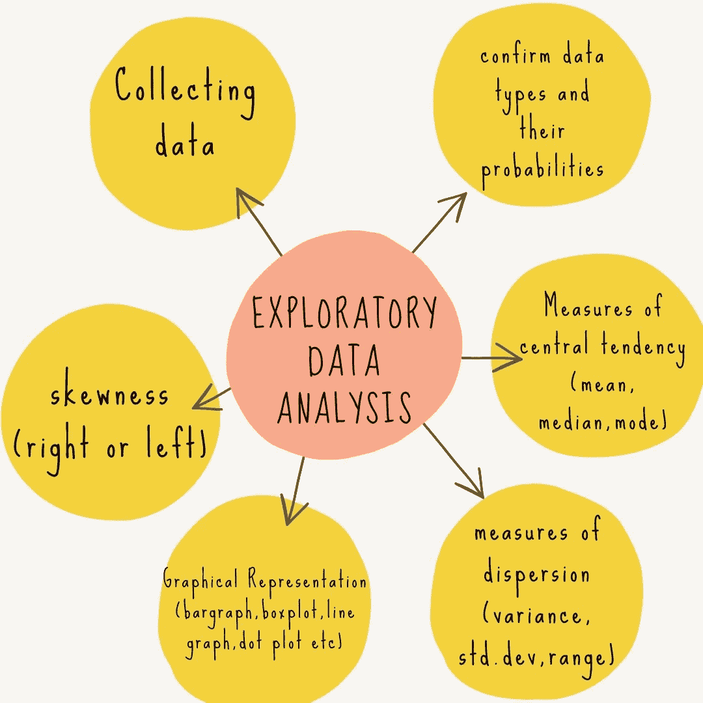
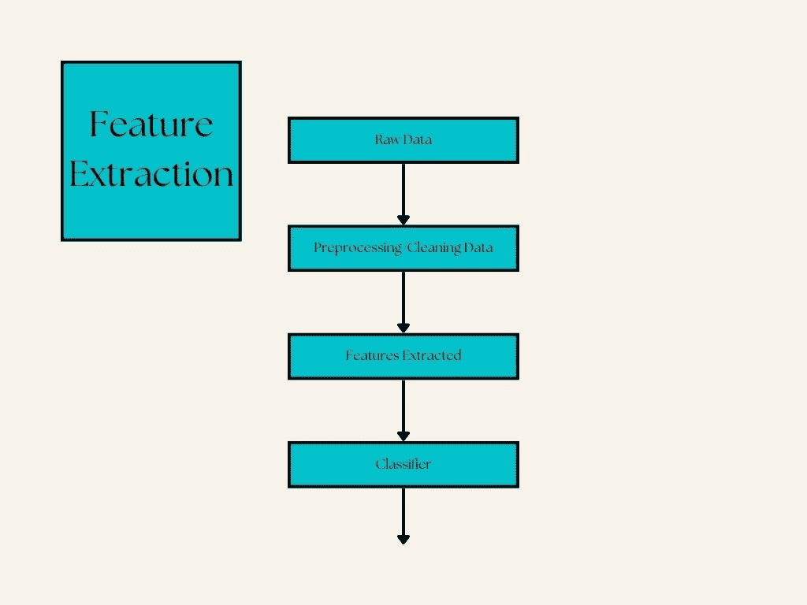
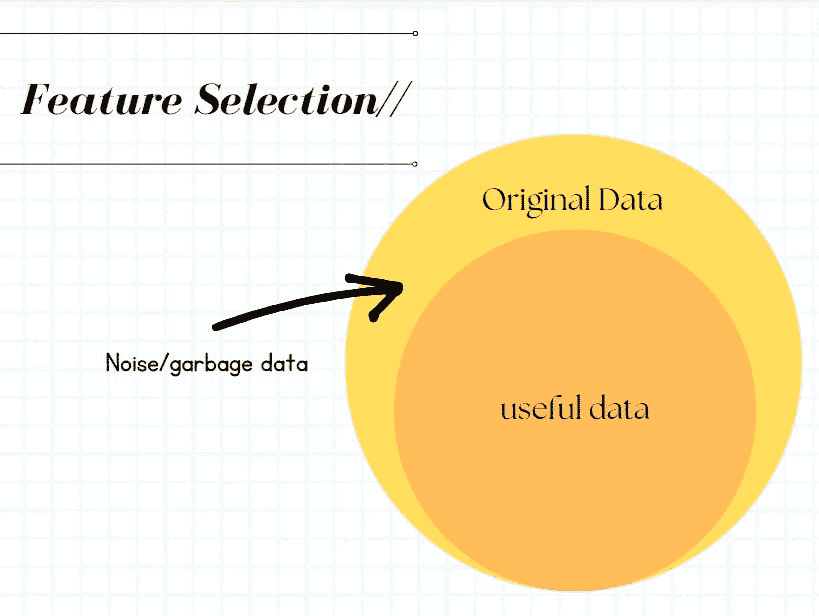
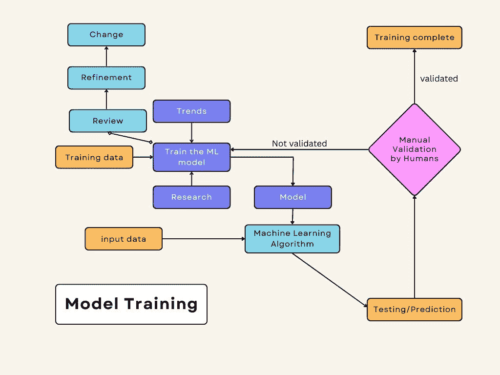
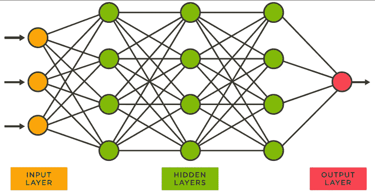

# 以正确的方式开展数据科学项目—数据科学生命周期

> 原文：<https://medium.com/geekculture/make-a-data-science-project-the-right-way-data-science-lifecycle-7d59d4cf97c6?source=collection_archive---------7----------------------->

Photo by [Desola Lanre-Ologun](https://unsplash.com/@disruptxn?utm_source=medium&utm_medium=referral) on [Unsplash](https://unsplash.com?utm_source=medium&utm_medium=referral)

数据科学项目的生命周期只不过是每个项目必须经历的过程，这些步骤是使项目成功和有用的基本部分。许多团队参与完成一个项目，但协调和沟通使每个人都更轻松，压力更小

# 为什么我们需要数据科学项目生命周期？

Photo by [Simone Secci](https://unsplash.com/@simonesecci?utm_source=medium&utm_medium=referral) on [Unsplash](https://unsplash.com?utm_source=medium&utm_medium=referral)

让我们一起思考，如果我们想在任何研究领域进行任何实验，我们首先要找到“数据”，然后如果我们得到数据，我们就更进一步。因此，为了获得有用和相关的数据，我们找到的数据必须经过许多过程，数据必须是干净的，没有错误或缺失值，这样不仅我们，项目的其他成员也可以使用它。

在数据科学项目中，数据是项目的核心部分。数据必须经过许多人，必须被使用和计算，因此必须考虑许多基本要求，让我们看看数据科学生命周期中的步骤。

# 数据科学项目生命周期

## 了解业务和数据需求

要开始任何项目，我们需要了解客户/用户的需求，我们需要问这样的问题:

*   他们想要什么？
*   为了优化过程和结果，我们需要满足和重新思考哪些需求？
*   商业标准是什么？客户提到了哪些业务需求？
*   完成数据科学生命周期项目中的每个步骤需要多长时间？有多少时间？
*   这个项目越来越贵了吗？我们可以通过使用不同的工具来降低价格吗？
*   客户是否提供任何数据？如果没有，那么我们可以在哪里找到数据？我们如何找到数据？将投入多少资金、时间和资源来查找相关数据？我们买得起吗？
*   客户提供任何“问题专家”吗，或者我们必须找到一个？我们能负担得起吗？

对于小规模的数据科学项目来说，这些问题听起来可能有些牵强或不相关，但是提出这样的问题可以减少解决每个问题所耗费的额外时间，并有助于更快地完成项目。

## 探索性数据分析

EDA 包括探索和寻找所需的数据。客户/顾客可能会提供一些数据，但是很多时候需要访问更多的数据来了解业务/任务的复杂性。

EDA 包括可视化和总结数据，以向所有利益相关者解释趋势，趋势是有用的，因为我们可以预测未来的结果，并提前为它们制定计划。

EDA 中使用了大量的统计数据，统计数据用于所有步骤，但在 EDA 中这很特别，因为如果我们在 EDA 中从数据中找出投影，那么我们就不必在数据集中应用 ML 算法，这更面向资源且耗时。

## 特征抽出

在特征提取中，我们降低了数据集的维数。特征提取帮助我们以模型支持的格式获得原始数据。数据中的不同变量被转换为数字特征，这将减少计算时间并提高模型的效率。

我们使用特征提取方法的原因如下:

*   为了减少计算时间
*   为了减少使用的资源
*   为了节省时间
*   为了优化 ML 模型

## 特征选择

在特征选择中，我们减少了数据集的必需列，假设您有一个教室中的学生数据集:

在这里，我们可以看到有如此多的列和特征，我们可以对它们进行操作、合并或从中提取子特征，以创建一个有用的数据集。

在机器学习模型中，值比什么都重要，如果在 ML 模型中计算某个未计算列的值，那么许多错误会浪费我们的时间、资源和金钱。

数据集中不相关的不需要的数据称为垃圾数据，为了使模型准确高效，垃圾数据不应该出现在数据集中。

## 模特培训

在模型训练中，我们尝试将偏差和权重的最佳组合拟合到 ML 算法，以最小化预测范围内的损失函数。模型训练的目的是为数据集建立最佳的数学函数/关系，以使损失最小化，并在结果中实现准确性。

模型训练是数据科学项目生命周期中最重要的部分，其中数据是根据人工验证和训练数据进行验证和测试的。

为了训练模型，数据集被分成“训练数据集”和“测试数据集”，训练数据集用于根据特征值训练模型，而测试数据集用于检查模型的准确性。

## 超参数调谐

在创建 ML 模型时，基于以下问题会有许多选择:

*   你有什么数据？
*   那是什么类型的数据？
*   你的最终目标是什么？
*   我有多少时间做这个？
*   我有哪种资源？

这样的问题肯定会帮助你加快工作速度，并优化你的资源以获得最佳结果。超参数调整无疑提高了模型的性能。

所以首先我们需要理解什么是 ML 训练模型中的参数和超参数，

例如，您有一个神经网络模型:

隐藏层中的节点将是“参数”，并且由节点上的每个输入引起的标量值将是“超参数”。

超参数被调整为以优化的方式拟合模型，以便每个输入的输出更接近真实的输出数据，这意味着测试数据集的输出集更接近或等于定型数据集的输出。

更多详细信息可以参考:[https://cloud . Google . com/ai-platform/training/docs/hyperparameter-tuning-overview](https://cloud.google.com/ai-platform/training/docs/hyperparameter-tuning-overview)

## 部署

数据科学团队完成所有工作后，项目将被发送到所需的平台上进行部署。

一些流行的项目部署平台有:

1.  [AWS 代码部署](https://aws.amazon.com/codedeploy/?tag=mochaglobal20-20)
2.  [章鱼部署](https://octopus.com/)
3.  詹金斯
4.  [团队城市](https://www.jetbrains.com/teamcity/)
5.  [部署 Bot](https://deploybot.com/)
6.  [GitLab](https://about.gitlab.com/)
7.  [竹子](https://www.atlassian.com/software/bamboo)
8.  [CircleCI](https://circleci.com/)
9.  [代码船](https://www.cloudbees.com/products/codeship)
10.  [谷歌云部署经理](https://cloud.google.com/deployment-manager/docs)

一些流行的应用程序部署平台有:

1.  [Heroku](https://id.heroku.com/login)
2.  [AWS 放大器](https://aws.amazon.com/amplify/)
3.  网络生活
4.  [火基](https://firebase.google.com/)
5.  [维尔塞尔](http://www.vercel.com)
6.  [GitHub 页面](https://pages.github.com/)
7.  [谷歌应用引擎](https://cloud.google.com/appengine)
8.  [浪涌](https://surge.sh/)
9.  [渲染](https://render.com/)

*注意:我将会写更多关于以上标题的博客。*

数据科学项目的生命周期都是为了节省您的时间和资源，所以引用 ***史蒂夫·乔布斯*** 的话很合适:

> 我们的时间有限，所以不要浪费在过别人的生活上。不要被教条所困——那是生活在别人思考的结果中。”