# 制作一个通用角度表。过滤，整理准备。

> 原文：<https://medium.com/geekculture/make-a-generic-angular-table-filter-sorting-preparation-3060900e45b7?source=collection_archive---------12----------------------->

## 具有漂亮特征的普通桌子。

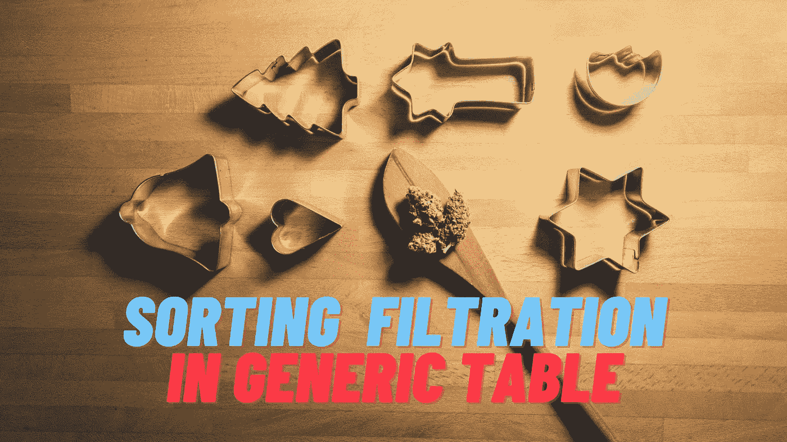

在[前一部分](/geekculture/make-a-generic-angular-table-represent-new-data-in-easiest-way-cd2471081941)中，我们创建了一个骨架。我们的表可以处理不同类型的数据。在这一部分，我们将检查它是否是真的，我们将增加新的功能，如排序，过滤。

**不同的数据**

在我们的第二个表中，我们将显示关于元素的信息。

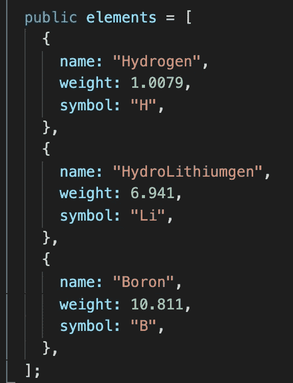

## **新表设置**

表组件需要有新的表设置实现来表示新的数据类型。就这样。我们的表已经为新数据准备好了。

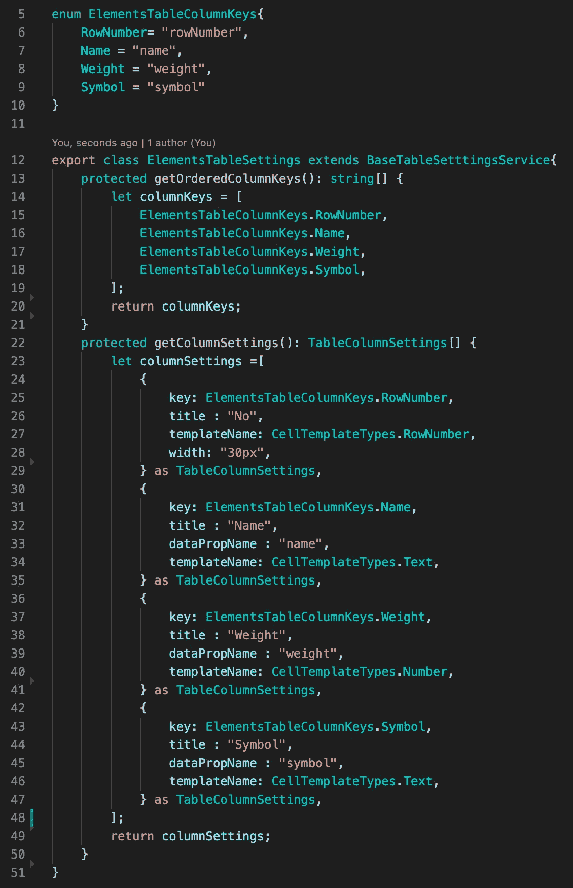

## **改进**

现在我们需要添加过滤和排序。我觉得把表格组件一分为二会更好。第一个包含所有表逻辑。第二个将代表列逻辑。列组件有几个数据和列设置的输入。从列设置中，我们需要一个数据属性名称和列类型，以正确的方式显示正确的信息。如果将来我们需要添加新的列模板，我们将在这里添加它。

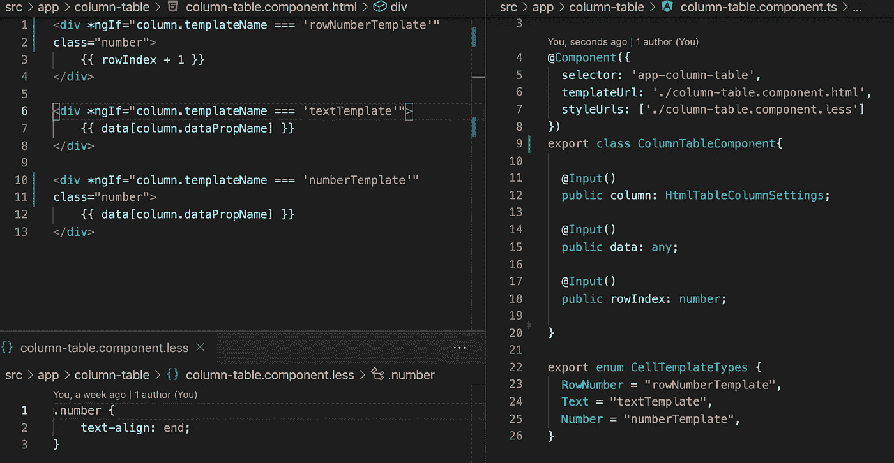

**排序**

为了支持排序，我们需要向 TableColumnSettings 添加两个新属性— allowSorting 和 sortingType。默认情况下，基表设置类将其设置为 true。

在 html 中，我们需要使我们的标题可点击，以改变排序类型，并显示什么是排序。

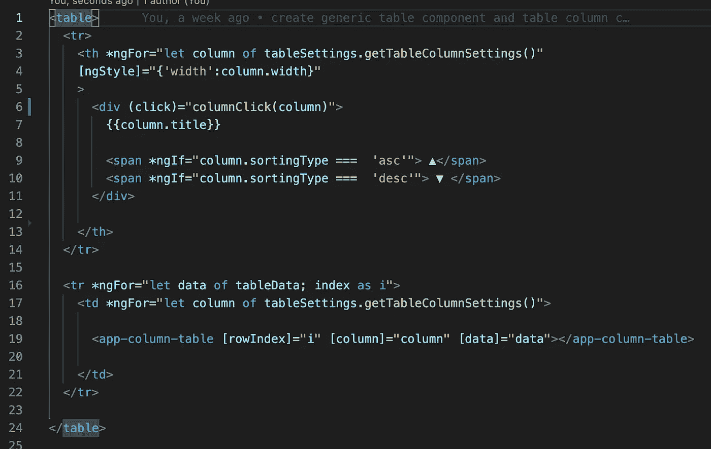

我们不会写一个排序算法，我们只是为这个准备我们的表。单击处理程序正在设置正确的排序类型:无、升序或降序。

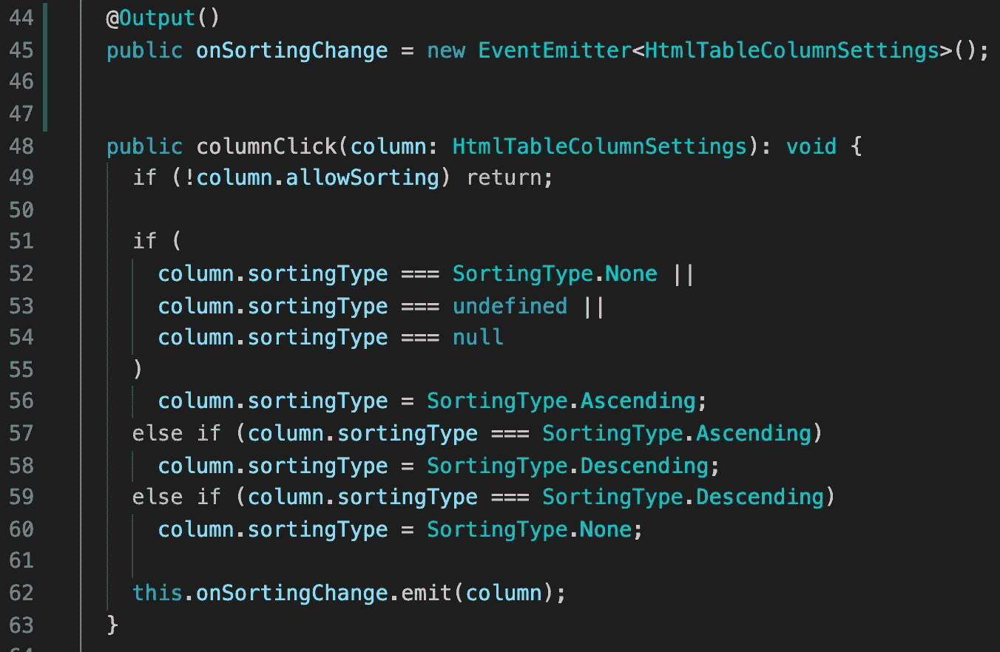

**过滤**

为了支持过滤，我们必须改变很多东西。首先是模型。现在我们必须有两个模型。我们将使用第一个模型来设置列设置，第二个模型是第一个模型的变形，有一些不同之处。大多数情况下，它有一些过滤绑定设置，如过滤文本和允许过滤。

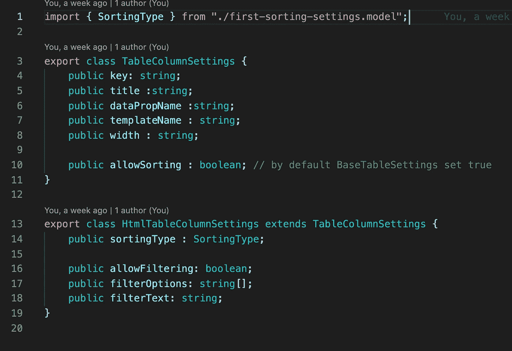

Html 现在有一个过滤行，该行绑定到表设置列，我们将只在用户按下 enter 后设置过滤。如果没有标题边距值，我们的列标题将总是在它的单元格的中间，这没问题，但当我们有一个过滤行时，中间的位置就变了。该属性将所有表格标题保持在同一可视级别上。

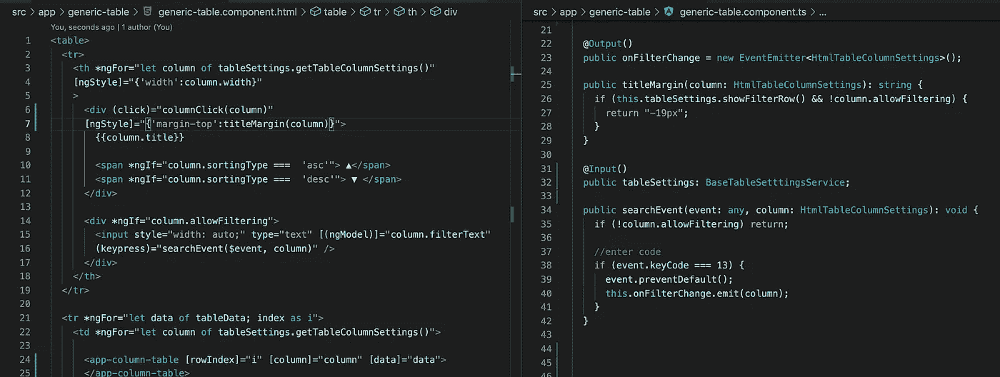

**设置设置表**

为了在表设置中添加过滤，我们只需要一个可选的覆盖方法 getFilterColumnSettings()。在基类中，它返回 null。让我们把它放在你的学生桌设置中。

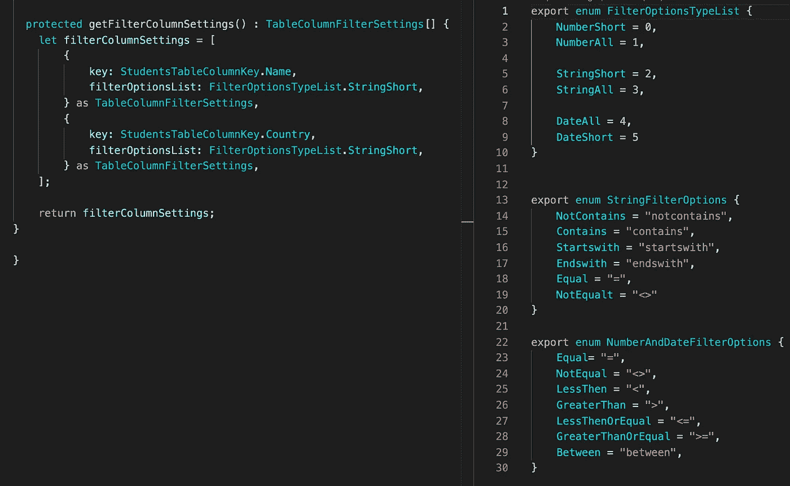

在上图的右边，我们可以看到几个菜单，让用户可以选择过滤。我认为大多数用户只需要三个过滤器选项:字符串的包含、开始于、结束于，数字和日期的等于、小于、大于，这些选项都在短列表中。

**列生成器更改**

因为我们在列设置模型中添加了新的属性，所以我们需要更改类列生成器。首先，我们现在使用地图类，这个类帮助我们找到重复，并防止复制粘贴错误。

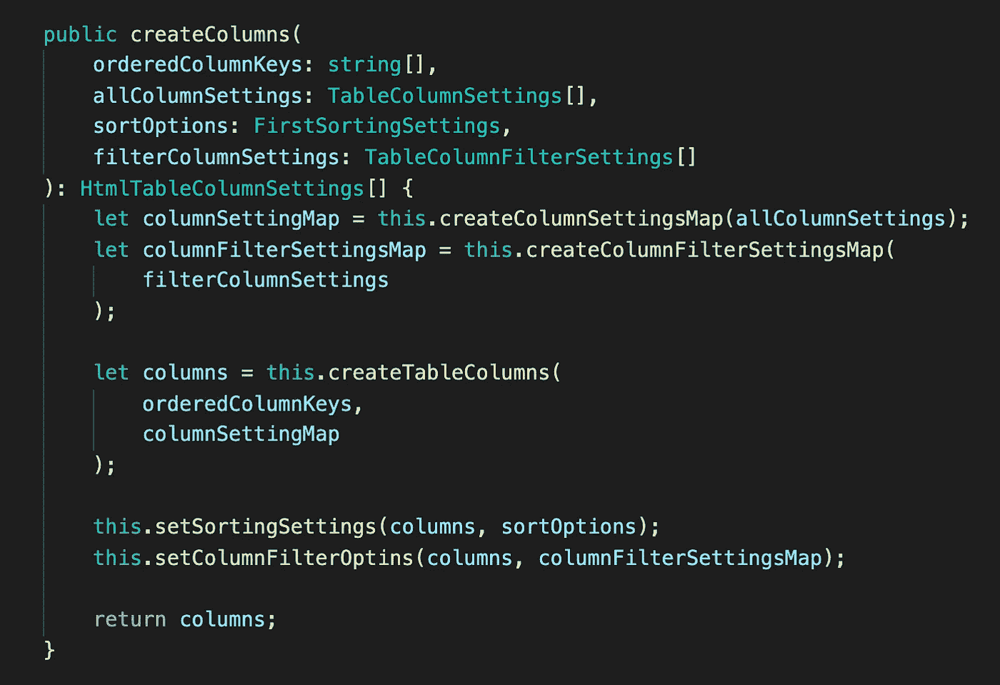

在这之后，我们只需添加过滤和排序设置。

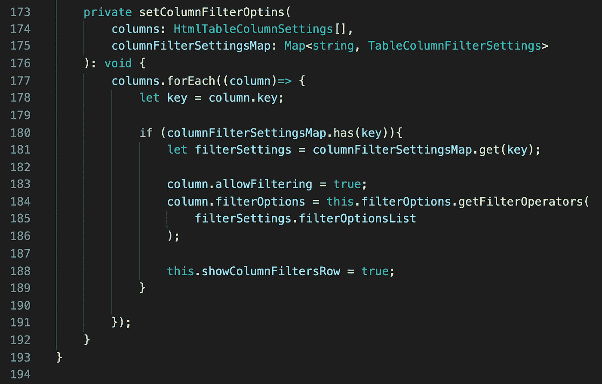

**结果**

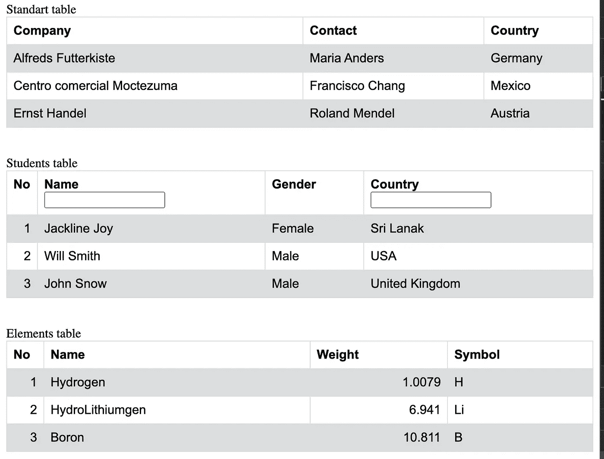

现在我们的桌子已经准备好了，看起来很漂亮。如果你需要仔细看看[项目，这里有链接。](https://github.com/8Tesla8/table-settings-helper)最后一步是将逻辑用于排序和过滤。这可能是你的作业。你可以很容易地把任何逻辑放在表格组件之外，我们有事件发射器。

*原载于 2021 年 4 月 11 日*[*http://tomorrowmeannever.wordpress.com*](https://tomorrowmeannever.wordpress.com/2021/04/11/make-a-generic-angular-table-filter-sorting-preparation/)*。*