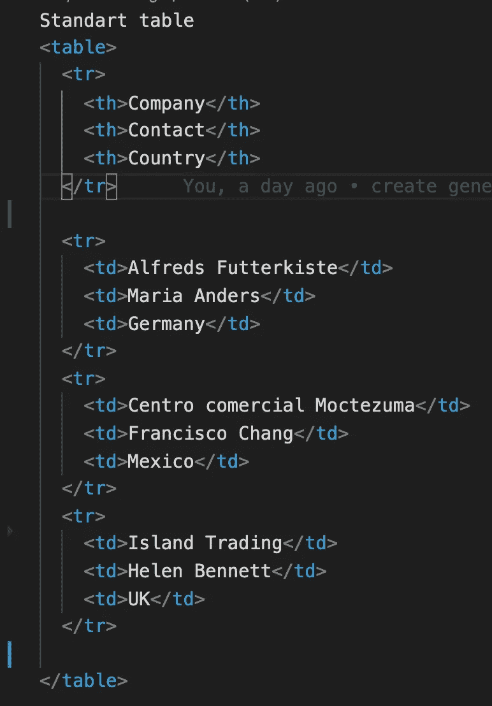
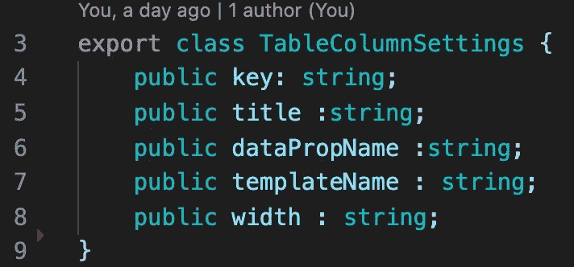
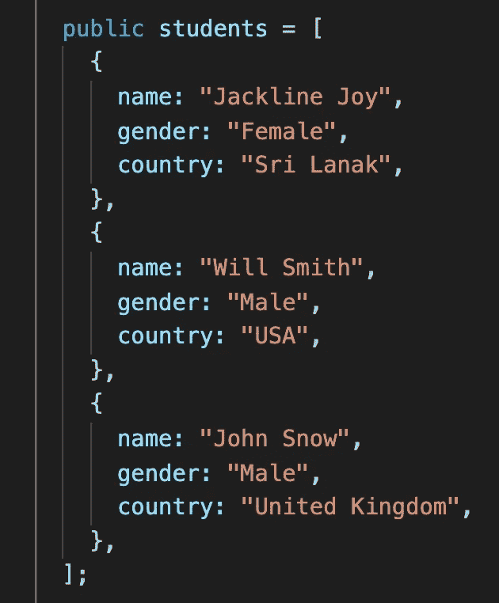
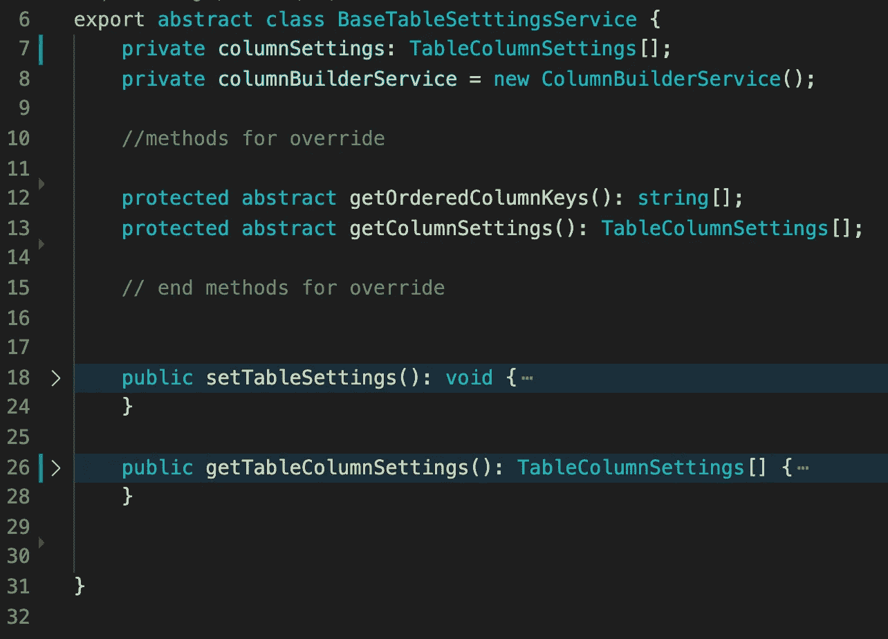
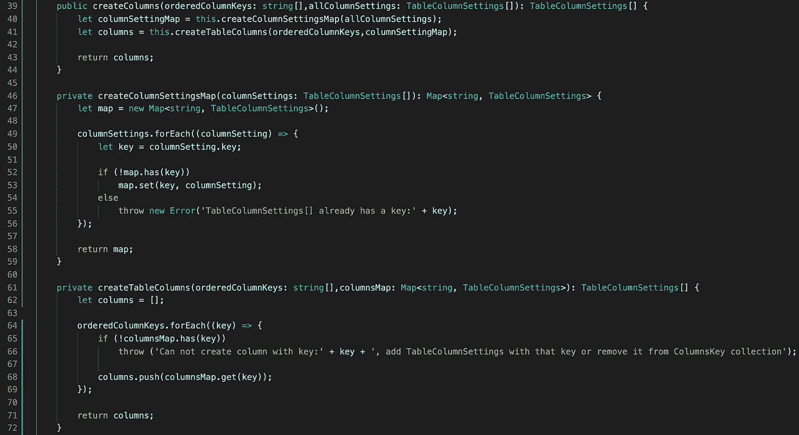
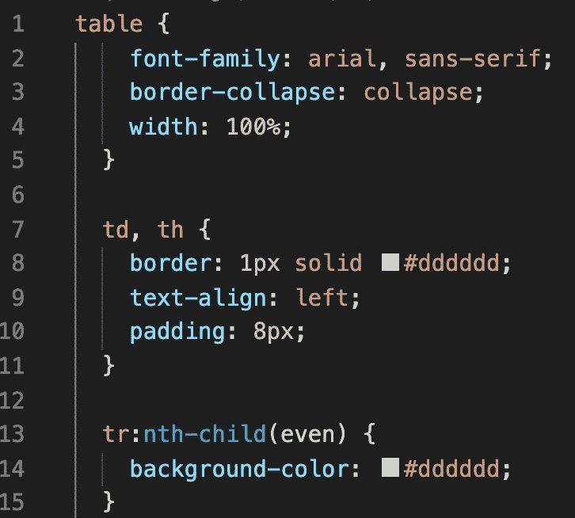
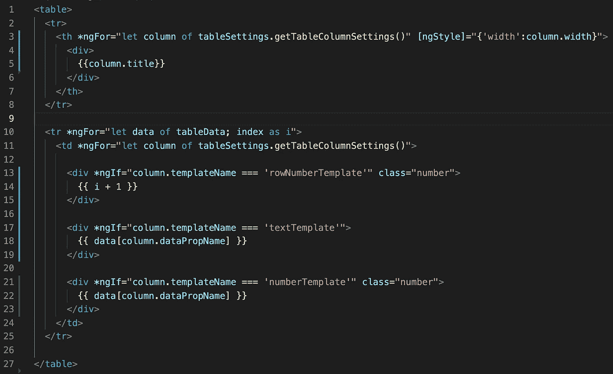
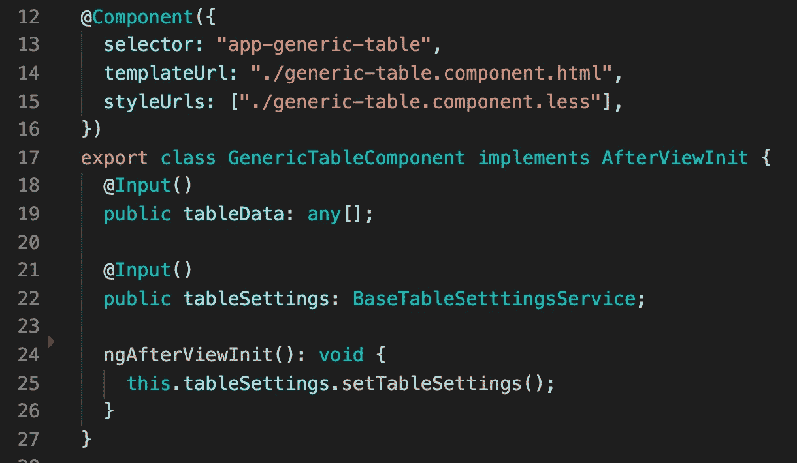
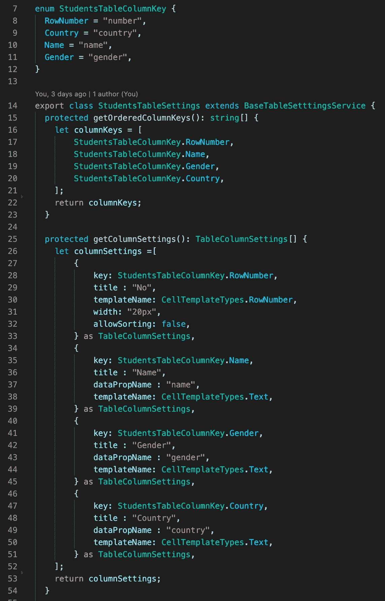
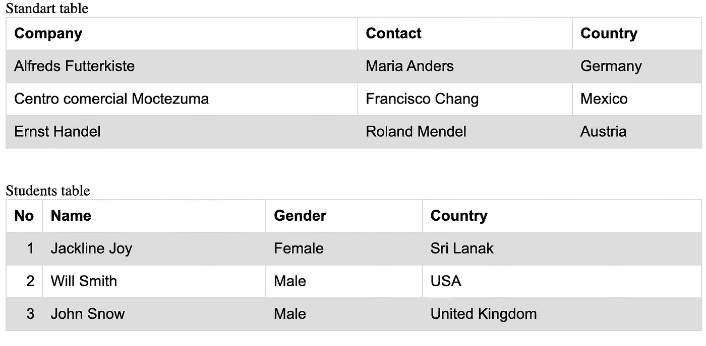

# 制作一个通用角度表。以最简单的方式表示新数据。

> 原文：<https://medium.com/geekculture/make-a-generic-angular-table-represent-new-data-in-easiest-way-cd2471081941?source=collection_archive---------3----------------------->

## 不同数据的公共表

**问题**

在许多情况下，向用户显示数据的最佳方式是使用表格。首先，您可能会将一个表中的代码复制并粘贴到另一个表中，然后根据需要调整这个表。如果你走这条路，最终你会发现自己在一个有很多几乎相同的表的项目中。然后，您需要在所有表中添加一个特性。这个任务会耗费大量时间，会变成一场噩梦。你肯定不想做这种类型的任务。
这个问题能有什么解决办法？灵活的桌子是我们的救星。想象一张易于摆放且灵活的桌子。

**计划**

我们的目标是制作一个灵活的表，我们可以通过使用基类和继承的逻辑从外部设置它。我们将有一个表组件、帮助建立表的模型和将完成几乎所有工作的基表服务。当我们需要建立一个新的表时，我们将在已交付的类中覆盖 couple 方法。

每个表都有两个重要的东西，列和数据。当我们查看干净的 html 代码时，我们可以看到里面有不同数据的相同代码。

**型号**

第一步是用所有设置定义一个列模型。基本上，模型将包含关于属性名称、标题、宽度、单元类型和唯一标识符的信息。

在我们的表格中，我们将显示一个简单的学生列表。

**基础表设置**

我们的主类将是抽象的，因为我们希望强制 deliver 类覆盖为我们提供列设置和列顺序的方法。这些方法为我们提供了独立更改顺序或列设置的灵活性。

在第 8 行我们有一个有趣的类— ColumnBuilderService。该服务为 html 表格生成表格列。我将创建列的逻辑放在不同的类中，因为我认为让几个类承担一个责任更好。

**ColumnBuilderService**

Column builder 进行了几次检查，以确保没有重复项，并且我们已经完成了制作表格所需的所有设置，然后它给出了我们想要查看的列的数组。

**组件**

现在是时候创建一个包含通用表的组件了。

半铸钢ˌ钢性铸铁(Cast Semi-Steel)

Css 很简单，只需添加一些样式，使它有点花哨。

超文本标记语言

棱角分明的‘森林’循环是我们的救星。这些循环为我们做了所有的工作。我们只需要从表设置中取出一个数组。

分时（同 timesharing）

在 TS 文件中，我们定义了设置数据的输入和基本设置的实现。

**基表设置的实现**

为了使代码简洁，最好创建一个枚举来表示列键。我们的 student table settings 类重写方法，以正确的顺序返回一个列键数组和一个列设置数组，以我们想要的方式表示数据。

**结果**

当我们需要添加一个新的列时，我们只需在列设置的数组中添加一个新的实体，并在列键数组中放置一个新的列键。如果我们需要为列添加一个新的模板，我们需要将它添加到一个组件中，并给它一个惟一的名称。

[在下一篇文章](/geekculture/make-a-generic-angular-table-filter-sorting-preparation-3060900e45b7)中，我们将添加排序、过滤的设置，并将添加一个新实体。

*原载于 2021 年 4 月 8 日 http://tomorrowmeannever.wordpress.com***。**