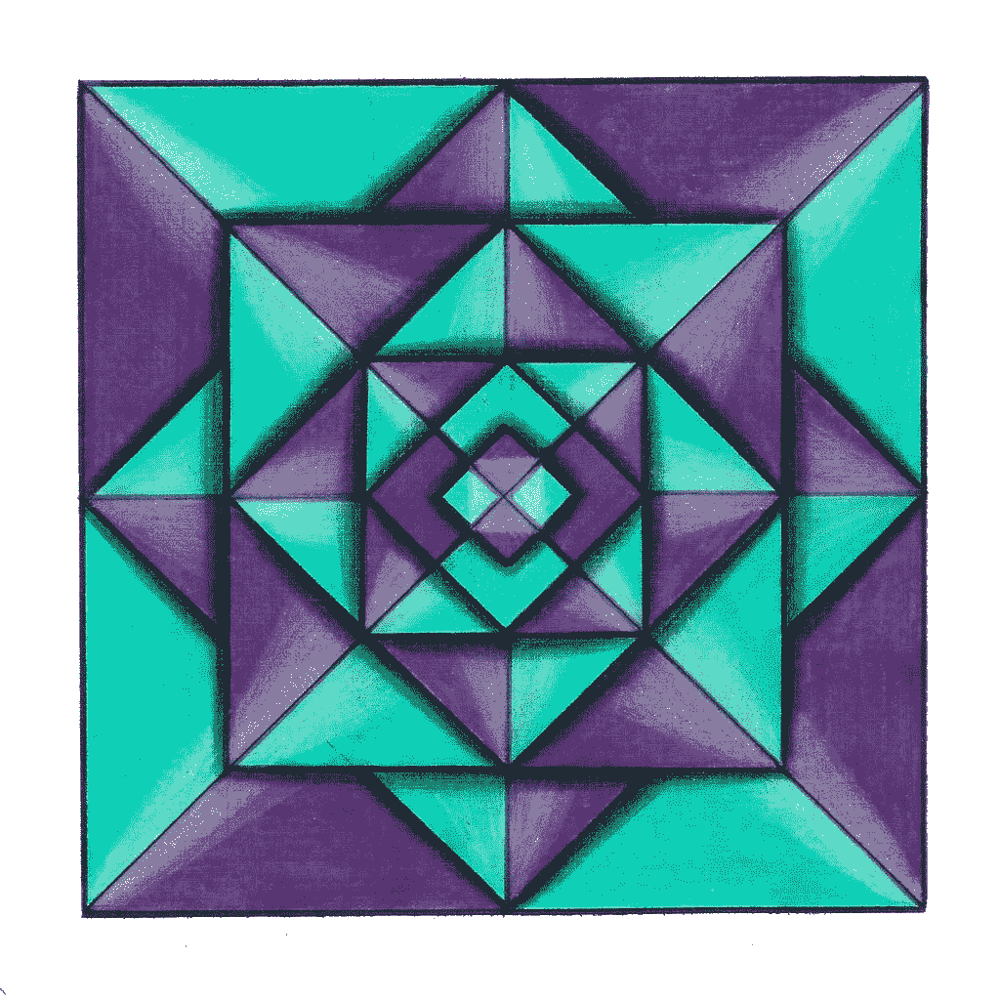

# 使用 Python 创建几何分布

> 原文：<https://medium.com/geekculture/make-a-geometric-distribution-using-python-7f0c95bb1211?source=collection_archive---------10----------------------->

几何分布是在重复的伯努利试验中获得第一次成功所需的试验次数。重复的伯努利试验意味着所有的试验都是相互独立的，每个结果都有两种可能的结果，要么成功，要么失败。

几何分布的公式定义如下