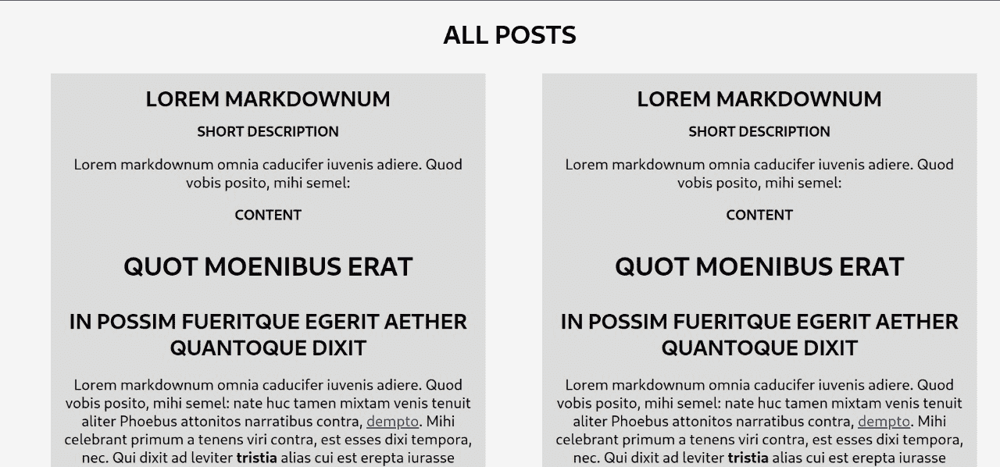
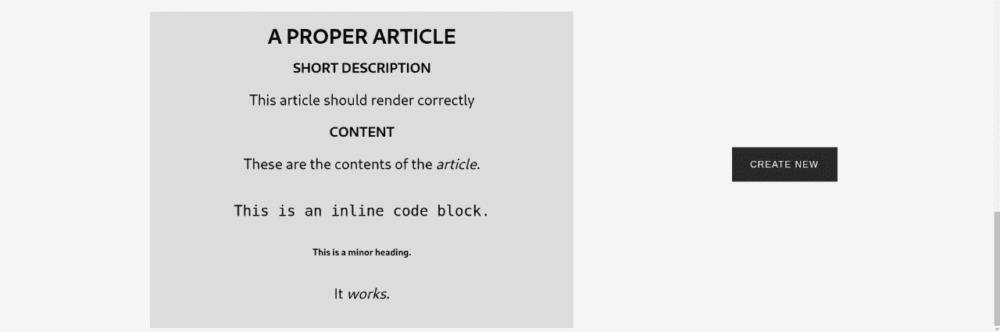
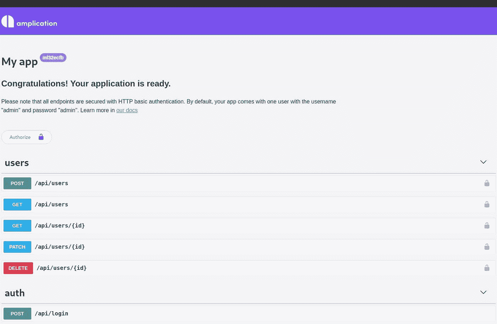
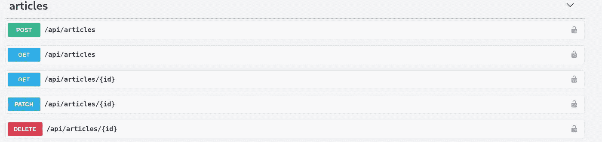
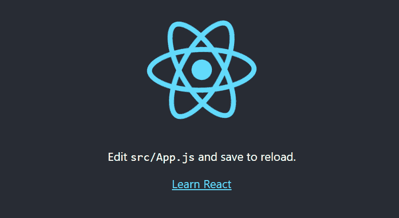
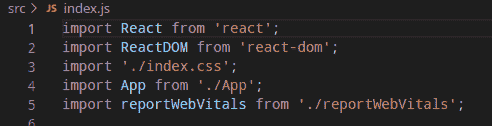
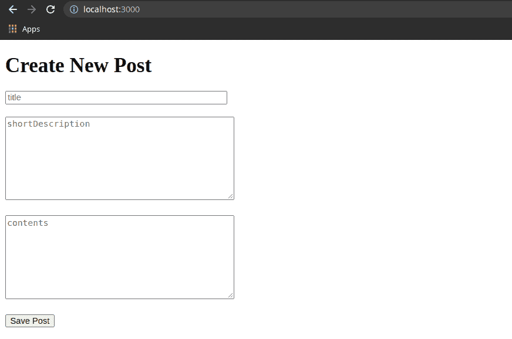
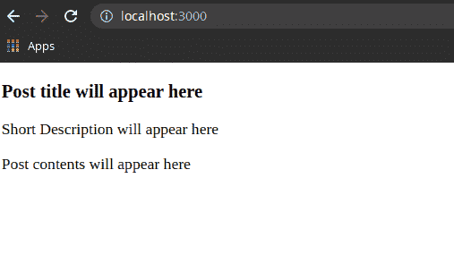
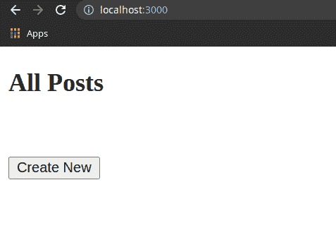
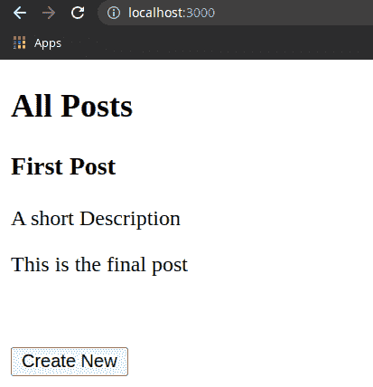

# 使用 Amplication 和 ReactJS 创建一个降价博客！

> 原文：<https://medium.com/geekculture/make-a-markdown-blog-using-amplication-and-reactjs-8bec5e59fdc3?source=collection_archive---------25----------------------->

**项目介绍**

这个项目背后的基本想法是创建一个**降价博客网站**。最终产品将是一个网站，用户可以在 markdown 中写文章，自动转换成纯文本。

这里先睹为快，看看我们的项目会是什么样子-



**降价**

Markdown 是一种非常流行的标记语言，用于格式化文档。广泛应用于讨论平台、博客网站、电子邮件、电子书等。

对于开发者来说，markdown 最著名的现实例子是 StackOverFlow 和 Github comments on PRs！！

下面是减价的一些基本知识，只是给你介绍一下它是什么？

#用于“标题 1”# #用于“标题 2”# # #用于“标题 3”

这些是降价的一些基础知识，如果你愿意，你可以在这里进一步阅读它的基础知识。

**扩增简介！！**

假设我们想建立一个网站。我们必须选择一种语言，一个框架，一个数据库，弄清楚我们想要如何部署，构建一些模型，创建 REST 端点…等等等等。

事实证明，现在我们可以在几分钟内完成所有这些，使用一种叫做 ***扩增*** 的技术。它需要我们做的只是对数据模型——或者说*实体*有一个简单的概念。然后，它会生成一堆代码来完成上述所有任务以及更多任务。

**这是如何工作的？**

amplification 使用元数据创建了一个成熟的应用程序，您可以使用 Amplication web 控制台定义这些元数据。自动生成的应用程序在服务器端基于 Node.js + Typescript，在客户端作出反应。

amplification 团队写了一个很棒的介绍性博客:[介绍 amplification——我推荐与本文一起阅读的开源开发工具](/amplication/introducing-amplication-the-open-source-development-tool-122994afd805)!

# 技术

Amplication 生成的代码基于许多流行的技术。

**框架-** [NestJs](https://docs.nestjs.com/)

**数据库-** [Postgres](https://www.postgresql.org/docs/)

**版本** **控制-** [Github](https://docs.github.com/en)

**部署-** [停靠](https://docs.docker.com/get-started/overview/)

**运行时-** [Node.js](https://nodejs.org/en/docs/)

让我们探索一下这些是如何以一种功能性的、自动生成的后端的形式结合在一起的。我们将使用构建降价*博客应用程序的标准示例。*

# 让我们开始吧

# 后端

创建这个博客应用程序的第一步是[登录 amplification](https://amplication.com/)并创建一个包含实体*文章*的应用程序。

这将使一个后端应用程序不做重复的编码任务。你可以阅读[扩增文件](https://docs.amplication.com/docs/getting-started/)以了解基本过程。

*条*实体中应包含以下规格:-

**标题-** 单行文本

**简短描述-** 多行文本

**内容-** 多行文本

我们也可以[同步扩增代码到 Github](https://docs.amplication.com/docs/sync-with-github) 。现在，我们必须提交、构建和生成代码。

这将创建一个对所选 Github 库的 pull 请求，我们只需合并它。

在制作 markdown 博客的下一步中，我们将在本地运行 amplication 生成的代码。

因此，只需从 Github 存储库中克隆代码，并在 VSCode 中打开。

将目录更改为*服务器*，然后运行这里[提到的一些基本命令](https://docs.amplication.com/docs/getting-started/dev-env)。

通过打开沙盒环境，还可以看到 Amplication 创建的 REST API。它看起来会像这样-



这表明服务器正在运行，并且已经准备好工作了！

我只是在想，如果我们在后端过程中不使用放大，而必须自己做编码部分，那么整个过程将会多么漫长和忙碌。

恭喜你！我们已经成功地完成了我们的 *Markdown 博客应用*的后端。

# 前端

**做出反应**

React 是一个用于构建用户界面的 JavaScript 库。前端使用 *ReactJS* 的原因包括几点-

*   更好的性能
*   可重用组件
*   易于实施
*   运行时间

**JSX**

它是 Javascript 的语法扩展。JSX 产生反应*元素*。它有一个普通 HTML 熟悉的语法，也可以直接在我们的 JavaScript 文件中使用，但没有浏览器可以在不传输它的情况下读取它。

**设置**

**编辑器使用- VSCode**

为了通过本教程创建 markdown 博客应用程序，我们将安装 node version-14。

现在打开 CLI 并安装 *React* 并使用该命令创建一个新项目。

```
**npx create-react-app react-markdown-blog**
```

上面的命令将创建一个名为 *react-markdown-blog* 的目录，其中安装了 react 和所有依赖项。

现在导航到新创建的目录( *react-markdown-blog* )并运行 *npm start* 来启动服务器。这个命令会自动启动浏览器，并重定向到[http://localhost:3000/](http://localhost:3000/)(react 的默认主页)。如果没有错误，我们将在屏幕上看到它。



我们现在已经准备好了我们想要创建的 React 应用程序的结构。

转到*react-markdown-blog/src/app . js*，让我们首先在那里创建一个 hello world 示例程序，看看它是否正常工作。

替换 App 的代码。Js 与下面的代码。

```
**import** React **from** “react”;**const** App = ( ) => {
 **return** (
 <div>
 <h1>Markdown Blog</h1>
 </div>
 );
};
**export** **default** App;
```

你可以在 [http://localhost:3000/](http://localhost:3000/) 上看到 *Markdown 博客*标题。

上述代码首先从节点模块导入 React，然后创建一个功能组件 *App* ，然后我们渲染 JSX 代码，最后只需导出 *App* 。

我们有一些在本教程中不会用到的文件，因此从*react-markdown-blog/src*中删除所有这些文件

*   App.css
*   应用测试网站
*   Index.css
*   徽标. svg
*   setupTests.js

导航到 *index.js* 文件并删除第三个导入(index.css)。



下一步是在 *src* 文件夹中创建一个文件夹 *Components* 。

博客应用的第一件事是创建一篇新文章。创建一个文件 *CreateNewPost.jsx* 并将以下代码添加到该文件中。

```
**import** React **from** “react”;
**const** CreateNewPost = () => {
 **return** (
 <>
<form>
 <h1>Create New Post</h1>
 <input type =”text” placeHolder=”title” size=”39" required></input>
 <br />
 <br />
 <textarea placeHolder=”shortDescription” rows=”8" cols=”41"required></textarea>
 <br />
 <br />
 <textarea placeHolder=”contents” rows=”8" cols=”41"required></textarea>
 <br />
 <br />
 <button>Save Post</button>
</form>
 </>
 );
};
export default CreateNewPost;
```

如前所述，这里我们使用的是 JSX 格式，在这段代码中，我们什么也没做，只是创建了一个包含三个输入的 HTML 表单——标题、简短描述和内容。

我们现在必须显示这些更改，为此，我们必须导航到*react-markdown-blog/src/app . js*并在代码中添加此导入行。

```
**import** CreateNewPost **from** ‘./components/CreateNewPost’
```

现在移除

# Markdown 博客

并呈现 *CreateNewPost* 组件，用< CreateNewPost / >替换它。

React 应用程序现在看起来像这样。



到目前为止，我们还没有在*保存帖子*按钮中添加功能，也没有 CSS，但是我们会在接下来的步骤中添加。

我们要添加的下一个组件是 *Post.jsx* ，并在其中添加以下代码。

```
**import** React **from** ‘react’;**const** Post = () => {
 **return** (
 <>
 <section>
 <h3>Post title will appear here</h3><p> Short Description will appear here</p>
 <p> Post contents will appear here</p>
 </section>
 </>
 )
}
export default Post
```

添加了一个简单的代码来显示文章的外观。现在导航到 *App.js* 并用下面的代码替换它，看看 *Post* 组件看起来会是什么样子。

```
**import** React **from** “react”;
**import** Posts **from** ‘./Components/Post’
**const** App = ( ) => {
 **return** (
 <>
 <Posts />
 </>
 );
};
export default App;
```

刷新浏览器，它将看起来像下面的截图。



我们要添加的最后一个组件是 *DisplayAllPosts.jsx* 。最初向其中添加以下代码。

```
**import** React **from** ‘React’;
**import** CreateNewPost **from** ‘./CreateNewPost’
**const** DisplayAllPosts = () => {
 **return** (
 <>
 <CreateNewPost />
 </>
 )
}
export default DisplayAllPosts
```

我们已经在 *DisplayAllPosts* 中渲染了 *CreateNewPost* 组件。

下一个目标是从用户那里获取输入，并在用户输入时将其直接存储到组件状态变量中。为了实现这一点，我们将使用 React *usestate* 。

当我们用 useState 声明一个状态变量时，它返回一个包含两项的数组。第一项是当前值，第二项是用于更新状态的 updater 函数。

因此，我们将在 *DisplayAllPosts* 中用以下代码替换它来实现这一点。

```
**import** React, {useState} **from** ‘react’;
**import** CreateNewPost **from** ‘./CreateNewPost’
**const** DisplayAllPosts = () => {
**const** [title, setTitle] = useState(“”);**const** [shortDescription, setShortDescription]= useState(“”);
**const** [content, setContent] = useState(“”);
**const** savePostTitleToState = event => {
 setTitle(event.target.value);
 console.log(title)
};**const** saveShortDescriptionToState = event =>{setShortDescription(event.target.value);console.log(shortDescription)};
**const** savePostContentToState = event => {
 setContent(event.target.value);
 console.log(content)
};
 **return** (
 <>
 <CreateNewPost 
 savePostTitleToState = {savePostTitleToState}saveShortDescriptionToState={saveShortDescriptionToState}
 savePostContentToState = {savePostContentToState}
 />
 </>
 )
}
export default DisplayAllPosts
```

这里我们创建了三个变量 *title、shortDescription* 和 *content* ，并分别设置了它们的更新函数 *setTitle、setShortDescription* 和 *setContent* 。然后我们创建了三个函数 *savePostTitletoState、saveShortDescriptionToState*和*savepostcontentstate*。

这些功能将用于保存用户输入值到状态。我们还向每个函数添加了 console.log()语句，以便在用户输入时查看输入值。然后我们将这三个函数作为道具传递给 CreateNewPost 组件。

现在打开 *CreateNewPost* ，用下面的代码更新它。

```
**import** React **from** “react”;
**const** CreateNewPost = props => {
 **return** (
 <>
<form>
 <h1>Create New Post</h1>
 <input type =”text” onChange={props.savePostTitleToState}
 placeHolder=”title” size=”39" required></input>
 <br />
 <br />
 <textarea onChange={props.saveShortDescriptionToState}
 placeHolder=”shortDescription” rows=”8" cols=”41"required></textarea>
 <br />
 <br />
 <textarea onChange={props.savePostContentToState}
 placeHolder=”contents” rows=”8" cols=”41"required></textarea>
 <br />
 <br />
 <button>Save Post</button>
</form>
 </>
 );
};
export default CreateNewPost;
```

您可以使用 *Ctrl+Shift+i* 命令预览 chrome 中的更改，无论何时您在表单中键入任何内容，它都会在控制台中可见。

接下来，我们希望在用户单击“保存帖子”按钮后，将捕获的帖子标题、简短描述和内容保存到另一个名为 allPosts 的状态变量中。

创建新的状态变量-

```
**const** [allPosts, setAllPosts] = useState([]);Then create a function *savePost* in *DisplayAllPosts*-**const** savePost = () => {
 **const** id = Date.now();
 setAllPost([…allPost, {title,shortDescription, content, id}]);
 console.log(allPost);
 };
```

该功能将输入文本保存到 *allPost* 状态变量中。我们通过将 *Date.now()* 放入其中，为每个帖子分配了一个唯一的 id。

我们还为*的所有帖子*添加了一个 console.log()。成功捕获数据后，我们希望清除我们的状态和所有输入字段值，以便用户可以添加另一篇文章。为此，我们必须清除标题和内容状态变量。

让我们像这样更新我们的 savePost 函数

```
**const** savePost = () => {
 setAllPosts([…allPosts, { title, shortDescription, content }]);
 setTitle(“”);
 setContent(“”);
 console.log(allPosts);
 };
```

为了定位 DOM 上的输入字段并清除它们的值，我们将使用 React Hook *useRef。*将 import 语句替换为- **import** React，“React”中的{ useState，useRef }**；**

初始化 *useRef-*

```
**const** getTitle = useRef();
**const** getShortDescription = useRef();**const** getContent = useRef();
```

然后将引用作为道具传递给 *CreateNewPost* 组件

```
<CreateNewPost
 savePostTitleToState = {savePostTitleToState}
 saveShortDescriptionToState={saveShortDescriptionToState}
 savePostContentToState = {savePostContentToState}
 getTitle={getTitle}
 getShortDescription={getShortDescription}
 getContent={getContent}
 />
```

现在我们将在来自 *CreateNewPosts* 组件的每个输入中添加引用。新代码看起来会像这样-

```
import React from “react”;
const CreateNewPost = props => {
 return (
 <>
 <form onSubmit={props.savePost}>
 <h1>Create New Post</h1>
 <input
 type=”text”
 onChange={props.savePostTitleToState}
 placeholder=”title”
 size=”39"
 required
 ref={props.getTitle}
 ></input>
 <br />
 <br />
 <textarea
 onChange={props.saveShortDescriptionToState}
 placeholder=”shortDecription”
 rows=”8"
 cols=”41"
 required
 ref={props.getShortDescription}
 ></textarea>
 <br />
 <br />
 <textarea
 onChange={props.savePostContentToState}
 placeholder=”contents”
 rows=”8"
 cols=”41"
 required
 ref={props.getContent}
 ></textarea>
 <br />
 <br />
 <button>Save Post</button>
 </form>
 </>
 );
};
export default CreateNewPost;
```

现在你可以打开控制台并保存文章，你可以在那里看到所有文章的列表。

我们希望只有当有人点击 Create New 时，才能看到 *CreateNewPost* 的内容。因此，将 *DisplayAllPosts* 的代码替换为以下更改。

```
**import** React, { useState, useRef } **from** “react”;
**import** CreateNewPost **from** “./CreateNewPost”;
**const** DisplayAllPosts = () => {
 **const** [title, setTitle] = useState(“”);
 **const** [shortDescription, setShortDescription]= useState(“”);
 **const** [content, setContent] = useState(“”);
 **const** [allPosts, setAllPosts] = useState([]);
 **const** [isCreateNewPost, setIsCreateNewPost] = useState(false); *// Initialize useRef*
 **const** getTitle = useRef();
 **const** getContent = useRef();
 **const** getShortDescription = useRef(); **const** savePostTitleToState = event => {
 setTitle(event.target.value);
 };
 **const** saveShortDescriptionToState = event =>{
 setShortDescription(event.target.value);
 };
 **const** savePostContentToState = event => {
 setContent(event.target.value);
 };
 **const** toggleCreateNewPost =()=>{
 setIsCreateNewPost(!isCreateNewPost)
} **const** savePost = event => {
 event.preventDefault();
 setAllPosts([…allPosts, { title, shortDescription, content }]);
 console.log(allPosts);
 getTitle.current.value = “”;
 getShortDescription.current.value = “”;
 getContent.current.value = “”;
 }; **if**(isCreateNewPost){
 **return** (
 <>
 <CreateNewPost
 savePostTitleToState={savePostTitleToState}
 savePostContentToState={savePostContentToState}
 saveShortDescriptionToState={saveShortDescriptionToState}
 getTitle={getTitle}
 getShortDescription={getShortDescription}
 getContent={getContent}
 savePost={savePost}
 />
 </>
);
}
return (
 <>
 <h2>All Posts</h2>
 <br/>
 <br/>
 <button onClick={toggleCreateNewPost}>Create New</button>
 </>
)
};
export default DisplayAllPosts;
```

输出会是这样的-



我们创建了一个名为 *isCreateNewPost* 的新状态变量，并用布尔值 false 对其进行了初始化。

然后我们创建了另一个名为 *toggleCreateNewpost* 的函数，这个函数将使 *isCreateNewPost* 状态变量在真和假之间切换。如果 *isCreateNewPost* 的前一状态值为真，则 *toggleCreateNewpost* 会将其改为假，否则为真。

我们还添加了一个按钮 *Create New* ，当用户点击它时，它将调用 *toggleCreateNewPost* 。添加了一个条件语句，该语句仅在被点击时呈现 *CreateNewPost* ,或者说，布尔值为真。

现在我们想看看屏幕上由 *CreateNewPost* 保存的内容。为此，让我们先对 *Post.jsx* 进行一些修改。

```
**import** React **from** ‘react’;**const** Post = (props) => {
 **return** (
 <>
 <section>
 <h3>{props.title}</h3>
 <p>{props.shortDescription}</p>
 <p> {props.content}</p>
 </section>
 </>
 )
}
export default Post
```

这里我们通过 *DisplayAllPosts* 组件*显示帖子数据。如果没有创建帖子，代码将显示*这里没有什么可看的*，如果我们创建了一些帖子，代码将映射创建的帖子列表。刷新浏览器，点击*新建*按钮，创建一个新帖子，输出如下-*



现在你可以对代码进行 CSS 修改，也可以直接使用我们从 Github 制作的样式文件。

**将前端连接到后端**

现在我们必须首先创建一个 *Post* 请求，此时 *Save Post* 按钮将被点击，并将数据保存到由*amplification*创建的后端。

继续之前安装三个模块-

*   npm 安装请求
*   npm 安装 axios
*   npm 安装反应-降价

将以下代码中的*显示所有帖子*代码更改为-

```
**import** React, { useState, useRef } **from** “react”;
**import** CreateNewPost **from** “./CreateNewPost”;
**import** Post **from** “./Post”;
**const** DisplayAllPosts = () => {
 **const** [title, setTitle] = useState(“”);
 **const** [shortDescription, setShortDescription]= useState(“”);
 **const** [content, setContent] = useState(“”);
 **const** [allPosts, setAllPosts] = useState([]);
 populateAllPosts(setAllPosts); **const** [isCreateNewPost, setIsCreateNewPost] = useState(false); *// Initialize useRef*
 **const** getTitle = useRef();
 **const** getContent = useRef();
 **const** getShortDescription = useRef(); **const** savePostTitleToState = event => {
 setTitle(event.target.value);
 };
 **const** saveShortDescriptionToState = event =>{
 setShortDescription(event.target.value);
 };
 **const** savePostContentToState = event => {
 setContent(event.target.value);
 };
 **const** toggleCreateNewPost =()=>{
 setIsCreateNewPost(!isCreateNewPost)
}**const** savePost = event => {
 event.preventDefault();
 **const** id = Date.now();
 setAllPosts([…allPosts, { title,shortDescription, content, id }]);
 console.log(allPosts);
 **var** request = require(‘request’);
 **var** options = {
 ‘method’: ‘POST’,
 ‘url’: ‘http://localhost:3000/api/articles/',
 ‘headers’: {
 Authorization: ‘Basic YWRtaW46YWRtaW4=’,
 ‘Content-Type’: ‘application/json’
 }, body:JSON.stringify({
 “content”: content,
 “shortDescription”:shortDescription,
 “title”:title
 })
 };
 request(options, **function** (error, response) {
 **if** (error) **throw** **new** Error(error);
 console.log(response.body);
 });
toggleCreateNewPost();
 }; **if**(isCreateNewPost){
 **return** (
 <>
 <CreateNewPost
 savePostTitleToState={savePostTitleToState}
 savePostContentToState={savePostContentToState}
 saveShortDescriptionToState={saveShortDescriptionToState}
 getTitle={getTitle}
 getShortDescription={getShortDescription}
 getContent={getContent}
 savePost={savePost}
 />
 </>
);
}return (
 <>
 <h2>All Posts</h2>
 {!allPosts.length ? (
 <div>
 <h3>There is nothing to see here!</h3>
 </div>
 ) : (
 allPosts.map(eachPost => {
 return (
 <Post
 id={eachPost.id}
 key={eachPost.id}
 title={eachPost.title}
 shortDescription={eachPost.shortDescription}
 content={eachPost.content}
 />
 );
 })
 )}

 <br />
 <br />
 <button onClick={toggleCreateNewPost}>Create New</button>
 </>
 );
 }; var populateAllPosts = async function(setAllPosts) { var axios = require(‘axios’);
 var config = {
 method: ‘get’,
 url: ‘http://localhost:3000/api/articles/’,
 headers: {
 Authorization: ‘Basic YWRtaW46YWRtaW4=’,
 ‘Content-Type’: ‘application/json’
 }
 };
 await axios(config).then(
 function(response) {
 console.log(response.data)
 setAllPosts(response.data)
 }
 )
 };
 export default DisplayAllPosts;
```

在上面的代码中，我们简单地做了一个 POST 和一个 GET 请求。对于 GET 请求，我们使用*请求*模块，对于 POST 请求，我们使用 *axios* 模块。

这里为了使事情变得简单，我们发送了一个*头*来超越*基础头文件*并允许在没有授权的情况下访问每个请求。

我们在前面的步骤中使用由*扩增*创建的*文章 API* 。现在，我们已经将前端连接到后端，您可以访问以前创建的文章，也可以创建新的文章，这些文章将存储在后端数据库中。

**添加降价-**

将 *Post.jsx* 的代码替换为以下代码-

```
import React from “react”;
import ReactMarkdown from “react-markdown”const Post = ({ title, content, shortDescription, id, deletePost }) => {
 return (
 <>
 <section className=”post-container”>
 <h2>{title}</h2>
 <br />
 <h3><b>
 Short Description</b>
 </h3>
 <p> {shortDescription}</p>
 <h3><b>
 Content </b>
 </h3>
 <ReactMarkdown>
 {content}
 </ReactMarkdown>

 </section>
 </>
 );
};
export default Post;
```

这里我们使用了 *React-Markdown* 模块以 Markdown 格式呈现文章的*内容*。

现在由你来添加一些 CSS，或者如果你愿意，你可以复制 *styles.css* 文件，并从 Github 库将其添加到你的代码中。

**最终输出**看起来会像这样-


你可以在下面的 Github 仓库中看到完整的代码

Github -

1.  前端

[https://github . com/souravjain 540/React-markdown-blog-frontend](https://github.com/souravjain540/React-markdown-blog-frontend)

2.后端

[https://github.com/souravjain540/markdown-blog](https://github.com/souravjain540/markdown-blog)

与文章相关的一些重要链接-

1.  [扩增文件](https://docs.amplication.com/docs/)
2.  [反应文件](https://reactjs.org/docs/getting-started.html)
3.  放大[不一致](https://discord.gg/Pch6FUgW)(如果你有错误，为了社区帮助，我也用了这个)